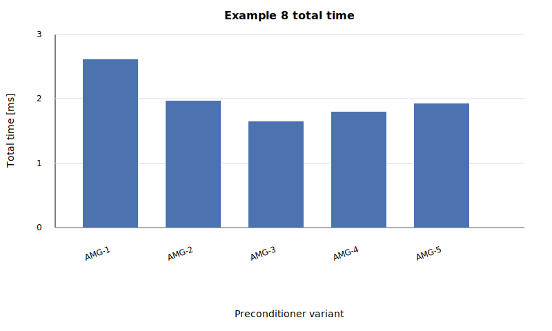

.. Copyright (c) 2024 Lawrence Livermore National Security, LLC and other
   HYPRE Project Developers. See the top-level COPYRIGHT file for details.

   SPDX-License-Identifier: (MIT)

.. _DriverExamples:

Driver Examples (hypredrive CLI)
================================

This section provides several examples demonstrating how to set up input files and use
the ``hypredrive`` executable (driver) to solve different types of linear-system problems.
All example inputs can be found in the ``examples`` folder and reference outputs at
``examples/refOutput``.

.. note::
   These examples exercise hypredrive as a standalone driver using YAML input files.
   If you are looking for application-side usage of the library API (``libHYPREDRV``),
   see :ref:`LibraryExamples`.

.. note::
   Many examples require datasets that are not included in the repository. These datasets
   must be downloaded from Zenodo at https://zenodo.org/records/17471036 before running
   the examples. The most convenient way to download and extract all datasets is using
   the CMake ``data`` target:

   .. code-block:: bash

      $ cmake --build <build-dir> --target data

   Alternatively, you can download the datasets manually from the Zenodo record and extract
   them into the ``data/`` directory. See ``data/README.md`` for more details.

CLI overrides (``-a/--args``)
-----------------------------

When developing or benchmarking, it is often convenient to keep a base YAML file and
override a few parameters from the command line.

The driver supports this via the ``-a`` / ``--args`` flag, followed by pairs of:

- ``--path:to:key <value>``

The ``path:to:key`` is interpreted as a YAML path where ``:`` separates nested blocks.
Overrides are applied *after* reading the YAML file, so the CLI has precedence over the
file.

Examples (based on ``examples/ex1.yml``):

.. code-block:: bash

   # Override solver parameters (keep solver as PCG, but change max_iter)
   $ mpirun -np 1 ./hypredrive examples/ex1.yml -q -a --solver:pcg:max_iter 50

.. code-block:: bash

   # Switch solver type and set a nested option (changes solver from PCG to GMRES)
   $ mpirun -np 1 ./hypredrive examples/ex1.yml -q -a --solver gmres --solver:gmres:max_iter 30

.. note::

   - Overrides must be provided as **key/value pairs** after ``-a``.
   - Accepts also key/value pairs not present in the base YAML file.
   - The key/value pairs must be separated by a space, for example: ``--solver:pcg:max_iter 50``.
   - If you pass values that include spaces or YAML syntax (e.g., lists like ``[1, 2]``),
     you will need to quote them according to your shell.

.. _Example1:

Example 1: Minimal configuration
--------------------------------

In this example, we solve a basic linear system using an `AMG-PCG` solver with default
settings. This example showcases the minimum amount of information required in the input
file to execute `hypredrive`.

We consider a linear system matrix arising from a seven points finite differences
discretizaion of the Laplace equation on a `10x10x10` cartesian grid. Furthermore, the
right hand side is the vector of ones. Both data are read from file and partitioned for a
single MPI rank. Therefore, this example must be executed on a single process.

.. note::
   This example requires the ``ps3d10pt7`` dataset. Make sure you have downloaded the
   datasets from Zenodo (see the note at the beginning of this section).

1. Prepare your linear system files (``matrix_filename`` and ``rhs_filename``).
2. Use the YAML configuration file ``ex1.yml``:

.. literalinclude:: ../../examples/ex1.yml
   :language: yaml

3. Run `hypredrive` with the configuration file:

.. code-block:: bash

    $ mpirun -np 1 ./hypredrive examples/ex1.yml

4. Your output should look like:

.. literalinclude:: ../../examples/refOutput/ex1.txt
   :language: text

.. warning::
   Make sure that `hypredrive` is executed from the top level project folder in order for
   the relative paths in ``matrix_filename`` and ``rhs_filename`` to be
   correct. Otherwise, adjust the relative paths for these entries accordingly.

.. _Example2:

Example 2: Parallel run with full AMG configuration
---------------------------------------------------

In this example, we solve the same problem as in the previous example, but partitioned for
`4` processes. We also showcase all available input options for `PCG` and `AMG` in the
configuration file.

.. note::
   This example requires the ``ps3d10pt7`` dataset. Make sure you have downloaded the
   datasets from Zenodo (see the note at the beginning of this section).

1. Prepare your linear system files.

2. Use the YAML configuration file ``ex2.yml``:

.. literalinclude:: ../../examples/ex2.yml
   :language: yaml

3. Run `hypredrive` with the configuration file:

.. code-block:: bash

    $ mpirun -np 4 ./hypredrive examples/ex2.yml

4. Your output should look like:

.. literalinclude:: ../../examples/refOutput/ex2.txt
   :language: text

.. _Example3:

Example 3: Minimal multigrid reduction strategy
-----------------------------------------------

In this example, we solve a linear system derived from the discretization of a
compositional flow problem from `GEOS <https://github.com/GEOS-DEV/GEOS>`_. Details about
how this linear system was generated can be found at ``data/compflow6k/README.md``. This
example uses a `MGR-GMRES` solver and showcases the minimal configuration for setting up
the multigrid reduction preconditioner for this particular kind of linear system.

.. note::
   This example requires the ``compflow6k`` dataset. Make sure you have downloaded the
   datasets from Zenodo (see the note at the beginning of this section).

1. Prepare your linear system files.

2. Use the YAML configuration file ``ex3.yml``:

.. literalinclude:: ../../examples/ex3.yml
   :language: yaml

3. Run `hypredrive` with the configuration file:

.. code-block:: bash

    $ mpirun -np 1 ./hypredrive examples/ex3.yml

4. Your output should look like:

.. literalinclude:: ../../examples/refOutput/ex3.txt
   :language: text

Example 4: Advanced multigrid reduction strategy
------------------------------------------------

In this example, we solve the same problem as before, but partitioned for 4
processes. Here, we showcase a more advanced setup of `MGR` involving multiple options.

.. note::
   This example requires the ``compflow6k`` dataset. Make sure you have downloaded the
   datasets from Zenodo (see the note at the beginning of this section).

1. Prepare your linear system files.

2. Use the YAML configuration file ``ex4.yml``:

.. literalinclude:: ../../examples/ex4.yml
   :language: yaml

3. Run `hypredrive` with the configuration file:

.. code-block:: bash

    $ mpirun -np 4 ./hypredrive examples/ex4.yml

4. Your output should look like:

.. literalinclude:: ../../examples/refOutput/ex4.txt
   :language: text

Example 5: Spreading input parameters in multiple files
-------------------------------------------------------

In this example, we solve the same problem as in example 3, but using the same solver and
preconditioner parameters as in example 4. In addition, we define these parameters in
separate files, which are included in the main input file via the ``include`` keyword .

.. note::
   This example requires the ``compflow6k`` dataset. Make sure you have downloaded the
   datasets from Zenodo (see the note at the beginning of this section).

1. Prepare your linear system files.

2. Define the input file containing the solver parameters ``ex5-gmres.yml``:

.. literalinclude:: ../../examples/ex5-gmres.yml
   :language: yaml

3. Define the input file containing the preconditioner parameters ``ex5-mgr.yml``:

.. literalinclude:: ../../examples/ex5-mgr.yml
   :language: yaml

4. Define the main input file ``ex5.yml``:

.. literalinclude:: ../../examples/ex5.yml
   :language: yaml

5. Run `hypredrive` with the configuration file:

.. code-block:: bash

    $ mpirun -np 1 ./hypredrive examples/ex5.yml

6. Your output should look like:

.. literalinclude:: ../../examples/refOutput/ex5.txt
   :language: text

.. _Example6:

Example 6: Full eigenspectrum computation (single rank)
-------------------------------------------------------

In this example, we enable the debug/analysis eigenspectrum capability to compute the
full eigenspectrum of the matrix using dense LAPACK routines. This path is intended for
small matrices and single-rank runs.

.. note::
   You must build `hypredrive` with eigenspectrum support enabled, e.g. configure with
   ``-DHYPREDRV_ENABLE_EIGSPEC=ON``.

.. note::
   This example requires the ``compflow6k`` dataset. Make sure you have downloaded the
   datasets from Zenodo (see the note at the beginning of this section).

1. Use the YAML configuration file ``ex6.yml``:

.. literalinclude:: ../../examples/ex6.yml
   :language: yaml

2. Run `hypredrive` with the configuration file (single rank):

.. code-block:: bash

   $ mpirun -np 1 ./hypredrive examples/ex6.yml

3. Your output should look like:

.. literalinclude:: ../../examples/refOutput/ex6.txt
   :language: text

4. (Optional) Plot the full eigenspectrum of the preconditioned matrix using the `eigplot.py` script:

.. code-block:: bash

   $ scripts/eigplot.py -f data/compflow6k/np1/eig.values.txt

.. _Example7:

Example 7: Solving a sequence of linear systems
-----------------------------------------------

In this example, we solve a sequence of linear systems stored in a hierarchical directory layout.
The systems originate from a single-rank (np1) GEOS multiphase poromechanics benchmark.
We use MGR-preconditioned FGMRES (MGR-FGMRES) as the linear solver.
See ``data/poromech2k/README.md`` for more details about the problem in GEOS.

.. note::
   This example requires the ``poromech2k`` dataset. Make sure you have downloaded the
   datasets from Zenodo (see the note at the beginning of this section).

1. Use the YAML configuration file ``ex7.yml``:

.. literalinclude:: ../../examples/ex7.yml
   :language: yaml

2. Run `hypredrive` with the configuration file (single rank):

.. code-block:: bash

   $ mpirun -np 1 ./hypredrive examples/ex7.yml

3. Your output should look like (truncated):

.. literalinclude:: ../../examples/refOutput/ex7.txt
   :language: text

4. (Optional) Plot the sparsity pattern of the matrices using the `spyplot.py` script:

.. code-block:: bash

   $ scripts/spyplot.py -d data/poromech2k/np1 -r 0:24 -l -t 1e-20

.. _Example8:

Example 8: Multiple preconditioner variants in one YAML
-------------------------------------------------------

This example demonstrates how to run several preconditioner variants defined as a
YAML sequence under a single ``preconditioner`` block. `hypredrive` will loop over each
variant and report a separate stats entry per variant while reusing the same linear system.

.. note::
   This example uses the ``ps3d10pt7`` dataset (multiple ranks). Ensure the dataset is
   available (see the note at the top of this page).

1. Use the YAML configuration file ``ex8.yml``:

.. literalinclude:: ../../examples/ex8.yml
   :language: yaml

2. Run `hypredrive` with the configuration file (single rank):

.. code-block:: bash

   $ mpirun -np 1 ./hypredrive examples/ex8.yml -q

3. Your output should look like:

.. literalinclude:: ../../examples/refOutput/ex8.txt
   :language: text

4. (Optional) Plot per-variant timing or iteration bars using ``scripts/analyze_statistics.py``.
   Provide one label per table entry via ``-ln`` (order matches the stats table):

.. code-block:: bash

   $ scripts/analyze_statistics.py -f examples/refOutput/ex8.txt -m bar -p total \
       -ln "AMG-1" "AMG-2" "AMG-3" "AMG-4" "AMG-5" \
       -s ex8.svg -T "Example 8 total time"

   # Use -p iters to compare iteration counts instead of timings

   Total time (setup + solve) for each preconditioner variant in Example 8.

.. note::
   A multi-file version of this input is also provided as ``examples/ex8-multi-1.yml``,
   where the individual preconditioner variants are split into separate YAML files and
   pulled in via ``include``. The solver configuration and per-variant iteration
   counts/residuals should match the single-file version. Minor differences in reported
   timings are expected.
