.. Copyright (c) 2024 Lawrence Livermore National Security, LLC and other
   HYPRE Project Developers. See the top-level COPYRIGHT file for details.

   SPDX-License-Identifier: (MIT)

.. _LibraryExamples:

Library Examples (libHYPREDRV)
==============================

This section demonstrates how to use the ``libHYPREDRV`` library from application codes
to assemble, configure, and solve linear systems with hypre. Unlike the :ref:`DriverExamples`
that fully operate the ``hypredrive`` executable via YAML input files, these examples embed the
linear system assembly directly in your program and expose hooks for customizing discretizations,
data layouts, MPI partitioning, and linear solver options via YAML configuration.

.. note::
   Prefer the ``hypredrive`` executable (driver) when working with file-based
   matrices/vectors and you want to quickly experiment with solver/preconditioner
   configurations. Prefer ``libHYPREDRV`` when your application assembles matrices
   and vectors in memory and you need a lightweight API to invoke HYPRE solvers
   and preconditioners programmatically.

Overview of Typical Steps
-------------------------

The library-side workflow in C/C++ generally follows these steps:

1. Initialize MPI (if not already done).
2. Initialize hypredrive and create an object handle.
3. Parse a YAML configuration string/file to set solver/preconditioner options.
4. Assemble your matrix and vectors (``HYPRE_IJMatrix``/``HYPRE_IJVector``) in parallel.
5. Tell hypredrive about your DOF layout (e.g., interleaved blocks).
6. Attach matrix/RHS/initial guess/prec matrix to hypredrive.
7. Create, setup, and apply the solver; print statistics as desired.
8. Retrieve solution values if needed; finalize and destroy hypredrive.

A minimal skeleton of a program using the library is shown below.

.. code-block:: c

   #include "HYPREDRV.h"
   #include <mpi.h>

   int main(int argc, char** argv) {
     MPI_Init(&argc, &argv);

     HYPREDRV_t h;
     HYPREDRV_Initialize();
     HYPREDRV_Create(MPI_COMM_WORLD, &h);

     // Provide YAML configuration
     const char* yaml = "solver: pcg\n"
                        "preconditioner: amg\n";
     char* args[1] = {(char*)yaml};
     HYPREDRV_InputArgsParse(1, args, h);

     HYPREDRV_SetGlobalOptions(h);
     HYPREDRV_SetLibraryMode(h);

     // Build IJ objects (global row range per rank) and assemble your system
     HYPRE_IJMatrix A;
     HYPRE_IJVector b;
     /* ... create/initialize/insert/assemble A, b ... */

     // Set linear system components
     HYPREDRV_LinearSystemSetMatrix(h, (HYPRE_Matrix)A);
     HYPREDRV_LinearSystemSetRHS(h, (HYPRE_Vector)b);
     HYPREDRV_LinearSystemSetInitialGuess(h);
     HYPREDRV_LinearSystemSetPrecMatrix(h);

     // Solve lifecycle
     HYPREDRV_LinearSolverCreate(h);
     HYPREDRV_LinearSolverSetup(h);
     HYPREDRV_LinearSolverApply(h);
     HYPREDRV_LinearSolverDestroy(h);

     // (Optional) Query statistics and solution values
     HYPREDRV_StatsPrint(h);
     HYPRE_Real* xvals = NULL;
     HYPREDRV_LinearSystemGetSolutionValues(h, &xvals);

     // Cleanup
     HYPRE_IJMatrixDestroy(A);
     HYPRE_IJVectorDestroy(b);
     HYPREDRV_Destroy(&h);
     HYPREDRV_Finalize();
     MPI_Finalize();
     return 0;
   }

- YAML configuration can be provided from input file or string.
- For block linear systems, set row mapping information via ``HYPREDRV_LinearSystemSetDofmap``.
- If compiled with GPU support, you may migrate assembled IJ objects to device memory with
  ``HYPRE_IJMatrixMigrate(..., HYPRE_MEMORY_DEVICE)`` and analogous calls for vectors.

Preconditioner reuse
--------------------

When solving a **sequence of linear systems** (e.g. multiple RHS or time steps), you can
reuse the same preconditioner for several systems to avoid repeated setup cost. The
preconditioner is rebuilt only at chosen linear system indices; for the rest, the previous
preconditioner is applied as-is.

Under ``preconditioner``, a ``reuse`` subsection configures this behavior. Available YAML keywords:

- **``enabled``** – Turn reuse logic on or off. Values: ``yes`` / ``no``. Default: ``no``.
- **``frequency``** – Nonnegative integer. Rebuild when (linear system index) mod
  (frequency + 1) = 0. So ``0`` = every system, ``1`` = every other, etc.
- **``linear_system_ids``** – Explicit list of **0-based** linear system indices at which to
  rebuild (e.g. ``[0, 5, 10]``). Alias: ``linear_solver_ids``. **Cannot** be combined with
  ``frequency`` or ``per_timestep``.
- **``per_timestep``** – If ``yes``, ``frequency`` is applied **per timestep**: rebuild at
  the first system of each timestep, then every (frequency+1)-th system within that timestep.
  Requires ``linear_system.timestep_filename`` to point to a timestep file. Values: ``yes``
  / ``no``. **Cannot** be combined with ``linear_system_ids``.

The timestep file (used only when ``per_timestep: yes``) must list how linear systems map
to timesteps. First line: total number of timesteps. Each following line: ``timestep_id
ls_start``, where ``ls_start`` is the 0-based index of the first linear system for that
timestep.

Example: frequency-based reuse (rebuild every 3rd system):

.. code-block:: yaml

   preconditioner:
     amg: {}
     reuse:
       enabled: yes
       frequency: 2

Example: explicit list of systems at which to rebuild:

.. code-block:: yaml

   preconditioner:
     amg: {}
     reuse:
       enabled: yes
       linear_system_ids: [0, 10, 20, 30]

Example: reuse per timestep (rebuild at first system of each timestep; requires
``linear_system.timestep_filename``):

.. code-block:: yaml

   linear_system:
     timestep_filename: timesteps.txt
   preconditioner:
     amg: {}
     reuse:
       enabled: yes
       per_timestep: yes
       frequency: 0

You can also configure a predefined preconditioner preset without parsing YAML:

.. code-block:: c

   HYPREDRV_SetLibraryMode(h);
   HYPREDRV_InputArgsSetPreconPreset(h, "poisson");
   HYPREDRV_SetGlobalOptions(h);

If you later call ``HYPREDRV_InputArgsParse``, the YAML configuration will override
the preset.

.. _LibraryExample1:

Example 1: Laplace's equation
-----------------------------

This section documents a scalar diffusion/Laplace example assembled directly from an
application using the hypre IJ interface via ``libHYPREDRV``. It mirrors the driver in
``examples/src/C_laplacian/laplacian.c`` and demonstrates multiple finite-difference
stencils on a structured grid.

Governing equation and boundary conditions
~~~~~~~~~~~~~~~~~~~~~~~~~~~~~~~~~~~~~~~~~~

We solve

.. math::
   -\nabla\!\cdot\!\big(\mathbf{c}\,\nabla u\big) \;=\; 0 \quad \text{in } \Omega=[0,1]^3, \\
   u \;=\; 0 \ \text{on } \partial\Omega\setminus\{y=0\},\\
   u \;=\; 1 \ \text{on } \{y=0\}

Anisotropy is supported through directional coefficients (see below). A pure Dirichlet
setup yields a symmetric positive definite (SPD) linear system. We discretize on a
uniform structured grid with global node counts :math:`N=(N_x,N_y,N_z)` and spacings
:math:`h_x = 1/(N_x-1)`, :math:`h_y = 1/(N_y-1)`, :math:`h_z = 1/(N_z-1)`. Nodes are
indexed lexicographically with :math:`x` fastest. Parallel partitioning uses an MPI
Cartesian grid :math:`P=(P_x,P_y,P_z)` with block starts ``pstarts[d]``.

Finite-difference stencils
~~~~~~~~~~~~~~~~~~~~~~~~~~

We support several stencils for :math:`-\nabla\!\cdot(\mathbf{c}\nabla u)` on a structured grid.
All produce an M-matrix (positive diagonal, non-positive off-diagonals) and are second-order
accurate when weights are chosen consistently.

7-point (faces only, classical 2nd order)
^^^^^^^^^^^^^^^^^^^^^^^^^^^^^^^^^^^^^^^^^

With directional coefficients :math:`c_x,c_y,c_z` and spacings :math:`h_x,h_y,h_z`,
the discrete operator at interior node :math:`(i,j,k)` is

.. math::
   \begin{aligned}
   (L_h u)_{i,j,k}
   &= \frac{c_x}{h_x^2}\,\big(u_{i+1,j,k} - 2u_{i,j,k} + u_{i-1,j,k}\big) + \\
   &\quad \frac{c_y}{h_y^2}\,\big(u_{i,j+1,k} - 2u_{i,j,k} + u_{i,j-1,k}\big) + \\
   &\quad \frac{c_z}{h_z^2}\,\big(u_{i,j,k+1} - 2u_{i,j,k} + u_{i,j,k-1}\big)
   \end{aligned}

19-point (faces + edges)
^^^^^^^^^^^^^^^^^^^^^^^^

Adds edge neighbors (e.g., :math:`(i\pm1,j\pm1,k)`, etc.) with scaled couplings to reduce
directional bias. A common strategy is to assign edge weights that partially compensate
cross-term truncation errors from a Taylor expansion, while preserving diagonal dominance
and the M-matrix structure.

27-point (faces + edges + corners)
^^^^^^^^^^^^^^^^^^^^^^^^^^^^^^^^^^

Includes the full :math:`3\times3\times3` neighborhood (faces, edges, corners). Corner
weights are smaller than faces; one can tune edge/corner weights (e.g., half/third of
face weights) to further reduce dispersion and directional bias.

125-point (radius-2 demo)
^^^^^^^^^^^^^^^^^^^^^^^^^

Extends the neighborhood to radius 2 (up to 125 points). In the example driver, face-adjacent
neighbors often receive stronger weights (e.g., :math:`-1`), while farther neighbors receive
smaller negative weights (e.g., :math:`-0.01`), preserving an M-matrix with a dominant diagonal.

Coefficients and anisotropy
^^^^^^^^^^^^^^^^^^^^^^^^^^^

The example exposes coefficient arrays in the driver (``params->c``). For 7-point,
only face-connected neighbors are used with directional weights, e.g., in dimension-wise
form

.. math::
   (A u)_{i,j,k} \;\approx\; \sum_{\alpha\in\{x,y,z\}}
   \frac{c_\alpha}{h_\alpha^2}\,\big(-u_{i-\hat\alpha} + 2u_{i} - u_{i+\hat\alpha}\big).

For 19/27-point, the example scales edge/corner couplings (e.g., half/third) to reduce
cross terms, preserving a strictly diagonally dominant M-matrix. The 125-point variant
uses uniform small weights for far neighbors to illustrate wide stencils.

Boundary Conditions and SPD Structure
^^^^^^^^^^^^^^^^^^^^^^^^^^^^^^^^^^^^^

Dirichlet values are enforced during assembly: when a neighbor lies outside :math:`\Omega`,
or when the face corresponds to :math:`y=0` with :math:`u=1`, the contribution is moved to
the RHS. Rows for interior nodes use only valid neighbor columns; the diagonal entry is
the negative sum of off-diagonals to maintain row-sum consistency and SPD structure.

Linear System Creation (IJ interface)
~~~~~~~~~~~~~~~~~~~~~~~~~~~~~~~~~~~~~

- Create ``HYPRE_IJMatrix``/``HYPRE_IJVector`` on the Cartesian communicator with global
  row range ``[ilower, iupper]`` for this rank.
- Set per-row nnz bounds according to the stencil (7, 19, 27, 125) with
  ``HYPRE_IJMatrixSetRowSizes``; initialize IJ objects.
- For each local node, compute the global row (block-aware), enumerate stencil neighbors,
  and build column/value arrays. Off-partition neighbors remain valid columns (IJ distributes);
  out-of-domain neighbors contribute to the RHS via Dirichlet handling above.
- Insert with ``HYPRE_IJMatrixSetValues`` (or ``AddToValues``) and ``HYPRE_IJVectorSetValues``,
  then assemble.

This is a scalar problem (one DOF per node), so no interleaved dofmap is required before
attaching the matrix/vector to hypredrive.

Linear Solver Setup
~~~~~~~~~~~~~~~~~~~

Solver and preconditioner options (PCG+AMG by default) are provided via YAML parsed with
``HYPREDRV_InputArgsParse``; the create/setup/apply sequence honors those settings.

.. code-block:: c

   // After building IJ A,b as a scalar system:
   HYPREDRV_LinearSystemSetMatrix(hdrv, (HYPRE_Matrix)A);
   HYPREDRV_LinearSystemSetRHS(hdrv,    (HYPRE_Vector)b);
   HYPREDRV_LinearSystemSetInitialGuess(hdrv);   // zero by default
   HYPREDRV_LinearSystemSetPrecMatrix(hdrv);     // reuse A if desired

   // Solve lifecycle
   HYPREDRV_LinearSolverCreate(hdrv);
   HYPREDRV_LinearSolverSetup(hdrv);
   HYPREDRV_LinearSolverApply(hdrv);
   HYPREDRV_LinearSolverDestroy(hdrv);

The default in the example is a conjugate gradient solver with a BoomerAMG preconditioner.
Additional AMG parameters (e.g., coarsening, interpolation) can be specified as needed in
the YAML configuration.

Visualizing the Solution
~~~~~~~~~~~~~~~~~~~~~~~~

The example can write per-rank ``RectilinearGrid`` VTK with a scalar point field
``solution``. Ghost exchanges (faces/edges/corners) assemble an overlapped piece on
negative faces to avoid cracks at partition boundaries. Use ``-vis 1`` (ASCII) or
``-vis 2`` (appended binary). Open the collection ``.pvd`` in ParaView and display
the ``solution`` scalar with a suitable colormap; consider “Contour” for isosurfaces.

.. figure:: figures/laplacian_7pt_10x10x10_1x1x1_solution.png
   :alt: Solution field
   :align: center
   :scale: 70%

   Single-rank result in ParaView: solution field visualized with “Contour”
   (clipped at (0.5, 0.5, 0.5) with normal (1, 0, 1)).

Reproducible Run
~~~~~~~~~~~~~~~~

Command-line parameters (see ``laplacian -h``) control problem size, coefficients,
partitioning, number of solves, printing, verbosity, and visualization.

.. code-block:: bash

  mpirun -np 1 /path/to/build/examples/src/C_laplacian/laplacian -h

.. code-block:: text

  Usage: ${MPIEXEC_COMMAND} ${MPIEXEC_NUMPROC_FLAG} <np> ./laplacian [options]

  Options:
    -i <file>         : YAML configuration file for solver settings
    -n <nx> <ny> <nz> : Global grid dimensions (default: 10 10 10)
    -c <cx> <cy> <cz> : Diffusion coefficients (default: 1.0 1.0 1.0)
    -P <Px> <Py> <Pz> : Processor grid dimensions (default: 1 1 1)
    -s <val>          : Stencil type: 7 19 27 125 (default: 7)
    -ns|--nsolve <n>  : Number of times to solve the system (default: 5)
    -vis|--visualize  : Output solution in VTK format (default: false)
    -p|--print        : Print matrices/vectors to file (default: false)
    -v|--verbose <n>  : Verbosity level (bitset):
                        0x1: Print solver statistics
                        0x2: Print library info
                        0x4: Print system info
    -h|--help         : Print this message

For a single-process run, the output should be similar to the following:

.. code-block:: bash

  mpirun -np 1 /path/to/build/examples/src/C_laplacian/laplacian

.. literalinclude:: ../../examples/refOutput/laplacian.txt
   :language: text

.. _LibraryExample2:

Example 2: Linear Elasticity
-----------------------------

This section documents the mathematical model, discretization, and hypre usage
for the 3D small-strain linear elasticity driver implemented in ``examples/src/C_elasticity/elasticity.c``.
It targets readers comfortable with PDEs, variational formulations, and finite element assembly.

Governing Equations (Small-Strain Isotropic Elasticity)
~~~~~~~~~~~~~~~~~~~~~~~~~~~~~~~~~~~~~~~~~~~~~~~~~~~~~~~

We consider a bounded Lipschitz domain :math:`\Omega \subset \mathbb{R}^3` with boundary
:math:`\partial\Omega = \Gamma_D \cup \Gamma_N`, :math:`\Gamma_D \cap \Gamma_N = \emptyset`.
The unknown displacement field is :math:`\mathbf{u} : \Omega \to \mathbb{R}^3`.

- Kinematics (small strain):

  .. math::

     \varepsilon(\mathbf{u}) \;=\; \tfrac{1}{2}\big(\nabla \mathbf{u} + \nabla \mathbf{u}^\top\big)
     \;\in\; \mathbb{R}_{\text{sym}}^{3\times 3}.

- Constitutive law (isotropic Hooke):

  .. math::

     \sigma(\mathbf{u}) \;=\; \lambda\,\mathrm{tr}\!\big(\varepsilon(\mathbf{u})\big)\,I \;+\; 2G\,\varepsilon(\mathbf{u}),

  with Lamé parameters

  .. math::
     G \;=\; \frac{E}{2(1+\nu)},\qquad
     \lambda \;=\; \frac{E\nu}{(1+\nu)(1-2\nu)}.

- Strong form:

  .. math::
     -\nabla\!\cdot \sigma(\mathbf{u}) \;=\; \mathbf{f} \quad \text{in } \Omega,
     \qquad
     \mathbf{u} \;=\; \mathbf{0} \quad \text{on } \Gamma_D,
     \qquad
     \sigma(\mathbf{u})\,\mathbf{n} \;=\; \mathbf{t} \quad \text{on } \Gamma_N.

In the example driver:
- The clamped plane is :math:`\Gamma_D = \{x=0\}` (all three components fixed).
- Body force :math:`\mathbf{f} = \rho\,\mathbf{g}`.
- Optional traction :math:`\mathbf{t}` on the top surface :math:`\{y=L_y\}`.

Variational Formulation
~~~~~~~~~~~~~~~~~~~~~~~

Let :math:`V = \big\{\mathbf{v}\in [H^1(\Omega)]^3 : \mathbf{v}=\mathbf{0}\text{ on }\Gamma_D\big\}`.
The weak problem reads: find :math:`\mathbf{u} \in \mathbf{u}_D + V` such that for all :math:`\mathbf{v} \in V`,

.. math::
   \int_{\Omega} \varepsilon(\mathbf{v}) : \sigma(\mathbf{u}) \, d\Omega
   \;=\;
   \int_{\Omega} \mathbf{v}\cdot \mathbf{f}\, d\Omega
   \;+\;
   \int_{\Gamma_N} \mathbf{v}\cdot \mathbf{t}\, d\Gamma.

With isotropy, in Voigt notation :math:`\varepsilon_v = (\varepsilon_{xx},\varepsilon_{yy},\varepsilon_{zz},
\gamma_{yz},\gamma_{xz},\gamma_{xy})^\top`, one writes :math:`\sigma_v = D\,\varepsilon_v`, where
the :math:`6\times6` matrix :math:`D` is

.. math::
   D \;=\;
   \begin{bmatrix}
   \lambda+2G & \lambda & \lambda & 0 & 0 & 0 \\
   \lambda & \lambda+2G & \lambda & 0 & 0 & 0 \\
   \lambda & \lambda & \lambda+2G & 0 & 0 & 0 \\
   0 & 0 & 0 & G & 0 & 0 \\
   0 & 0 & 0 & 0 & G & 0 \\
   0 & 0 & 0 & 0 & 0 & G
   \end{bmatrix}.

Discretization: Q1 Hexahedra on a Cartesian Mesh
~~~~~~~~~~~~~~~~~~~~~~~~~~~~~~~~~~~~~~~~~~~~~~~~

We use a uniform Cartesian mesh with nodal counts :math:`N=(N_x,N_y,N_z)` and physical sizes
:math:`L=(L_x,L_y,L_z)`. Element sizes are
:math:`h = (h_x,h_y,h_z) = \big(L_x/(N_x-1),\, L_y/(N_y-1),\, L_z/(N_z-1)\big)`.
Each hexahedral element has 8 vertices with trilinear (Q1) shape functions on the
reference cube :math:`\widehat{\Omega}=[-1,1]^3`.

Reference shape functions and derivatives
^^^^^^^^^^^^^^^^^^^^^^^^^^^^^^^^^^^^^^^^^

Number the element vertices :math:`a=1,\dots,8` and define signed tuples
:math:`(s_x^a,s_y^a,s_z^a)\in\{\pm1\}^3`. The reference shape functions are

.. math::
   N_a(\xi,\eta,\zeta) \;=\; \tfrac{1}{8}\,(1+s_x^a \xi)\,(1+s_y^a \eta)\,(1+s_z^a \zeta),

with derivatives

.. math::
   \frac{\partial N_a}{\partial \xi} \;=\; \tfrac{1}{8}\,s_x^a\,(1+s_y^a \eta)\,(1+s_z^a \zeta),\\
   \frac{\partial N_a}{\partial \eta} \;=\; \tfrac{1}{8}\,s_y^a\,(1+s_x^a \xi)\,(1+s_z^a \zeta),\\
   \frac{\partial N_a}{\partial \zeta} \;=\; \tfrac{1}{8}\,s_z^a\,(1+s_x^a \xi)\,(1+s_y^a \eta).

Mapping and gradient transformation
^^^^^^^^^^^^^^^^^^^^^^^^^^^^^^^^^^^

For a uniform rectangular element the mapping :math:`\mathbf{x}(\xi,\eta,\zeta)` has
constant Jacobian

.. math::
   J \;=\; \mathrm{diag}\!\big(\tfrac{h_x}{2},\,\tfrac{h_y}{2},\,\tfrac{h_z}{2}\big),\qquad
   J^{-1} \;=\; \mathrm{diag}\!\big(\tfrac{2}{h_x},\,\tfrac{2}{h_y},\,\tfrac{2}{h_z}\big),\qquad
   \det J \;=\; \tfrac{h_x h_y h_z}{8}.

Physical gradients follow from :math:`\nabla_{\mathbf{x}} N_a = J^{-\top}\,\nabla_{\xi} N_a`, i.e.,

.. math::
   \frac{\partial N_a}{\partial x} \;=\; \frac{2}{h_x}\,\frac{\partial N_a}{\partial \xi},\qquad
   \frac{\partial N_a}{\partial y} \;=\; \frac{2}{h_y}\,\frac{\partial N_a}{\partial \eta},\qquad
   \frac{\partial N_a}{\partial z} \;=\; \frac{2}{h_z}\,\frac{\partial N_a}{\partial \zeta}.

Strain–displacement operator (Voigt form)
^^^^^^^^^^^^^^^^^^^^^^^^^^^^^^^^^^^^^^^^^

Let :math:`\mathbf{u}_e \in \mathbb{R}^{24}` collect the 24 element dofs in the interleaved order
:math:`[u_{x1},u_{y1},u_{z1},\,\dots,\,u_{x8},u_{y8},u_{z8}]^\top`.
The strain in Voigt notation :math:`\varepsilon_v = (\varepsilon_{xx},\varepsilon_{yy},\varepsilon_{zz},
\gamma_{yz},\gamma_{xz},\gamma_{xy})^\top` is

.. math::
   \varepsilon_v(\mathbf{u}_e) \;=\; B\,\mathbf{u}_e,\qquad
   B \;=\; \big[\,B_1\;\;B_2\;\;\cdots\;\;B_8\,\big],\;\; B_a \in \mathbb{R}^{6\times 3},

with per-node blocks

.. math::
   B_a \;=\;
   \begin{bmatrix}
   \partial_x N_a & 0 & 0 \\
   0 & \partial_y N_a & 0 \\
   0 & 0 & \partial_z N_a \\
   0 & \partial_z N_a & \partial_y N_a \\
   \partial_z N_a & 0 & \partial_x N_a \\
   \partial_y N_a & \partial_x N_a & 0
   \end{bmatrix}.

Element matrices and loads
^^^^^^^^^^^^^^^^^^^^^^^^^^

- Volume quadrature: tensor-product 2×2×2 Gauss points :math:`\{(\xi_q,\eta_q,\zeta_q),\,w_q\}`.
  With the constant mapping, the physical weight is :math:`w_q^{\Omega} = w_q \,\det J`.
  The element stiffness and body-force load read

  .. math::
     K_e \;=\; \sum_q B(\xi_q,\eta_q,\zeta_q)^\top\, D \, B(\xi_q,\eta_q,\zeta_q)\; w_q^{\Omega},
     \qquad
     \mathbf{f}_e^{\text{vol}} \;=\; \sum_q N(\xi_q,\eta_q,\zeta_q)^\top (\rho\,\mathbf{g})\; w_q^{\Omega},

  where :math:`N(\cdot)\in\mathbb{R}^{3\times 24}` is the vector-valued shape function matrix that
  places each scalar :math:`N_a` on the three displacement components in the interleaved ordering.

- Traction on the top face :math:`\{y=L_y\}` corresponds to :math:`\eta = +1` on the reference element.
  Using 2×2 Gauss in :math:`(\xi,\zeta)` with surface Jacobian :math:`\det J_s=\tfrac{h_x h_z}{4}`, the
  face load contribution is

  .. math::
     \mathbf{f}_e^{\text{trac}} \;=\;
     \sum_{q\in \widehat{\Gamma}}
     N(\xi_q,\,\eta{=}+1,\,\zeta_q)^\top \,\mathbf{t}\; w_q^{\Gamma},\qquad
     w_q^{\Gamma} \;=\; w_q \,\det J_s.

In practice, the driver precomputes the constant factors (e.g., :math:`J^{-1}`, :math:`\det J`,
and the values of :math:`B` at Gauss points) to amortize cost across elements with identical size,
and assembles :math:`K_e` and :math:`\mathbf{f}_e=\mathbf{f}_e^{\text{vol}}+\mathbf{f}_e^{\text{trac}}`
into the global system using the interleaved dof map.

Element Matrices and Vectors
^^^^^^^^^^^^^^^^^^^^^^^^^^^^

For a single element with 8 nodes and 3 components per node (24 dofs), define the element
strain-displacement operator :math:`B(\xi,\eta,\zeta) \in \mathbb{R}^{6\times 24}` in Voigt form,
assembled from the physical derivatives :math:`(\partial N_a/\partial x,\partial N_a/\partial y,\partial N_a/\partial z)`.
The element stiffness and loads are

.. math::
   K_e \;=\; \int_{\Omega_e} B^\top D\,B\, d\Omega
   \;\;\approx\;\; \sum_{q\in Q_{2\times2\times2}} B_q^\top D\,B_q\, w_q,

.. math::
   \mathbf{f}_e^{\text{vol}} \;=\; \int_{\Omega_e} N^\top\,(\rho\,\mathbf{g})\, d\Omega
   \;\;\approx\;\; \sum_{q\in Q_{2\times2\times2}} N_q^\top\,(\rho\,\mathbf{g})\, w_q,

.. math::
   \mathbf{f}_e^{\text{trac}} \;=\; \int_{\Gamma_{t}\cap\partial\Omega_e} N^\top\,\mathbf{t}\, d\Gamma
   \;\;\approx\;\; \sum_{q\in Q_{2\times2}} N_q^\top\,\mathbf{t}\, w_q^{\Gamma}.

Boundary Conditions and SPD Structure
^^^^^^^^^^^^^^^^^^^^^^^^^^^^^^^^^^^^^

The clamped plane :math:`\{x=0\}` imposes :math:`\mathbf{u}=\mathbf{0}` on all three displacement components.
In assembly, we:

1. Suppress all rows and columns associated with Dirichlet dofs when inserting element contributions.
2. Before final assembly, set each Dirichlet row to an identity row (diagonal 1) and RHS 0.

This yields a symmetric positive definite (SPD) system.

Parallel Partitioning and Global Numbering
^^^^^^^^^^^^^^^^^^^^^^^^^^^^^^^^^^^^^^^^^^

We use an MPI Cartesian partition :math:`P=(P_x,P_y,P_z)`. Let :math:`pstarts[d][b]` be the
prefix-sum array of node starts along dimension :math:`d` for block coordinate
:math:`b\in\{0,\dots,P_d\}` (balanced remainder). Denote the owner of global node
:math:`(i,j,k)` by :math:`(b_x,b_y,b_z)`. The scalar global node ID uses lexicographic ordering
with block-aware offsets (as in ``grid2idx``). With three interleaved displacement components per
node, DOF IDs satisfy:

.. math::
   \mathrm{dof}_{\mathrm{gid}}(a,c) \;=\; 3\,\mathrm{node}_{\mathrm{gid}}(a) \;+\; c,
   \qquad c\in\{0,1,2\}.

The driver restricts insertion to owned rows; off-rank columns (couplings) are allowed by IJ assembly.

Linear System Creation
~~~~~~~~~~~~~~~~~~~~~~

- Create ``HYPRE_IJMatrix`` and ``HYPRE_IJVector`` on the solver communicator with global
  dof bounds for this rank; set object type to ``HYPRE_PARCSR``.
- Provide per-row nnz upper bounds (conservative 81) with
  ``HYPRE_IJMatrixSetRowSizes``; initialize with ``HYPRE_IJMatrixInitialize_v2`` and
  ``HYPRE_IJVectorInitialize_v2``.
- Assemble element contributions using ``HYPRE_IJMatrixAddToValues`` and ``HYPRE_IJVectorAddToValues``.
- Impose Dirichlet rows with ``HYPRE_IJMatrixSetValues`` and ``HYPRE_IJVectorSetValues``.
- Finalize with ``HYPRE_IJMatrixAssemble`` and ``HYPRE_IJVectorAssemble``.
- Optional GPU migration with ``HYPRE_IJMatrixMigrate``/``HYPRE_IJVectorMigrate`` if built with GPU.

For example, the following code snippet shows how to create a ``HYPRE_IJMatrix`` and ``HYPRE_IJVector``
and assemble element contributions using ``HYPRE_IJMatrixAddToValues`` and ``HYPRE_IJVectorAddToValues``
and set the linear system components to hypredrive. Note that the interleaved 3-DOF layout per node is
announced to hypredrive before setting the matrix and vector components. This information might be useful
for some preconditioners.

  .. code-block:: c

     HYPRE_IJMatrix A;
     HYPRE_IJVector b;
     /* ... create/initialize/insert/assemble A, b ... */

     HYPREDRV_LinearSystemSetInterleavedDofmap(hdrv, local_num_nodes, 3);
     HYPREDRV_LinearSystemSetMatrix(hdrv, (HYPRE_Matrix)A);
     HYPREDRV_LinearSystemSetRHS(hdrv, (HYPRE_Vector)b);
     HYPREDRV_LinearSystemSetInitialGuess(hdrv);
     HYPREDRV_LinearSystemSetPrecMatrix(hdrv);

Near-Nullspace and Rigid Body Modes (RBMs)
~~~~~~~~~~~~~~~~~~~~~~~~~~~~~~~~~~~~~~~~~~

For linear elasticity, the near-nullspace of the operator (particularly under weak constraints)
is spanned by the six rigid body modes (RBMs):

- three translations: \(t_x=(1,0,0)\), \(t_y=(0,1,0)\), \(t_z=(0,0,1)\)
- three rotations about the domain center \(\mathbf{c}=(L_x/2, L_y/2, L_z/2)\):
  \(\mathbf{u}(\mathbf{x})=\boldsymbol{\omega}\times(\mathbf{x}-\mathbf{c})\) with
  \(\boldsymbol{\omega}\in\{(1,0,0),(0,1,0),(0,0,1)\}\)

Supplying RBMs to the preconditioner (e.g., BoomerAMG) may improve robustness and convergence,
especially when using nodal coarsening for vector-valued problems. From the HYPREDRV perspective:

- The elasticity driver computes the six RBMs on the physical mesh coordinates.
- The modes are arranged in component-major (SoA) order: six contiguous blocks, each of
  length ``num_entries = 3 * num_local_nodes`` (interleaved dofs per node).
- Dirichlet-clamped DOFs (the plane ``x=0`` in this example) are explicitly zeroed in all modes.
- The application transfers the modes to hypre with a single call; the data is copied
  internally by `libHYPREDRV`, so the application can free its buffer afterwards.

Driver-side mode computation
^^^^^^^^^^^^^^^^^^^^^^^^^^^^

In the example driver, a helper computes the six RBMs using physical coordinates scaled by
the input dimensions \(L=(L_x, L_y, L_z)\) and zeros clamped DOFs:

.. code-block:: c

   /* Compute 6 modes (Tx, Ty, Tz, Rx, Ry, Rz) into a single contiguous array.
      Each block has length num_entries = 3 * local_num_nodes (interleaved dofs per node). */
   extern int ComputeRigidBodyModes(DistMesh *mesh, ElasticParams *params, HYPRE_Real **rbm_ptr);

   /* ... after BuildElasticitySystem_Q1Hex(...) */
   HYPRE_Real *rbm = NULL;
   const int num_entries   = 3 * mesh->local_size;
   const int num_components = 6;
   ComputeRigidBodyModes(mesh, &params, &rbm);
   /* rbm layout (SoA): [Tx block | Ty block | Tz block | Rx block | Ry block | Rz block] */

   /* Tell libHYPREDRV about the near-nullspace modes (data is copied internally; free rbm afterwards) */
   HYPREDRV_LinearSystemSetNearNullSpace(hdrv, num_entries, num_components, rbm);
   free(rbm);

Using RBMs in libHYPREDRV
^^^^^^^^^^^^^^^^^^^^^^^^^

- Provide the six-mode buffer as above before creating the preconditioner and solver.
- Hypredrive stores the near-nullspace vector internally and can pass it to the
  configured preconditioner. For BoomerAMG nodal coarsening, typical settings involve:

  .. code-block:: yaml

     preconditioner:
       amg:
         coarsening:
           nodal: 1   # Nodal coarsening based on row-sum norm (default)
         # optional advanced controls (implementation-dependent):
         # interpolation:
         #   ...
         # relaxation:
         #   ...

- Memory and layout:
  - The call ``HYPREDRV_LinearSystemSetNearNullSpace(h, num_entries, num_components, values)`` expects the values in SoA layout: ``num_components`` contiguous blocks, each with ``num_entries`` degrees of freedom.
  - The buffer is copied into ``libHYPREDRV``-owned storage; the caller must free its buffer after the call returns.

Linear Solver Setup
~~~~~~~~~~~~~~~~~~~

The linear solver is created, setup, applied, and destroyed per solve. Solver and
preconditioner choices (e.g., PCG/FGMRES, AMG/MGR), tolerances, stopping criteria, and
other options are provided via the YAML configuration parsed earlier with
``HYPREDRV_InputArgsParse``; the create/setup/apply sequence below honors those settings.

  .. code-block:: c

     HYPREDRV_LinearSolverCreate(hdrv);
     HYPREDRV_LinearSolverSetup(hdrv);
     HYPREDRV_LinearSolverApply(hdrv);
     HYPREDRV_LinearSolverDestroy(hdrv);

The default in the example is a conjugate gradient solver with an unknown-based BoomerAMG
preconditioner (Prolongation operator considers only intra-variable couplings, i.e.,
connections within the same type of displacement component).

Visualizing the Solution
~~~~~~~~~~~~~~~~~~~~~~~~

The driver can emit per-rank VTK ``RectilinearGrid`` pieces with one-layer overlap on the
negative faces so adjacent subdomains stitch seamlessly. Ghost data for faces, edges,
and corners are exchanged prior to writing to avoid cracks at partition boundaries.

- ``-vis 1``: ASCII VTK. Easy to inspect/diff but larger on disk and slower to write.
- ``-vis 2``: Appended raw binary. Compact and faster; preferred for larger runs.

Output artifacts:

- One file per rank:
  ``elasticity_{Nx}x{Ny}x{Nz}_{Px}x{Py}x{Pz}_{rank}.vtr`` with a 3-component point vector
  named ``displacement``.
- One collection file on rank 0:
  ``elasticity_{Nx}x{Ny}x{Nz}_{Px}x{Py}x{Pz}.pvd`` enumerating all rank pieces.

To visualize, open the ``.pvd`` in ParaView. Display the ``displacement`` vector and,
optionally, use “Warp By Vector” or “Glyph” filters to view deformations or vectors.

.. figure:: figures/elasticity_30x10x10_1x1x1_solution.png
   :alt: Displacement field (Warp By Vector, colored by |u|)
   :align: center
   :scale: 70%

   Single-rank result in ParaView: displacement field visualized with “Warp By Vector”
   (modest scale) and colored by magnitude
   :math:`\|\mathbf{u}\|_2 = \sqrt{u_x^2 + u_y^2 + u_z^2}`.

Reproducible Run
~~~~~~~~~~~~~~~~

Command-line parameters (see ``elasticity -h``) control problem size, partitioning,
material/loads, verbosity, and visualization. Defaults (in parentheses) match the
figure above and the reference output included below.

.. code-block:: bash

  mpirun -np 1 /path/to/build/examples/src/C_elasticity/elasticity -h

.. code-block:: text

  Usage: ${MPIRUN} ./elasticity [options]

  Options:
    -i <file>         : YAML configuration file for solver settings (Optional)
    -n <nx> <ny> <nz> : Global grid dimensions in nodes (30 10 10)
    -P <Px> <Py> <Pz> : Processor grid dimensions (1 1 1)
    -L <Lx> <Ly> <Lz> : Physical dimensions (3 1 1)
    -g <gx> <gy> <gz> : Gravity vector g (0 -9.81 0)
    -T <tx> <ty> <tz> : Uniform traction on top surface y=Ly (0 -100 0)
    -br <n>           : Batch rows for matrix assembly (128)
    -E <val>          : Young's modulus E (1.0e5)
    -nu <val>         : Poisson ratio nu (0.3)
    -rho <val>        : Density rho (1.0)
    -ns|--nsolve <n>  : Number of solves (5)
    -vis <m>          : Visualization mode (0)
        0: none
        1: ASCII VTK
        2: binary VTK
    -v|--verbose <n>  : Verbosity bitset (1)
        0x1: Linear solver statistics
        0x2: Library information
        0x4: Linear system printing
    -h|--help         : Print this message

For a single-process run, the output should be similar to the following:

.. code-block:: bash

   mpirun -np 1 /path/to/build/examples/src/C_elasticity/elasticity

.. literalinclude:: ../../examples/refOutput/elasticity.txt
   :language: text

.. _LibraryExample3:

Example 3: Nonlinear Heat Flow
------------------------------

This section documents the transient nonlinear heat conduction driver implemented in
``examples/src/C_heatflow/heatflow.c``. It solves a scalar diffusion equation with
temperature-dependent conductivity on a structured 3D mesh using Q1 hexahedral elements,
backward Euler time integration, and a full Newton method.

Geometry and Boundary Conditions
~~~~~~~~~~~~~~~~~~~~~~~~~~~~~~~~

The domain is :math:`\Omega = [0, L_x] \times [0, L_y] \times [0, L_z]` with a Cartesian
grid of :math:`N_x \times N_y \times N_z` nodes. The y-axis represents the vertical
direction with a cold base:

- **Dirichlet**: :math:`T = 0` on the bottom plane :math:`y = 0` (cold base)
- **Neumann (insulated)**: :math:`\partial T / \partial n = 0` on all other faces
  (:math:`x = 0`, :math:`x = L_x`, :math:`y = L_y`, :math:`z = 0`, :math:`z = L_z`)

This configuration models heat conduction in a body with an isothermal cold base and
thermally insulated sides and top.

Governing Equation
~~~~~~~~~~~~~~~~~~

We consider the PDE

.. math::

   \rho c\, \partial_t T \;-\; \nabla\!\cdot\!\big(k(T)\,\nabla T\big) \;=\; Q_{\text{MMS}}(x,y,z,t),
   \qquad k(T) \;=\; k_0\,e^{\beta T}.

The nonlinear conductivity :math:`k(T)` allows modeling temperature-dependent thermal properties:

- :math:`\beta = 0`: linear conductivity (:math:`k = k_0`)
- :math:`\beta > 0`: conductivity increases with temperature
- :math:`\beta < 0`: conductivity decreases with temperature

MMS Validation
~~~~~~~~~~~~~~

The example uses a transient Method of Manufactured Solutions (MMS) with a 3D exact solution:

.. math::

   T_{\text{exact}}(x,y,z,t) \;=\; e^{-t}\,
   \frac{1 + \cos(2\pi x/L_x)}{2}\,
   \sin\!\left(\frac{\pi y}{2 L_y}\right)\,
   \frac{1 + \cos(2\pi z/L_z)}{2},

which satisfy the boundary conditions:

  - :math:`T = 0` at :math:`y = 0` (since :math:`\sin(0) = 0`)
  - :math:`\partial T / \partial x = 0` at :math:`x = 0, L_x` (since :math:`\sin(0) = \sin(2\pi) = 0`)
  - :math:`\partial T / \partial y = 0` at :math:`y = L_y` (since :math:`\cos(\pi/2) = 0`)
  - :math:`\partial T / \partial z = 0` at :math:`z = 0, L_z` (since :math:`\sin(0) = \sin(2\pi) = 0`)

The corresponding source term :math:`Q_{\text{MMS}}` is computed analytically so that
:math:`T_{\text{exact}}` satisfies the PDE, enabling verification of the numerical
implementation. The solution has full 3D spatial variation, with temperature maxima at the
corners :math:`(0,L_y,0)` and :math:`(L_x,L_y,L_z)` and minima along the :math:`y=0` plane.

Discretization and Nonlinear Formulation
~~~~~~~~~~~~~~~~~~~~~~~~~~~~~~~~~~~~~~~~

- Space: trilinear Q1 hexahedral elements on a uniform Cartesian grid.
- Time: backward Euler (implicit, first order).
- Unknown: scalar temperature, one DOF per node.
- Nonlinear conductivity: :math:`k(T)=k_0 e^{\beta T}`, so :math:`k'(T)=\beta k(T)`.

At a Newton iterate :math:`T^k` the residual reads

.. math::
   R(T^k) \;=\; \frac{\rho c}{\Delta t}\,M\,(T^k - T^n) \;+\;
                \int_{\Omega} k(T^k)\,\nabla v \cdot \nabla T^k \, d\Omega
                \;-\; \int_{\Omega} v\,Q_{\text{MMS}} \, d\Omega.

The Jacobian applied to :math:`\delta T` is

.. math::
   J(T^k)\,\delta T \;=\; \frac{\rho c}{\Delta t}\,M\,\delta T
   \;+\; \int_{\Omega} k(T^k)\,\nabla v \cdot \nabla(\delta T) \, d\Omega
   \;+\; \int_{\Omega} k'(T^k)\,(\delta T)\,\big(\nabla v \cdot \nabla T^k\big) \, d\Omega.

Implementation notes:

- Precomputed Q1 templates provide consistent mass and unit-diffusion stiffness on uniform
  hexes; conductivity and nonlinear terms are accumulated at Gauss points.
- Dirichlet rows are set to identity with zero RHS (Newton solves for the update), and
  interior rows include zero entries for Dirichlet columns to preserve a symmetric
  sparsity pattern (AMG friendly).
- Parallel assembly uses face/edge/corner ghost exchanges so each rank can evaluate
  boundary-straddling elements without cracks in the global solution or VTK output.

Jacobian Symmetry and Solver Choice
^^^^^^^^^^^^^^^^^^^^^^^^^^^^^^^^^^^

The Jacobian matrix is **symmetric only when** :math:`\beta = 0` (linear conductivity). For nonlinear
conductivity (:math:`\beta \neq 0`), the extra Jacobian term

.. math::

   \int_{\Omega} k'(T^k)\,(\delta T)\,\big(\nabla v \cdot \nabla T^k\big)\, d\Omega

introduces asymmetry because :math:`\nabla v \cdot \nabla T^k` differs from
:math:`\nabla(\delta T) \cdot \nabla T^k` when expanded in the finite element basis.

- **PCG** (conjugate gradient) works correctly for :math:`\beta = 0` and may work for
  small :math:`|\beta|` where the asymmetry is negligible.
- **GMRES** (or FGMRES) is recommended for nonlinear problems (:math:`\beta \neq 0`) as it
  handles non-symmetric systems robustly. The default configuration uses GMRES+AMG for
  this reason.

Output and Diagnostics
~~~~~~~~~~~~~~~~~~~~~~

- VTK RectilinearGrid per rank with point fields:

  - ``temperature`` (numerical solution)
  - ``conductivity`` (derived via :math:`k(T)`)
  - ``temperature_exact`` (MMS exact solution, enable with ``-vis 16`` bit)
  - ``heat_flux`` vector field :math:`\mathbf{q}=-k(T)\nabla T` (enable with ``-vis 8`` bit)

- PVD collection at the end for easy time series loading in ParaView.
- The header and iteration logs report:

  - Fourier number :math:`\text{Fo} = \alpha_0 \Delta t / h_{\min}^2` where :math:`\alpha_0 = k_0 / (\rho c)`
  - Total internal energy :math:`E = \int_\Omega \rho c\, T\, d\Omega` and :math:`\Delta E` per step
  - MMS L2 error :math:`\|T - T_{\text{exact}}\|_{L^2}` at each Newton iteration

Reproducible Run
~~~~~~~~~~~~~~~~

.. code-block:: text

  Usage: mpirun -np <np> ./heatflow [options]

  Options:
    -i <file>         : YAML configuration file for solver settings
    -n <nx> <ny> <nz> : Global grid nodes (default: 17 17 17)
    -P <Px> <Py> <Pz> : Processor grid (default: 1 1 1)
    -L <Lx> <Ly> <Lz> : Domain lengths (default: 1 1 1)
    -rho <val>        : Density (default: 1)
    -cp <val>         : Heat capacity (default: 1)
    -dt <val>         : Time step (default: 1e-2)
    -tf <val>         : Final time (default: 1.0)
    -k0 <val>         : Base conductivity (default: 1)
    -beta <val>       : Conductivity exponent (default: 0 = linear)
    -br <n>           : Batch rows per IJ call (default: 128)
    -adt              : Enable adaptive time stepping
    -cfl <val>        : Maximum CFL for adaptive time stepping (0=no limit)
    -vis <m>          : Visualization mode bitset (default: 0)
                         Any nonzero value enables visualization
                         Bit 1 (0x2): ASCII (1) or binary (0)
                         Bit 2 (0x4): All timesteps (1) or last only (0)
                         Bit 3 (0x8): Include heat flux in output
                         Bit 4 (0x10): Include exact MMS solution
    -nw_max <n>       : Newton max iterations (default: 20)
    -nw_tol <t>       : Newton update tolerance ||delta||_inf (default: 1e-5)
    -nw_rtol <t>      : Newton residual tolerance ||R||_2 (default: 1e-5)
    -v|--verbose <n>  : Verbosity bitset (default: 7)
                         0x1: Newton iteration info
                         0x2: Library and system info
                         0x4: Print linear system
    -h|--help         : Print this message

.. code-block:: bash

   # 2×2×2 parallel, transient MMS with insulated BCs, moderate nonlinearity
   mpirun -np 8 ./heatflow -n 33 33 33 -P 2 2 2 -beta 0.5 -dt 0.01 -tf 0.1 -v 1

.. _LibraryExample4:

Example 4: Lid-Driven Cavity (Navier-Stokes)
--------------------------------------------

This section documents the mathematical model, discretization, and hypre usage
for the 2D lid-driven cavity driver implemented in ``examples/src/C_lidcavity/lidcavity.c``.
This is a classical benchmark problem for incompressible fluid flow solvers, featuring
time-dependent Navier-Stokes equations solved with stabilized finite elements and
Newton iteration.

Governing Equations (Incompressible Navier-Stokes)
~~~~~~~~~~~~~~~~~~~~~~~~~~~~~~~~~~~~~~~~~~~~~~~~~~

We consider the unit square domain :math:`\Omega = [0, L] \times [0, L]` with the
lid-driven cavity configuration. The unknowns are the velocity field
:math:`\mathbf{u} = (u, v)` and the pressure :math:`p`.

- Momentum equation:

  .. math::

     \frac{\partial \mathbf{u}}{\partial t} + (\mathbf{u} \cdot \nabla) \mathbf{u}
     - \nu \nabla^2 \mathbf{u} + \nabla p = \mathbf{0} \quad \text{in } \Omega,

- Continuity equation (incompressibility):

  .. math::

     \nabla \cdot \mathbf{u} = 0 \quad \text{in } \Omega,

where the kinematic viscosity :math:`\nu = 1/\text{Re}` is the inverse of the
Reynolds number.

Geometry and Boundary Conditions
~~~~~~~~~~~~~~~~~~~~~~~~~~~~~~~~

The lid-driven cavity is a square domain with the following boundary conditions:

- **Lid** (:math:`y = L`, excluding corners): :math:`u = u_{\text{lid}}(x)`, :math:`v = 0`

  - *Classic BC*: :math:`u_{\text{lid}} = 1` (discontinuous at corners)
  - *Regularized BC*: :math:`u_{\text{lid}} = [1 - (2x/L - 1)^{16}]^2` (smooth, zero at corners)

- **Walls** (:math:`x = 0`, :math:`x = L`, :math:`y = 0`, and corners): :math:`\mathbf{u} = \mathbf{0}` (no-slip)
- **Pressure**: Fixed at one node (bottom-left corner, :math:`p = 0`) to remove the nullspace

The regularized boundary condition eliminates the velocity discontinuity at the
top corners, which can cause numerical difficulties at high Reynolds numbers.

Numerical Discretization
~~~~~~~~~~~~~~~~~~~~~~~~

This section describes the spatial and temporal discretization of the lid-driven cavity problem.

Spatial Discretization
^^^^^^^^^^^^^^^^^^^^^^

We use equal-order bilinear (Q1) finite elements for both velocity and pressure on a
structured quadrilateral mesh. This violates the Ladyzhenskaya-Babuška-Brezzi (LBB)
inf-sup condition, requiring stabilization to obtain a well-posed system.

Temporal Discretization
^^^^^^^^^^^^^^^^^^^^^^^

Backward Euler (implicit, first-order) is used for time integration:

.. math::

   \frac{\mathbf{u}^{n+1} - \mathbf{u}^n}{\Delta t} + (\mathbf{u}^{n+1} \cdot \nabla) \mathbf{u}^{n+1}
   - \nu \nabla^2 \mathbf{u}^{n+1} + \nabla p^{n+1} = \mathbf{0}

The nonlinear convective term is handled by Newton iteration within each time step.

SUPG and PSPG Stabilization
^^^^^^^^^^^^^^^^^^^^^^^^^^^

To stabilize the equal-order discretization, we add SUPG (Streamline-Upwind/Petrov-Galerkin)
for the momentum equations and PSPG (Pressure-Stabilizing/Petrov-Galerkin) for the
continuity equation. The stabilized residual is:

.. math::

   \mathbf{R}(\mathbf{u}, p) = \mathbf{R}_{\text{Gal}} + \sum_{e} \mathbf{R}_{\text{SUPG}}^e
   + \sum_{e} \mathbf{R}_{\text{PSPG}}^e = \mathbf{0}

The SUPG term adds streamline diffusion to the momentum equations:

.. math::

   \mathbf{R}_{\text{SUPG}}^e = \int_{\Omega_e} (\mathbf{u} \cdot \nabla \mathbf{w}) \, \tau_{\text{SUPG}}
   \left( \rho \mathbf{u} \cdot \nabla \mathbf{u} + \nabla p \right) d\Omega

The PSPG term stabilizes the pressure field:

.. math::

   \mathbf{R}_{\text{PSPG}}^e = \int_{\Omega_e} (\nabla q) \, \tau_{\text{PSPG}}
   \left( \rho \mathbf{u} \cdot \nabla \mathbf{u} + \nabla p \right) d\Omega

where :math:`\mathbf{w}` and :math:`q` are velocity and pressure test functions,
and :math:`\tau` is the element-wise stabilization parameter computed from:

.. math::

   \tau = \left[ \left(\frac{2}{\Delta t}\right)^2 + \left(\frac{2|\mathbf{u}|}{h}\right)^2
   + \left(\frac{4\nu}{h^2}\right)^2 \right]^{-1/2}

Jacobian Matrix Structure
^^^^^^^^^^^^^^^^^^^^^^^^^

The Newton-Raphson iteration solves :math:`\mathbf{J} \delta \mathbf{U} = -\mathbf{R}`,
where the Jacobian has a 2×2 block structure:

.. math::

   \mathbf{J} =
   \begin{bmatrix}
   \mathbf{J}_{\mathbf{uu}} & \mathbf{J}_{\mathbf{up}} \\
   \mathbf{J}_{p\mathbf{u}} & \mathbf{J}_{pp}
   \end{bmatrix}

- :math:`\mathbf{J}_{\mathbf{uu}}`: Momentum-momentum block (advection, diffusion, SUPG)
- :math:`\mathbf{J}_{\mathbf{u}p}`: Momentum-pressure block (pressure gradient, SUPG pressure)
- :math:`\mathbf{J}_{p\mathbf{u}}`: Continuity-velocity block (divergence, PSPG advection)
- :math:`\mathbf{J}_{pp}`: Continuity-pressure block (PSPG pressure Laplacian)

The PSPG stabilization populates :math:`\mathbf{J}_{pp}` with a pressure-Laplacian-like
term, which would be zero in standard Galerkin Q1-Q1 formulation. This is the key
mechanism that allows equal-order interpolation to work.

Element Assembly
^^^^^^^^^^^^^^^^

Each quadrilateral element has 4 nodes with 3 DOFs per node (interleaved as :math:`u, v, p`),
giving 12 element DOFs. The element stiffness matrix :math:`K_e \in \mathbb{R}^{12 \times 12}`
and residual vector :math:`\mathbf{r}_e \in \mathbb{R}^{12}` are computed using 2×2 Gauss
quadrature. The global system is assembled using the hypre IJ interface.

Parallel Partitioning
~~~~~~~~~~~~~~~~~~~~~

The domain is partitioned using an MPI Cartesian grid :math:`P = (P_x, P_y)`. Each rank
owns a rectangular subdomain with local node counts determined by balanced partitioning.
Ghost data exchange is performed for velocity values needed in element assembly at
partition boundaries.

The global DOF numbering uses block-aware lexicographic ordering: for a node with
global coordinates :math:`(i, j)`, the three DOF indices are:

.. math::

   \text{dof}_{\text{gid}}(i, j, c) = 3 \cdot \text{node}_{\text{gid}}(i, j) + c,
   \qquad c \in \{0, 1, 2\}

where :math:`c = 0` is :math:`u`, :math:`c = 1` is :math:`v`, and :math:`c = 2` is :math:`p`.

Linear System Creation
~~~~~~~~~~~~~~~~~~~~~~

At each Newton iteration within each time step:

1. Create ``HYPRE_IJMatrix`` and ``HYPRE_IJVector`` with global DOF bounds for this rank.
2. Set per-row nnz bounds (conservative 27 per row for 9 nodes × 3 DOFs).
3. For each local element, compute the Jacobian and residual contributions and
   assemble using ``HYPRE_IJMatrixAddToValues`` and ``HYPRE_IJVectorAddToValues``.
4. Apply Dirichlet boundary conditions by setting identity rows and prescribed RHS values.
5. Finalize with ``HYPRE_IJMatrixAssemble`` and ``HYPRE_IJVectorAssemble``.
6. Optionally migrate to GPU with ``HYPRE_IJMatrixMigrate``/``HYPRE_IJVectorMigrate``.

The following code snippet shows the linear system setup and solve within a Newton iteration:

.. code-block:: c

   HYPRE_IJMatrix A;
   HYPRE_IJVector b;
   /* ... BuildNewtonSystem creates and assembles A, b ... */

   // Tell hypredrive we have 3 interleaved DOFs per node (u, v, p)
   HYPREDRV_LinearSystemSetInterleavedDofmap(hdrv, local_num_nodes, 3);
   HYPREDRV_LinearSystemSetMatrix(hdrv, (HYPRE_Matrix)A);
   HYPREDRV_LinearSystemSetRHS(hdrv, (HYPRE_Vector)b);
   HYPREDRV_LinearSystemSetInitialGuess(hdrv);
   HYPREDRV_LinearSystemSetPrecMatrix(hdrv);

   // Solve lifecycle
   HYPREDRV_LinearSolverCreate(hdrv);
   HYPREDRV_LinearSolverSetup(hdrv);
   HYPREDRV_LinearSolverApply(hdrv);
   HYPREDRV_LinearSolverDestroy(hdrv);

   // Update solution vector (U^{k + 1} = U^{k} + ΔU)
   HYPREDRV_StateVectorApplyCorrection(hdrv);

   // Cleanup IJ objects (recreated each Newton iteration)
   HYPRE_IJMatrixDestroy(A);
   HYPRE_IJVectorDestroy(b);

State Vector Management for Time-Stepping
~~~~~~~~~~~~~~~~~~~~~~~~~~~~~~~~~~~~~~~~~

For time-dependent problems, HYPREDRV provides a state vector management system that
efficiently handles multiple solution states (e.g., previous time step, current time step)
using a circular indexing scheme. This is particularly useful for time-stepping applications
where you need to maintain and access multiple solution states.

The state vector system is initialized with ``HYPREDRV_StateVectorSet``, which registers
an array of ``HYPRE_IJVector`` objects that will be managed internally. The system uses
logical indices (0, 1, ...) that map to physical state vectors through a circular buffer,
allowing efficient state rotation without data copying.

The following code snippet shows how to set up state vectors for a time-stepping application:

.. code-block:: c

   // Create state vectors for time-stepping (e.g., old and new time steps)
   HYPRE_IJVector vec_s[2];
   for (int i = 0; i < 2; i++)
   {
      HYPRE_IJVectorCreate(MPI_COMM_WORLD, dof_ilower, dof_iupper, &vec_s[i]);
      HYPRE_IJVectorSetObjectType(vec_s[i], HYPRE_PARCSR);
      HYPRE_IJVectorInitialize(vec_s[i]);
   }
   HYPREDRV_StateVectorSet(hdrv, 2, vec_s);

   // In the time-stepping loop:
   for (int t = 0; t < num_steps; t++)
   {
      // Copy previous time step to current (state 1 -> state 0)
      HYPREDRV_StateVectorCopy(hdrv, 1, 0);

      // Get pointers to state vector data for assembly
      HYPRE_Complex *u_old = NULL;
      HYPRE_Complex *u_now = NULL;
      HYPREDRV_StateVectorGetValues(hdrv, 1, &u_old);  // Previous time step
      HYPREDRV_StateVectorGetValues(hdrv, 0, &u_now);  // Current time step

      // ... Newton iteration loop ...
      for (int k = 0; k < max_newton_iters; k++)
      {
         // Assemble linear system using u_old and u_now
         BuildNewtonSystem(..., u_old, u_now, &A, &b, ...);

         // Solve linear system
         HYPREDRV_LinearSolverApply(hdrv);

         // Apply Newton correction: U^{k+1} = U^k + ΔU
         HYPREDRV_StateVectorApplyCorrection(hdrv);
      }

      // At end of time step, cycle states for next iteration
      HYPREDRV_StateVectorUpdateAll(hdrv);
   }

The main function APIs are listed below:

- **HYPREDRV_StateVectorSet**: Initializes the state vector management system with
  an array of ``HYPRE_IJVector`` objects. Must be called before using other state vector
  functions.

- **HYPREDRV_StateVectorGetValues**: Retrieves a pointer to the underlying data
  array of a state vector, allowing direct read/write access without copying. The
  pointer is valid as long as the state vector exists.

- **HYPREDRV_StateVectorCopy**: Copies the contents of one state vector to another.
  Commonly used to initialize the new time step with the solution from the previous
  time step.

- **HYPREDRV_StateVectorApplyCorrection**: Applies the linear solver correction
  (ΔU) to the current state vector (logical index 0), implementing the Newton update:
  :math:`U^{k+1} = U^k + \Delta U`.

- **HYPREDRV_StateVectorUpdateAll**: Advances the internal state mapping by one
  position in a circular manner. After calling this, logical indices refer to different
  physical state vectors. Typically called at the end of each time step.

The circular indexing scheme allows efficient state management: after ``HYPREDRV_StateVectorUpdateAll``,
what was previously state 1 becomes state 0, state 2 becomes state 1, etc., wrapping around.
This avoids unnecessary data copying while maintaining clear logical indexing.

Linear Solver Configuration
~~~~~~~~~~~~~~~~~~~~~~~~~~~

One of the main goals of hypredrive is to provide a flexible and easy-to-use interface for solving
linear systems. In this example, we provide a comparison script to evaluate different preconditioner strategies:

.. code-block:: bash

   ./reproduce.sh --solvers

This script runs the simulation with six different solver configurations and
generates performance comparison plots. The tested configurations are stored in
the ``examples/src/C_lidcavity/`` directory and are listed below:

- **ILUK(0)**: Block Jacobi ILU with zero fill level (``fgmres-ilu0.yml``)
- **ILUK(1)**: Block Jacobi ILU with fill level 1 (``fgmres-ilu1.yml``)
- **ILUT(1e-2)**: Block Jacobi ILUT with drop tolerance 1.0e-2 (``fgmres-ilut_1e-2.yml``)
- **AMG**: Algebraic multigrid preconditioner (``fgmres-amg.yml``)
- **AMG+ILUT(1e-2)**: AMG with block Jacobi ILUT smoothing (``fgmres-amg-ilut.yml``)
- **MGR**: MGR with absolute block rowsum prolongation (``fgmres-mgr.yml``)

All configurations use flexible GMRES (FGMRES) with a relative tolerance of
1.0e-6. The comparison uses a 256×256 grid with 64 MPI ranks, running from
t=0 to t=50 with adaptive time stepping.

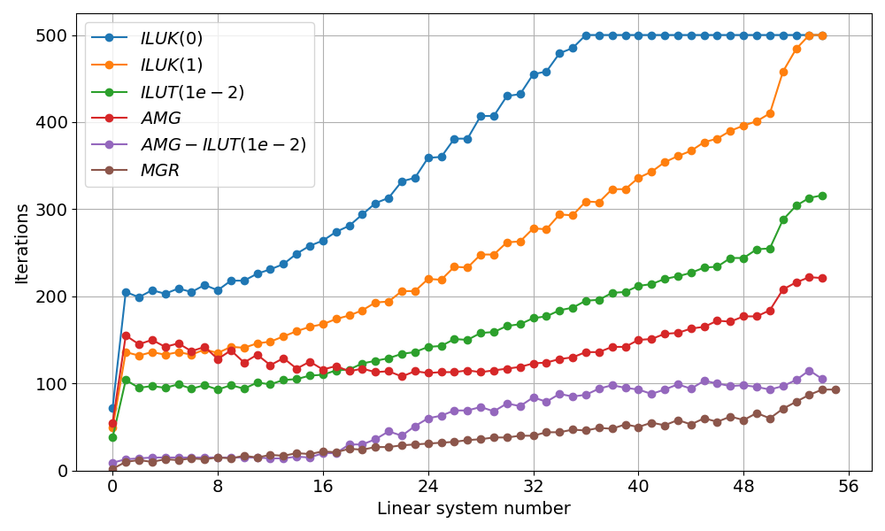

   Linear solver iterations for different preconditioner
   configurations (Re=100, 256×256 grid).

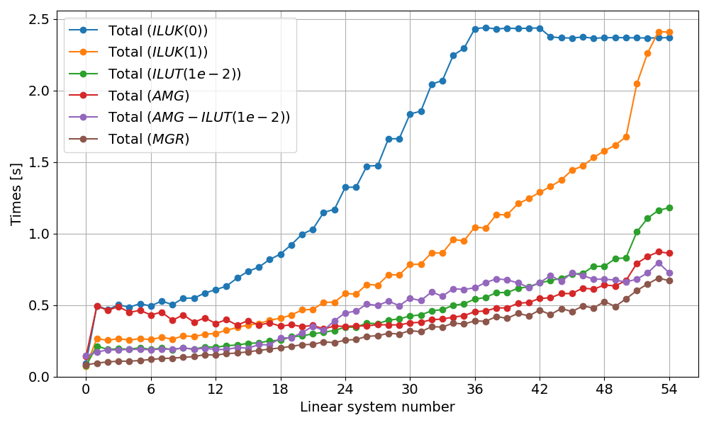

   Total execution time for different preconditioner
   configurations (Re=100, 256×256 grid).

Time Stepping and Newton Convergence
~~~~~~~~~~~~~~~~~~~~~~~~~~~~~~~~~~~~

The simulation advances in time using backward Euler with adaptive time stepping:

1. Initialize velocity and pressure to zero.
2. For each time step until final time:

   a. Perform Newton iterations until the residual norm is below tolerance.
   b. At each Newton iteration, assemble and solve the linearized system.
   c. Update the solution with the Newton correction.
   d. Optionally adjust :math:`\Delta t` based on Newton convergence (adaptive stepping).

3. Write VTK output at specified intervals or at steady state.

The driver supports simple adaptive time stepping: if Newton converges quickly
(≤3 iterations), :math:`\Delta t` is increased; if convergence is slow (≥6 iterations),
:math:`\Delta t` is decreased. Additionally, a maximum CFL constraint can be specified
using the ``-cfl`` option to prevent the time step from growing too large; when enabled,
the time step is limited to :math:`\Delta t \leq \text{CFL}_{\max} \cdot h_{\min}`.

Visualizing the Solution
~~~~~~~~~~~~~~~~~~~~~~~~

The driver outputs VTK ``RectilinearGrid`` files with velocity vectors, pressure,
and divergence fields. A PVD collection file is written at the end to group all
time steps for visualization in ParaView.

- ``-vis 1``: Binary VTK, last time step only
- ``-vis 2``: ASCII VTK, last time step only
- ``-vis 4``: Binary VTK, all time steps
- ``-vis 6``: ASCII VTK, all time steps

Output includes:

- ``velocity``: 3-component vector field :math:`(u, v, 0)`
- ``pressure``: Scalar field :math:`p`
- ``div_velocity``: Divergence :math:`\nabla \cdot \mathbf{u}` (should be near zero)

Open the ``.pvd`` file in ParaView to visualize the flow evolution. Use "Stream Tracer"
or "Glyph" filters to visualize the velocity field and vortex structures.

Validation Results
~~~~~~~~~~~~~~~~~~

In this section, we validate the lid-driven cavity simulation by comparing 128×128
simulation centerline velocity profiles with high-resolution (8192×8192 grid) reference
data from Marchi et al. (2021). The plots were generated using the ``postprocess.py`` script.
They show the u-velocity profiles along the vertical centerline (x = 0.5) as a function of y
and the v-velocity profiles along the horizontal centerline (y = 0.5) as a function of x.
The error metrics (maximum error and RMSE) for both components are also displayed.

.. code-block:: bash

   # Run test cases and plot centerlines comparison
   ./reproduce.sh --centerlines

   # (Optional) Generate individual comparison plots (Re = 100)
   python3 postprocess.py results.pvd --Re 100 --save lidcavity.png --compact

.. list-table:: Centerline Velocity Profile Validation
   :widths: 50 50
   :header-rows: 0

   * - |image_re1|

     - |image_re10|

   * - |image_re100|

     - |image_re400|

   * - |image_re1000|

     - |image_re3200|

   * - |image_re5000|

     - |image_re7500|

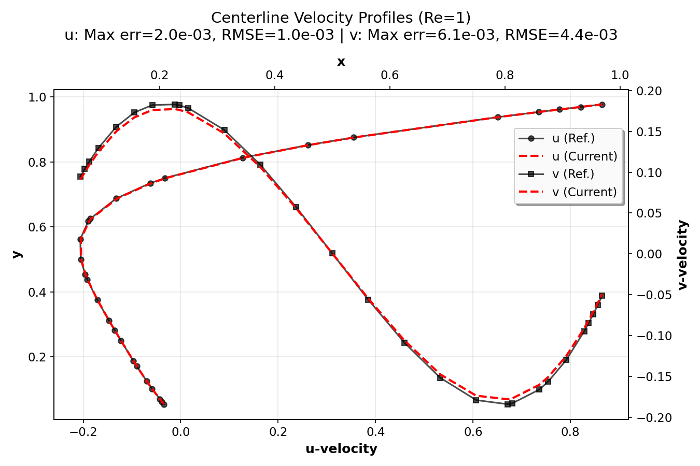

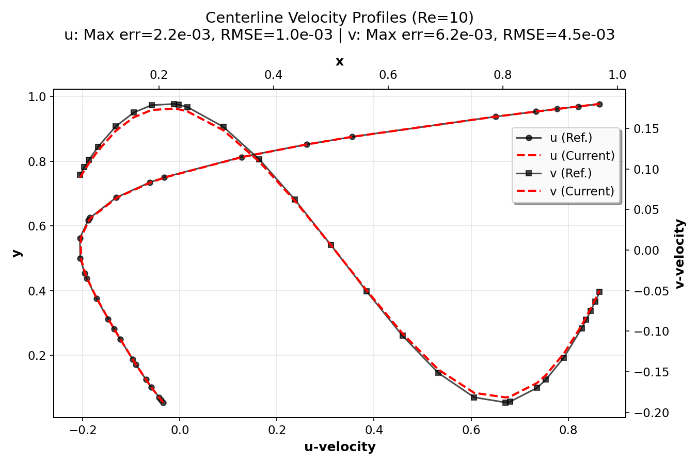

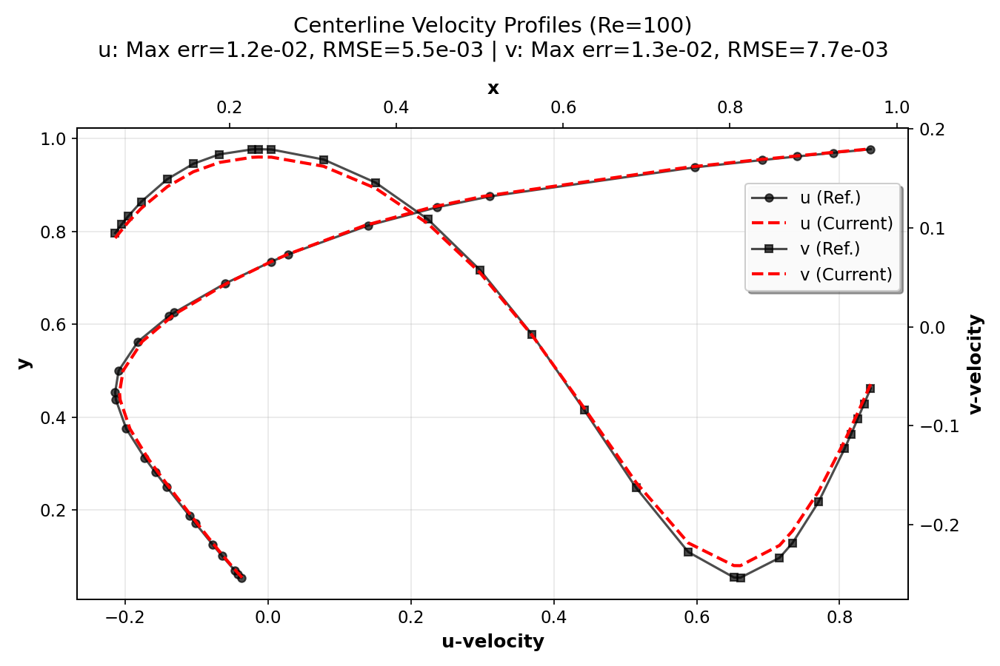

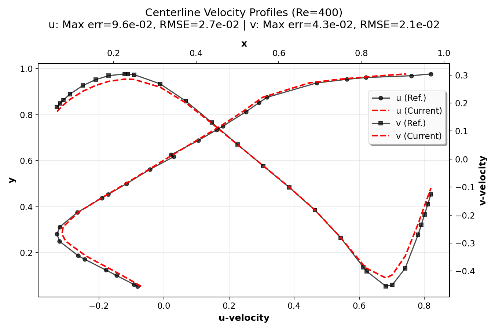

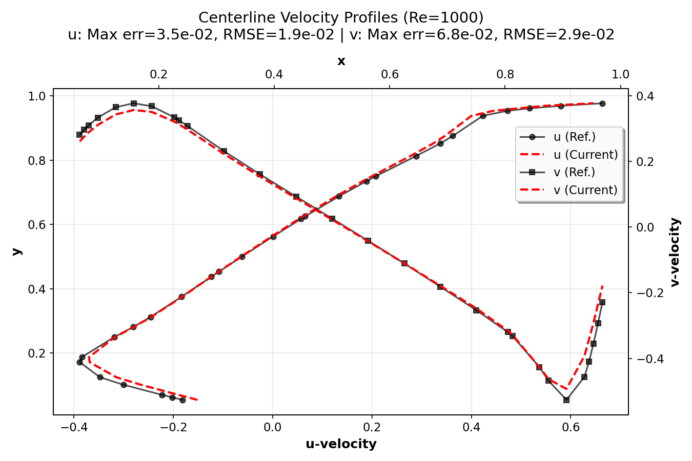

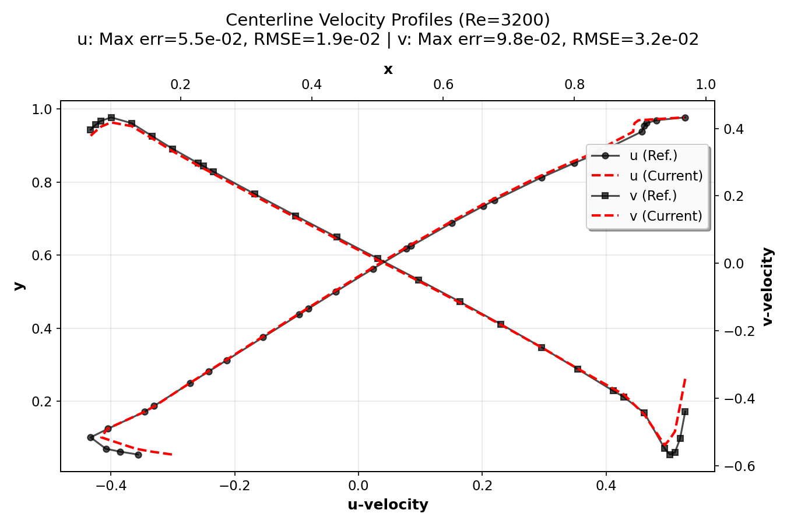

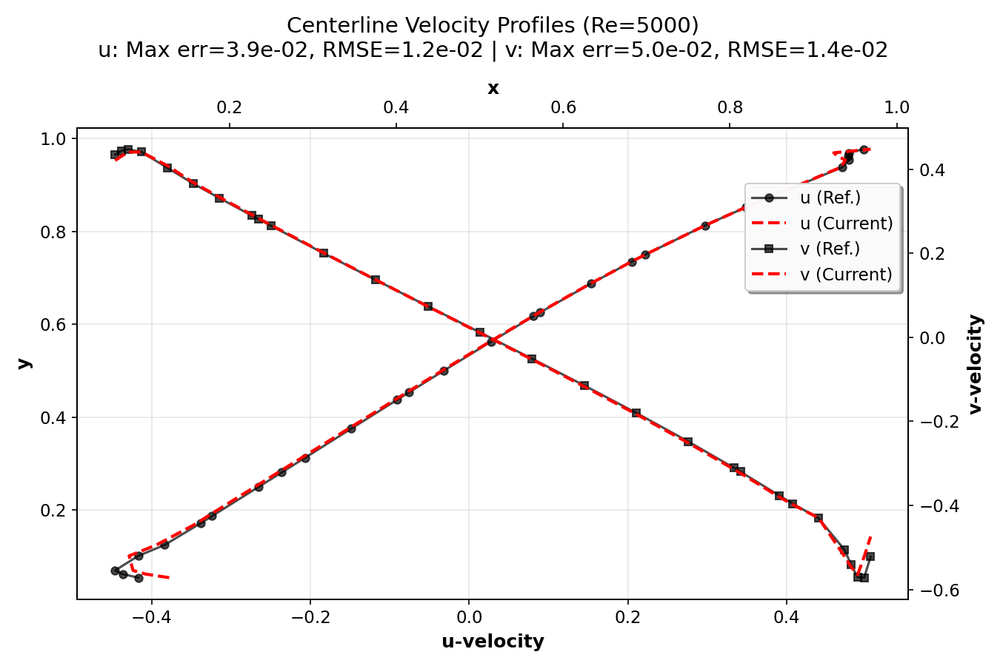

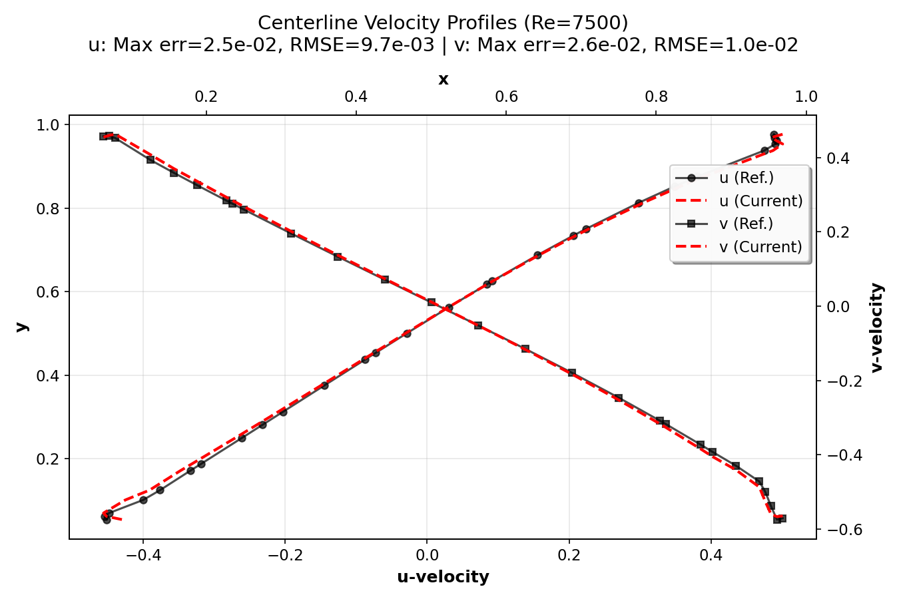

The validation demonstrates that the current numerical implementation provides
accurate results across a wide range of Reynolds numbers, from creeping flow
(Re = 1) to turbulent flow (Re = 7500). The agreement with high-resolution reference
data (Marchi et al., 2021) confirms the correctness of the implementation. The compact
plots show excellent agreement between simulation results and reference data,
with error metrics (maximum error and RMSE) displayed for each Reynolds number.

Reproducible Run
~~~~~~~~~~~~~~~~

Command-line parameters (see ``lidcavity -h``) control problem size, Reynolds number,
time stepping, partitioning, and visualization.

.. code-block:: bash

   mpirun -np 1 /path/to/build/examples/src/C_lidcavity/lidcavity -h

.. code-block:: text

   Usage: ${MPIEXEC_COMMAND} <np> ./lidcavity [options]

   Options:
     -i <file>         : YAML configuration file for solver settings (Opt.)
     -n <nx> <ny>      : Global grid dimensions in nodes (32 32)
     -P <Px> <Py>      : Processor grid dimensions (1 1)
     -L <Lx> <Ly>      : Physical dimensions (1 1)
     -Re <val>         : Reynolds number (100.0)
     -dt <val>         : Initial time step size (1)
     -tf <val>         : Final simulation time (50)
     -ntol <val>       : Non-linear solver tolerance (1.0e-6)
     -adt              : Enable simple adaptive time stepping
     -cfl <val>        : Maximum CFL for adaptive time stepping (0=no limit)
     -reg              : Use regularized lid BC (smooth corners)
     -br <n>           : Batch rows for matrix assembly (128)
     -vis <m>          : Visualization mode bitset (0)
                            Any nonzero value enables visualization
                            Bit 2 (0x2): ASCII (1) or binary (0)
                            Bit 3 (0x4): All timesteps (1) or last only (0)
     -v|--verbose <n>  : Verbosity bitset (0)
                            0x1: Linear solver statistics
                            0x2: Library information
                            0x4: Linear system printing
     -h|--help         : Print this message

Example run for Re=100 with visualization:

.. code-block:: bash

   mpirun -np 1 /path/to/build/examples/src/C_lidcavity/lidcavity -vis 1

.. literalinclude:: ../../examples/src/C_lidcavity/refOutput/default_Re100.out
   :language: text

Resulting streamlines can be plot via the ``postprocess.py`` script in the following way:

.. code-block:: bash

   ./postprocess.py lidcavity_Re100_32x32_1x1.pvd -s --Re 100 --save lidcavity_32x32.png

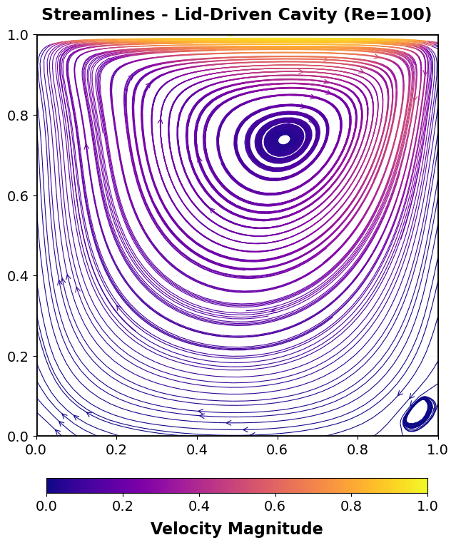
