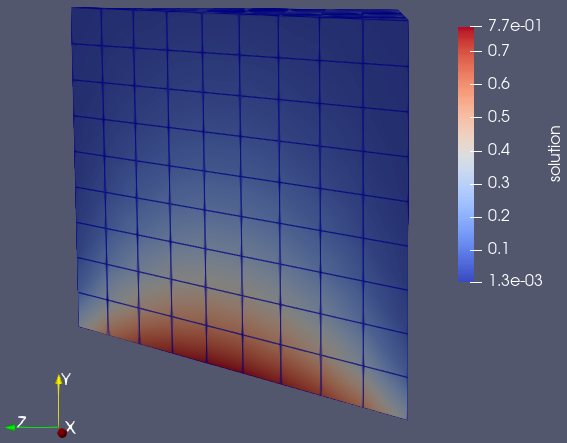
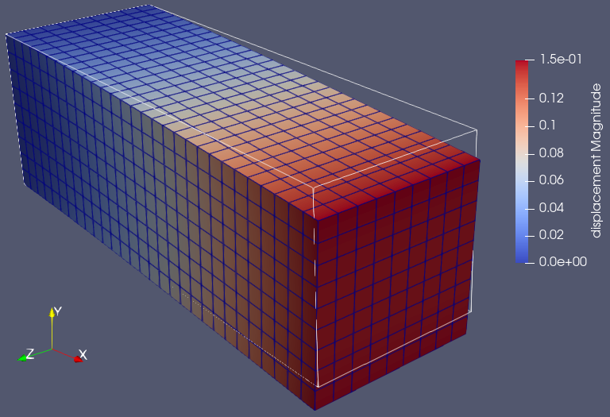

.. Copyright (c) 2024 Lawrence Livermore National Security, LLC and other
   HYPRE Project Developers. See the top-level COPYRIGHT file for details.

   SPDX-License-Identifier: (MIT)

.. _LibraryExamples:

Library Examples (libHYPREDRV)
==============================

This section demonstrates how to use the ``libHYPREDRV`` library from application codes
to assemble, configure, and solve linear systems with hypre. Unlike the :ref:`DriverExamples`
that fully operate the ``hypredrive`` executable via YAML input files, these examples embed the
linear system assembly directly in your program and expose hooks for customizing discretizations,
data layouts, MPI partitioning, and linear solver options via YAML configuration.

.. note::
   Prefer the ``hypredrive`` executable (driver) when working with file-based
   matrices/vectors and you want to quickly experiment with solver/preconditioner
   configurations. Prefer ``libHYPREDRV`` when your application assembles matrices
   and vectors in memory and you need a lightweight API to invoke HYPRE solvers
   and preconditioners programmatically.

Overview of Typical Steps
-------------------------

The library-side workflow in C/C++ generally follows these steps:

1. Initialize MPI (if not already done).
2. Initialize hypredrive and create an object handle.
3. Parse a YAML configuration string/file to set solver/preconditioner options.
4. Assemble your matrix and vectors (``HYPRE_IJMatrix``/``HYPRE_IJVector``) in parallel.
5. Tell hypredrive about your DOF layout (e.g., interleaved blocks).
6. Attach matrix/RHS/initial guess/prec matrix to hypredrive.
7. Create, setup, and apply the solver; print statistics as desired.
8. Retrieve solution values if needed; finalize and destroy hypredrive.

A minimal skeleton of a program using the library is shown below.

.. code-block:: c

   #include "HYPREDRV.h"
   #include <mpi.h>

   int main(int argc, char** argv) {
     MPI_Init(&argc, &argv);

     HYPREDRV_t h;
     HYPREDRV_Initialize();
     HYPREDRV_Create(MPI_COMM_WORLD, &h);

     // Provide YAML configuration
     const char* yaml = "solver: pcg\n"
                        "preconditioner: amg\n";
     char* args[1] = {(char*)yaml};
     HYPREDRV_InputArgsParse(1, args, h);

     HYPREDRV_SetGlobalOptions(h);
     HYPREDRV_SetLibraryMode(h);

     // Build IJ objects (global row range per rank) and assemble your system
     HYPRE_IJMatrix A;
     HYPRE_IJVector b;
     /* ... create/initialize/insert/assemble A, b ... */

     // Set linear system components
     HYPREDRV_LinearSystemSetMatrix(h, (HYPRE_Matrix)A);
     HYPREDRV_LinearSystemSetRHS(h, (HYPRE_Vector)b);
     HYPREDRV_LinearSystemSetInitialGuess(h);
     HYPREDRV_LinearSystemSetPrecMatrix(h);

     // Solve lifecycle
     HYPREDRV_PreconCreate(h);
     HYPREDRV_LinearSolverCreate(h);
     HYPREDRV_LinearSolverSetup(h);
     HYPREDRV_LinearSolverApply(h);
     HYPREDRV_PreconDestroy(h);
     HYPREDRV_LinearSolverDestroy(h);

     // (Optional) Query statistics and solution values
     HYPREDRV_StatsPrint(h);
     HYPRE_Real* xvals = NULL;
     HYPREDRV_LinearSystemGetSolutionValues(h, &xvals);

     // Cleanup
     HYPRE_IJMatrixDestroy(A);
     HYPRE_IJVectorDestroy(b);
     HYPREDRV_Destroy(&h);
     HYPREDRV_Finalize();
     MPI_Finalize();
     return 0;
   }

- YAML configuration can be provided from input file or string.
- For block linear systems, set row mapping information via ``HYPREDRV_LinearSystemSetDofmap``.
- If compiled with GPU support, you may migrate assembled IJ objects to device memory with
  ``HYPRE_IJMatrixMigrate(..., HYPRE_MEMORY_DEVICE)`` and analogous calls for vectors.

.. _LibraryExample1:

Example 1: Laplace's equation
-----------------------------

This section documents a scalar diffusion/Laplace example assembled directly from an
application using the hypre IJ interface via ``libHYPREDRV``. It mirrors the driver in
``examples/src/C_laplacian/laplacian.c`` and demonstrates multiple finite-difference
stencils on a structured grid.

Governing equation and boundary conditions
~~~~~~~~~~~~~~~~~~~~~~~~~~~~~~~~~~~~~~~~~~

We solve

.. math::
   -\nabla\!\cdot\!\big(\mathbf{c}\,\nabla u\big) \;=\; 0 \quad \text{in } \Omega=[0,1]^3, \\
   u \;=\; 0 \ \text{on } \partial\Omega\setminus\{y=0\},\\
   u \;=\; 1 \ \text{on } \{y=0\}

Anisotropy is supported through directional coefficients (see below). A pure Dirichlet
setup yields a symmetric positive definite (SPD) linear system. We discretize on a
uniform structured grid with global node counts :math:`N=(N_x,N_y,N_z)` and spacings
:math:`h_x = 1/(N_x-1)`, :math:`h_y = 1/(N_y-1)`, :math:`h_z = 1/(N_z-1)`. Nodes are
indexed lexicographically with :math:`x` fastest. Parallel partitioning uses an MPI
Cartesian grid :math:`P=(P_x,P_y,P_z)` with block starts ``pstarts[d]``.

Finite-difference stencils
~~~~~~~~~~~~~~~~~~~~~~~~~~

We support several stencils for :math:`-\nabla\!\cdot(\mathbf{c}\nabla u)` on a structured grid.
All produce an M-matrix (positive diagonal, non-positive off-diagonals) and are second-order
accurate when weights are chosen consistently.

7-point (faces only, classical 2nd order)
^^^^^^^^^^^^^^^^^^^^^^^^^^^^^^^^^^^^^^^^^

With directional coefficients :math:`c_x,c_y,c_z` and spacings :math:`h_x,h_y,h_z`,
the discrete operator at interior node :math:`(i,j,k)` is

.. math::
   \begin{aligned}
   (L_h u)_{i,j,k}
   &= \frac{c_x}{h_x^2}\,\big(u_{i+1,j,k} - 2u_{i,j,k} + u_{i-1,j,k}\big) + \\
   &\quad \frac{c_y}{h_y^2}\,\big(u_{i,j+1,k} - 2u_{i,j,k} + u_{i,j-1,k}\big) + \\
   &\quad \frac{c_z}{h_z^2}\,\big(u_{i,j,k+1} - 2u_{i,j,k} + u_{i,j,k-1}\big)
   \end{aligned}

19-point (faces + edges)
^^^^^^^^^^^^^^^^^^^^^^^^

Adds edge neighbors (e.g., :math:`(i\pm1,j\pm1,k)`, etc.) with scaled couplings to reduce
directional bias. A common strategy is to assign edge weights that partially compensate
cross-term truncation errors from a Taylor expansion, while preserving diagonal dominance
and the M-matrix structure.

27-point (faces + edges + corners)
^^^^^^^^^^^^^^^^^^^^^^^^^^^^^^^^^^

Includes the full :math:`3\times3\times3` neighborhood (faces, edges, corners). Corner
weights are smaller than faces; one can tune edge/corner weights (e.g., half/third of
face weights) to further reduce dispersion and directional bias.

125-point (radius-2 demo)
^^^^^^^^^^^^^^^^^^^^^^^^^

Extends the neighborhood to radius 2 (up to 125 points). In the example driver, face-adjacent
neighbors often receive stronger weights (e.g., :math:`-1`), while farther neighbors receive
smaller negative weights (e.g., :math:`-0.01`), preserving an M-matrix with a dominant diagonal.

Coefficients and anisotropy
^^^^^^^^^^^^^^^^^^^^^^^^^^^

The example exposes coefficient arrays in the driver (``params->c``). For 7-point,
only face-connected neighbors are used with directional weights, e.g., in dimension-wise
form

.. math::
   (A u)_{i,j,k} \;\approx\; \sum_{\alpha\in\{x,y,z\}}
   \frac{c_\alpha}{h_\alpha^2}\,\big(-u_{i-\hat\alpha} + 2u_{i} - u_{i+\hat\alpha}\big).

For 19/27-point, the example scales edge/corner couplings (e.g., half/third) to reduce
cross terms, preserving a strictly diagonally dominant M-matrix. The 125-point variant
uses uniform small weights for far neighbors to illustrate wide stencils.

Boundary Conditions and SPD Structure
^^^^^^^^^^^^^^^^^^^^^^^^^^^^^^^^^^^^^

Dirichlet values are enforced during assembly: when a neighbor lies outside :math:`\Omega`,
or when the face corresponds to :math:`y=0` with :math:`u=1`, the contribution is moved to
the RHS. Rows for interior nodes use only valid neighbor columns; the diagonal entry is
the negative sum of off-diagonals to maintain row-sum consistency and SPD structure.

Linear System Creation (IJ interface)
~~~~~~~~~~~~~~~~~~~~~~~~~~~~~~~~~~~~~

- Create ``HYPRE_IJMatrix``/``HYPRE_IJVector`` on the Cartesian communicator with global
  row range ``[ilower, iupper]`` for this rank.
- Set per-row nnz bounds according to the stencil (7, 19, 27, 125) with
  ``HYPRE_IJMatrixSetRowSizes``; initialize IJ objects.
- For each local node, compute the global row (block-aware), enumerate stencil neighbors,
  and build column/value arrays. Off-partition neighbors remain valid columns (IJ distributes);
  out-of-domain neighbors contribute to the RHS via Dirichlet handling above.
- Insert with ``HYPRE_IJMatrixSetValues`` (or ``AddToValues``) and ``HYPRE_IJVectorSetValues``,
  then assemble.

This is a scalar problem (one DOF per node), so no interleaved dofmap is required before
attaching the matrix/vector to hypredrive.

Linear Solver Setup
~~~~~~~~~~~~~~~~~~~

Solver and preconditioner options (PCG+AMG by default) are provided via YAML parsed with
``HYPREDRV_InputArgsParse``; the create/setup/apply sequence honors those settings.

.. code-block:: c

   // After building IJ A,b as a scalar system:
   HYPREDRV_LinearSystemSetMatrix(hdrv, (HYPRE_Matrix)A);
   HYPREDRV_LinearSystemSetRHS(hdrv,    (HYPRE_Vector)b);
   HYPREDRV_LinearSystemSetInitialGuess(hdrv);   // zero by default
   HYPREDRV_LinearSystemSetPrecMatrix(hdrv);     // reuse A if desired

   HYPREDRV_PreconCreate(hdrv);
   HYPREDRV_LinearSolverCreate(hdrv);
   HYPREDRV_LinearSolverSetup(hdrv);
   HYPREDRV_LinearSolverApply(hdrv);
   HYPREDRV_PreconDestroy(hdrv);
   HYPREDRV_LinearSolverDestroy(hdrv);

The default in the example is a conjugate gradient solver with a BoomerAMG preconditioner.
Additional AMG parameters (e.g., coarsening, interpolation) can be specified as needed in
the YAML configuration.

Visualizing the Solution
~~~~~~~~~~~~~~~~~~~~~~~~

The example can write per-rank ``RectilinearGrid`` VTK with a scalar point field
``solution``. Ghost exchanges (faces/edges/corners) assemble an overlapped piece on
negative faces to avoid cracks at partition boundaries. Use ``-vis 1`` (ASCII) or
``-vis 2`` (appended binary). Open the collection ``.pvd`` in ParaView and display
the ``solution`` scalar with a suitable colormap; consider “Contour” for isosurfaces.

   Single-rank result in ParaView: solution field visualized with “Contour”
   (clipped at (0.5, 0.5, 0.5) with normal (1, 0, 1)).

Reproducible Run
~~~~~~~~~~~~~~~~

Command-line parameters (see ``laplacian -h``) control problem size, coefficients,
partitioning, number of solves, printing, verbosity, and visualization.

.. code-block:: bash

  mpirun -np 1 /path/to/build/examples/src/C_laplacian/laplacian -h

.. code-block:: text

  Usage: ${MPIEXEC_COMMAND} ${MPIEXEC_NUMPROC_FLAG} <np> ./laplacian [options]

  Options:
    -i <file>         : YAML configuration file for solver settings
    -n <nx> <ny> <nz> : Global grid dimensions (default: 10 10 10)
    -c <cx> <cy> <cz> : Diffusion coefficients (default: 1.0 1.0 1.0)
    -P <Px> <Py> <Pz> : Processor grid dimensions (default: 1 1 1)
    -s <val>          : Stencil type: 7 19 27 125 (default: 7)
    -ns|--nsolve <n>  : Number of times to solve the system (default: 5)
    -vis|--visualize  : Output solution in VTK format (default: false)
    -p|--print        : Print matrices/vectors to file (default: false)
    -v|--verbose <n>  : Verbosity level (bitset):
                        0x1: Print solver statistics
                        0x2: Print library info
                        0x4: Print system info
    -h|--help         : Print this message

For a single-process run, the output should be similar to the following:

.. code-block:: bash

  mpirun -np 1 /path/to/build/examples/src/C_laplacian/laplacian

.. literalinclude:: ../../examples/refOutput/laplacian.txt
   :language: text

.. _LibraryExample2:

Example 2: Linear Elasticity
-----------------------------

This section documents the mathematical model, discretization, and hypre usage
for the 3D small-strain linear elasticity driver implemented in ``examples/src/C_elasticity/elasticity.c``.
It targets readers comfortable with PDEs, variational formulations, and finite element assembly.

Governing Equations (Small-Strain Isotropic Elasticity)
~~~~~~~~~~~~~~~~~~~~~~~~~~~~~~~~~~~~~~~~~~~~~~~~~~~~~~~

We consider a bounded Lipschitz domain :math:`\Omega \subset \mathbb{R}^3` with boundary
:math:`\partial\Omega = \Gamma_D \cup \Gamma_N`, :math:`\Gamma_D \cap \Gamma_N = \emptyset`.
The unknown displacement field is :math:`\mathbf{u} : \Omega \to \mathbb{R}^3`.

- Kinematics (small strain):

  .. math::

     \varepsilon(\mathbf{u}) \;=\; \tfrac{1}{2}\big(\nabla \mathbf{u} + \nabla \mathbf{u}^\top\big)
     \;\in\; \mathbb{R}_{\text{sym}}^{3\times 3}.

- Constitutive law (isotropic Hooke):

  .. math::

     \sigma(\mathbf{u}) \;=\; \lambda\,\mathrm{tr}\!\big(\varepsilon(\mathbf{u})\big)\,I \;+\; 2G\,\varepsilon(\mathbf{u}),

  with Lamé parameters

  .. math::
     G \;=\; \frac{E}{2(1+\nu)},\qquad
     \lambda \;=\; \frac{E\nu}{(1+\nu)(1-2\nu)}.

- Strong form:

  .. math::
     -\nabla\!\cdot \sigma(\mathbf{u}) \;=\; \mathbf{f} \quad \text{in } \Omega,
     \qquad
     \mathbf{u} \;=\; \mathbf{0} \quad \text{on } \Gamma_D,
     \qquad
     \sigma(\mathbf{u})\,\mathbf{n} \;=\; \mathbf{t} \quad \text{on } \Gamma_N.

In the example driver:
- The clamped plane is :math:`\Gamma_D = \{x=0\}` (all three components fixed).
- Body force :math:`\mathbf{f} = \rho\,\mathbf{g}`.
- Optional traction :math:`\mathbf{t}` on the top surface :math:`\{y=L_y\}`.

Variational Formulation
~~~~~~~~~~~~~~~~~~~~~~~

Let :math:`V = \big\{\mathbf{v}\in [H^1(\Omega)]^3 : \mathbf{v}=\mathbf{0}\text{ on }\Gamma_D\big\}`.
The weak problem reads: find :math:`\mathbf{u} \in \mathbf{u}_D + V` such that for all :math:`\mathbf{v} \in V`,

.. math::
   \int_{\Omega} \varepsilon(\mathbf{v}) : \sigma(\mathbf{u}) \, d\Omega
   \;=\;
   \int_{\Omega} \mathbf{v}\cdot \mathbf{f}\, d\Omega
   \;+\;
   \int_{\Gamma_N} \mathbf{v}\cdot \mathbf{t}\, d\Gamma.

With isotropy, in Voigt notation :math:`\varepsilon_v = (\varepsilon_{xx},\varepsilon_{yy},\varepsilon_{zz},
\gamma_{yz},\gamma_{xz},\gamma_{xy})^\top`, one writes :math:`\sigma_v = D\,\varepsilon_v`, where
the :math:`6\times6` matrix :math:`D` is

.. math::
   D \;=\;
   \begin{bmatrix}
   \lambda+2G & \lambda & \lambda & 0 & 0 & 0 \\
   \lambda & \lambda+2G & \lambda & 0 & 0 & 0 \\
   \lambda & \lambda & \lambda+2G & 0 & 0 & 0 \\
   0 & 0 & 0 & G & 0 & 0 \\
   0 & 0 & 0 & 0 & G & 0 \\
   0 & 0 & 0 & 0 & 0 & G
   \end{bmatrix}.

Discretization: Q1 Hexahedra on a Cartesian Mesh
~~~~~~~~~~~~~~~~~~~~~~~~~~~~~~~~~~~~~~~~~~~~~~~~

We use a uniform Cartesian mesh with nodal counts :math:`N=(N_x,N_y,N_z)` and physical sizes
:math:`L=(L_x,L_y,L_z)`. Element sizes are
:math:`h = (h_x,h_y,h_z) = \big(L_x/(N_x-1),\, L_y/(N_y-1),\, L_z/(N_z-1)\big)`.
Each hexahedral element has 8 vertices with trilinear (Q1) shape functions on the
reference cube :math:`\widehat{\Omega}=[-1,1]^3`.

Reference shape functions and derivatives
^^^^^^^^^^^^^^^^^^^^^^^^^^^^^^^^^^^^^^^^^

Number the element vertices :math:`a=1,\dots,8` and define signed tuples
:math:`(s_x^a,s_y^a,s_z^a)\in\{\pm1\}^3`. The reference shape functions are

.. math::
   N_a(\xi,\eta,\zeta) \;=\; \tfrac{1}{8}\,(1+s_x^a \xi)\,(1+s_y^a \eta)\,(1+s_z^a \zeta),

with derivatives

.. math::
   \frac{\partial N_a}{\partial \xi} \;=\; \tfrac{1}{8}\,s_x^a\,(1+s_y^a \eta)\,(1+s_z^a \zeta),\\
   \frac{\partial N_a}{\partial \eta} \;=\; \tfrac{1}{8}\,s_y^a\,(1+s_x^a \xi)\,(1+s_z^a \zeta),\\
   \frac{\partial N_a}{\partial \zeta} \;=\; \tfrac{1}{8}\,s_z^a\,(1+s_x^a \xi)\,(1+s_y^a \eta).

Mapping and gradient transformation
^^^^^^^^^^^^^^^^^^^^^^^^^^^^^^^^^^^

For a uniform rectangular element the mapping :math:`\mathbf{x}(\xi,\eta,\zeta)` has
constant Jacobian

.. math::
   J \;=\; \mathrm{diag}\!\big(\tfrac{h_x}{2},\,\tfrac{h_y}{2},\,\tfrac{h_z}{2}\big),\qquad
   J^{-1} \;=\; \mathrm{diag}\!\big(\tfrac{2}{h_x},\,\tfrac{2}{h_y},\,\tfrac{2}{h_z}\big),\qquad
   \det J \;=\; \tfrac{h_x h_y h_z}{8}.

Physical gradients follow from :math:`\nabla_{\mathbf{x}} N_a = J^{-\top}\,\nabla_{\xi} N_a`, i.e.,

.. math::
   \frac{\partial N_a}{\partial x} \;=\; \frac{2}{h_x}\,\frac{\partial N_a}{\partial \xi},\qquad
   \frac{\partial N_a}{\partial y} \;=\; \frac{2}{h_y}\,\frac{\partial N_a}{\partial \eta},\qquad
   \frac{\partial N_a}{\partial z} \;=\; \frac{2}{h_z}\,\frac{\partial N_a}{\partial \zeta}.

Strain–displacement operator (Voigt form)
^^^^^^^^^^^^^^^^^^^^^^^^^^^^^^^^^^^^^^^^^

Let :math:`\mathbf{u}_e \in \mathbb{R}^{24}` collect the 24 element dofs in the interleaved order
:math:`[u_{x1},u_{y1},u_{z1},\,\dots,\,u_{x8},u_{y8},u_{z8}]^\top`.
The strain in Voigt notation :math:`\varepsilon_v = (\varepsilon_{xx},\varepsilon_{yy},\varepsilon_{zz},
\gamma_{yz},\gamma_{xz},\gamma_{xy})^\top` is

.. math::
   \varepsilon_v(\mathbf{u}_e) \;=\; B\,\mathbf{u}_e,\qquad
   B \;=\; \big[\,B_1\;\;B_2\;\;\cdots\;\;B_8\,\big],\;\; B_a \in \mathbb{R}^{6\times 3},

with per-node blocks

.. math::
   B_a \;=\;
   \begin{bmatrix}
   \partial_x N_a & 0 & 0 \\
   0 & \partial_y N_a & 0 \\
   0 & 0 & \partial_z N_a \\
   0 & \partial_z N_a & \partial_y N_a \\
   \partial_z N_a & 0 & \partial_x N_a \\
   \partial_y N_a & \partial_x N_a & 0
   \end{bmatrix}.

Element matrices and loads
^^^^^^^^^^^^^^^^^^^^^^^^^^

- Volume quadrature: tensor-product 2×2×2 Gauss points :math:`\{(\xi_q,\eta_q,\zeta_q),\,w_q\}`.
  With the constant mapping, the physical weight is :math:`w_q^{\Omega} = w_q \,\det J`.
  The element stiffness and body-force load read

  .. math::
     K_e \;=\; \sum_q B(\xi_q,\eta_q,\zeta_q)^\top\, D \, B(\xi_q,\eta_q,\zeta_q)\; w_q^{\Omega},
     \qquad
     \mathbf{f}_e^{\text{vol}} \;=\; \sum_q N(\xi_q,\eta_q,\zeta_q)^\top (\rho\,\mathbf{g})\; w_q^{\Omega},

  where :math:`N(\cdot)\in\mathbb{R}^{3\times 24}` is the vector-valued shape function matrix that
  places each scalar :math:`N_a` on the three displacement components in the interleaved ordering.

- Traction on the top face :math:`\{y=L_y\}` corresponds to :math:`\eta = +1` on the reference element.
  Using 2×2 Gauss in :math:`(\xi,\zeta)` with surface Jacobian :math:`\det J_s=\tfrac{h_x h_z}{4}`, the
  face load contribution is

  .. math::
     \mathbf{f}_e^{\text{trac}} \;=\;
     \sum_{q\in \widehat{\Gamma}}
     N(\xi_q,\,\eta{=}+1,\,\zeta_q)^\top \,\mathbf{t}\; w_q^{\Gamma},\qquad
     w_q^{\Gamma} \;=\; w_q \,\det J_s.

In practice, the driver precomputes the constant factors (e.g., :math:`J^{-1}`, :math:`\det J`,
and the values of :math:`B` at Gauss points) to amortize cost across elements with identical size,
and assembles :math:`K_e` and :math:`\mathbf{f}_e=\mathbf{f}_e^{\text{vol}}+\mathbf{f}_e^{\text{trac}}`
into the global system using the interleaved dof map.

Element Matrices and Vectors
^^^^^^^^^^^^^^^^^^^^^^^^^^^^

For a single element with 8 nodes and 3 components per node (24 dofs), define the element
strain-displacement operator :math:`B(\xi,\eta,\zeta) \in \mathbb{R}^{6\times 24}` in Voigt form,
assembled from the physical derivatives :math:`(\partial N_a/\partial x,\partial N_a/\partial y,\partial N_a/\partial z)`.
The element stiffness and loads are

.. math::
   K_e \;=\; \int_{\Omega_e} B^\top D\,B\, d\Omega
   \;\;\approx\;\; \sum_{q\in Q_{2\times2\times2}} B_q^\top D\,B_q\, w_q,

.. math::
   \mathbf{f}_e^{\text{vol}} \;=\; \int_{\Omega_e} N^\top\,(\rho\,\mathbf{g})\, d\Omega
   \;\;\approx\;\; \sum_{q\in Q_{2\times2\times2}} N_q^\top\,(\rho\,\mathbf{g})\, w_q,

.. math::
   \mathbf{f}_e^{\text{trac}} \;=\; \int_{\Gamma_{t}\cap\partial\Omega_e} N^\top\,\mathbf{t}\, d\Gamma
   \;\;\approx\;\; \sum_{q\in Q_{2\times2}} N_q^\top\,\mathbf{t}\, w_q^{\Gamma}.

Boundary Conditions and SPD Structure
^^^^^^^^^^^^^^^^^^^^^^^^^^^^^^^^^^^^^

The clamped plane :math:`\{x=0\}` imposes :math:`\mathbf{u}=\mathbf{0}` on all three displacement components.
In assembly, we:

1. Suppress all rows and columns associated with Dirichlet dofs when inserting element contributions.
2. Before final assembly, set each Dirichlet row to an identity row (diagonal 1) and RHS 0.

This yields a symmetric positive definite (SPD) system.

Parallel Partitioning and Global Numbering
^^^^^^^^^^^^^^^^^^^^^^^^^^^^^^^^^^^^^^^^^^

We use an MPI Cartesian partition :math:`P=(P_x,P_y,P_z)`. Let :math:`pstarts[d][b]` be the
prefix-sum array of node starts along dimension :math:`d` for block coordinate
:math:`b\in\{0,\dots,P_d\}` (balanced remainder). Denote the owner of global node
:math:`(i,j,k)` by :math:`(b_x,b_y,b_z)`. The scalar global node ID uses lexicographic ordering
with block-aware offsets (as in ``grid2idx``). With three interleaved displacement components per
node, DOF IDs satisfy:

.. math::
   \mathrm{dof}_{\mathrm{gid}}(a,c) \;=\; 3\,\mathrm{node}_{\mathrm{gid}}(a) \;+\; c,
   \qquad c\in\{0,1,2\}.

The driver restricts insertion to owned rows; off-rank columns (couplings) are allowed by IJ assembly.

Linear System Creation
~~~~~~~~~~~~~~~~~~~~~~

- Create ``HYPRE_IJMatrix`` and ``HYPRE_IJVector`` on the solver communicator with global
  dof bounds for this rank; set object type to ``HYPRE_PARCSR``.
- Provide per-row nnz upper bounds (conservative 81) with
  ``HYPRE_IJMatrixSetRowSizes``; initialize with ``HYPRE_IJMatrixInitialize_v2`` and
  ``HYPRE_IJVectorInitialize_v2``.
- Assemble element contributions using ``HYPRE_IJMatrixAddToValues`` and ``HYPRE_IJVectorAddToValues``.
- Impose Dirichlet rows with ``HYPRE_IJMatrixSetValues`` and ``HYPRE_IJVectorSetValues``.
- Finalize with ``HYPRE_IJMatrixAssemble`` and ``HYPRE_IJVectorAssemble``.
- Optional GPU migration with ``HYPRE_IJMatrixMigrate``/``HYPRE_IJVectorMigrate`` if built with GPU.

For example, the following code snippet shows how to create a ``HYPRE_IJMatrix`` and ``HYPRE_IJVector``
and assemble element contributions using ``HYPRE_IJMatrixAddToValues`` and ``HYPRE_IJVectorAddToValues``
and set the linear system components to hypredrive. Note that the interleaved 3-DOF layout per node is
announced to hypredrive before setting the matrix and vector components. This information might be useful
for some preconditioners.

  .. code-block:: c

     HYPRE_IJMatrix A;
     HYPRE_IJVector b;
     /* ... create/initialize/insert/assemble A, b ... */

     HYPREDRV_LinearSystemSetInterleavedDofmap(hdrv, local_num_nodes, 3);
     HYPREDRV_LinearSystemSetMatrix(hdrv, (HYPRE_Matrix)A);
     HYPREDRV_LinearSystemSetRHS(hdrv, (HYPRE_Vector)b);
     HYPREDRV_LinearSystemSetInitialGuess(hdrv);
     HYPREDRV_LinearSystemSetPrecMatrix(hdrv);

Linear Solver Setup
~~~~~~~~~~~~~~~~~~~

The linear solver is created, setup, applied, and destroyed per solve. Solver and
preconditioner choices (e.g., PCG/FGMRES, AMG/MGR), tolerances, stopping criteria, and
other options are provided via the YAML configuration parsed earlier with
``HYPREDRV_InputArgsParse``; the create/setup/apply sequence below honors those settings.

  .. code-block:: c

     HYPREDRV_PreconCreate(hdrv);
     HYPREDRV_LinearSolverCreate(hdrv);
     HYPREDRV_LinearSolverSetup(hdrv);
     HYPREDRV_LinearSolverApply(hdrv);
     HYPREDRV_PreconDestroy(hdrv);
     HYPREDRV_LinearSolverDestroy(hdrv);

The default in the example is a conjugate gradient solver with an unknown-based BoomerAMG
preconditioner (Prolongation operator considers only intra-variable couplings, i.e.,
connections within the same type of displacement component).

Visualizing the Solution
~~~~~~~~~~~~~~~~~~~~~~~~

The driver can emit per-rank VTK ``RectilinearGrid`` pieces with one-layer overlap on the
negative faces so adjacent subdomains stitch seamlessly. Ghost data for faces, edges,
and corners are exchanged prior to writing to avoid cracks at partition boundaries.

- ``-vis 1``: ASCII VTK. Easy to inspect/diff but larger on disk and slower to write.
- ``-vis 2``: Appended raw binary. Compact and faster; preferred for larger runs.

Output artifacts:

- One file per rank:
  ``elasticity_{Nx}x{Ny}x{Nz}_{Px}x{Py}x{Pz}_{rank}.vtr`` with a 3-component point vector
  named ``displacement``.
- One collection file on rank 0:
  ``elasticity_{Nx}x{Ny}x{Nz}_{Px}x{Py}x{Pz}.pvd`` enumerating all rank pieces.

To visualize, open the ``.pvd`` in ParaView. Display the ``displacement`` vector and,
optionally, use “Warp By Vector” or “Glyph” filters to view deformations or vectors.
  

   Single-rank result in ParaView: displacement field visualized with “Warp By Vector”
   (modest scale) and colored by magnitude
   :math:`\|\mathbf{u}\|_2 = \sqrt{u_x^2 + u_y^2 + u_z^2}`.

Reproducible Run
~~~~~~~~~~~~~~~~

Command-line parameters (see ``elasticity -h``) control problem size, partitioning,
material/loads, verbosity, and visualization. Defaults (in parentheses) match the
figure above and the reference output included below.

.. code-block:: bash

  mpirun -np 1 /path/to/build/examples/src/C_elasticity/elasticity -h

.. code-block:: text

  Usage: ${MPIRUN} ./elasticity [options]

  Options:
    -i <file>         : YAML configuration file for solver settings (Optional)
    -n <nx> <ny> <nz> : Global grid dimensions in nodes (30 10 10)
    -P <Px> <Py> <Pz> : Processor grid dimensions (1 1 1)
    -L <Lx> <Ly> <Lz> : Physical dimensions (3 1 1)
    -g <gx> <gy> <gz> : Gravity vector g (0 -9.81 0)
    -T <tx> <ty> <tz> : Uniform traction on top surface y=Ly (0 -100 0)
    -br <n>           : Batch rows for matrix assembly (128)
    -E <val>          : Young's modulus E (1.0e5)
    -nu <val>         : Poisson ratio nu (0.3)
    -rho <val>        : Density rho (1.0)
    -ns|--nsolve <n>  : Number of solves (5)
    -vis <m>          : Visualization mode (0)
        0: none
        1: ASCII VTK
        2: binary VTK
    -v|--verbose <n>  : Verbosity bitset (1)
        0x1: Linear solver statistics
        0x2: Library information
        0x4: Linear system printing
    -h|--help         : Print this message

For a single-process run, the output should be similar to the following:

.. code-block:: bash

   mpirun -np 1 /path/to/build/examples/src/C_elasticity/elasticity

.. literalinclude:: ../../examples/refOutput/elasticity.txt
   :language: text
