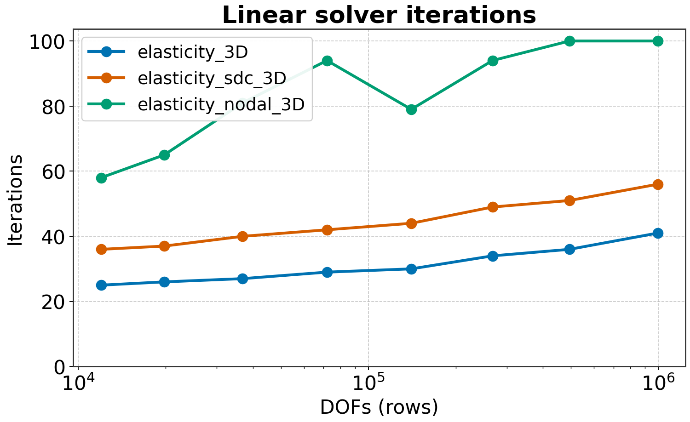
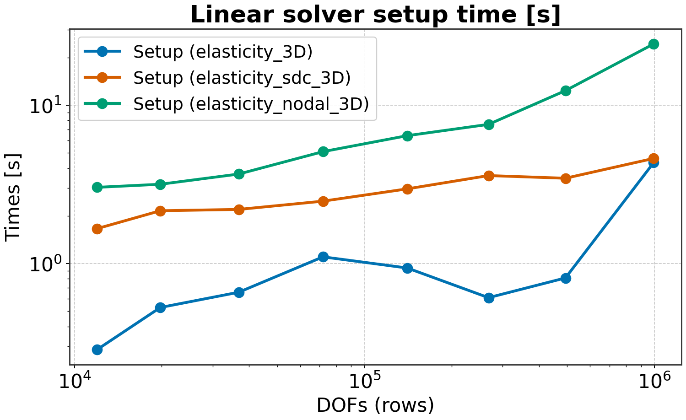
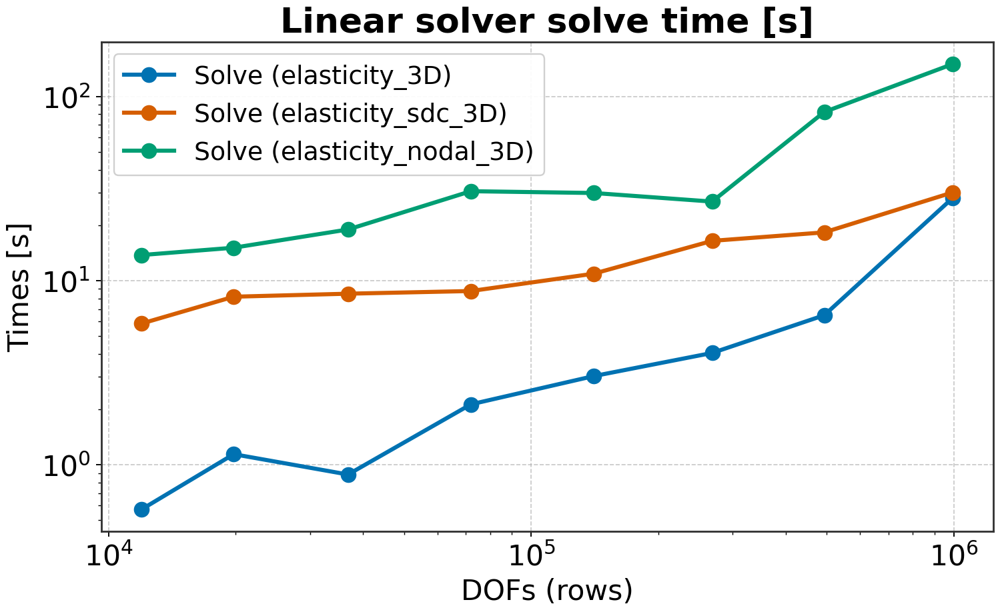

.. Copyright (c) 2024 Lawrence Livermore National Security, LLC and other
   HYPRE Project Developers. See the top-level COPYRIGHT file for details.

   SPDX-License-Identifier: (MIT)

.. _LibraryExamples:

Library Examples (libHYPREDRV)
==============================

This section shows how applications use ``libHYPREDRV`` with their own linear systems.
The :ref:`DriverExamples` use ``hypredrive-cli`` with YAML and system data files. In
contrast, these library examples assemble matrices and vectors in the application. This
mode supports applications that own the discretization, data layout, MPI partition, and
solver lifecycle. `hypredrive` then configures and runs the HYPRE solvers and
preconditioners.

.. note::
   The ``hypredrive-cli`` driver is appropriate for system data on disk and quick solver
   comparisons. ``libHYPREDRV`` is appropriate when an application assembles system data
   in memory and requires a small API.

Examples at a Glance
--------------------

Click any panel (image or title) to jump to the full example.

.. |gl_laplace| image:: figures/laplacian_solution_3d.png
   :target: LibraryExample1_
   :width: 100%
   :class: gallery-thumb
.. |gl_darcy| image:: figures/spe10_darcy_pressure.png
   :target: LibraryExample2_
   :width: 100%
   :class: gallery-thumb
.. |gl_elasticity| image:: figures/elasticity_solution_3d.png
   :target: LibraryExample3_
   :width: 100%
   :class: gallery-thumb
.. |gl_maxwell| image:: figures/maxwell_solution_3d.png
   :target: maxwell_example_
   :width: 100%
   :class: gallery-thumb
.. |gl_graddiv| image:: figures/graddiv_solution_3d.png
   :target: graddiv_example_
   :width: 100%
   :class: gallery-thumb
.. |gl_heatflow_v| image:: figures/heatflow_transient.gif
   :target: LibraryExample4_
   :width: 100%
   :class: gallery-thumb
.. |gl_lidcavity_v| image:: figures/lidcavity_streamlines.gif
   :target: LibraryExample5_
   :width: 100%
   :class: gallery-thumb
.. |gl_heatflow_s| image:: figures/heatflow_transient.png
   :target: LibraryExample4_
   :width: 100%
   :class: gallery-thumb
.. |gl_lidcavity_s| image:: figures/lidcavity_streamlines.png
   :target: LibraryExample5_
   :width: 100%
   :class: gallery-thumb

.. only:: html

   .. list-table::
      :widths: 1 1 1
      :align: center

      * - |gl_laplace|

          :ref:`1. Laplace's equation <LibraryExample1>`
        - |gl_darcy|

          :ref:`2. Mixed Darcy Flow <LibraryExample2>`
        - |gl_elasticity|

          :ref:`3. Linear Elasticity <LibraryExample3>`
      * - |gl_heatflow_v|

          :ref:`4. Nonlinear Heat Flow <LibraryExample4>`
        - |gl_lidcavity_v|

          :ref:`5. Navier-Stokes <LibraryExample5>`
        - |gl_maxwell|

          :ref:`6. Definite curl-curl (AMS) <maxwell_example>`
      * - |gl_graddiv|

          :ref:`7. Definite grad-div (ADS) <graddiv_example>`
        -
        -

.. only:: latex

   .. list-table::
      :widths: 1 1 1
      :align: center

      * - |gl_laplace|

          :ref:`1. Laplace's equation <LibraryExample1>`
        - |gl_darcy|

          :ref:`2. Mixed Darcy Flow <LibraryExample2>`
        - |gl_elasticity|

          :ref:`3. Linear Elasticity <LibraryExample3>`
      * - |gl_heatflow_s|

          :ref:`4. Nonlinear Heat Flow <LibraryExample4>`
        - |gl_lidcavity_s|

          :ref:`5. Navier-Stokes <LibraryExample5>`
        - |gl_maxwell|

          :ref:`6. Definite curl-curl (AMS) <maxwell_example>`
      * - |gl_graddiv|

          :ref:`7. Definite grad-div (ADS) <graddiv_example>`
        -
        -

Overview of Typical Steps
-------------------------

.. note::
   This section focuses on the C/C++ library API. For language bindings, see
   :ref:`Interfaces`, especially :ref:`PythonInterface` and
   :ref:`FortranInterface`.

Use this general C or C++ library workflow:

1. Initialize MPI when the application has not initialized it.
2. Initialize `hypredrive`.
3. Create an object handle.
4. Call ``HYPREDRV_SetLibraryMode`` before you parse the configuration.
5. Parse a YAML string or file.
6. Assemble the HYPRE matrix and vectors in parallel.
7. Define the degree-of-freedom (DOF) layout, such as interleaved blocks.
8. Attach the matrix and vectors to `hypredrive`.
9. Create the solver.
10. Set up the solver.
11. Apply the solver.
12. Retrieve the solution values or statistics when required.
13. Destroy the solver.
14. Destroy the object handle.
15. Finalize `hypredrive`.

In library mode, object destruction writes the configured statistics. Call
``HYPREDRV_StatsPrint`` only for an earlier snapshot. Set
``general.statistics_filename`` to append summaries to a file instead of ``stdout``.
``HYPREDRV_Finalize`` destroys remaining handles, but it cannot set local handle variables
to ``NULL``.

If you manage multiple handles, set ``general.name`` in YAML or call
``HYPREDRV_ObjectSetName`` so statistics can identify which object produced each
summary.

All drivers in ``examples/src`` accept `hypredrive` command-line overrides after ``-a``
or ``--args``. They use the ``--path:to:key value`` syntax from ``hypredrive-cli``. For
example, use ``-a --solver:pcg:max_iter 100``. Put overrides last on the command line.

Some drivers use built-in presets when ``-i`` is absent. The ``laplacian``,
``elasticity``, ``graddiv``, ``heatflow``, and ``maxwell`` drivers require ``-i`` with
``-a``. The ``darcy`` and ``lidcavity`` drivers apply overrides to their built-in
configuration.

Use the annotation APIs when an application owns multiple concurrent ``HYPREDRV_t``
objects. The APIs also define time-step or nonlinear-iteration boundaries for
preconditioner reuse. Use ``HYPREDRV_AnnotateBegin`` and ``HYPREDRV_AnnotateEnd`` for
regions. Use the corresponding ``Level`` functions for nested regions.

This example shows a minimal library program:

.. code-block:: c

   #include "HYPREDRV.h"
   #include <mpi.h>

   int main(int argc, char** argv) {
     MPI_Init(&argc, &argv);

     HYPREDRV_t h;
     HYPREDRV_Initialize();
     HYPREDRV_Create(MPI_COMM_WORLD, &h);

     // Signal that this is a library-mode caller (must precede InputArgsParse)
     HYPREDRV_SetLibraryMode(h);
     HYPREDRV_ObjectSetName(h, "flow-solver");

     // Provide YAML configuration
     const char* yaml = "general:\n"
                        "  statistics: 1\n"
                        "  statistics_filename: stats.txt\n"
                        "solver:\n"
                        "  pcg: {}\n"
                        "preconditioner:\n"
                        "  amg: {}\n";
     char* args[1] = {(char*)yaml};
     HYPREDRV_InputArgsParse(1, args, h);

     // Build IJ objects (global row range per rank) and assemble your system
     HYPRE_IJMatrix A;
     HYPRE_IJVector b;
     /* ... create/initialize/insert/assemble A, b ... */

     // Set linear system components
     HYPREDRV_LinearSystemSetMatrix(h, (HYPRE_Matrix)A);
     HYPREDRV_LinearSystemSetRHS(h, (HYPRE_Vector)b);
     HYPREDRV_LinearSystemSetInitialGuess(h, NULL);
     HYPREDRV_LinearSystemSetReferenceSolution(h, NULL);
     HYPREDRV_LinearSystemSetPrecMatrix(h, NULL);

     // Solve lifecycle
     HYPREDRV_LinearSolverCreate(h);
     HYPREDRV_LinearSolverSetup(h);
     HYPREDRV_LinearSolverApply(h);
     HYPREDRV_LinearSolverDestroy(h);

     // (Optional) Query statistics early and retrieve host solution values
     // (general.statistics also prints automatically on destroy in library mode)
     HYPREDRV_StatsPrint(h);
     HYPRE_Real* xvals = NULL;
     HYPREDRV_LinearSystemGetSolutionValues(h, &xvals);

     // Cleanup
     HYPRE_IJMatrixDestroy(A);
     HYPRE_IJVectorDestroy(b);
     HYPREDRV_Destroy(&h);
     HYPREDRV_Finalize();
     MPI_Finalize();
     return 0;
   }

- Provide the YAML configuration as an **in-memory string** or a **file path**. The
  example passes a ``char*`` string as ``argv[0]``. Both forms use the same YAML
  structure.
- For block linear systems, set row mapping information with
  ``HYPREDRV_LinearSystemSetDofmap``.
- With GPU support, use ``HYPRE_IJMatrixMigrate(..., HYPRE_MEMORY_DEVICE)`` to
  migrate assembled IJ matrices to device memory. Use the analogous calls for
  vectors.
- ``HYPREDRV_LinearSystemSetInitialGuess``,
  ``HYPREDRV_LinearSystemSetReferenceSolution``, and
  ``HYPREDRV_LinearSystemSetPrecMatrix`` accept optional external vectors/matrix.
  Passing ``NULL`` asks hypredrive to use the configured/default behavior.
  Passing non-``NULL`` uses the provided object.
- Ownership follows library mode. After ``HYPREDRV_SetLibraryMode``, hypredrive
  borrows non-``NULL`` HYPRE objects from the caller. The caller retains ownership.
  Without library mode, hypredrive owns non-``NULL`` objects from these setters.
  It destroys these objects with the ``HYPREDRV_t`` object.

.. note::
   The ``preconditioner.reuse`` YAML subsection controls reuse across a system sequence.
   This includes time steps and multiple right-hand sides. See
   :ref:`PreconReuse` in the :ref:`InputFileStructure` reference.
   Embedded multi-handle applications use ``HYPREDRV_AnnotateLevelBegin`` and
   ``HYPREDRV_AnnotateLevelEnd`` for timestep boundaries. These annotations attach
   reuse decisions to the correct ``HYPREDRV_t`` object.

For example, an embedded caller that wants reuse to restart at each timestep can bracket the
solve lifecycle like this:

.. code-block:: c

   HYPREDRV_AnnotateLevelBegin(h, 0, "timestep-7", -1);
   HYPREDRV_AnnotateLevelBegin(h, 1, "newton-0", -1);
   HYPREDRV_AnnotateBegin(h, "system", -1);
   HYPREDRV_LinearSolverCreate(h);
   HYPREDRV_LinearSolverSetup(h);
   HYPREDRV_AnnotateEnd(h, "system", -1);
   HYPREDRV_LinearSolverApply(h);
   HYPREDRV_AnnotateLevelEnd(h, 1, "newton-0", -1);
   HYPREDRV_AnnotateLevelEnd(h, 0, "timestep-7", -1);

To select a predefined preconditioner preset without YAML, use the programmatic API:

.. code-block:: c

   HYPREDRV_SetLibraryMode(h);
   HYPREDRV_InputArgsSetPreconPreset(h, "poisson");

If you then call ``HYPREDRV_InputArgsParse`` with YAML, its settings override the
corresponding preset keys.

.. _LibraryExample1:

Example 1: Laplace's equation
-----------------------------

This section documents a scalar diffusion/Laplace example from an application.
The application uses the hypre IJ interface through ``libHYPREDRV``. It mirrors the driver in
``examples/src/C_laplacian/laplacian.c`` and demonstrates multiple finite-difference
stencils on a structured grid.

Governing equation and boundary conditions
~~~~~~~~~~~~~~~~~~~~~~~~~~~~~~~~~~~~~~~~~~

We solve

.. math::
   -\nabla\!\cdot\!\big(\mathbf{c}\,\nabla u\big) \;=\; 0 \quad \text{in } \Omega=[0,1]^3, \\
   u \;=\; 0 \ \text{on } \partial\Omega\setminus\{y=0\},\\
   u \;=\; 1 \ \text{on } \{y=0\}

Directional coefficients support anisotropy (see below). A pure Dirichlet
setup yields a symmetric positive definite (SPD) linear system. We discretize on a
uniform structured grid with global node counts :math:`N=(N_x,N_y,N_z)` and spacings
:math:`h_x = 1/(N_x-1)`, :math:`h_y = 1/(N_y-1)`, :math:`h_z = 1/(N_z-1)`. Nodes are
indexed lexicographically with :math:`x` fastest. Parallel partitioning uses an MPI
Cartesian grid :math:`P=(P_x,P_y,P_z)` with block starts ``pstarts[d]``.

Finite-difference stencils
~~~~~~~~~~~~~~~~~~~~~~~~~~

We support several stencils for :math:`-\nabla\!\cdot(\mathbf{c}\nabla u)` on a structured grid.
All produce an M-matrix (positive diagonal, non-positive off-diagonals) and are second-order
accurate when you choose weights consistently.

7-point (faces only, classical 2nd order)
^^^^^^^^^^^^^^^^^^^^^^^^^^^^^^^^^^^^^^^^^

With directional coefficients :math:`c_x,c_y,c_z` and spacings :math:`h_x,h_y,h_z`,
the discrete negative-Laplacian operator at interior node :math:`(i,j,k)` is

.. math::
   \begin{aligned}
   (A_h u)_{i,j,k}
   &= \frac{c_x}{h_x^2}\,\big(2u_{i,j,k} - u_{i+1,j,k} - u_{i-1,j,k}\big) + \\
   &\quad \frac{c_y}{h_y^2}\,\big(2u_{i,j,k} - u_{i,j+1,k} - u_{i,j-1,k}\big) + \\
   &\quad \frac{c_z}{h_z^2}\,\big(2u_{i,j,k} - u_{i,j,k+1} - u_{i,j,k-1}\big)
   \end{aligned}

19-point (faces + edges)
^^^^^^^^^^^^^^^^^^^^^^^^

This stencil adds edge neighbors, such as :math:`(i\pm1,j\pm1,k)`. Scaled couplings reduce
directional bias. Edge weights can partially compensate for cross-term truncation errors
in a Taylor expansion. The weights also preserve diagonal dominance and the M-matrix
structure.

27-point (faces + edges + corners)
^^^^^^^^^^^^^^^^^^^^^^^^^^^^^^^^^^

This stencil includes the full :math:`3\times3\times3` neighborhood of faces, edges, and
corners. Corner weights are smaller than face weights. Half or one-third of a face weight
can further reduce dispersion and directional bias.

125-point (radius-2 demo)
^^^^^^^^^^^^^^^^^^^^^^^^^

This stencil extends the neighborhood to radius 2, for at most 125 points. In the example,
face-adjacent neighbors receive weights such as :math:`-1`. More distant neighbors receive
smaller weights, such as :math:`-0.01`. These weights preserve an M-matrix with a dominant
diagonal.

Coefficients and anisotropy
^^^^^^^^^^^^^^^^^^^^^^^^^^^

The driver exposes coefficient arrays through ``params->c``. The 7-point stencil uses only
face-connected neighbors with directional weights. In dimension-wise form,

.. math::
   (A u)_{i,j,k} \;\approx\; \sum_{\alpha\in\{x,y,z\}}
   \frac{c_\alpha}{h_\alpha^2}\,\big(-u_{i-\hat\alpha} + 2u_{i} - u_{i+\hat\alpha}\big).

The 19-point and 27-point stencils scale edge and corner couplings to reduce cross terms.
Typical factors are one-half and one-third. This scaling preserves a strictly diagonally
dominant M-matrix. The 125-point variant uses uniform small weights for distant neighbors.

Boundary Conditions and SPD Structure
^^^^^^^^^^^^^^^^^^^^^^^^^^^^^^^^^^^^^

Assembly enforces Dirichlet values. When a neighbor lies outside
:math:`\Omega`, or when the face corresponds to :math:`y=0` with :math:`u=1`,
assembly moves the known contribution to the right-hand side (RHS). Interior rows use
only valid neighbor columns. The diagonal is the negative sum of the off-diagonal entries.
This maintains row-sum consistency and the SPD structure.

Linear System Creation (IJ interface)
~~~~~~~~~~~~~~~~~~~~~~~~~~~~~~~~~~~~~

- Create ``HYPRE_IJMatrix``/``HYPRE_IJVector`` on the Cartesian communicator with global
  row range ``[ilower, iupper]`` for this rank.
- Set per-row nonzero bounds for the selected stencil with
  ``HYPRE_IJMatrixSetRowSizes``.
- Initialize the IJ objects.
- For each local node, compute the global row (block-aware), enumerate stencil neighbors,
  and build the column and value arrays.
- Keep off-partition neighbors as valid columns. IJ assembly distributes these entries.
- Add out-of-domain neighbor contributions to the RHS with the stated Dirichlet rules.
- Insert with ``HYPRE_IJMatrixSetValues`` (or ``AddToValues``) and ``HYPRE_IJVectorSetValues``,
  then assemble.

This scalar problem has one DOF at each node. It does not require an interleaved
dofmap before the application attaches the matrix and vector.

Linear Solver Setup
~~~~~~~~~~~~~~~~~~~

``HYPREDRV_InputArgsParse`` reads the YAML solver and preconditioner options. The default
uses PCG with AMG. The create, setup, and apply calls use these settings.

.. code-block:: c

   // After building IJ A,b as a scalar system:
   HYPREDRV_LinearSystemSetMatrix(hdrv, (HYPRE_Matrix)A);
   HYPREDRV_LinearSystemSetRHS(hdrv,    (HYPRE_Vector)b);
   HYPREDRV_LinearSystemSetInitialGuess(hdrv, NULL);   // zero by default
   HYPREDRV_LinearSystemSetPrecMatrix(hdrv, NULL);     // reuse A if desired

   // Solve lifecycle
   HYPREDRV_LinearSolverCreate(hdrv);
   HYPREDRV_LinearSolverSetup(hdrv);
   HYPREDRV_LinearSolverApply(hdrv);
   HYPREDRV_LinearSolverDestroy(hdrv);

The example uses a conjugate gradient solver with a BoomerAMG preconditioner by default.
The YAML configuration can specify more AMG parameters, such as coarsening and
interpolation.

Visualizing the Solution
~~~~~~~~~~~~~~~~~~~~~~~~

With ``-vis``, the example writes a VTK ``RectilinearGrid`` solution. Each rank writes a
``.vtr`` file, and the run writes a ``.pvd`` collection. The driver names the scalar
point field ``solution``. Ghost exchanges add overlap on negative faces and prevent cracks at
partition boundaries.

The bundled ``postprocess.py`` uses `PyVista <https://pyvista.org>`_ to render the field.
By default, it draws nested translucent isosurfaces. The ``--style`` option also supports
``clip``, ``volume``, and ``slices``. This behavior matches the Maxwell and grad-div
examples:

.. code-block:: bash

   mpirun -np 4 /path/to/build/laplacian -n 65 65 65 -P 2 2 1 -vis
   python3 postprocess.py laplacian_7pt_65x65x65_2x2x1.pvd -o laplacian_solution_3d.png   # needs: pip install pyvista

.. figure:: figures/laplacian_solution_3d.png
   :alt: Laplace solution isosurfaces
   :width: 70%
   :align: center

   Solution :math:`u` on a :math:`64^3` grid, shown as nested isosurfaces with a
   logarithmic color scale. The Dirichlet datum :math:`u=1` on the :math:`y=0` face
   diffuses into the domain and decays by orders of magnitude toward the far boundaries.
   The same ``.pvd``/``.vtr`` files can also be opened directly in ParaView.

Reproducible Run
~~~~~~~~~~~~~~~~

Command-line parameters (see ``laplacian -h``) control problem size, coefficients,
partitioning, number of solves, printing, verbosity, and visualization.

.. code-block:: bash

  mpirun -np 1 /path/to/build/examples/src/C_laplacian/laplacian -h

.. code-block:: text

  Usage: ${MPIEXEC_COMMAND} ${MPIEXEC_NUMPROC_FLAG} <np> ./laplacian [options]

  Options:
    -i <file>         : YAML configuration file for solver settings
    -n <nx> <ny> <nz> : Global grid dimensions (default: 10 10 10)
    -c <cx> <cy> <cz> : Diffusion coefficients (default: 1.0 1.0 1.0)
    -P <Px> <Py> <Pz> : Processor grid dimensions (default: 1 1 1)
    -s <val>          : Stencil type: 7 19 27 125 (default: 7)
    -ns|--nsolve <n>  : Number of times to solve the system (default: 5)
    -vis|--visualize  : Output solution in VTK format (default: false)
    -p|--print        : Print matrices/vectors to file (default: false)
    -v|--verbose <n>  : Verbosity level (bitset):
                        0x1: Print solver statistics
                        0x2: Print library info
                        0x4: Print system info
    -h|--help         : Print this message

Run the example with one process:

.. code-block:: bash

  mpirun -np 1 /path/to/build/examples/src/C_laplacian/laplacian

Compare the output with this reference:

.. literalinclude:: ../../examples/refOutput/laplacian.txt
   :language: text

.. note::
   Python examples are in ``interfaces/python/examples``. See :ref:`PythonInterface`.
   The Fortran Laplacian example is in ``interfaces/fortran/examples/laplacian``. See
   :ref:`FortranInterface`.

.. _LibraryExample2:

Example 2: Mixed Darcy Flow
---------------------------

This section describes the mixed Darcy driver in ``examples/src/C_darcy/darcy.c``.
The example uses the standard C ``libHYPREDRV`` interface. The application assembles
``HYPRE_IJMatrix`` and ``HYPRE_IJVector`` objects and supplies a degree-of-freedom map.
`hypredrive` configures GMRES with an MGR preconditioner. The current implementation
provides an RT0/P0 discretization descriptor. Other mixed discretizations can replace the
cell-local flux DOFs and mass entries without a solver interface change.

Governing Equations
~~~~~~~~~~~~~~~~~~~

On a Cartesian domain :math:`\Omega=[0,L_x]\times[0,L_y]\times[0,L_z]`, we
write the Darcy flow equations in mixed first-order form

.. math::

   \mathbf{q} + K\nabla u = 0,\qquad
   \nabla\!\cdot\mathbf{q} = f,

with pressure :math:`u`, flux :math:`\mathbf{q}`, permeability tensor :math:`K`,
Dirichlet pressure data on :math:`\Gamma_D`, and prescribed normal flux on
:math:`\Gamma_N`. The example uses ``f=0`` and supports diagonal permeability
fields. The driver accepts constant or heterogeneous cell values. By default, the driver
applies a unit pressure drop along the selected active axis. It sets :math:`u=1` on the
low boundary and :math:`u=0` on the high boundary. Other active boundaries have no flow.

RT0/P0 Discretization
~~~~~~~~~~~~~~~~~~~~~

The implemented discretization uses lowest-order Raviart--Thomas fluxes (RT0)
and cellwise constant pressures (P0). The discretization stores one pressure unknown
per cell.
Flux unknowns live on mesh faces and represent integrated normal flux

.. math::

   q_F = \int_F \mathbf{q}\cdot\mathbf{n}_F\,dS,

where :math:`\mathbf{n}_F` is the global positive coordinate normal of that face.
For a cell :math:`K_c`, the local mixed blocks are

.. math::

   M_{ab}^{(c)} =
   (K^{-1})_{d_a d_b}\,|K_c|\,\frac{\alpha_{ab}}{|F_a|\,|F_b|},
   \qquad
   B_{a,c}=\begin{cases}
      -1 & F_a \text{ is the low face of } K_c,\\
      +1 & F_a \text{ is the high face of } K_c,
   \end{cases}

where :math:`d_a` is the coordinate direction of local face :math:`F_a`. For
diagonal permeability, only same-direction face pairs contribute. The RT0 mass
block uses :math:`\alpha_{ab}=1/3` for same-direction same-side faces and
:math:`\alpha_{ab}=1/6` for same-direction opposite-side faces.

After negating the continuity equation to get the symmetric saddle-point sign
convention before boundary row pinning, the global system is

.. math::

   \begin{bmatrix}
   M & -B\\
   -B^T & 0
   \end{bmatrix}
   \begin{bmatrix}
   \mathbf{q}\\
   \mathbf{u}
   \end{bmatrix}
   =
   \begin{bmatrix}
   \mathbf{g}_D\\
   0
   \end{bmatrix}.

Dirichlet pressure data enters the flux equations through
:math:`-\int_{\Gamma_D}u_D\,\mathbf{v}\cdot\mathbf{n}_{out}\,dS`. The driver enforces
no-flow Neumann faces as pinned flux rows with a zero value. It leaves their columns
intact because the pinned value is zero. This operation is safe for parallel IJ row
partitions and preserves the intended solution.

Parallel Numbering and C Interface Assembly
~~~~~~~~~~~~~~~~~~~~~~~~~~~~~~~~~~~~~~~~~~~

The C example uses a rank-contiguous global unknown order. Within each rank, the
driver orders the owned unknowns as follows:

.. math::

   [\,x\text{-faces}\,][\,y\text{-faces}\,][\,z\text{-faces}\,][\,cells\,],

with inactive face blocks omitted for 1D/2D prefix-active meshes. The Cartesian
driver selects the rank grid automatically by default. To select it explicitly,
use ``-P`` or ``--procs <px> <py> <pz>``. Make the product equal to the MPI
size. Set the partition count to ``1`` for inactive dimensions.

The rank on the high-coordinate side owns each face. The last rank in that
direction owns the global high boundary face. Each Cartesian subdomain owns its
cells. Each rank builds a local CSR slab over its contiguous row range and
passes it to hypredrive. Off-rank columns keep their global column indices.

The driver supplies the dofmap explicitly:

- Label ``1`` for flux-face rows.
- Label ``0`` for cell-pressure rows.

This dofmap does not depend on the RT0 cell-local helper. A higher-order
mixed method can keep the same solver-facing labels while replacing the
discretization descriptor that enumerates cell dofs and local matrices.

Heterogeneous Permeability Files
~~~~~~~~~~~~~~~~~~~~~~~~~~~~~~~~

The ``-K`` option sets a constant diagonal permeability
:math:`(K_x,K_y,K_z)`. Alternatively, ``--K-file`` reads a whitespace-delimited
text file. The file contains one scalar permeability per source cell or three component
blocks named ``Kx``, ``Ky``, and ``Kz``. Without ``--K-file-grid``, provide a source grid
that matches ``-n``. With a source grid, the example samples source cell centers onto the
requested mesh. This supports coarse-mesh experiments, refinement studies, and mesh
sequence scalability measurements.

SPE10 model 2 permeability files use a ``60 x 220 x 85`` source grid with
three component blocks. The helper script downloads and unpacks that dataset
into an ignored directory:

.. code-block:: bash

   scripts/download_spe10_case2a.sh

Then run a coarse heterogeneous solve, for example:

.. code-block:: bash

   mpirun -np 2 /path/to/build/darcy -n 8 8 4 \
      -P 1 1 2 \
      --K-file data/spe10_case2a/spe_perm.dat \
      --K-file-grid 60 220 85 \
      --K-file-k-order top-down \
      -g y -v 0

The ``-g y`` option imposes the pressure gradient in the y-direction, which is
the standard SPE10 setup.

For heterogeneous input, the driver reports successful solver completion. It does not
report an analytic pressure error because the default linear profile is not exact.

SPE10 Reproduction Script
~~~~~~~~~~~~~~~~~~~~~~~~~

The C Darcy example directory includes a reproducibility script for the SPE10
case:

.. code-block:: bash

   examples/src/C_darcy/reproduce.sh

By default, the script performs these actions:

- Downloads the ignored SPE10 data when necessary.
- Builds the ``darcy`` example when its executable is missing.
- Runs the full ``60 x 220 x 85`` benchmark on 16 MPI ranks.
- Uses a ``1 x 4 x 4`` rank grid.
- Writes the solver log to ``examples/src/C_darcy/reproduce-out/darcy_spe10.log``.
- Writes the VTK master file and one ``.vti`` file for each rank.
- Regenerates the layer figure below.

Set ``BUILD_DIR`` to select the build directory. Set ``HYPRE_ROOT`` to use an existing
HYPRE installation. Set ``DARCY_BIN`` to select an existing executable.

.. figure:: figures/spe10_darcy_fields.png
   :alt: SPE10 permeability and pressure fields on one layer
   :align: center

   SPE10 case 2a layer visualization. Left: ``log10(Kx)`` on one physical
   layer. Right: pressure-drop solution on the same layer with unit pressure on
   the low-y side, zero pressure on the high-y side, and no-flow x/z
   boundaries.

Use ``--figure-mode 3d`` to generate a three-dimensional view of the full
problem, or ``--figure-mode both`` to generate both figures:

.. code-block:: bash

   examples/src/C_darcy/reproduce.sh --skip-run --figure-mode both

The figure generation lives in ``examples/src/C_darcy/postprocess.py`` and can
also be run directly:

.. code-block:: bash

   examples/src/C_darcy/postprocess.py \
      --result-file examples/src/C_darcy/reproduce-out/darcy_spe10.pvti \
      --mode both

.. figure:: figures/spe10_darcy_3d.png
   :alt: SPE10 full-volume permeability and pressure fields
   :align: center

   Full-volume SPE10 case 2a visualization using full-resolution exterior
   surfaces from the C Darcy VTK results. Left: ``log10(Kx)`` from the
   ``60 x 220 x 85`` permeability field. Right: pressure-drop solution on the
   same full-resolution grid, with unit pressure on the low-y side, zero
   pressure on the high-y side, and no-flow x/z boundaries.

The performance run uses the C mixed RT0/P0 driver:

.. code-block:: bash

   mpirun -np 16 /path/to/build/darcy \
      -n 60 220 85 \
      -P 1 4 4 \
      --K-file data/spe10_case2a/spe_perm.dat \
      --K-file-grid 60 220 85 \
      --K-file-k-order top-down \
      --output examples/src/C_darcy/reproduce-out/darcy_spe10.vti \
      -g y -v 1

The reproduction script generates the figures from C VTK output with NumPy and
Matplotlib. Thus, the image process does not require VTK or ParaView. Set
``SPE10_LAYER=<k>`` to choose a different physical layer for the layer figure.
Set ``NP``, ``NXYZ``, ``PGRID``, ``RESULT_FILE``, ``BUILD_DIR``, or
``DARCY_BIN`` to override the benchmark command. Use ``--skip-run`` or
``--skip-figure`` to run only one part.

MGR Preconditioning
~~~~~~~~~~~~~~~~~~~

The mixed operator is indefinite, so with HYPRE 3.x and newer the default
configuration uses GMRES with a two-block MGR preconditioner. Flux rows are
F-points and pressure rows are the coarse block:

.. code-block:: yaml

   solver:
     gmres:
       krylov_dim: 60
       max_iter: 200
       relative_tol: 1.0e-10
   preconditioner:
     mgr:
       level:
         0:
           f_dofs: [1]
           f_relaxation: jacobi
           g_relaxation: none
           restriction_type: injection
           prolongation_type: jacobi
           coarse_level_type: rap
       coarsest_level:
         amg:
           max_iter: 1

This corresponds to eliminating/relaxing the flux block and applying BoomerAMG
to the pressure Schur complement approximation. The C driver passes the dofmap
with ``HYPREDRV_LinearSystemSetDofmap`` before attaching the IJ matrix and RHS,
so MGR can identify the two fields.

With older HYPRE releases, the example uses a GMRES+BoomerAMG compatibility
configuration because the MGR options exercised here require newer HYPRE APIs.

The driver also accepts hypredrive command-line overrides after ``-a`` or
``--args`` using the same path syntax as ``hypredrive-cli``. Place these
overrides after the Darcy-specific options:

.. code-block:: bash

   mpirun -np 2 /path/to/build/darcy -n 30 110 85 -g x -v 1 \
      -a --solver:gmres:max_iter 100 --preconditioner:mgr:print_level 1

Preconditioner Strategy Comparison
~~~~~~~~~~~~~~~~~~~~~~~~~~~~~~~~~~~~

The full SPE10 system has 4,525,000 rows and 23,471,400 nonzero entries. This is
approximately 5.2 entries for each row. The saddle-point structure contains 3,403,000
flux rows and 1,122,000 pressure rows.

The flux mass block :math:`M` contains 10,071,200 nonzero entries. Each flux row has
approximately 2.96 entries that connect same-direction faces of neighboring cells. The
flux-pressure block :math:`B` contains 6,668,200 entries. Each flux row has approximately
1.96 entries, one for each adjacent cell. :math:`B^{\top}` contains 6,732,000 entries,
which is six for each pressure row.

The pressure-pressure block is empty, so the operator is indefinite. The MGR split below
uses this block structure.

The flux/pressure splitting above leaves room for several preconditioner
strategies. The example ships four MGR variants in ``examples/src/C_darcy/``
that all converge on the SPE10 case but with different iteration counts:

- ``mgr_jacobi.yml`` -- the default two-block MGR (Jacobi F-relaxation and a
  single BoomerAMG V-cycle on the pressure Schur complement).
- ``mgr_amg_strong.yml`` -- strengthens the coarse (pressure) solve to two
  BoomerAMG V-cycles with l1-hybrid-SGS relaxation.
- ``mgr_ilu.yml`` -- replaces the Jacobi flux relaxation with block-Jacobi
  ILU(0) (BJ-ILU0 F-relaxation).
- ``mgr_global_ilu.yml`` -- keeps Jacobi F-relaxation but adds a global
  block-Jacobi ILU(0) smoother (BJ-ILU0 G-relaxation) over the full
  flux+pressure system.

Each strategy file sets ``print_level: 2`` on the GMRES solver and
``statistics: 1``, so every log carries both the per-iteration residual history
and a setup/solve timing summary. A single loop captures one log per strategy on
the SPE10 case:

.. code-block:: bash

   cd examples/src/C_darcy
   for s in mgr_jacobi mgr_amg_strong mgr_ilu mgr_global_ilu; do
     mpirun -np 16 /path/to/build/darcy -n 60 220 85 -P 1 4 4 \
        --K-file ../../../data/spe10_case2a/spe_perm.dat \
        --K-file-grid 60 220 85 --K-file-k-order top-down \
        -g y -v 1 -i ${s}.yml > ${s}.log
   done

Two helper scripts compare the logs. ``scripts/plot_convergence.py`` uses the Python
standard library and Matplotlib. It parses the ``print_level: 2`` history and plots the
relative residual for each Krylov iteration. ``scripts/analyze_statistics.py`` renders
setup and solve times as a stacked bar chart. Use ``-m bar+setup+solve``:

.. code-block:: bash

   # Left panel: GMRES convergence history
   ../../../scripts/plot_convergence.py \
      mgr_amg_strong.log mgr_jacobi.log mgr_ilu.log mgr_global_ilu.log \
      --labels "MGR + strong coarse AMG" "MGR + Jacobi (default)" \
               "MGR + BJ-ILU0 F-relax" "MGR + BJ-ILU0 G-relax" \
      --title "SPE10 Darcy: GMRES convergence" -o convergence.png

   # Right panel: stacked setup/solve time (HYPRE version read from the log)
   cat mgr_amg_strong.log mgr_jacobi.log mgr_ilu.log mgr_global_ilu.log > combined.log
   hv=$(grep -m1 HYPRE_RELEASE_VERSION combined.log | awk '{print $NF}')
   ../../../scripts/analyze_statistics.py -f combined.log -m bar+setup+solve \
      -ln "strong coarse AMG" "Jacobi (default)" "BJ-ILU0 F-relax" "BJ-ILU0 G-relax" \
      -T "SPE10 Darcy setup/solve time (HYPRE ${hv})" -s panel.png

   # Place the two panels side by side
   convert convergence.png stacked_bar_panel.png -resize x1100 +append \
      ../../../docs/usrman-src/figures/spe10_darcy_strategies.png

.. figure:: figures/spe10_darcy_strategies.png
   :alt: GMRES convergence and setup/solve time for four MGR strategies on SPE10
   :align: center

   Left: GMRES relative residual versus Krylov iteration. Right: stacked
   setup/solve time per strategy. SPE10 case 2a Darcy problem (4.5M unknowns,
   16 MPI ranks, ``relative_tol = 1e-10``, HYPRE 3.1.0).

For this RT0/P0 system, the flux mass block is well conditioned. Thus, the pressure
Schur-complement approximation controls the cost. The stronger coarse pressure solve in
``mgr_amg_strong.yml`` reduces the iteration count from 24 to 19.

More work in the flux block does not improve the Schur-complement approximation. This
includes BJ-ILU0 F-relaxation and a global BJ-ILU0 smoother. These options increase the
cost of each iteration. They also cause GMRES to use more iterations.

The smallest iteration count does not give the shortest run time. Each
``mgr_amg_strong`` iteration runs two l1-hybrid-SGS AMG cycles. Its solve time is slightly
longer than the less costly default ``mgr_jacobi``. Thus, ``mgr_jacobi`` has the best
time to solution in this test. Setup time is small and almost constant, so solves control
the total time.

Without the MGR split, a GMRES and BoomerAMG combination stalls on the indefinite system.
It does not reach the tolerance in 200 iterations. Therefore, MGR is the default.

Reproducible Run
~~~~~~~~~~~~~~~~

Build with examples enabled, then run:

.. code-block:: bash

   mpirun -np 1 /path/to/build/darcy -n 4 3 1 -g x -v 1
   mpirun -np 2 /path/to/build/darcy -n 4 3 1 -g x -v 1

The program prints the grid, unknown counts, MPI rank-grid and row-partition
summary, drive direction, and relative cell-pressure L2 error against the analytic solution
:math:`u=1-x_{\mathrm{axis}}/L_{\mathrm{axis}}`. The same executable accepts an
external YAML file with ``-i`` to override the default GMRES+MGR options.

.. _LibraryExample3:

Example 3: Linear Elasticity
-----------------------------

This section documents the mathematical model, discretization, and hypre usage
for the 3D small-strain linear elasticity driver implemented in ``examples/src/C_elasticity/elasticity.c``.
It targets readers comfortable with PDEs, variational formulations, and finite element assembly.

Governing Equations (Small-Strain Isotropic Elasticity)
~~~~~~~~~~~~~~~~~~~~~~~~~~~~~~~~~~~~~~~~~~~~~~~~~~~~~~~

We consider a bounded Lipschitz domain :math:`\Omega \subset \mathbb{R}^3` with boundary
:math:`\partial\Omega = \Gamma_D \cup \Gamma_N`, :math:`\Gamma_D \cap \Gamma_N = \emptyset`.
The unknown displacement field is :math:`\mathbf{u} : \Omega \to \mathbb{R}^3`.

- Kinematics (small strain):

  .. math::

     \varepsilon(\mathbf{u}) \;=\; \tfrac{1}{2}\big(\nabla \mathbf{u} + \nabla \mathbf{u}^\top\big)
     \;\in\; \mathbb{R}_{\text{sym}}^{3\times 3}.

- Constitutive law (isotropic Hooke):

  .. math::

     \sigma(\mathbf{u}) \;=\; \lambda\,\mathrm{tr}\!\big(\varepsilon(\mathbf{u})\big)\,I \;+\; 2G\,\varepsilon(\mathbf{u}),

  with Lamé parameters

  .. math::
     G \;=\; \frac{E}{2(1+\nu)},\qquad
     \lambda \;=\; \frac{E\nu}{(1+\nu)(1-2\nu)}.

- Strong form:

  .. math::
     -\nabla\!\cdot \sigma(\mathbf{u}) \;=\; \mathbf{f} \quad \text{in } \Omega,
     \qquad
     \mathbf{u} \;=\; \mathbf{0} \quad \text{on } \Gamma_D,
     \qquad
     \sigma(\mathbf{u})\,\mathbf{n} \;=\; \mathbf{t} \quad \text{on } \Gamma_N.

In the example driver:
- The clamped plane is :math:`\Gamma_D = \{x=0\}` (all three components fixed).
- Body force :math:`\mathbf{f} = \rho\,\mathbf{g}`.
- Optional traction :math:`\mathbf{t}` on the top surface :math:`\{y=L_y\}`.

Variational Formulation
~~~~~~~~~~~~~~~~~~~~~~~

Let :math:`V = \big\{\mathbf{v}\in [H^1(\Omega)]^3 : \mathbf{v}=\mathbf{0}\text{ on }\Gamma_D\big\}`.
The weak problem reads: find :math:`\mathbf{u} \in \mathbf{u}_D + V` such that for all :math:`\mathbf{v} \in V`,

.. math::
   \int_{\Omega} \varepsilon(\mathbf{v}) : \sigma(\mathbf{u}) \, d\Omega
   \;=\;
   \int_{\Omega} \mathbf{v}\cdot \mathbf{f}\, d\Omega
   \;+\;
   \int_{\Gamma_N} \mathbf{v}\cdot \mathbf{t}\, d\Gamma.

With isotropy, in Voigt notation :math:`\varepsilon_v = (\varepsilon_{xx},\varepsilon_{yy},\varepsilon_{zz},
\gamma_{yz},\gamma_{xz},\gamma_{xy})^\top`, one writes :math:`\sigma_v = D\,\varepsilon_v`, where
the :math:`6\times6` matrix :math:`D` is

.. math::
   D \;=\;
   \begin{bmatrix}
   \lambda+2G & \lambda & \lambda & 0 & 0 & 0 \\
   \lambda & \lambda+2G & \lambda & 0 & 0 & 0 \\
   \lambda & \lambda & \lambda+2G & 0 & 0 & 0 \\
   0 & 0 & 0 & G & 0 & 0 \\
   0 & 0 & 0 & 0 & G & 0 \\
   0 & 0 & 0 & 0 & 0 & G
   \end{bmatrix}.

Discretization: Q1 Hexahedra on a Cartesian Mesh
~~~~~~~~~~~~~~~~~~~~~~~~~~~~~~~~~~~~~~~~~~~~~~~~

We use a uniform Cartesian mesh with nodal counts :math:`N=(N_x,N_y,N_z)` and physical sizes
:math:`L=(L_x,L_y,L_z)`. Element sizes are
:math:`h = (h_x,h_y,h_z) = \big(L_x/(N_x-1),\, L_y/(N_y-1),\, L_z/(N_z-1)\big)`.
Each hexahedral element has 8 vertices with trilinear (Q1) shape functions on the
reference cube :math:`\widehat{\Omega}=[-1,1]^3`.

Reference shape functions and derivatives
^^^^^^^^^^^^^^^^^^^^^^^^^^^^^^^^^^^^^^^^^

Number the element vertices :math:`a=1,\dots,8` and define signed tuples
:math:`(s_x^a,s_y^a,s_z^a)\in\{\pm1\}^3`. The reference shape functions are

.. math::
   N_a(\xi,\eta,\zeta) \;=\; \tfrac{1}{8}\,(1+s_x^a \xi)\,(1+s_y^a \eta)\,(1+s_z^a \zeta),

with derivatives

.. math::
   \frac{\partial N_a}{\partial \xi} \;=\; \tfrac{1}{8}\,s_x^a\,(1+s_y^a \eta)\,(1+s_z^a \zeta),\\
   \frac{\partial N_a}{\partial \eta} \;=\; \tfrac{1}{8}\,s_y^a\,(1+s_x^a \xi)\,(1+s_z^a \zeta),\\
   \frac{\partial N_a}{\partial \zeta} \;=\; \tfrac{1}{8}\,s_z^a\,(1+s_x^a \xi)\,(1+s_y^a \eta).

Mapping and gradient transformation
^^^^^^^^^^^^^^^^^^^^^^^^^^^^^^^^^^^

For a uniform rectangular element the mapping :math:`\mathbf{x}(\xi,\eta,\zeta)` has
constant Jacobian

.. math::
   J \;=\; \mathrm{diag}\!\big(\tfrac{h_x}{2},\,\tfrac{h_y}{2},\,\tfrac{h_z}{2}\big),\qquad
   J^{-1} \;=\; \mathrm{diag}\!\big(\tfrac{2}{h_x},\,\tfrac{2}{h_y},\,\tfrac{2}{h_z}\big),\qquad
   \det J \;=\; \tfrac{h_x h_y h_z}{8}.

Physical gradients follow from :math:`\nabla_{\mathbf{x}} N_a = J^{-\top}\,\nabla_{\xi} N_a`:

.. math::
   \frac{\partial N_a}{\partial x} \;=\; \frac{2}{h_x}\,\frac{\partial N_a}{\partial \xi},\qquad
   \frac{\partial N_a}{\partial y} \;=\; \frac{2}{h_y}\,\frac{\partial N_a}{\partial \eta},\qquad
   \frac{\partial N_a}{\partial z} \;=\; \frac{2}{h_z}\,\frac{\partial N_a}{\partial \zeta}.

Strain–displacement operator (Voigt form)
^^^^^^^^^^^^^^^^^^^^^^^^^^^^^^^^^^^^^^^^^

Let :math:`\mathbf{u}_e \in \mathbb{R}^{24}` collect the 24 element dofs in the interleaved order
:math:`[u_{x1},u_{y1},u_{z1},\,\dots,\,u_{x8},u_{y8},u_{z8}]^\top`.
The strain in Voigt notation :math:`\varepsilon_v = (\varepsilon_{xx},\varepsilon_{yy},\varepsilon_{zz},
\gamma_{yz},\gamma_{xz},\gamma_{xy})^\top` is

.. math::
   \varepsilon_v(\mathbf{u}_e) \;=\; B\,\mathbf{u}_e,\qquad
   B \;=\; \big[\,B_1\;\;B_2\;\;\cdots\;\;B_8\,\big],\;\; B_a \in \mathbb{R}^{6\times 3},

with per-node blocks

.. math::
   B_a \;=\;
   \begin{bmatrix}
   \partial_x N_a & 0 & 0 \\
   0 & \partial_y N_a & 0 \\
   0 & 0 & \partial_z N_a \\
   0 & \partial_z N_a & \partial_y N_a \\
   \partial_z N_a & 0 & \partial_x N_a \\
   \partial_y N_a & \partial_x N_a & 0
   \end{bmatrix}.

Element matrices and loads
^^^^^^^^^^^^^^^^^^^^^^^^^^

- Volume quadrature: tensor-product 2×2×2 Gauss points :math:`\{(\xi_q,\eta_q,\zeta_q),\,w_q\}`.
  With the constant mapping, the physical weight is :math:`w_q^{\Omega} = w_q \,\det J`.
  The element stiffness and body-force load are:

  .. math::
     K_e \;=\; \sum_q B(\xi_q,\eta_q,\zeta_q)^\top\, D \, B(\xi_q,\eta_q,\zeta_q)\; w_q^{\Omega},
     \qquad
     \mathbf{f}_e^{\text{vol}} \;=\; \sum_q N(\xi_q,\eta_q,\zeta_q)^\top (\rho\,\mathbf{g})\; w_q^{\Omega},

  where :math:`N(\cdot)\in\mathbb{R}^{3\times 24}` is the vector-valued shape function matrix that
  places each scalar :math:`N_a` on the three displacement components in the interleaved ordering.

- Traction on the top face :math:`\{y=L_y\}` corresponds to :math:`\eta = +1` on the reference element.
  Using 2×2 Gauss in :math:`(\xi,\zeta)` with surface Jacobian :math:`\det J_s=\tfrac{h_x h_z}{4}`, the
  face load contribution is:

  .. math::
     \mathbf{f}_e^{\text{trac}} \;=\;
     \sum_{q\in \widehat{\Gamma}}
     N(\xi_q,\,\eta{=}+1,\,\zeta_q)^\top \,\mathbf{t}\; w_q^{\Gamma},\qquad
     w_q^{\Gamma} \;=\; w_q \,\det J_s.

The driver precomputes constant factors for elements that have the same size. These
factors include :math:`J^{-1}`, :math:`\det J`, and :math:`B` at the Gauss points. The
driver then assembles :math:`K_e` and the combined load into the global system. It uses
the interleaved DOF map.

Element Matrices and Vectors
^^^^^^^^^^^^^^^^^^^^^^^^^^^^

A single element has eight nodes and three components for each node. Thus, it has 24
DOFs. Define the element strain-displacement operator
:math:`B(\xi,\eta,\zeta) \in \mathbb{R}^{6\times 24}` in Voigt form. Assemble it from the
physical derivatives of :math:`N_a`. The element stiffness and loads are

.. math::
   K_e \;=\; \int_{\Omega_e} B^\top D\,B\, d\Omega
   \;\;\approx\;\; \sum_{q\in Q_{2\times2\times2}} B_q^\top D\,B_q\, w_q,

.. math::
   \mathbf{f}_e^{\text{vol}} \;=\; \int_{\Omega_e} N^\top\,(\rho\,\mathbf{g})\, d\Omega
   \;\;\approx\;\; \sum_{q\in Q_{2\times2\times2}} N_q^\top\,(\rho\,\mathbf{g})\, w_q,

.. math::
   \mathbf{f}_e^{\text{trac}} \;=\; \int_{\Gamma_{t}\cap\partial\Omega_e} N^\top\,\mathbf{t}\, d\Gamma
   \;\;\approx\;\; \sum_{q\in Q_{2\times2}} N_q^\top\,\mathbf{t}\, w_q^{\Gamma}.

Boundary Conditions and SPD Structure
^^^^^^^^^^^^^^^^^^^^^^^^^^^^^^^^^^^^^

The clamped plane :math:`\{x=0\}` imposes :math:`\mathbf{u}=\mathbf{0}` on all three displacement components.
In assembly, we:

1. Suppress all rows and columns associated with Dirichlet dofs when inserting element contributions.
2. Before final assembly, set each Dirichlet row to an identity row (diagonal 1) and RHS 0.

This yields a symmetric positive definite (SPD) system.

Parallel Partitioning and Global Numbering
^^^^^^^^^^^^^^^^^^^^^^^^^^^^^^^^^^^^^^^^^^

We use an MPI Cartesian partition :math:`P=(P_x,P_y,P_z)`. Let :math:`pstarts[d][b]` be the
prefix-sum array of node starts along dimension :math:`d` for block coordinate
:math:`b\in\{0,\dots,P_d\}` (balanced remainder). Denote the owner of global node
:math:`(i,j,k)` by :math:`(b_x,b_y,b_z)`. The scalar global node ID uses lexicographic ordering
with block-aware offsets (as in ``grid2idx``). With three interleaved displacement components per
node, DOF IDs satisfy:

.. math::
   \mathrm{dof}_{\mathrm{gid}}(a,c) \;=\; 3\,\mathrm{node}_{\mathrm{gid}}(a) \;+\; c,
   \qquad c\in\{0,1,2\}.

The driver inserts only into owned rows. IJ assembly permits coupling columns from other
ranks.

Linear System Creation
~~~~~~~~~~~~~~~~~~~~~~

- Create ``HYPRE_IJMatrix`` and ``HYPRE_IJVector`` on the solver communicator.
- Set the global DOF bounds for this rank.
- Set the object type to ``HYPRE_PARCSR``.
- Provide per-row nnz upper bounds (conservative 81) with
  ``HYPRE_IJMatrixSetRowSizes``.
- Initialize the matrix with ``HYPRE_IJMatrixInitialize_v2``.
- Initialize the vector with ``HYPRE_IJVectorInitialize_v2``.
- Assemble element contributions using ``HYPRE_IJMatrixAddToValues`` and ``HYPRE_IJVectorAddToValues``.
- Impose Dirichlet rows with ``HYPRE_IJMatrixSetValues`` and ``HYPRE_IJVectorSetValues``.
- Finalize with ``HYPRE_IJMatrixAssemble`` and ``HYPRE_IJVectorAssemble``.
- If the build supports GPUs, migrate objects with the applicable ``HYPRE_*Migrate``
  functions.

The following code creates a ``HYPRE_IJMatrix`` and ``HYPRE_IJVector``. It then assembles
element contributions and attaches the system to `hypredrive`. The code defines the
interleaved three-DOF layout before it attaches the system. Some preconditioners use this
layout information.

  .. code-block:: c

     HYPRE_IJMatrix A;
     HYPRE_IJVector b;
     /* ... create/initialize/insert/assemble A, b ... */

     HYPREDRV_LinearSystemSetInterleavedDofmap(hdrv, local_num_nodes, 3);
     HYPREDRV_LinearSystemSetMatrix(hdrv, (HYPRE_Matrix)A);
     HYPREDRV_LinearSystemSetRHS(hdrv, (HYPRE_Vector)b);
     HYPREDRV_LinearSystemSetInitialGuess(hdrv, NULL);
     HYPREDRV_LinearSystemSetPrecMatrix(hdrv, NULL);

Near-Nullspace and Rigid Body Modes (RBMs)
~~~~~~~~~~~~~~~~~~~~~~~~~~~~~~~~~~~~~~~~~~

For linear elasticity, the near-nullspace of the operator (particularly under weak constraints)
is spanned by the six rigid body modes (RBMs):

- Three translations: :math:`t_x=(1,0,0)`, :math:`t_y=(0,1,0)`, :math:`t_z=(0,0,1)`.
- Three rotations about the domain center :math:`\mathbf{c}=(L_x/2, L_y/2, L_z/2)`:
  :math:`\mathbf{u}(\mathbf{x})=\boldsymbol{\omega}\times(\mathbf{x}-\mathbf{c})` with
  :math:`\boldsymbol{\omega}\in\{(1,0,0),(0,1,0),(0,0,1)\}`

Rigid body modes (RBMs) can improve preconditioner robustness and convergence. BoomerAMG
can use them during nodal coarsening for vector problems. HYPREDRV uses RBMs as follows:

- The elasticity driver computes the six RBMs on the physical mesh coordinates.
- The example arranges the modes in component-major (SoA) order: six contiguous blocks, each of
  length ``num_entries = 3 * num_local_nodes`` (interleaved dofs per node).
- The example sets all Dirichlet-clamped DOFs to zero in every mode. In this
  example, the clamped plane is ``x=0``.
- The application transfers the modes to `hypre` with one call. ``libHYPREDRV`` copies
  the data, so the application can then release its buffer.

Driver-side mode computation
^^^^^^^^^^^^^^^^^^^^^^^^^^^^

In the example driver, a helper computes the six RBMs using physical coordinates scaled by
the input dimensions :math:`L=(L_x, L_y, L_z)` and zeros clamped DOFs:

.. code-block:: c

   /* Compute 6 modes (Tx, Ty, Tz, Rx, Ry, Rz) into a single contiguous array.
      Each block has length num_entries = 3 * local_num_nodes (interleaved dofs per node). */
   extern int ComputeRigidBodyModes(DistMesh *mesh, ElasticParams *params, HYPRE_Real **rbm_ptr);

   /* ... after BuildElasticitySystem_Q1Hex(...) */
   HYPRE_Real *rbm = NULL;
   const int num_entries   = 3 * mesh->local_size;
   const int num_components = 6;
   ComputeRigidBodyModes(mesh, &params, &rbm);
   /* rbm layout (SoA): [Tx block | Ty block | Tz block | Rx block | Ry block | Rz block] */

   /* Tell libHYPREDRV about the near-nullspace modes (data is copied internally; free rbm afterwards) */
   HYPREDRV_LinearSystemSetNearNullSpace(hdrv, num_entries, num_components, rbm);
   free(rbm);

Using RBMs in libHYPREDRV
^^^^^^^^^^^^^^^^^^^^^^^^^

- Provide the six-mode buffer as above before creating the preconditioner and solver.
- `hypredrive` stores the near-null-space vector internally and can pass it to the
  configured preconditioner. For BoomerAMG nodal coarsening, typical settings involve:

  .. code-block:: yaml

     preconditioner:
       amg:
         coarsening:
           nodal: 1   # Nodal coarsening based on row-sum norm (default)
         # optional advanced controls (implementation-dependent):
         # interpolation:
         #   ...
         # relaxation:
         #   ...

- Memory and layout:

  - Pass the values in structure-of-arrays (SoA) layout. The layout has
    ``num_components`` contiguous blocks with ``num_entries`` DOFs in each block.
  - ``libHYPREDRV`` copies the buffer into internal storage. Release the caller buffer
    after the call returns.

.. note::
   Near-null-space modes are different from the *exact* null-space modes that
   ``HYPREDRV_LinearSystemSetNullSpace`` sets. Near-null-space modes inform the
   preconditioner, and `hypredrive` does not project them from the solution. In contrast,
   it projects exact modes from each solution to fix the gauge. See the Q2-Q1 cavity
   example below. A clamped elastic body's RBMs are near modes, not exact modes.

Linear Solver Setup
~~~~~~~~~~~~~~~~~~~

Each solve creates, sets up, applies, and destroys the linear solver. The parsed YAML
selects the solver, preconditioner, tolerances, and stop criteria. The sequence below uses
these settings.

  .. code-block:: c

     HYPREDRV_LinearSolverCreate(hdrv);
     HYPREDRV_LinearSolverSetup(hdrv);
     HYPREDRV_LinearSolverApply(hdrv);
     HYPREDRV_LinearSolverDestroy(hdrv);

By default, the example uses a conjugate gradient solver with unknown-based BoomerAMG.
The prolongation operator considers only connections within the same displacement
component.

Solver Comparison
~~~~~~~~~~~~~~~~~

The elasticity driver now exposes a dedicated ``--solver-preset`` option to exercise
both built-in and application-registered preconditioner presets from the command line.
The available values are:

- ``elasticity_3D``: built-in BoomerAMG elasticity preset.
- ``elasticity_sdc_3D``: application-registered preset that matches ``elasticity_3D``
  and additionally sets ``coarsening.filter_functions: on``.
- ``elasticity_nodal_3D``: application-registered preset that matches ``elasticity_3D``
  and additionally sets ``coarsening.nodal: 1``.

The application calls ``HYPREDRV_PreconPresetRegister`` to register the two custom
presets before it parses YAML or applies command-line overrides.
They are therefore example-local conveniences and not global built-in presets.

To compare all three configurations over a DOF sweep (8 variants from about
``1e4`` to ``1e6`` unknowns), run:

.. code-block:: bash

   ./reproduce.sh

The script runs each preset across all size variants and stores three output
files. These files are ``elasticity_builtin.out``, ``elasticity_sdc.out``, and
``elasticity_nodal.out``. By default, the script also generates plots. It calls
``scripts/analyze_statistics.py``
with ``-t rows`` and ``--log-x`` to produce separate comparison figures with a
log-scale X axis (DOFs):

   Linear solver iterations vs DOFs.

   Preconditioner setup time vs DOFs.

   Solve time vs DOFs.

The verbose output identifies each plot.

To regenerate only the plots from existing ``*.out`` logs (without rerunning solves):

.. code-block:: bash

   ./reproduce.sh --plot-only

Visualizing the Solution
~~~~~~~~~~~~~~~~~~~~~~~~

The driver can emit per-rank VTK ``RectilinearGrid`` pieces. A one-layer overlap
on negative faces joins adjacent subdomains. Before output, the driver exchanges
ghost data for faces, edges, and corners. This exchange prevents cracks at
partition boundaries.

- ``-vis 1``: ASCII VTK. This format supports text inspection and comparison, but
  it is larger and slower to write.
- ``-vis 2``: Appended raw binary. This format is compact and faster for larger runs.

Output artifacts:

- One file per rank:
  ``elasticity_{Nx}x{Ny}x{Nz}_{Px}x{Py}x{Pz}_{rank}.vtr`` with a 3-component point vector
  named ``displacement``.
- One collection file on rank 0:
  ``elasticity_{Nx}x{Ny}x{Nz}_{Px}x{Py}x{Pz}.pvd`` enumerating all rank pieces.

To visualize, open the ``.pvd`` in ParaView. Display the ``displacement`` vector and,
optionally, use “Warp By Vector” or “Glyph” filters to view deformations or vectors.

.. figure:: figures/elasticity_solution_3d.png
   :alt: Deformed cantilever colored by |u| with the undeformed reference
   :align: center
   :width: 70%

   Displacement field rendered with PyVista. The deformed (warped) configuration is
   colored by magnitude
   :math:`\|\mathbf{u}\|_2 = \sqrt{u_x^2 + u_y^2 + u_z^2}` (modest warp scale) and shown
   together with the original (undeformed) configuration as a light box outline. The red
   arrows on the free-end top surface mark the downward load that bends the cantilever.

The bundled ``postprocess.py`` (`PyVista <https://pyvista.org>`_) generates this from the
``-vis`` output:

.. code-block:: bash

   mpirun -np 4 /path/to/build/elasticity -P 2 2 1 -vis 2
   python3 postprocess.py elasticity_30x10x10_2x2x1.pvd -o elasticity_solution_3d.png   # needs: pip install pyvista

Reproducible Run
~~~~~~~~~~~~~~~~

Command-line parameters (see ``elasticity -h``) control problem size, partitioning,
material/loads, verbosity, and visualization. Defaults (in parentheses) match the
figure above and the reference output included below.

.. code-block:: bash

  mpirun -np 1 /path/to/build/examples/src/C_elasticity/elasticity -h

.. code-block:: text

  Usage: ${MPIRUN} ./elasticity [options]

  Options:
    -i <file>         : YAML configuration file for solver settings (Optional)
    -n <nx> <ny> <nz> : Global grid dimensions in nodes (30 10 10)
    -P <Px> <Py> <Pz> : Processor grid dimensions (1 1 1)
    -L <Lx> <Ly> <Lz> : Physical dimensions (3 1 1)
    -g <gx> <gy> <gz> : Gravity vector g (0 -9.81 0)
    -T <tx> <ty> <tz> : Uniform traction on top surface y=Ly (0 -100 0)
    -br <n>           : Batch rows for matrix assembly (128)
    -E <val>          : Young's modulus E (1.0e5)
    -nu <val>         : Poisson ratio nu (0.3)
    -rho <val>        : Density rho (1.0)
    --solver-preset <name>
                     : Solver preset selector (elasticity_3D | elasticity_sdc_3D | elasticity_nodal_3D)
    -ns|--nsolve <n>  : Number of solves (5)
    -vis <m>          : Visualization mode (0)
        0: none
        1: ASCII VTK
        2: binary VTK
    -v|--verbose <n>  : Verbosity bitset (0)
        0x1: Library info and linear solver statistics
        0x2: System info
        0x4: Print linear system matrices
    -h|--help         : Print this message

Run the example with one process:

.. code-block:: bash

   mpirun -np 1 /path/to/build/examples/src/C_elasticity/elasticity

Compare the output with this reference:

.. literalinclude:: ../../examples/refOutput/elasticity.txt
   :language: text

.. _LibraryExample4:

Example 4: Nonlinear Heat Flow
------------------------------

This section describes the transient nonlinear heat driver in
``examples/src/C_heatflow/heatflow.c``. It solves a scalar diffusion equation with
temperature-dependent conductivity. The discretization uses a structured 3D mesh with Q1
hexahedral elements. It uses backward Euler time integration and a full Newton method.

Geometry and Boundary Conditions
~~~~~~~~~~~~~~~~~~~~~~~~~~~~~~~~

The domain is :math:`\Omega = [0, L_x] \times [0, L_y] \times [0, L_z]` with a Cartesian
grid of :math:`N_x \times N_y \times N_z` nodes. The y-axis represents the vertical
direction with a cold base:

- **Dirichlet**: :math:`T = 0` on the bottom plane :math:`y = 0` (cold base)
- **Neumann (insulated)**: :math:`\partial T / \partial n = 0` on all other faces
  (:math:`x = 0`, :math:`x = L_x`, :math:`y = L_y`, :math:`z = 0`, :math:`z = L_z`)

This configuration models heat conduction in a body with an isothermal cold base and
thermally insulated sides and top.

Governing Equation
~~~~~~~~~~~~~~~~~~

We consider the PDE

.. math::

   \rho c\, \partial_t T \;-\; \nabla\!\cdot\!\big(k(T)\,\nabla T\big) \;=\; Q_{\text{MMS}}(x,y,z,t),
   \qquad k(T) \;=\; k_0\,e^{\beta T}.

The nonlinear conductivity :math:`k(T)` allows modeling temperature-dependent thermal properties:

- :math:`\beta = 0`: linear conductivity (:math:`k = k_0`)
- :math:`\beta > 0`: conductivity increases with temperature
- :math:`\beta < 0`: conductivity decreases with temperature

MMS Validation
~~~~~~~~~~~~~~

The example uses a transient Method of Manufactured Solutions (MMS) with a 3D exact solution:

.. math::

   T_{\text{exact}}(x,y,z,t) \;=\; e^{-t}\,
   \frac{1 + \cos(2\pi x/L_x)}{2}\,
   \sin\!\left(\frac{\pi y}{2 L_y}\right)\,
   \frac{1 + \cos(2\pi z/L_z)}{2},

which satisfies the boundary conditions:

  - :math:`T = 0` at :math:`y = 0` (since :math:`\sin(0) = 0`)
  - :math:`\partial T / \partial x = 0` at :math:`x = 0, L_x` (since :math:`\sin(0) = \sin(2\pi) = 0`)
  - :math:`\partial T / \partial y = 0` at :math:`y = L_y` (since :math:`\cos(\pi/2) = 0`)
  - :math:`\partial T / \partial z = 0` at :math:`z = 0, L_z` (since :math:`\sin(0) = \sin(2\pi) = 0`)

The driver computes the source term :math:`Q_{\text{MMS}}` analytically.
This source makes :math:`T_{\text{exact}}` satisfy the PDE and supports numerical
verification. The solution varies in three dimensions. Its maximum temperatures
occur at :math:`(0,L_y,0)` and :math:`(L_x,L_y,L_z)`. Its minimum occurs on the
:math:`y=0` plane.

Discretization and Nonlinear Formulation
~~~~~~~~~~~~~~~~~~~~~~~~~~~~~~~~~~~~~~~~

- Space: trilinear Q1 hexahedral elements on a uniform Cartesian grid.
- Time: backward Euler (implicit, first order).
- Unknown: scalar temperature, one DOF per node.
- Nonlinear conductivity: :math:`k(T)=k_0 e^{\beta T}`, so :math:`k'(T)=\beta k(T)`.

At a Newton iterate :math:`T^k` the residual reads

.. math::
   R(T^k) \;=\; \frac{\rho c}{\Delta t}\,M\,(T^k - T^n) \;+\;
                \int_{\Omega} k(T^k)\,\nabla v \cdot \nabla T^k \, d\Omega
                \;-\; \int_{\Omega} v\,Q_{\text{MMS}} \, d\Omega.

The Jacobian applied to :math:`\delta T` is

.. math::
   J(T^k)\,\delta T \;=\; \frac{\rho c}{\Delta t}\,M\,\delta T
   \;+\; \int_{\Omega} k(T^k)\,\nabla v \cdot \nabla(\delta T) \, d\Omega
   \;+\; \int_{\Omega} k'(T^k)\,(\delta T)\,\big(\nabla v \cdot \nabla T^k\big) \, d\Omega.

Implementation notes:

- Precomputed Q1 templates provide consistent mass and unit-diffusion stiffness on uniform
  hexahedra. The driver accumulates conductivity and nonlinear terms at Gauss points.
- Dirichlet rows have an identity value and a zero RHS because Newton solves for an
  update. Interior rows keep zero entries for Dirichlet columns. These entries preserve a
  symmetric sparsity pattern for AMG.
- Parallel assembly uses face/edge/corner ghost exchanges so each rank can evaluate
  boundary-straddling elements without cracks in the global solution or VTK output.

Jacobian Symmetry and Solver Choice
^^^^^^^^^^^^^^^^^^^^^^^^^^^^^^^^^^^

The Jacobian matrix is **symmetric only when** :math:`\beta = 0` (linear conductivity). For nonlinear
conductivity (:math:`\beta \neq 0`), the extra Jacobian term

.. math::

   \int_{\Omega} k'(T^k)\,(\delta T)\,\big(\nabla v \cdot \nabla T^k\big)\, d\Omega

introduces asymmetry because :math:`\nabla v \cdot \nabla T^k` differs from
:math:`\nabla(\delta T) \cdot \nabla T^k` when expanded in the finite element basis.

- **PCG** (conjugate gradient) works correctly for :math:`\beta = 0` and may work for
  small :math:`|\beta|` where the asymmetry is negligible.
- Use **GMRES** or FGMRES for nonlinear problems (:math:`\beta \neq 0`).
  These solvers handle nonsymmetric systems. Thus, the default configuration
  uses GMRES+AMG.

Output and Diagnostics
~~~~~~~~~~~~~~~~~~~~~~

- VTK RectilinearGrid per rank with point fields:

  - ``temperature`` (numerical solution)
  - ``conductivity`` (derived from :math:`k(T)`)
  - ``temperature_exact`` (MMS exact solution, enable with ``-vis 16`` bit)
  - ``heat_flux`` vector field :math:`\mathbf{q}=-k(T)\nabla T` (enable with ``-vis 8`` bit)

- PVD collection for time-series loading in ParaView.
- The header and iteration logs report:

  - Fourier number :math:`\text{Fo} = \alpha_0 \Delta t / h_{\min}^2` where :math:`\alpha_0 = k_0 / (\rho c)`
  - Total internal energy :math:`E = \int_\Omega \rho c\, T\, d\Omega` and :math:`\Delta E` per step
  - MMS L2 error :math:`\|T - T_{\text{exact}}\|_{L^2}` at each Newton iteration

Reproducible Run
~~~~~~~~~~~~~~~~

.. code-block:: text

  Usage: mpirun -np <np> ./heatflow [options]

  Options:
    -i <file>         : YAML configuration file for solver settings
    -n <nx> <ny> <nz> : Global grid nodes (default: 17 17 17)
    -P <Px> <Py> <Pz> : Processor grid (default: 1 1 1)
    -L <Lx> <Ly> <Lz> : Domain lengths (default: 1 1 1)
    -rho <val>        : Density (default: 1)
    -cp <val>         : Heat capacity (default: 1)
    -dt <val>         : Time step (default: 1e-2)
    -tf <val>         : Final time (default: 1.0)
    -k0 <val>         : Base conductivity (default: 1)
    -beta <val>       : Conductivity exponent (default: 0 = linear)
    -br <n>           : Batch rows per IJ call (default: 128)
    -adt              : Enable adaptive time stepping
    -cfl <val>        : Maximum CFL for adaptive time stepping (0=no limit)
    -vis <m>          : Visualization mode bitset (default: 0)
                         Any nonzero value enables visualization
                         Bit 1 (0x2): ASCII (1) or binary (0)
                         Bit 2 (0x4): All timesteps (1) or last only (0)
                         Bit 3 (0x8): Include heat flux in output
                         Bit 4 (0x10): Include exact MMS solution
    -nw_max <n>       : Newton max iterations (default: 20)
    -nw_tol <t>       : Newton update tolerance ||delta||_inf (default: 1e-5)
    -nw_rtol <t>      : Newton residual tolerance ||R||_2 (default: 1e-5)
    -v|--verbose <n>  : Verbosity bitset (default: 7)
                         0x1: Newton iteration info
                         0x2: Library and system info
                         0x4: Print linear system
    -h|--help         : Print this message

.. code-block:: bash

   # 2×2×2 parallel, transient MMS with insulated BCs, moderate nonlinearity
   mpirun -np 8 ./heatflow -n 33 33 33 -P 2 2 2 -beta 0.5 -dt 0.01 -tf 0.1 -v 1

Transient Visualization
~~~~~~~~~~~~~~~~~~~~~~~~~

The ``-vis 4`` option writes a ``.pvd`` time-series collection for all time steps. The
bundled ``postprocess.py`` uses `PyVista <https://pyvista.org>`_ to render an animated
GIF of the temperature isosurfaces. The ``-cfl 1.0`` option limits the time-step size.
This gives frames with uniform time intervals. Without the limit, the driver increases
``dt`` and produces fewer frames.

.. code-block:: bash

   mpirun -np 4 /path/to/build/heatflow -n 49 49 49 -P 2 2 1 -dt 0.005 -tf 0.6 -cfl 1.0 -vis 4
   python3 postprocess.py heatflow_49x49x49_2x2x1.pvd -o heatflow_transient.gif   # needs: pip install pyvista imageio

.. only:: html

   .. figure:: figures/heatflow_transient.gif
      :width: 70%
      :align: center
      :alt: Animated temperature isosurfaces decaying over the transient

      Nested translucent isosurfaces of the temperature field over the transient. The hot
      cores at the insulated corners gradually shrink and cool as heat diffuses out through
      the isothermal cold base at :math:`y = 0`. The fixed isosurface levels and color
      scale show the decay.

.. only:: latex

   .. figure:: figures/heatflow_transient.png
      :width: 70%
      :align: center
      :alt: Temperature isosurfaces decaying over the transient

      Nested translucent isosurfaces of the temperature field over the transient. The hot
      cores at the insulated corners gradually shrink and cool as heat diffuses out through
      the isothermal cold base at :math:`y = 0`. The fixed isosurface levels and color
      scale show the decay.

.. _LibraryExample5:

Example 5: Lid-Driven Cavity (Navier-Stokes)
--------------------------------------------

This section documents the mathematical model, discretization, and hypre usage
for the 2D lid-driven cavity driver implemented in ``examples/src/C_lidcavity/lidcavity.c``.
This is a classical benchmark problem for incompressible fluid flow solvers, featuring
time-dependent Navier-Stokes equations solved with stabilized finite elements and
Newton iteration.

Governing Equations (Incompressible Navier-Stokes)
~~~~~~~~~~~~~~~~~~~~~~~~~~~~~~~~~~~~~~~~~~~~~~~~~~

We consider the unit square domain :math:`\Omega = [0, L] \times [0, L]` with the
lid-driven cavity configuration. The unknowns are the velocity field
:math:`\mathbf{u} = (u, v)` and the pressure :math:`p`.

- Momentum equation:

  .. math::

     \frac{\partial \mathbf{u}}{\partial t} + (\mathbf{u} \cdot \nabla) \mathbf{u}
     - \nu \nabla^2 \mathbf{u} + \nabla p = \mathbf{0} \quad \text{in } \Omega,

- Continuity equation (incompressibility):

  .. math::

     \nabla \cdot \mathbf{u} = 0 \quad \text{in } \Omega,

where the kinematic viscosity :math:`\nu = 1/\text{Re}` is the inverse of the
Reynolds number.

Geometry and Boundary Conditions
~~~~~~~~~~~~~~~~~~~~~~~~~~~~~~~~

The lid-driven cavity is a square domain with the following boundary conditions:

- **Lid** (:math:`y = L`, excluding corners): :math:`u = u_{\text{lid}}(x)`, :math:`v = 0`

  - *Classic BC*: :math:`u_{\text{lid}} = 1` (discontinuous at corners)
  - *Regularized BC*: :math:`u_{\text{lid}} = [1 - (2x/L - 1)^{16}]^2` (smooth, zero at corners)

- **Walls** (:math:`x = 0`, :math:`x = L`, :math:`y = 0`, and corners): :math:`\mathbf{u} = \mathbf{0}` (no-slip)
- **Pressure**: Fixed at one node (bottom-left corner, :math:`p = 0`) to remove the nullspace

The regularized boundary condition eliminates the velocity discontinuity at the
top corners, which can cause numerical difficulties at high Reynolds numbers.

Numerical Discretization
~~~~~~~~~~~~~~~~~~~~~~~~

This section describes the spatial and temporal discretization of the lid-driven cavity problem.

Spatial Discretization
^^^^^^^^^^^^^^^^^^^^^^

By default, we use equal-order bilinear (Q1) finite elements for both velocity and
pressure on a structured quadrilateral mesh. This violates the
Ladyzhenskaya-Babuška-Brezzi (LBB) inf-sup condition, requiring stabilization to obtain a
well-posed system. In this discretization, the driver interleaves the three
degrees of freedom ``(u, v, p)`` at every node. It pins the pressure at a
reference node.

Alternatively, ``-disc q2q1`` selects an inf-sup stable Q2-Q1 Taylor-Hood discretization.
This discretization does not require stabilization. The ``-n`` option gives the bilinear
pressure grid. The biquadratic velocity grid has
``(2*nx - 1) x (2*ny - 1)`` nodes.

The two fields use staggered grids and have different numbers of unknowns. Therefore, the
driver stores the DOFs in a block layout. Interleaved ``(u, v)`` pairs come first. The
pressure block follows them. ``HYPREDRV_LinearSystemSetDofmap`` sends explicit labels to
`hypredrive`: ``u = 0``, ``v = 1``, and ``p = 2``.

This mode does not pin pressure. The enclosed flow determines pressure only up to a
constant. The driver registers this constant mode with
``HYPREDRV_LinearSystemSetNullSpace``. `hypredrive` projects the mode from each solution
and fixes the pressure gauge.

By default, Q2-Q1 uses a two-level MGR preconditioner. The velocity DOF types are F
points, and pressure is the C point. Prolongation uses ``blk-absrowsum``. The Q2-Q1 path
runs in serial or in parallel with ``-P Px Py``. This MGR configuration requires `hypre`
3.1 or newer.

``examples/src/C_lidcavity/compare.sh`` compares the two discretizations at the same
velocity resolution. It sweeps the Reynolds and CFL numbers. It reports time steps,
nonlinear iterations, linear iterations, final kinetic energy, and elapsed times. The
driver prints kinetic energy as a comparable solution value.

Temporal Discretization
^^^^^^^^^^^^^^^^^^^^^^^

The driver uses first-order implicit backward Euler time integration:

.. math::

   \frac{\mathbf{u}^{n+1} - \mathbf{u}^n}{\Delta t} + (\mathbf{u}^{n+1} \cdot \nabla) \mathbf{u}^{n+1}
   - \nu \nabla^2 \mathbf{u}^{n+1} + \nabla p^{n+1} = \mathbf{0}

Newton iteration handles the nonlinear convective term in each time step.

SUPG and PSPG Stabilization
^^^^^^^^^^^^^^^^^^^^^^^^^^^

To stabilize the equal-order discretization, we add SUPG (Streamline-Upwind/Petrov-Galerkin)
for the momentum equations and PSPG (Pressure-Stabilizing/Petrov-Galerkin) for the
continuity equation. The stabilized residual is:

.. math::

   \mathbf{R}(\mathbf{u}, p) = \mathbf{R}_{\text{Gal}} + \sum_{e} \mathbf{R}_{\text{SUPG}}^e
   + \sum_{e} \mathbf{R}_{\text{PSPG}}^e = \mathbf{0}

The SUPG term adds streamline diffusion to the momentum equations:

.. math::

   \mathbf{R}_{\text{SUPG}}^e = \int_{\Omega_e} (\mathbf{u} \cdot \nabla \mathbf{w}) \, \tau_{\text{SUPG}}
   \left( \rho \mathbf{u} \cdot \nabla \mathbf{u} + \nabla p \right) d\Omega

The PSPG term stabilizes the pressure field:

.. math::

   \mathbf{R}_{\text{PSPG}}^e = \int_{\Omega_e} (\nabla q) \, \tau_{\text{PSPG}}
   \left( \rho \mathbf{u} \cdot \nabla \mathbf{u} + \nabla p \right) d\Omega

where :math:`\mathbf{w}` and :math:`q` are velocity and pressure test functions,
and :math:`\tau` is the element stabilization parameter from this formula:

.. math::

   \tau = \left[ \left(\frac{2}{\Delta t}\right)^2 + \left(\frac{2|\mathbf{u}|}{h}\right)^2
   + \left(\frac{4\nu}{h^2}\right)^2 \right]^{-1/2}

Jacobian Matrix Structure
^^^^^^^^^^^^^^^^^^^^^^^^^

The Newton-Raphson iteration solves :math:`\mathbf{J} \delta \mathbf{U} = -\mathbf{R}`,
where the Jacobian has a 2×2 block structure:

.. math::

   \mathbf{J} =
   \begin{bmatrix}
   \mathbf{J}_{\mathbf{uu}} & \mathbf{J}_{\mathbf{up}} \\
   \mathbf{J}_{p\mathbf{u}} & \mathbf{J}_{pp}
   \end{bmatrix}

- :math:`\mathbf{J}_{\mathbf{uu}}`: Momentum-momentum block (advection, diffusion, SUPG)
- :math:`\mathbf{J}_{\mathbf{u}p}`: Momentum-pressure block (pressure gradient, SUPG pressure)
- :math:`\mathbf{J}_{p\mathbf{u}}`: Continuity-velocity block (divergence, PSPG advection)
- :math:`\mathbf{J}_{pp}`: Continuity-pressure block (PSPG pressure Laplacian)

The PSPG stabilization populates :math:`\mathbf{J}_{pp}` with a
pressure-Laplacian-like term. Standard Galerkin Q1-Q1 leaves this term at zero.
The PSPG term makes equal-order interpolation possible.

Element Assembly
^^^^^^^^^^^^^^^^

Each quadrilateral element has 4 nodes and 3 DOFs at each node. The DOF order is
:math:`u, v, p`, which gives 12 element DOFs. The driver computes the element
stiffness matrix :math:`K_e \in \mathbb{R}^{12 \times 12}` and residual vector
:math:`\mathbf{r}_e \in \mathbb{R}^{12}` with 2×2 Gauss quadrature. It assembles
the global system with the hypre IJ interface.

Parallel Partitioning
~~~~~~~~~~~~~~~~~~~~~

An MPI Cartesian grid :math:`P = (P_x, P_y)` partitions the domain. Each rank
owns a rectangular subdomain. Balanced partitioning determines the local node
counts. The driver exchanges ghost velocity data for element assembly at
partition boundaries.

The global DOF numbering uses block-aware lexicographic ordering: for a node with
global coordinates :math:`(i, j)`, the three DOF indices are:

.. math::

   \text{dof}_{\text{gid}}(i, j, c) = 3 \cdot \text{node}_{\text{gid}}(i, j) + c,
   \qquad c \in \{0, 1, 2\}

where :math:`c = 0` is :math:`u`, :math:`c = 1` is :math:`v`, and :math:`c = 2` is :math:`p`.

Linear System Creation
~~~~~~~~~~~~~~~~~~~~~~

At each Newton iteration within each time step:

1. Create ``HYPRE_IJMatrix`` and ``HYPRE_IJVector`` with global DOF bounds for this rank.
2. Set per-row nnz bounds (conservative 27 per row for 9 nodes × 3 DOFs).
3. For each local element, compute the Jacobian and residual contributions and
   assemble using ``HYPRE_IJMatrixAddToValues`` and ``HYPRE_IJVectorAddToValues``.
4. Apply Dirichlet boundary conditions by setting identity rows and prescribed RHS values.
5. Finalize with ``HYPRE_IJMatrixAssemble`` and ``HYPRE_IJVectorAssemble``.
6. Optionally migrate to GPU with ``HYPRE_IJMatrixMigrate``/``HYPRE_IJVectorMigrate``.

The following code snippet shows the linear system setup and solve within a Newton iteration:

.. code-block:: c

   HYPRE_IJMatrix A;
   HYPRE_IJVector b;
   /* ... BuildNewtonSystem creates and assembles A, b ... */

   // Tell hypredrive we have 3 interleaved DOFs per node (u, v, p)
   HYPREDRV_LinearSystemSetInterleavedDofmap(hdrv, local_num_nodes, 3);
   HYPREDRV_LinearSystemSetMatrix(hdrv, (HYPRE_Matrix)A);
   HYPREDRV_LinearSystemSetRHS(hdrv, (HYPRE_Vector)b);
   HYPREDRV_LinearSystemSetInitialGuess(hdrv, NULL);
   HYPREDRV_LinearSystemSetPrecMatrix(hdrv, NULL);

   // Solve lifecycle
   HYPREDRV_LinearSolverCreate(hdrv);
   HYPREDRV_LinearSolverSetup(hdrv);
   HYPREDRV_LinearSolverApply(hdrv);
   HYPREDRV_LinearSolverDestroy(hdrv);

   // Update solution vector (U^{k + 1} = U^{k} + ΔU)
   HYPREDRV_StateVectorApplyCorrection(hdrv);

   // Cleanup IJ objects (recreated each Newton iteration)
   HYPRE_IJMatrixDestroy(A);
   HYPRE_IJVectorDestroy(b);

State Vector Management for Time-Stepping
~~~~~~~~~~~~~~~~~~~~~~~~~~~~~~~~~~~~~~~~~

For time-dependent problems, HYPREDRV manages multiple solution states with circular
indices. The states can represent the previous and current time steps. This scheme gives
time-stepping applications access to multiple states without unnecessary copies.

``HYPREDRV_StateVectorSet`` initializes the state vector system and registers an
array of ``HYPRE_IJVector`` objects. HYPREDRV manages these objects. Logical
indices map to physical state vectors through a circular buffer. This scheme
rotates states without copying data.

This code sets up state vectors for a time-step application:

.. code-block:: c

   // Create state vectors for time-stepping (e.g., old and new time steps)
   HYPRE_IJVector vec_s[2];
   for (int i = 0; i < 2; i++)
   {
      HYPRE_IJVectorCreate(MPI_COMM_WORLD, dof_ilower, dof_iupper, &vec_s[i]);
      HYPRE_IJVectorSetObjectType(vec_s[i], HYPRE_PARCSR);
      HYPRE_IJVectorInitialize(vec_s[i]);
   }
   HYPREDRV_StateVectorSet(hdrv, 2, vec_s);

   // In the time-stepping loop:
   for (int t = 0; t < num_steps; t++)
   {
      // Copy previous time step to current (state 1 -> state 0)
      HYPREDRV_StateVectorCopy(hdrv, 1, 0);

      // Get pointers to state vector data for assembly
      HYPRE_Complex *u_old = NULL;
      HYPRE_Complex *u_now = NULL;
      HYPREDRV_StateVectorGetValues(hdrv, 1, &u_old);  // Previous time step
      HYPREDRV_StateVectorGetValues(hdrv, 0, &u_now);  // Current time step

      // ... Newton iteration loop ...
      for (int k = 0; k < max_newton_iters; k++)
      {
         // Assemble linear system using u_old and u_now
         BuildNewtonSystem(..., u_old, u_now, &A, &b, ...);

         // Solve linear system
         HYPREDRV_LinearSolverApply(hdrv);

         // Apply Newton correction: U^{k+1} = U^k + ΔU
         HYPREDRV_StateVectorApplyCorrection(hdrv);
      }

      // At end of time step, cycle states for next iteration
      HYPREDRV_StateVectorUpdateAll(hdrv);
   }

The main function APIs are:

- **HYPREDRV_StateVectorSet**: Initializes the state vector management system with
  an array of ``HYPRE_IJVector`` objects. Call this function before other state
  vector functions.

- **HYPREDRV_StateVectorGetValues**: Retrieves a pointer to the underlying data
  array of a state vector, allowing direct read/write access without copying. The
  pointer is valid as long as the state vector exists.

- **HYPREDRV_StateVectorCopy**: Copies the contents of one state vector to another.
  Commonly used to initialize the new time step with the solution from the previous
  time step.

- **HYPREDRV_StateVectorApplyCorrection**: Applies the linear solver correction
  (ΔU) to the current state vector (logical index 0), implementing the Newton update:
  :math:`U^{k+1} = U^k + \Delta U`.

- **HYPREDRV_StateVectorUpdateAll**: Advances the internal state mapping by one
  position in a circular manner. After calling this, logical indices refer to different
  physical state vectors. Call this function at the end of each time step.

``HYPREDRV_StateVectorUpdateAll`` advances the circular state indices. Previous state 1
becomes state 0, and previous state 2 becomes state 1. The last index wraps to the start.
This operation does not copy the state data.

Linear Solver Configuration
~~~~~~~~~~~~~~~~~~~~~~~~~~~

This example includes a comparison script for different preconditioner
strategies:

.. code-block:: bash

   ./reproduce.sh --solvers

This script runs the simulation with five solver configurations and generates
performance comparison plots. The ``examples/src/C_lidcavity/`` directory contains
these configurations:

- **ILUK(0)**: Block Jacobi ILU with zero fill level (``fgmres-ilu0.yml``)
- **ILUK(1)**: Block Jacobi ILU with fill level 1 (``fgmres-ilu1.yml``)
- **ILUT(1e-2)**: Block Jacobi ILUT with drop tolerance 1.0e-2 (``fgmres-ilut_1e-2.yml``)
- **AMG**: Algebraic multigrid preconditioner (``fgmres-amg.yml``)
- **MGR**: MGR with absolute block rowsum prolongation (``fgmres-mgr.yml``)

All configurations use flexible GMRES (FGMRES) with a relative tolerance of
1.0e-6. The comparison uses a 256×256 grid with 16 MPI ranks, running from
t=0 to t=50 with adaptive time stepping.

.. figure:: figures/lidcavity_256x256_Re0100_iters.png
   :alt: Linear solver iteration comparison for Re=100
   :width: 80%
   :align: center

   Linear solver iterations for different preconditioner
   configurations (Re=100, 256×256 grid).

.. figure:: figures/lidcavity_256x256_Re0100_total.png
   :alt: Total execution time comparison for Re=100
   :width: 80%
   :align: center

   Total execution time for different preconditioner
   configurations (Re=100, 256×256 grid).

Time Stepping and Newton Convergence
~~~~~~~~~~~~~~~~~~~~~~~~~~~~~~~~~~~~

The simulation advances in time using backward Euler with adaptive time stepping:

1. Initialize velocity and pressure to zero.
2. For each time step until final time:

   a. Perform Newton iterations until the residual norm is below tolerance.
   b. Assemble the linearized system for each Newton iteration.
   c. Solve the linearized system.
   d. Update the solution with the Newton correction.
   e. For adaptive stepping, adjust :math:`\Delta t` from the Newton convergence.

3. Write VTK output at specified intervals or at steady state.

The driver supports simple adaptive time steps. It increases :math:`\Delta t` when Newton
converges in three iterations or fewer. It decreases :math:`\Delta t` after six iterations
or more. The ``-cfl`` option sets a maximum CFL constraint. This constraint limits the
time step to :math:`\Delta t \leq \text{CFL}_{\max} \cdot h_{\min}`.

Visualizing the Solution
~~~~~~~~~~~~~~~~~~~~~~~~

The driver writes VTK ``RectilinearGrid`` files with velocity vectors, pressure,
and divergence fields. At the end, it writes a PVD collection that groups all
time steps for ParaView.

- ``-vis 1``: Binary VTK, last time step only
- ``-vis 2``: ASCII VTK, last time step only
- ``-vis 4``: Binary VTK, all time steps
- ``-vis 6``: ASCII VTK, all time steps

Output includes:

- ``velocity``: 3-component vector field :math:`(u, v, 0)`
- ``pressure``: Scalar field :math:`p`
- ``div_velocity``: Divergence :math:`\nabla \cdot \mathbf{u}` (expected near zero)

Open the ``.pvd`` file in ParaView to visualize the flow evolution. Use "Stream Tracer"
or "Glyph" filters to visualize the velocity field and vortex structures.

Validation Results
~~~~~~~~~~~~~~~~~~

This validation compares centerline velocity profiles on a 128×128 grid with reference
data on an 8192×8192 grid. Marchi and others published the reference data in 2021. The
``postprocess.py`` script generated the plots. They show horizontal velocity on the
vertical centerline and vertical velocity on the horizontal centerline. The plots also
show the maximum error and root mean square error (RMSE).

.. code-block:: bash

   # Run test cases and plot centerlines comparison
   ./reproduce.sh --centerlines

   # (Optional) Generate individual comparison plots (Re = 100)
   python3 postprocess.py results.pvd --Re 100 --save lidcavity.png --compact

.. list-table:: Centerline Velocity Profile Validation
   :widths: 50 50
   :header-rows: 0

   * - |image_re1|

     - |image_re10|

   * - |image_re100|

     - |image_re400|

   * - |image_re1000|

     - |image_re3200|

   * - |image_re5000|

     - |image_re7500|

.. |image_re1| image:: figures/lidcavity_128x128_Re0001_centerlines.png
   :alt: Centerline velocity profiles for Re=1
   :width: 100%

.. |image_re10| image:: figures/lidcavity_128x128_Re0010_centerlines.png
   :alt: Centerline velocity profiles for Re=10
   :width: 100%

.. |image_re100| image:: figures/lidcavity_128x128_Re0100_centerlines.png
   :alt: Centerline velocity profiles for Re=100
   :width: 100%

.. |image_re400| image:: figures/lidcavity_128x128_Re0400_centerlines.png
   :alt: Centerline velocity profiles for Re=400
   :width: 100%

.. |image_re1000| image:: figures/lidcavity_128x128_Re1000_centerlines.png
   :alt: Centerline velocity profiles for Re=1000
   :width: 100%

.. |image_re3200| image:: figures/lidcavity_128x128_Re3200_centerlines.png
   :alt: Centerline velocity profiles for Re=3200
   :width: 100%

.. |image_re5000| image:: figures/lidcavity_128x128_Re5000_centerlines.png
   :alt: Centerline velocity profiles for Re=5000
   :width: 100%

.. |image_re7500| image:: figures/lidcavity_128x128_Re7500_centerlines.png
   :alt: Centerline velocity profiles for Re=7500
   :width: 100%

The results agree with the reference data from Reynolds number 1 through 7500. This
agreement validates the current numerical implementation for the tested cases. Each plot
shows the maximum error and RMSE.

Reproducible Run
~~~~~~~~~~~~~~~~

Command-line parameters (see ``lidcavity -h``) control problem size, Reynolds number,
time stepping, partitioning, and visualization.

.. code-block:: bash

   mpirun -np 1 /path/to/build/examples/src/C_lidcavity/lidcavity -h

.. code-block:: text

   Usage: ${MPIEXEC_COMMAND} <np> ./lidcavity [options]

   Options:
     -i <file>         : YAML configuration file for solver settings (Opt.)
     -n <nx> <ny>      : Global grid dimensions in nodes (32 32)
     -P <Px> <Py>      : Processor grid dimensions (1 1)
     -L <Lx> <Ly>      : Physical dimensions (1 1)
     -Re <val>         : Reynolds number (100.0)
     -dt <val>         : Initial time step size (1)
     -tf <val>         : Final simulation time (50)
     -ntol <val>       : Non-linear solver tolerance (1.0e-6)
     -adt              : Enable simple adaptive time stepping
     -cfl <val>        : Maximum CFL for adaptive time stepping (0=no limit)
     -reg              : Use regularized lid BC (smooth corners)
     -br <n>           : Batch rows for matrix assembly (128)
     -vis <m>          : Visualization mode bitset (0)
                            Any nonzero value enables visualization
                            Bit 2 (0x2): ASCII (1) or binary (0)
                            Bit 3 (0x4): All timesteps (1) or last only (0)
     -v|--verbose <n>  : Verbosity bitset (0)
                            0x1: Linear solver statistics
                            0x2: Library information
                            0x4: Linear system printing
     -h|--help         : Print this message

Example run for Re=100 with visualization:

.. code-block:: bash

   mpirun -np 1 /path/to/build/examples/src/C_lidcavity/lidcavity -vis 1

.. literalinclude:: ../../examples/src/C_lidcavity/refOutput/default_Re100.out
   :language: text

The ``postprocess.py`` script can render the transient streamlines as an animated GIF. It
uses `PyVista <https://pyvista.org>`_ to trace the velocity field at each time step.
Write all time steps with ``-vis 4``:

.. code-block:: bash

   mpirun -np 4 /path/to/build/lidcavity -n 96 96 -P 2 2 -Re 100 -dt 0.05 -tf 50 -adt -reg -vis 4 -i fgmres-ilu0.yml
   python3 postprocess.py lidcavity_Re100_96x96_2x2.pvd --Re 100 --video lidcavity_streamlines.gif   # needs: pip install pyvista imageio

.. only:: html

   .. figure:: figures/lidcavity_streamlines.gif
      :alt: Animated streamlines of the lid-driven cavity (Re=100) as the vortex develops
      :width: 70%
      :align: center

      Streamlines of the lid-driven cavity flow (Re=100) over the transient, colored by the
      velocity magnitude. The primary vortex forms and the two secondary corner eddies emerge
      as the flow approaches steady state.

.. only:: latex

   .. figure:: figures/lidcavity_streamlines.png
      :alt: Streamlines of the lid-driven cavity (Re=100) as the vortex develops
      :width: 70%
      :align: center

      Streamlines of the lid-driven cavity flow (Re=100) over the transient, colored by the
      velocity magnitude. The primary vortex forms and the two secondary corner eddies emerge
      as the flow approaches steady state.

.. _maxwell_example:

Example 6: Definite curl-curl (AMS)
-----------------------------------

The example in ``examples/src/C_maxwell/maxwell.c`` is an electromagnetic benchmark for
the **Auxiliary-space Maxwell Solver (AMS)**. It combines lowest-order edge elements with
a manufactured definite Maxwell solution. The benchmark measures algebraic performance
through iteration counts and times. It also measures discretization accuracy directly.

Governing Equations (Definite Maxwell)
~~~~~~~~~~~~~~~~~~~~~~~~~~~~~~~~~~~~~~~~

On a box :math:`\Omega=[0,L_x]\times[0,L_y]\times[0,L_z]` we solve the
curl-curl + mass (also called *definite Maxwell*) problem for the electric field
:math:`E`:

.. math::

   \nabla\times\!\big(\mu^{-1}\,\nabla\times E\big) + \sigma\,E = f
   \quad\text{in } \Omega,
   \qquad
   E\times n = (E\times n)_D \quad\text{on } \partial\Omega ,

where :math:`\mu^{-1}` is the inverse magnetic permeability (the curl-curl coefficient)
and :math:`\sigma\ge 0` is the conductivity / mass coefficient. Both default to
:math:`1` and are configurable with the ``-muinv`` and ``-sigma`` flags. The essential
boundary condition prescribes the **tangential trace** :math:`E\times n`, which is the
natural Dirichlet datum for fields in :math:`H(\mathrm{curl})`.

The mass term makes the operator definite. For :math:`\sigma>0`, the bilinear form is
coercive on all of :math:`H(\mathrm{curl})`. The :math:`\sigma\,E` term controls gradient
fields in the curl kernel. AMS targets this regime. It remains robust from curl-dominated
to mass-dominated problems when :math:`\sigma\ge 0`.

Variational Formulation
~~~~~~~~~~~~~~~~~~~~~~~~~

Let :math:`V=\{v\in H(\mathrm{curl};\Omega): v\times n=0 \text{ on }\partial\Omega\}`.
The weak problem reads: find :math:`E\in E_D+V` such that for all :math:`v\in V`,

.. math::

   \int_\Omega \mu^{-1}\,(\nabla\times E)\cdot(\nabla\times v)\,d\Omega
   \;+\;
   \int_\Omega \sigma\,E\cdot v\,d\Omega
   \;=\;
   \int_\Omega f\cdot v\,d\Omega .

After discretization, the first volume integral gives a curl-curl stiffness matrix
weighted by :math:`\mu^{-1}`. The second gives a mass matrix weighted by
:math:`\sigma`. Their sum is the system matrix.

Discretization: Lowest-Order Nedelec (Edge) Elements
~~~~~~~~~~~~~~~~~~~~~~~~~~~~~~~~~~~~~~~~~~~~~~~~~~~~~~

The example discretizes the field with lowest-order Nedelec (Whitney) edge elements on a
structured hexahedral mesh. The degrees of freedom live on **edges**: the DOF of edge
:math:`e` is the integral of the tangential component of :math:`E` along it,

.. math::

   \mathrm{dof}_e(E) \;=\; \int_e E\cdot \tau \, ds ,

with every edge oriented in the positive axis direction. Each hexahedron has 12 edge
DOFs, with four in each axis direction. The example integrates the Whitney basis with a
three-point Gauss rule in each direction. This integration builds the
:math:`12\times12` element matrix :math:`S_K = \mu^{-1}\,K_K + \sigma\,M_K`.
Here, :math:`(K_K)_{ab}=\int_K(\nabla\times W_a)\cdot(\nabla\times W_b)` and
:math:`(M_K)_{ab}=\int_K W_a\cdot W_b`.

Element-level static condensation imposes the essential boundary condition. Boundary-edge
rows become identity rows with the prescribed tangential value on the RHS. Assembly
lifts their columns to the loads of interior rows.

One **rank-monotonic** scheme numbers nodes, edges, and faces. Thus, their partitions are
mutually consistent. The internal AMS and ADS auxiliary-space products require this
consistency.

Manufactured Solution and Error Measurement
~~~~~~~~~~~~~~~~~~~~~~~~~~~~~~~~~~~~~~~~~~~~~

The benchmark uses the smooth field

.. math::

   E=(\sin\kappa y,\ \sin\kappa z,\ \sin\kappa x),\qquad \kappa=\text{freq}\cdot\pi
   \ \ (\texttt{-freq}, \text{ default } 1),

which is an eigenfunction of the curl-curl operator: a short computation gives
:math:`\nabla\times E=(-\kappa\cos\kappa z,-\kappa\cos\kappa x,-\kappa\cos\kappa y)` and
hence :math:`\nabla\times\nabla\times E=\kappa^2 E`. The forcing is therefore available
in closed form,

.. math::

   f \;=\; \mu^{-1}\,\nabla\times\nabla\times E + \sigma\,E
       \;=\; (\mu^{-1}\kappa^2+\sigma)\,E ,

The exact edge DOFs reduce to one-dimensional integrals. For an :math:`x`-edge at height
:math:`y`, the DOF is :math:`h_x\sin(\kappa y)`. After the solve, the example compares
the computed DOFs with this reference field. The relative discrete :math:`\ell_2` error
verifies convergence to the correct field, not only to a small residual.

Auxiliary-Space Inputs: the Discrete de Rham Complex
~~~~~~~~~~~~~~~~~~~~~~~~~~~~~~~~~~~~~~~~~~~~~~~~~~~~~~

AMS accelerates the edge system by mapping curl-free error components into nodal
(:math:`H^1`) auxiliary spaces, where standard AMG is effective. This requires two
*operator inputs* beyond the system matrix, both reflecting the de Rham complex
:math:`H^1 \xrightarrow{\nabla} H(\mathrm{curl}) \xrightarrow{\nabla\times} H(\mathrm{div})`:

- The **discrete gradient** :math:`G` is an edge-by-node incidence matrix. Its edge row
  contains :math:`-1` at the tail and :math:`+1` at the head. Pass it with
  ``HYPREDRV_LinearSystemSetDiscreteGradient()``.
- The **vertex coordinate vectors** :math:`x,y,z`, passed with
  ``HYPREDRV_LinearSystemSetCoordinates()``.

The example assembles :math:`G` as an ``HYPRE_IJMatrix`` (edges :math:`\times` nodes) and
the coordinates as three nodal ``HYPRE_IJVector`` objects. Note that these inputs are
purely topological/geometric: they do **not** depend on :math:`\mu^{-1}` or
:math:`\sigma`.

Linear System Creation
~~~~~~~~~~~~~~~~~~~~~~~~

The driver builds the IJ objects itself and hands them to HYPREDRV in library mode:

.. code-block:: c

   HYPREDRV_LinearSystemSetMatrix(hypredrv, (HYPRE_Matrix) A);
   HYPREDRV_LinearSystemSetRHS(hypredrv, (HYPRE_Vector) b);
   HYPREDRV_LinearSystemSetDiscreteGradient(hypredrv, (HYPRE_Matrix) G);
   HYPREDRV_LinearSystemSetCoordinates(hypredrv,
                                       (HYPRE_Vector) xcoord,
                                       (HYPRE_Vector) ycoord,
                                       (HYPRE_Vector) zcoord);

The ``examples/src/C_maxwell/pcg-ams.yml`` file configures the PCG solver and AMS
preconditioner. Run a typical case with this command:

.. code-block:: bash

   mpirun -np 4 /path/to/build/maxwell -i pcg-ams.yml -n 33 33 33 -P 2 2 1

Solution Visualization
~~~~~~~~~~~~~~~~~~~~~~~~

The ``-vtk <base>`` option writes the computed field as VTK ImageData. A serial run
writes ``<base>.vti``. A parallel run writes a ``<base>.pvti`` master and one piece for
each rank. The driver reconstructs the cell-centered electric field from the edge DOFs.
It stores the vector and its magnitude.

The bundled ``postprocess.py`` uses `PyVista <https://pyvista.org>`_ to render the
magnitude. By default, it draws nested translucent isosurfaces that show the 3D field.
The ``--style`` option also provides ``clip``, ``volume``, and ``slices``:

.. code-block:: bash

   mpirun -np 4 /path/to/build/maxwell -i pcg-ams.yml -n 65 65 65 -P 2 2 1 -vtk maxwell
   python3 postprocess.py maxwell.pvti -o maxwell_solution_3d.png   # needs: pip install pyvista

.. figure:: figures/maxwell_solution_3d.png
   :alt: Maxwell electric-field magnitude isosurfaces
   :width: 70%
   :align: center

   Computed electric-field magnitude :math:`\|E\|_2` on a :math:`64^3` mesh (4 MPI
   ranks) for the default manufactured solution (:math:`\text{freq}=1`), shown as nested
   isosurfaces. The field is smooth and peaks at the cube center. The same
   ``.vti``/``.pvti`` files can also be opened directly in ParaView.

Mesh Refinement (Discretization Accuracy)
~~~~~~~~~~~~~~~~~~~~~~~~~~~~~~~~~~~~~~~~~~~

``./reproduce.sh`` (the default ``refine`` mode) confirms convergence to the
manufactured field. AMS keeps the iteration count nearly mesh independent while the
discrete :math:`\ell_2` error drops like :math:`O(h^2)`:

.. code-block:: text

   grid       iters        rel. error
   9^3        4            5.302372e-04
   17^3       7            1.358464e-04
   33^3       9            3.443534e-05
   65^3       10           8.673237e-06

Coefficient Robustness
~~~~~~~~~~~~~~~~~~~~~~~~

The ``./reproduce.sh sweep`` mode tests coefficient robustness on the
:math:`64^3` mesh with approximately 0.8 million edge unknowns. The discrete
operator is :math:`\mu^{-1}K+\sigma M`. Thus, the curl-to-mass ratio
:math:`\sigma/\mu^{-1}` controls the behavior. The sweep fixes
:math:`\mu^{-1}=1` and changes :math:`\sigma` across six orders of magnitude.
Values below 1 are curl-dominated, and values above 1 are mass-dominated.

The iteration plot compares AMS with two generic preconditioners. These
preconditioners do not target :math:`H(\mathrm{curl})`. The first is BoomerAMG
with ``pcg-amg.yml``. The second is restricted additive Schwarz with
``gmres-ras1-ilu0.yml``. It uses one overlap level and ILU(0) subdomain solves.
All runs use ``relative_tol = 1e-8`` and a limit of 500 iterations.

.. code-block:: bash

   cd /path/to/build/examples/src/C_maxwell
   MPI_RANKS=4 PGRID="2 2 1" ./reproduce.sh sweep

.. figure:: figures/maxwell_sigma_sweep.png
   :alt: AMS vs AMG vs RAS-ILU0 iterations and AMS setup/solve time versus sigma
   :align: center

   Definite Maxwell problem on a :math:`64^3` mesh (4 MPI ranks). Left: iteration count
   versus :math:`\sigma` (log-log) for AMS, BoomerAMG, and RAS(1)-ILU0. Right: stacked
   AMS setup/solve time versus :math:`\sigma`.

**AMS is stable and robust.** It uses 12 iterations in the curl-dominated regime and 7 in
the mass-dominated regime. Thus, its iteration count has little dependence on
:math:`\sigma`.

The generic preconditioners fail in the curl-dominated regime. BoomerAMG reaches the
500-iteration limit when :math:`\sigma\le 1`. RAS(1)-ILU0 reaches this limit when
:math:`\sigma\le 10`. They recover when the mass term dominates at approximately
:math:`\sigma\ge 100`. In that regime, the matrix approaches a well-conditioned mass
matrix. AMS alone handles the large near-kernel of the curl operator.

The AMS setup time remains approximately two seconds for all :math:`\sigma` values. The
auxiliary hierarchy uses the discrete gradient and vertex coordinates, not the coefficient
values. The solve time follows the iteration count.

The comparison uses four MPI ranks. In the bundled HYPRE build, RAS setup stops
at higher rank counts for this :math:`64^3` system. AMS, ADS, and BoomerAMG do
not have this rank limit.

.. _graddiv_example:

Example 7: Definite grad-div (ADS)
----------------------------------

This example, in ``examples/src/C_graddiv/graddiv.c``, is the :math:`H(\mathrm{div})`
counterpart of the Maxwell benchmark and targets the **Auxiliary-space Divergence
Solver (ADS)**. It mirrors Example 6 one step down the de Rham complex: edges become
faces, the curl-curl operator becomes grad-div, and Nedelec elements become
Raviart-Thomas elements.

Governing Equations (Definite grad-div)
~~~~~~~~~~~~~~~~~~~~~~~~~~~~~~~~~~~~~~~~~

On a box :math:`\Omega` we solve the grad-div + mass problem for a vector field
:math:`u` (a flux/velocity):

.. math::

   -\alpha\,\nabla(\nabla\cdot u) + \beta\,u = f \quad\text{in } \Omega,
   \qquad
   u\cdot n = (u\cdot n)_D \quad\text{on } \partial\Omega ,

Here, :math:`\alpha` weights the divergence-stiffness term, and :math:`\beta\ge 0` is the
mass coefficient. Both default to :math:`1`. The ``-alpha`` and ``-beta`` options set
them.

The essential boundary condition prescribes the normal trace :math:`u\cdot n`.
This is the natural Dirichlet datum in :math:`H(\mathrm{div})`. The mass term controls
divergence-free fields and makes the operator definite. ADS targets this regime.

Variational Formulation
~~~~~~~~~~~~~~~~~~~~~~~~~

With :math:`W=\{v\in H(\mathrm{div};\Omega): v\cdot n=0\text{ on }\partial\Omega\}`, the
weak form is: find :math:`u\in u_D+W` such that for all :math:`v\in W`,

.. math::

   \int_\Omega \alpha\,(\nabla\cdot u)(\nabla\cdot v)\,d\Omega
   \;+\;
   \int_\Omega \beta\,u\cdot v\,d\Omega
   \;=\;
   \int_\Omega f\cdot v\,d\Omega ,

giving a **divergence-stiffness** matrix weighted by :math:`\alpha` plus a **mass**
matrix weighted by :math:`\beta`.

Discretization: Lowest-Order Raviart-Thomas (Face) Elements
~~~~~~~~~~~~~~~~~~~~~~~~~~~~~~~~~~~~~~~~~~~~~~~~~~~~~~~~~~~~~~

The example discretizes the flux with lowest-order Raviart-Thomas (RT0) face elements. The
degrees of freedom live on **faces**: the DOF of face :math:`F` is the integral of the
normal flux through it,

.. math::

   \mathrm{dof}_F(u) \;=\; \int_F u\cdot n \, dA ,

with every face normal oriented in the positive axis direction. Each hexahedron has six
face DOFs. The RT0 basis gives the :math:`6\times6` element matrix
:math:`S_K=\alpha\,K^{\mathrm{div}}_K + \beta\,M_K`. Here,
:math:`(K^{\mathrm{div}}_K)_{ab}=\int_K(\nabla\cdot v_a)(\nabla\cdot v_b)` and
:math:`(M_K)_{ab}=\int_K v_a\cdot v_b`. The example imposes the normal-trace
boundary condition with the same element static condensation as the Maxwell
example.

Manufactured Solution and Error Measurement
~~~~~~~~~~~~~~~~~~~~~~~~~~~~~~~~~~~~~~~~~~~~~

The benchmark uses

.. math::

   u=(\sin\kappa x,\ \sin\kappa y,\ \sin\kappa z),\qquad \kappa=\text{freq}\cdot\pi .

Here :math:`\nabla\cdot u=\kappa(\cos\kappa x+\cos\kappa y+\cos\kappa z)` and
:math:`\nabla(\nabla\cdot u)=-\kappa^2 u`, so the forcing is again closed-form,

.. math::

   f \;=\; -\alpha\,\nabla(\nabla\cdot u)+\beta\,u \;=\; (\alpha\kappa^2+\beta)\,u ,

and the exact face DOFs reduce to surface integrals such as
:math:`h_y h_z\sin(\kappa x)` for an :math:`x`-face. The example reports the relative
discrete :math:`\ell_2` error of the computed face DOFs against this reference.

Auxiliary-Space Inputs: the Full de Rham Complex
~~~~~~~~~~~~~~~~~~~~~~~~~~~~~~~~~~~~~~~~~~~~~~~~~~

ADS reduces the face system through the *edge* space (where it applies AMS) and then to
the *nodal* space. It therefore needs the **whole discrete de Rham sequence**
:math:`\text{nodes}\xrightarrow{G}\text{edges}\xrightarrow{C}\text{faces}`. ADS requires three
operator inputs in addition to the system matrix:

- The **discrete gradient** :math:`G` (edge :math:`\times` node), passed with
  ``HYPREDRV_LinearSystemSetDiscreteGradient()``.
- The **discrete curl** :math:`C` (face :math:`\times` edge incidence with right-hand-rule
  signs), passed with ``HYPREDRV_LinearSystemSetDiscreteCurl()``.
- The **vertex coordinate vectors**, passed with
  ``HYPREDRV_LinearSystemSetCoordinates()``.

The example constructs :math:`G` and :math:`C` to satisfy :math:`C\,G=0`
exactly. This identity means that the discrete curl of a gradient is zero. ADS
relies on this identity. As in the Maxwell case, these inputs contain only
topology and geometry. They do not depend on :math:`\alpha` or
:math:`\beta`.

Linear System Creation
~~~~~~~~~~~~~~~~~~~~~~~~

.. code-block:: c

   HYPREDRV_LinearSystemSetMatrix(hypredrv, (HYPRE_Matrix) A);
   HYPREDRV_LinearSystemSetRHS(hypredrv, (HYPRE_Vector) b);
   HYPREDRV_LinearSystemSetDiscreteGradient(hypredrv, (HYPRE_Matrix) G);
   HYPREDRV_LinearSystemSetDiscreteCurl(hypredrv, (HYPRE_Matrix) C);
   HYPREDRV_LinearSystemSetCoordinates(hypredrv,
                                       (HYPRE_Vector) xcoord,
                                       (HYPRE_Vector) ycoord,
                                       (HYPRE_Vector) zcoord);

The solver/preconditioner come from ``examples/src/C_graddiv/pcg-ads.yml`` (PCG + ADS):

.. code-block:: bash

   mpirun -np 4 /path/to/build/graddiv -i pcg-ads.yml -n 33 33 33 -P 2 2 1

Solution Visualization
~~~~~~~~~~~~~~~~~~~~~~~~

As in the Maxwell example, ``-vtk <base>`` writes VTK ImageData. A serial run writes
``<base>.vti``. A parallel run writes ``<base>.pvti`` and one piece for each rank. The
driver reconstructs cell-centered flux from the face DOFs with the RT0 basis. The bundled
``postprocess.py`` uses `PyVista <https://pyvista.org>`_ to render the magnitude. It uses
the same defaults and ``--style`` options as the Maxwell example:

.. code-block:: bash

   mpirun -np 4 /path/to/build/graddiv -i pcg-ads.yml -n 65 65 65 -P 2 2 1 -freq 2 -vtk graddiv
   python3 postprocess.py graddiv.pvti -o graddiv_solution_3d.png   # needs: pip install pyvista

.. figure:: figures/graddiv_solution_3d.png
   :alt: grad-div flux magnitude isosurfaces
   :width: 70%
   :align: center

   Computed flux magnitude :math:`\|u\|_2` on a :math:`64^3` mesh (4 MPI ranks) for the
   manufactured solution at frequency ``-freq 2`` (:math:`\kappa = 2\pi`), shown as nested
   isosurfaces. The higher frequency produces a periodic lattice of peaks throughout the
   domain, so the field looks visibly different from the single central peak of the Maxwell
   example (which uses the default ``-freq 1``).

Mesh Refinement (Discretization Accuracy)
~~~~~~~~~~~~~~~~~~~~~~~~~~~~~~~~~~~~~~~~~~~

``./reproduce.sh`` shows ADS behaving like AMS -- nearly mesh independent with
:math:`O(h^2)` error decay:

.. code-block:: text

   grid       iters        rel. error
   9^3        5            1.174488e-03
   17^3       8            2.950893e-04
   33^3       10           7.386281e-05
   65^3       13           1.847132e-05

Coefficient Robustness
~~~~~~~~~~~~~~~~~~~~~~~~

The **div-to-mass ratio** :math:`\beta/\alpha` controls this problem.
``./reproduce.sh sweep`` fixes :math:`\alpha=1` and changes :math:`\beta` across six
orders of magnitude. The range is :math:`\{10^{-3},\dots,10^{3}\}` on the
:math:`64^3` mesh. It crosses from div-dominated to mass-dominated problems. The test
compares ADS with BoomerAMG and RAS(1)-ILU0.

.. code-block:: bash

   cd /path/to/build/examples/src/C_graddiv
   MPI_RANKS=4 PGRID="2 2 1" ./reproduce.sh sweep

.. figure:: figures/graddiv_beta_sweep.png
   :alt: ADS vs AMG vs RAS-ILU0 iterations and ADS setup/solve time versus beta
   :align: center

   Definite grad-div problem on a :math:`64^3` mesh (4 MPI ranks). Left: iteration count
   versus :math:`\beta` (log-log) for ADS, BoomerAMG, and RAS(1)-ILU0. Right: stacked
   ADS setup/solve time versus :math:`\beta`.

ADS behaves like its :math:`H(\mathrm{curl})` counterpart. It uses 14 iterations in the
div-dominated regime and 7 when the mass term dominates. BoomerAMG and RAS(1)-ILU0 reach
the 500-iteration limit for small :math:`\beta`. They recover only when the mass term
dominates.

The ADS setup time does not depend on the coefficients. Its auxiliary hierarchy uses
only the discrete curl, discrete gradient, and coordinates. The solve time follows the
iteration count. The auxiliary-space method remains robust as the differential-to-mass
ratio changes. The generic algebraic preconditioners do not.

The comparison uses four MPI ranks for the same RAS limitation as the Maxwell comparison.
