.. Copyright (c) 2024 Lawrence Livermore National Security, LLC and other
   HYPRE Project Developers. See the top-level COPYRIGHT file for details.

   SPDX-License-Identifier: (MIT)

.. _LibraryExamples:

Library Examples (libHYPREDRV)
==============================

This section demonstrates how to use the ``libHYPREDRV`` library from application
codes that assemble their own linear systems. Unlike the :ref:`DriverExamples`,
which drive the ``hypredrive-cli`` executable from YAML input files and
file-based matrix/RHS data, these examples embed the matrix/vector assembly
directly in the application. This is the right mode when the application owns the
discretization, data layout, MPI partitioning, and solver lifecycle, but still
wants hypredrive to configure and invoke HYPRE solvers and preconditioners.

.. note::
   Prefer the ``hypredrive-cli`` driver when working with matrices/vectors on
   disk or when quickly comparing solver/preconditioner configurations. Prefer
   ``libHYPREDRV`` when your application assembles matrices and vectors in
   memory and needs a lightweight API to invoke HYPRE programmatically.

Examples at a Glance
--------------------

Click any panel (image or title) to jump to the full example.

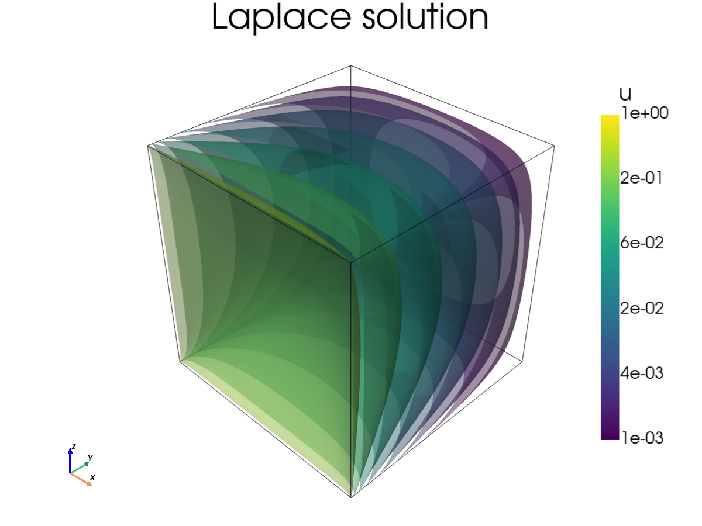
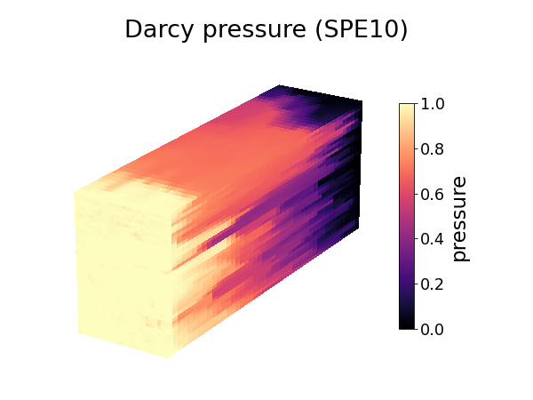
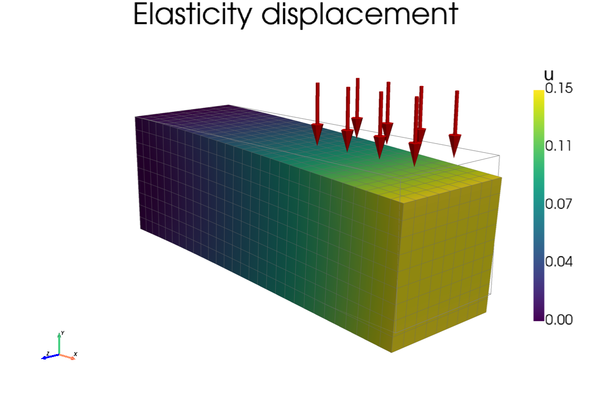
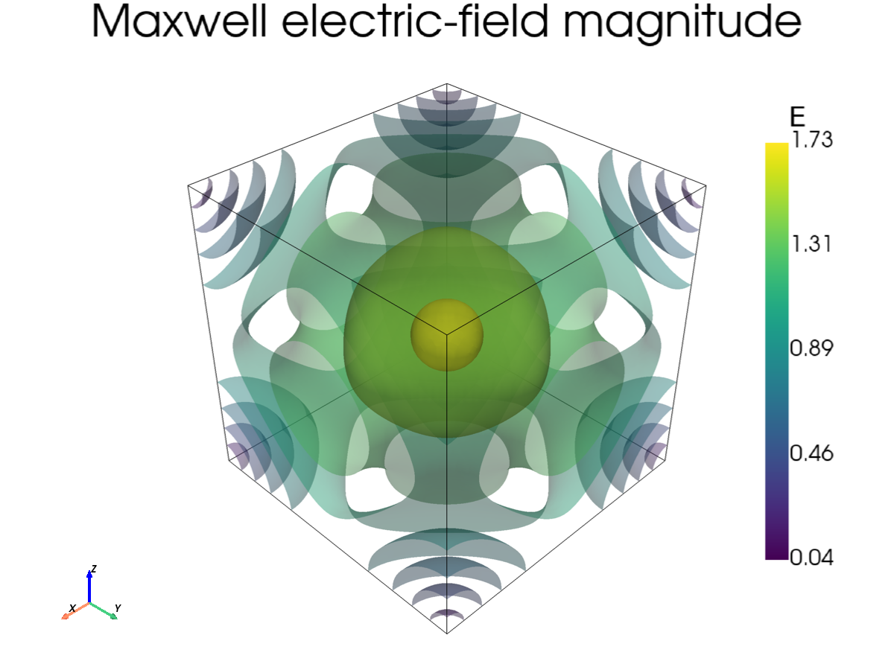
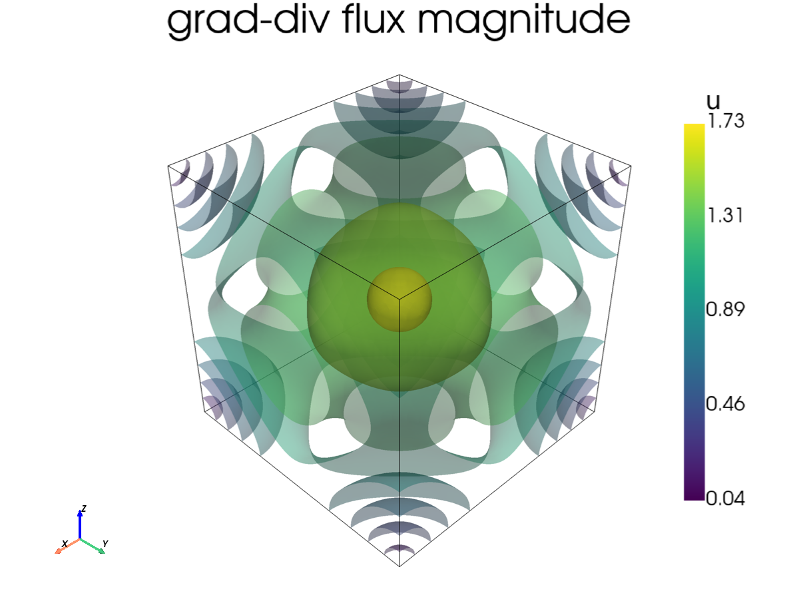
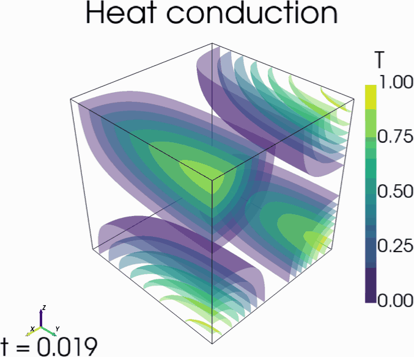
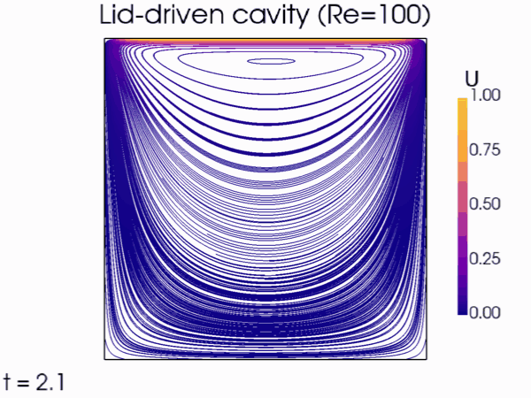
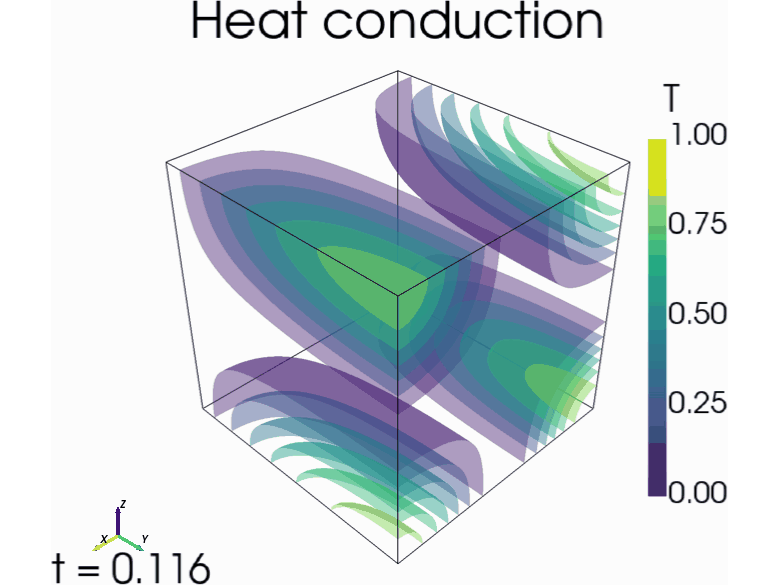
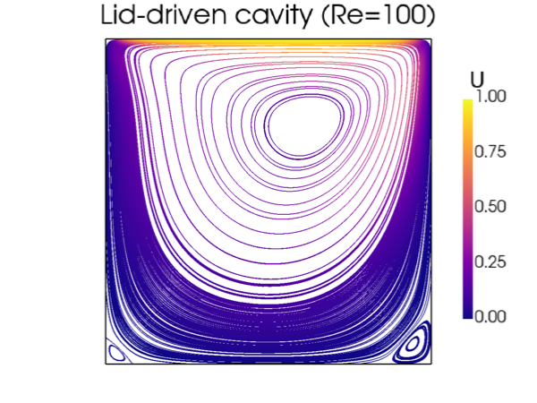

.. only:: html

   .. list-table::
      :widths: 1 1 1
      :align: center

      * - |gl_laplace|

          :ref:`1. Laplace's equation <LibraryExample1>`
        - |gl_darcy|

          :ref:`2. Mixed Darcy Flow <LibraryExample2>`
        - |gl_elasticity|

          :ref:`3. Linear Elasticity <LibraryExample3>`
      * - |gl_heatflow_v|

          :ref:`4. Nonlinear Heat Flow <LibraryExample4>`
        - |gl_lidcavity_v|

          :ref:`5. Navier-Stokes <LibraryExample5>`
        - |gl_maxwell|

          :ref:`6. Definite curl-curl (AMS) <maxwell_example>`
      * - |gl_graddiv|

          :ref:`7. Definite grad-div (ADS) <graddiv_example>`
        -
        -

.. only:: latex

   .. list-table::
      :widths: 1 1 1
      :align: center

      * - |gl_laplace|

          :ref:`1. Laplace's equation <LibraryExample1>`
        - |gl_darcy|

          :ref:`2. Mixed Darcy Flow <LibraryExample2>`
        - |gl_elasticity|

          :ref:`3. Linear Elasticity <LibraryExample3>`
      * - |gl_heatflow_s|

          :ref:`4. Nonlinear Heat Flow <LibraryExample4>`
        - |gl_lidcavity_s|

          :ref:`5. Navier-Stokes <LibraryExample5>`
        - |gl_maxwell|

          :ref:`6. Definite curl-curl (AMS) <maxwell_example>`
      * - |gl_graddiv|

          :ref:`7. Definite grad-div (ADS) <graddiv_example>`
        -
        -

Overview of Typical Steps
-------------------------

.. note::
   This section focuses on the C/C++ library API. For language bindings, see
   :ref:`Interfaces`, especially :ref:`PythonInterface` and
   :ref:`FortranInterface`.

The library-side workflow in C/C++ generally follows these steps:

1. Initialize MPI (if not already done).
2. Initialize hypredrive and create an object handle.
3. Call ``HYPREDRV_SetLibraryMode`` to signal library use (must precede step 4).
4. Parse a YAML configuration string/file to set solver/preconditioner options.
5. Assemble your matrix and vectors (``HYPRE_IJMatrix``/``HYPRE_IJVector``) in parallel.
6. Tell hypredrive about your DOF layout (e.g., interleaved blocks).
7. Attach matrix/RHS/initial guess/prec matrix to hypredrive.
8. Create, set up, apply, and destroy the solver.
9. Retrieve solution values or statistics if needed. In library mode,
   ``general.statistics`` is flushed automatically when the ``HYPREDRV_t``
   object is destroyed; call ``HYPREDRV_StatsPrint`` only if you want an earlier
   snapshot. Set ``general.statistics_filename`` to append summaries to a file
   instead of ``stdout``.
10. Destroy handles explicitly when practical, then finalize hypredrive.
    ``HYPREDRV_Finalize()`` auto-destroys any remaining live handles, but it
    cannot rewrite your local handle variables to ``NULL``.

If you manage multiple handles, set ``general.name`` in YAML or call
``HYPREDRV_ObjectSetName`` so statistics can identify which object produced each
summary.

If your application owns multiple ``HYPREDRV_t`` objects concurrently, or if you want
preconditioner reuse to respect application-defined timestep / nonlinear-iteration boundaries,
use the annotation APIs (``HYPREDRV_AnnotateBegin`` / ``HYPREDRV_AnnotateEnd`` and
``HYPREDRV_AnnotateLevelBegin`` / ``HYPREDRV_AnnotateLevelEnd``).

A minimal skeleton of a program using the library is shown below.

.. code-block:: c

   #include "HYPREDRV.h"
   #include <mpi.h>

   int main(int argc, char** argv) {
     MPI_Init(&argc, &argv);

     HYPREDRV_t h;
     HYPREDRV_Initialize();
     HYPREDRV_Create(MPI_COMM_WORLD, &h);

     // Signal that this is a library-mode caller (must precede InputArgsParse)
     HYPREDRV_SetLibraryMode(h);
     HYPREDRV_ObjectSetName(h, "flow-solver");

     // Provide YAML configuration
     const char* yaml = "general:\n"
                        "  statistics: 1\n"
                        "  statistics_filename: stats.txt\n"
                        "solver:\n"
                        "  pcg: {}\n"
                        "preconditioner:\n"
                        "  amg: {}\n";
     char* args[1] = {(char*)yaml};
     HYPREDRV_InputArgsParse(1, args, h);

     // Build IJ objects (global row range per rank) and assemble your system
     HYPRE_IJMatrix A;
     HYPRE_IJVector b;
     /* ... create/initialize/insert/assemble A, b ... */

     // Set linear system components
     HYPREDRV_LinearSystemSetMatrix(h, (HYPRE_Matrix)A);
     HYPREDRV_LinearSystemSetRHS(h, (HYPRE_Vector)b);
     HYPREDRV_LinearSystemSetInitialGuess(h, NULL);
     HYPREDRV_LinearSystemSetReferenceSolution(h, NULL);
     HYPREDRV_LinearSystemSetPrecMatrix(h, NULL);

     // Solve lifecycle
     HYPREDRV_LinearSolverCreate(h);
     HYPREDRV_LinearSolverSetup(h);
     HYPREDRV_LinearSolverApply(h);
     HYPREDRV_LinearSolverDestroy(h);

     // (Optional) Query statistics early and retrieve solution values
     // (general.statistics also prints automatically on destroy in library mode)
     HYPREDRV_StatsPrint(h);
     HYPRE_Real* xvals = NULL;
     HYPREDRV_LinearSystemGetSolutionValues(h, &xvals);

     // Cleanup
     HYPRE_IJMatrixDestroy(A);
     HYPRE_IJVectorDestroy(b);
     HYPREDRV_Destroy(&h);
     HYPREDRV_Finalize();
     MPI_Finalize();
     return 0;
   }

- YAML configuration can be provided as an **in-memory string** (as shown above, where the
  ``char*`` is passed directly as ``argv[0]``) or as a **path to a ``.yml`` / ``.yaml``
  file** on disk. The YAML structure is identical in both cases.
- For block linear systems, set row mapping information via ``HYPREDRV_LinearSystemSetDofmap``.
- If compiled with GPU support, you may migrate assembled IJ objects to device memory with
  ``HYPRE_IJMatrixMigrate(..., HYPRE_MEMORY_DEVICE)`` and analogous calls for vectors.
- ``HYPREDRV_LinearSystemSetInitialGuess``,
  ``HYPREDRV_LinearSystemSetReferenceSolution``, and
  ``HYPREDRV_LinearSystemSetPrecMatrix`` accept optional external vectors/matrix.
  Passing ``NULL`` asks hypredrive to use the configured/default behavior.
  Passing non-``NULL`` uses the provided object.
- Ownership follows library mode. After ``HYPREDRV_SetLibraryMode``, non-``NULL``
  HYPRE objects supplied by the caller are borrowed and remain caller-owned.
  Without library mode, non-``NULL`` objects passed through these setters are
  treated as hypredrive-owned and destroyed with the ``HYPREDRV_t`` object.

.. note::
   Preconditioner reuse across a sequence of linear systems (time steps, multiple RHS) is
   configured via the ``preconditioner.reuse`` YAML subsection. See
   :ref:`PreconReuse` in the :ref:`InputFileStructure` reference.
   In embedded multi-handle applications, drive timestep boundaries with
   ``HYPREDRV_AnnotateLevelBegin`` / ``HYPREDRV_AnnotateLevelEnd`` so reuse decisions stay
   attached to the correct ``HYPREDRV_t`` object.

For example, an embedded caller that wants reuse to restart at each timestep can bracket the
solve lifecycle like this:

.. code-block:: c

   HYPREDRV_AnnotateLevelBegin(h, 0, "timestep-7", -1);
   HYPREDRV_AnnotateLevelBegin(h, 1, "newton-0", -1);
   HYPREDRV_AnnotateBegin(h, "system", -1);
   HYPREDRV_LinearSolverCreate(h);
   HYPREDRV_LinearSolverSetup(h);
   HYPREDRV_AnnotateEnd(h, "system", -1);
   HYPREDRV_LinearSolverApply(h);
   HYPREDRV_AnnotateLevelEnd(h, 1, "newton-0", -1);
   HYPREDRV_AnnotateLevelEnd(h, 0, "timestep-7", -1);

You can also select a predefined preconditioner preset programmatically, without a YAML file:

.. code-block:: c

   HYPREDRV_SetLibraryMode(h);
   HYPREDRV_InputArgsSetPreconPreset(h, "poisson");

If you subsequently call ``HYPREDRV_InputArgsParse`` with a YAML string or file, the
parsed YAML settings will override the preset for any keys it defines.

.. _LibraryExample1:

Example 1: Laplace's equation
-----------------------------

This section documents a scalar diffusion/Laplace example assembled directly from an
application using the hypre IJ interface via ``libHYPREDRV``. It mirrors the driver in
``examples/src/C_laplacian/laplacian.c`` and demonstrates multiple finite-difference
stencils on a structured grid.

Governing equation and boundary conditions
~~~~~~~~~~~~~~~~~~~~~~~~~~~~~~~~~~~~~~~~~~

We solve

.. math::
   -\nabla\!\cdot\!\big(\mathbf{c}\,\nabla u\big) \;=\; 0 \quad \text{in } \Omega=[0,1]^3, \\
   u \;=\; 0 \ \text{on } \partial\Omega\setminus\{y=0\},\\
   u \;=\; 1 \ \text{on } \{y=0\}

Anisotropy is supported through directional coefficients (see below). A pure Dirichlet
setup yields a symmetric positive definite (SPD) linear system. We discretize on a
uniform structured grid with global node counts :math:`N=(N_x,N_y,N_z)` and spacings
:math:`h_x = 1/(N_x-1)`, :math:`h_y = 1/(N_y-1)`, :math:`h_z = 1/(N_z-1)`. Nodes are
indexed lexicographically with :math:`x` fastest. Parallel partitioning uses an MPI
Cartesian grid :math:`P=(P_x,P_y,P_z)` with block starts ``pstarts[d]``.

Finite-difference stencils
~~~~~~~~~~~~~~~~~~~~~~~~~~

We support several stencils for :math:`-\nabla\!\cdot(\mathbf{c}\nabla u)` on a structured grid.
All produce an M-matrix (positive diagonal, non-positive off-diagonals) and are second-order
accurate when weights are chosen consistently.

7-point (faces only, classical 2nd order)
^^^^^^^^^^^^^^^^^^^^^^^^^^^^^^^^^^^^^^^^^

With directional coefficients :math:`c_x,c_y,c_z` and spacings :math:`h_x,h_y,h_z`,
the discrete negative-Laplacian operator at interior node :math:`(i,j,k)` is

.. math::
   \begin{aligned}
   (A_h u)_{i,j,k}
   &= \frac{c_x}{h_x^2}\,\big(2u_{i,j,k} - u_{i+1,j,k} - u_{i-1,j,k}\big) + \\
   &\quad \frac{c_y}{h_y^2}\,\big(2u_{i,j,k} - u_{i,j+1,k} - u_{i,j-1,k}\big) + \\
   &\quad \frac{c_z}{h_z^2}\,\big(2u_{i,j,k} - u_{i,j,k+1} - u_{i,j,k-1}\big)
   \end{aligned}

19-point (faces + edges)
^^^^^^^^^^^^^^^^^^^^^^^^

Adds edge neighbors (e.g., :math:`(i\pm1,j\pm1,k)`, etc.) with scaled couplings to reduce
directional bias. A common strategy is to assign edge weights that partially compensate
cross-term truncation errors from a Taylor expansion, while preserving diagonal dominance
and the M-matrix structure.

27-point (faces + edges + corners)
^^^^^^^^^^^^^^^^^^^^^^^^^^^^^^^^^^

Includes the full :math:`3\times3\times3` neighborhood (faces, edges, corners). Corner
weights are smaller than faces; one can tune edge/corner weights (e.g., half/third of
face weights) to further reduce dispersion and directional bias.

125-point (radius-2 demo)
^^^^^^^^^^^^^^^^^^^^^^^^^

Extends the neighborhood to radius 2 (up to 125 points). In the example driver, face-adjacent
neighbors often receive stronger weights (e.g., :math:`-1`), while farther neighbors receive
smaller negative weights (e.g., :math:`-0.01`), preserving an M-matrix with a dominant diagonal.

Coefficients and anisotropy
^^^^^^^^^^^^^^^^^^^^^^^^^^^

The example exposes coefficient arrays in the driver (``params->c``). For 7-point,
only face-connected neighbors are used with directional weights, e.g., in dimension-wise
form

.. math::
   (A u)_{i,j,k} \;\approx\; \sum_{\alpha\in\{x,y,z\}}
   \frac{c_\alpha}{h_\alpha^2}\,\big(-u_{i-\hat\alpha} + 2u_{i} - u_{i+\hat\alpha}\big).

For 19/27-point, the example scales edge/corner couplings (e.g., half/third) to reduce
cross terms, preserving a strictly diagonally dominant M-matrix. The 125-point variant
uses uniform small weights for far neighbors to illustrate wide stencils.

Boundary Conditions and SPD Structure
^^^^^^^^^^^^^^^^^^^^^^^^^^^^^^^^^^^^^

Dirichlet values are enforced during assembly. When a neighbor lies outside
:math:`\Omega`, or when the face corresponds to :math:`y=0` with :math:`u=1`,
the known-value contribution is moved to the RHS. Rows for interior nodes use
only valid neighbor columns; the diagonal entry is the negative sum of
off-diagonals to maintain row-sum consistency and the SPD structure.

Linear System Creation (IJ interface)
~~~~~~~~~~~~~~~~~~~~~~~~~~~~~~~~~~~~~

- Create ``HYPRE_IJMatrix``/``HYPRE_IJVector`` on the Cartesian communicator with global
  row range ``[ilower, iupper]`` for this rank.
- Set per-row nnz bounds according to the stencil (7, 19, 27, 125) with
  ``HYPRE_IJMatrixSetRowSizes``; initialize IJ objects.
- For each local node, compute the global row (block-aware), enumerate stencil neighbors,
  and build column/value arrays. Off-partition neighbors remain valid columns (IJ distributes);
  out-of-domain neighbors contribute to the RHS via Dirichlet handling above.
- Insert with ``HYPRE_IJMatrixSetValues`` (or ``AddToValues``) and ``HYPRE_IJVectorSetValues``,
  then assemble.

This is a scalar problem (one DOF per node), so no interleaved dofmap is required before
attaching the matrix/vector to hypredrive.

Linear Solver Setup
~~~~~~~~~~~~~~~~~~~

Solver and preconditioner options (PCG+AMG by default) are provided via YAML parsed with
``HYPREDRV_InputArgsParse``; the create/setup/apply sequence honors those settings.

.. code-block:: c

   // After building IJ A,b as a scalar system:
   HYPREDRV_LinearSystemSetMatrix(hdrv, (HYPRE_Matrix)A);
   HYPREDRV_LinearSystemSetRHS(hdrv,    (HYPRE_Vector)b);
   HYPREDRV_LinearSystemSetInitialGuess(hdrv, NULL);   // zero by default
   HYPREDRV_LinearSystemSetPrecMatrix(hdrv, NULL);     // reuse A if desired

   // Solve lifecycle
   HYPREDRV_LinearSolverCreate(hdrv);
   HYPREDRV_LinearSolverSetup(hdrv);
   HYPREDRV_LinearSolverApply(hdrv);
   HYPREDRV_LinearSolverDestroy(hdrv);

The default in the example is a conjugate gradient solver with a BoomerAMG preconditioner.
Additional AMG parameters (e.g., coarsening, interpolation) can be specified as needed in
the YAML configuration.

Visualizing the Solution
~~~~~~~~~~~~~~~~~~~~~~~~

With ``-vis`` the example writes the solution as VTK ``RectilinearGrid`` -- a per-rank
``.vtr`` plus a ``.pvd`` collection -- with the scalar point field ``solution``. Ghost
exchanges (faces/edges/corners) assemble an overlapped piece on negative faces to avoid
cracks at partition boundaries. The bundled ``postprocess.py`` renders the field with
`PyVista <https://pyvista.org>`_; by default it draws nested translucent isosurfaces
(``--style`` also offers ``clip``, ``volume``, and ``slices``), matching the Maxwell and
grad-div examples:

.. code-block:: bash

   mpirun -np 4 /path/to/build/laplacian -n 65 65 65 -P 2 2 1 -vis
   python3 postprocess.py laplacian_7pt_65x65x65_2x2x1.pvd -o laplacian_solution_3d.png   # needs: pip install pyvista

   Solution :math:`u` on a :math:`64^3` grid, shown as nested isosurfaces with a
   logarithmic color scale. The Dirichlet datum :math:`u=1` on the :math:`y=0` face
   diffuses into the domain and decays by orders of magnitude toward the far boundaries.
   The same ``.pvd``/``.vtr`` files can also be opened directly in ParaView.

Reproducible Run
~~~~~~~~~~~~~~~~

Command-line parameters (see ``laplacian -h``) control problem size, coefficients,
partitioning, number of solves, printing, verbosity, and visualization.

.. code-block:: bash

  mpirun -np 1 /path/to/build/examples/src/C_laplacian/laplacian -h

.. code-block:: text

  Usage: ${MPIEXEC_COMMAND} ${MPIEXEC_NUMPROC_FLAG} <np> ./laplacian [options]

  Options:
    -i <file>         : YAML configuration file for solver settings
    -n <nx> <ny> <nz> : Global grid dimensions (default: 10 10 10)
    -c <cx> <cy> <cz> : Diffusion coefficients (default: 1.0 1.0 1.0)
    -P <Px> <Py> <Pz> : Processor grid dimensions (default: 1 1 1)
    -s <val>          : Stencil type: 7 19 27 125 (default: 7)
    -ns|--nsolve <n>  : Number of times to solve the system (default: 5)
    -vis|--visualize  : Output solution in VTK format (default: false)
    -p|--print        : Print matrices/vectors to file (default: false)
    -v|--verbose <n>  : Verbosity level (bitset):
                        0x1: Print solver statistics
                        0x2: Print library info
                        0x4: Print system info
    -h|--help         : Print this message

For a single-process run, the output should be similar to the following:

.. code-block:: bash

  mpirun -np 1 /path/to/build/examples/src/C_laplacian/laplacian

.. literalinclude:: ../../examples/refOutput/laplacian.txt
   :language: text

.. note::
   Python examples live under ``interfaces/python/examples``; see
   :ref:`PythonInterface`. The Fortran Laplacian example lives under
   ``interfaces/fortran/examples/laplacian``; see :ref:`FortranInterface`.

.. _LibraryExample2:

Example 2: Mixed Darcy Flow
---------------------------

This section documents the mixed Darcy driver implemented in
``examples/src/C_darcy/darcy.c``. The example uses the standard C
``libHYPREDRV`` interface: the application assembles ``HYPRE_IJMatrix`` and
``HYPRE_IJVector`` objects, supplies a dofmap, and lets hypredrive configure GMRES
with an MGR preconditioner. The current implementation provides an RT0/P0
discretization descriptor; the assembly is organized so future mixed
discretizations can replace the cell-local flux dofs and mass entries without
changing the solver interface.

Governing Equations
~~~~~~~~~~~~~~~~~~~

On a Cartesian domain :math:`\Omega=[0,L_x]\times[0,L_y]\times[0,L_z]`, Darcy
flow is written in mixed first-order form

.. math::

   \mathbf{q} + K\nabla u = 0,\qquad
   \nabla\!\cdot\mathbf{q} = f,

with pressure :math:`u`, flux :math:`\mathbf{q}`, permeability tensor :math:`K`,
Dirichlet pressure data on :math:`\Gamma_D`, and prescribed normal flux on
:math:`\Gamma_N`. The example uses ``f=0`` and supports diagonal permeability
fields, either constant over the domain or read as per-cell heterogeneous
values. By default it imposes a unit pressure drop along the selected active
axis: :math:`u=1` on the low boundary, :math:`u=0` on the high boundary, and
no-flow boundaries on the remaining active axes.

RT0/P0 Discretization
~~~~~~~~~~~~~~~~~~~~~

The implemented discretization uses lowest-order Raviart--Thomas fluxes (RT0)
and cellwise constant pressures (P0). One pressure unknown is stored per cell.
Flux unknowns live on mesh faces and represent integrated normal flux

.. math::

   q_F = \int_F \mathbf{q}\cdot\mathbf{n}_F\,dS,

where :math:`\mathbf{n}_F` is the global positive coordinate normal of that face.
For a cell :math:`K_c`, the local mixed blocks are

.. math::

   M_{ab}^{(c)} =
   (K^{-1})_{d_a d_b}\,|K_c|\,\frac{\alpha_{ab}}{|F_a|\,|F_b|},
   \qquad
   B_{a,c}=\begin{cases}
      -1 & F_a \text{ is the low face of } K_c,\\
      +1 & F_a \text{ is the high face of } K_c,
   \end{cases}

where :math:`d_a` is the coordinate direction of local face :math:`F_a`. For
diagonal permeability, only same-direction face pairs contribute. The RT0 mass
block uses :math:`\alpha_{ab}=1/3` for same-direction same-side faces and
:math:`\alpha_{ab}=1/6` for same-direction opposite-side faces.

After negating the continuity equation to get the symmetric saddle-point sign
convention before boundary row pinning, the global system is

.. math::

   \begin{bmatrix}
   M & -B\\
   -B^T & 0
   \end{bmatrix}
   \begin{bmatrix}
   \mathbf{q}\\
   \mathbf{u}
   \end{bmatrix}
   =
   \begin{bmatrix}
   \mathbf{g}_D\\
   0
   \end{bmatrix}.

Dirichlet pressure data enters the flux equations through
:math:`-\int_{\Gamma_D}u_D\,\mathbf{v}\cdot\mathbf{n}_{out}\,dS`. No-flow
Neumann faces are enforced as zero-valued pinned flux rows. Since the pinned
value is zero, the example leaves columns intact; this is parallel-safe for an
IJ row-partitioned assembly and preserves the intended solution.

Parallel Numbering and C Interface Assembly
~~~~~~~~~~~~~~~~~~~~~~~~~~~~~~~~~~~~~~~~~~~

The C example uses a rank-contiguous global unknown ordering. Within each rank,
owned unknowns are ordered

.. math::

   [\,x\text{-faces}\,][\,y\text{-faces}\,][\,z\text{-faces}\,][\,cells\,],

with inactive face blocks omitted for 1D/2D prefix-active meshes. The Cartesian
rank grid is selected automatically by default and can be set explicitly with
``-P``/``--procs <px> <py> <pz>``. The product must match the MPI size, and
inactive dimensions must have partition count ``1``.

Faces are owned by the rank on their high-coordinate side, with the global high
boundary face owned by the last rank in that direction. Cells are owned by their
Cartesian subdomain. Each rank builds a local CSR slab over its contiguous row
range and passes it to hypredrive, with off-rank columns left as global column
indices.

The dofmap is supplied explicitly:

- label ``1`` for flux-face rows,
- label ``0`` for cell-pressure rows.

This is intentionally independent of the RT0 cell-local helper. A higher-order
mixed method can keep the same solver-facing labels while replacing the
discretization descriptor that enumerates cell dofs and local matrices.

Heterogeneous Permeability Files
~~~~~~~~~~~~~~~~~~~~~~~~~~~~~~~~

The ``-K`` option sets a constant diagonal permeability
:math:`(K_x,K_y,K_z)`. Alternatively, ``--K-file`` reads a whitespace-delimited
text file containing either one scalar permeability per source cell or three
component blocks ``Kx``, ``Ky``, and ``Kz``. If ``--K-file-grid`` is omitted,
the source grid is assumed to match ``-n`` exactly. If a source grid is supplied,
the example samples the source field at cell centers onto the requested mesh.
This is useful for experiments on a coarser mesh than the input data, for
refinement studies across a sequence of mesh resolutions, and for mesh-sequence
scalability measurements.

SPE10 model 2 permeability files use a ``60 x 220 x 85`` source grid with
three component blocks. The helper script downloads and unpacks that dataset
into an ignored directory:

.. code-block:: bash

   scripts/download_spe10_case2a.sh

Then run a coarse heterogeneous solve, for example:

.. code-block:: bash

   mpirun -np 2 /path/to/build/darcy -n 8 8 4 \
      -P 1 1 2 \
      --K-file data/spe10_case2a/spe_perm.dat \
      --K-file-grid 60 220 85 \
      --K-file-k-order top-down \
      -g y -v 0

The ``-g y`` option imposes the pressure gradient in the y-direction, which is
the standard SPE10 setup.

For heterogeneous inputs, the driver reports successful solver completion
rather than an analytic pressure error because the default linear pressure
profile is no longer the exact solution.

SPE10 Reproduction Script
~~~~~~~~~~~~~~~~~~~~~~~~~

The C Darcy example directory includes a reproducibility script for the SPE10
case:

.. code-block:: bash

   examples/src/C_darcy/reproduce.sh

By default, the script downloads the ignored SPE10 data if needed, builds the
``darcy`` example automatically when its executable is missing (set ``BUILD_DIR``
to choose the build directory, ``HYPRE_ROOT`` to reuse an existing HYPRE install,
or ``DARCY_BIN`` to point at a prebuilt binary), runs the
full ``60 x 220 x 85`` heterogeneous C benchmark on 16 MPI ranks with a
``1 x 4 x 4`` rank grid, writes the solver log to
``examples/src/C_darcy/reproduce-out/darcy_spe10.log``, writes full-resolution
VTK results to ``examples/src/C_darcy/reproduce-out/darcy_spe10.pvti`` plus one
``.vti`` piece per rank, and regenerates the layer documentation figure below:

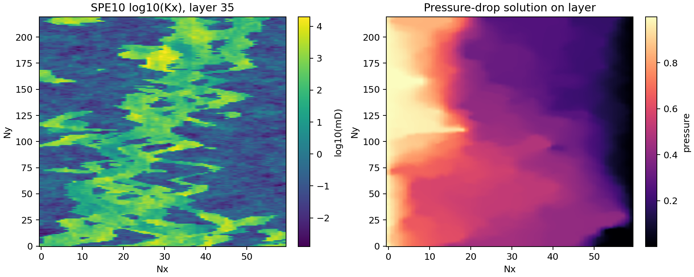

   SPE10 case 2a layer visualization. Left: ``log10(Kx)`` on one physical
   layer. Right: pressure-drop solution on the same layer with unit pressure on
   the low-y side, zero pressure on the high-y side, and no-flow x/z
   boundaries.

Use ``--figure-mode 3d`` to generate a three-dimensional view of the full
problem, or ``--figure-mode both`` to generate both figures:

.. code-block:: bash

   examples/src/C_darcy/reproduce.sh --skip-run --figure-mode both

The figure generation lives in ``examples/src/C_darcy/postprocess.py`` and can
also be run directly:

.. code-block:: bash

   examples/src/C_darcy/postprocess.py \
      --result-file examples/src/C_darcy/reproduce-out/darcy_spe10.pvti \
      --mode both

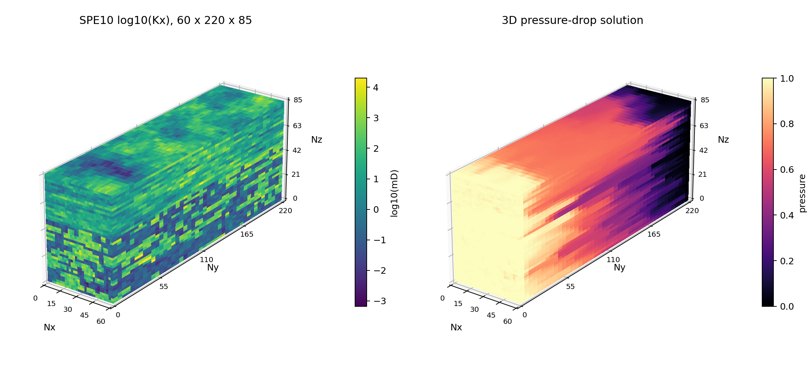

   Full-volume SPE10 case 2a visualization using full-resolution exterior
   surfaces from the C Darcy VTK results. Left: ``log10(Kx)`` from the
   ``60 x 220 x 85`` permeability field. Right: pressure-drop solution on the
   same full-resolution grid, with unit pressure on the low-y side, zero
   pressure on the high-y side, and no-flow x/z boundaries.

The performance run uses the C mixed RT0/P0 driver:

.. code-block:: bash

   mpirun -np 16 /path/to/build/darcy \
      -n 60 220 85 \
      -P 1 4 4 \
      --K-file data/spe10_case2a/spe_perm.dat \
      --K-file-grid 60 220 85 \
      --K-file-k-order top-down \
      --output examples/src/C_darcy/reproduce-out/darcy_spe10.vti \
      -g y -v 1

The figures are generated from the C VTK output with NumPy and Matplotlib, so
reproducing the images does not require VTK or ParaView. Set
``SPE10_LAYER=<k>`` to choose a different physical layer for the layer figure.
Set ``NP``, ``NXYZ``, ``PGRID``, ``RESULT_FILE``, ``BUILD_DIR``, or
``DARCY_BIN`` to override the benchmark command. Use ``--skip-run`` or
``--skip-figure`` to run only one part.

MGR Preconditioning
~~~~~~~~~~~~~~~~~~~

The mixed operator is indefinite, so with HYPRE 3.x and newer the default
configuration uses GMRES with a two-block MGR preconditioner. Flux rows are
F-points and pressure rows are the coarse block:

.. code-block:: yaml

   solver:
     gmres:
       krylov_dim: 60
       max_iter: 200
       relative_tol: 1.0e-10
   preconditioner:
     mgr:
       level:
         0:
           f_dofs: [1]
           f_relaxation: jacobi
           g_relaxation: none
           restriction_type: injection
           prolongation_type: jacobi
           coarse_level_type: rap
       coarsest_level:
         amg:
           max_iter: 1

This corresponds to eliminating/relaxing the flux block and applying BoomerAMG
to the pressure Schur complement approximation. The C driver passes the dofmap
with ``HYPREDRV_LinearSystemSetDofmap`` before attaching the IJ matrix and RHS,
so MGR can identify the two fields.

With older HYPRE releases, the example uses a GMRES+BoomerAMG compatibility
configuration because the MGR options exercised here require newer HYPRE APIs.

The driver also accepts hypredrive command-line overrides after ``-a`` or
``--args`` using the same path syntax as ``hypredrive-cli``. Place these
overrides after the Darcy-specific options:

.. code-block:: bash

   mpirun -np 2 /path/to/build/darcy -n 30 110 85 -g x -v 1 \
      -a --solver:gmres:max_iter 100 --preconditioner:mgr:print_level 1

Preconditioner Strategy Comparison
~~~~~~~~~~~~~~~~~~~~~~~~~~~~~~~~~~~~

Before comparing strategies, it helps to size the problem. On the full SPE10
grid the assembled system has 4,525,000 rows and 23,471,400 nonzeros, roughly
``5.2`` per row. It keeps the saddle-point block structure introduced above,
with 3,403,000 flux rows and 1,122,000 pressure rows. The blocks are very
different in density: the flux mass block :math:`M` holds 10,071,200 nonzeros
(about ``2.96`` per row, coupling each face to the same-direction faces of its
neighbouring cells), the flux--pressure block :math:`B` holds 6,668,200
(about ``1.96`` per flux row, one entry per cell a face borders), and
:math:`B^{\top}` holds 6,732,000 (exactly ``6`` per pressure row -- the six
faces of every cell). The pressure--pressure block is empty, so the operator is
indefinite; this is exactly the structure the MGR splitting below is designed to
exploit.

The flux/pressure splitting above leaves room for several preconditioner
strategies. The example ships four MGR variants in ``examples/src/C_darcy/``
that all converge on the SPE10 case but with different iteration counts:

- ``mgr_jacobi.yml`` -- the default two-block MGR (Jacobi F-relaxation and a
  single BoomerAMG V-cycle on the pressure Schur complement).
- ``mgr_amg_strong.yml`` -- strengthens the coarse (pressure) solve to two
  BoomerAMG V-cycles with l1-hybrid-SGS relaxation.
- ``mgr_ilu.yml`` -- replaces the Jacobi flux relaxation with block-Jacobi
  ILU(0) (BJ-ILU0 F-relaxation).
- ``mgr_global_ilu.yml`` -- keeps Jacobi F-relaxation but adds a global
  block-Jacobi ILU(0) smoother (BJ-ILU0 G-relaxation) over the full
  flux+pressure system.

Each strategy file sets ``print_level: 2`` on the GMRES solver and
``statistics: 1``, so every log carries both the per-iteration residual history
and a setup/solve timing summary. A single loop captures one log per strategy on
the SPE10 case:

.. code-block:: bash

   cd examples/src/C_darcy
   for s in mgr_jacobi mgr_amg_strong mgr_ilu mgr_global_ilu; do
     mpirun -np 16 /path/to/build/darcy -n 60 220 85 -P 1 4 4 \
        --K-file ../../../data/spe10_case2a/spe_perm.dat \
        --K-file-grid 60 220 85 --K-file-k-order top-down \
        -g y -v 1 -i ${s}.yml > ${s}.log
   done

Two helper scripts turn those logs into a side-by-side comparison.
``scripts/plot_convergence.py`` (argparse-based; needs only the Python standard
library and Matplotlib) parses the ``print_level: 2`` history and plots the
relative residual against the Krylov iteration, while
``scripts/analyze_statistics.py`` renders the setup/solve timing summary as a
stacked bar chart (``-m bar+setup+solve``):

.. code-block:: bash

   # Left panel: GMRES convergence history
   ../../../scripts/plot_convergence.py \
      mgr_amg_strong.log mgr_jacobi.log mgr_ilu.log mgr_global_ilu.log \
      --labels "MGR + strong coarse AMG" "MGR + Jacobi (default)" \
               "MGR + BJ-ILU0 F-relax" "MGR + BJ-ILU0 G-relax" \
      --title "SPE10 Darcy: GMRES convergence" -o convergence.png

   # Right panel: stacked setup/solve time (HYPRE version read from the log)
   cat mgr_amg_strong.log mgr_jacobi.log mgr_ilu.log mgr_global_ilu.log > combined.log
   hv=$(grep -m1 HYPRE_RELEASE_VERSION combined.log | awk '{print $NF}')
   ../../../scripts/analyze_statistics.py -f combined.log -m bar+setup+solve \
      -ln "strong coarse AMG" "Jacobi (default)" "BJ-ILU0 F-relax" "BJ-ILU0 G-relax" \
      -T "SPE10 Darcy setup/solve time (HYPRE ${hv})" -s panel.png

   # Place the two panels side by side
   convert convergence.png stacked_bar_panel.png -resize x1100 +append \
      ../../../docs/usrman-src/figures/spe10_darcy_strategies.png

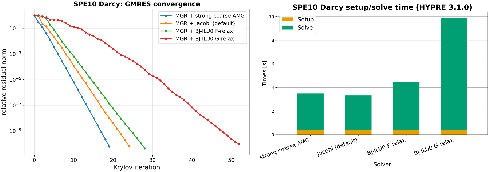

   Left: GMRES relative residual versus Krylov iteration. Right: stacked
   setup/solve time per strategy. SPE10 case 2a Darcy problem (4.5M unknowns,
   16 MPI ranks, ``relative_tol = 1e-10``, HYPRE 3.1.0).

For this RT0/P0 system the flux mass block is well conditioned, so the cost is
dominated by the quality of the pressure Schur-complement approximation.
Strengthening the coarse pressure solve (``mgr_amg_strong.yml``) is the only
change that lowers the iteration count, from 24 down to 19. Pouring more work
into the flux block instead -- BJ-ILU0 F-relaxation or a global BJ-ILU0 smoother
-- does not improve the Schur-complement approximation and only adds cost per
iteration, so GMRES takes more iterations, not fewer.

The timing panel adds an important caveat: fewest iterations is not the same as
fastest wall-clock. Each ``mgr_amg_strong`` iteration runs two l1-hybrid-SGS AMG
cycles, so even though it needs the fewest iterations its solve time is slightly
higher than the much cheaper default ``mgr_jacobi``, which remains the best
time-to-solution here. Setup time is small and nearly constant across
strategies, so the solve phase dominates the total. For reference, a plain
GMRES+BoomerAMG preconditioner without the MGR splitting stalls on the
indefinite saddle-point system and fails to reach the tolerance within 200
iterations, which is why MGR is the default.

Reproducible Run
~~~~~~~~~~~~~~~~

Build with examples enabled, then run:

.. code-block:: bash

   mpirun -np 1 /path/to/build/darcy -n 4 3 1 -g x -v 1
   mpirun -np 2 /path/to/build/darcy -n 4 3 1 -g x -v 1

The program prints the grid, unknown counts, MPI rank-grid and row-partition
summary, drive direction, and relative cell-pressure L2 error against the analytic solution
:math:`u=1-x_{\mathrm{axis}}/L_{\mathrm{axis}}`. The same executable accepts an
external YAML file with ``-i`` to override the default GMRES+MGR options.

.. _LibraryExample3:

Example 3: Linear Elasticity
-----------------------------

This section documents the mathematical model, discretization, and hypre usage
for the 3D small-strain linear elasticity driver implemented in ``examples/src/C_elasticity/elasticity.c``.
It targets readers comfortable with PDEs, variational formulations, and finite element assembly.

Governing Equations (Small-Strain Isotropic Elasticity)
~~~~~~~~~~~~~~~~~~~~~~~~~~~~~~~~~~~~~~~~~~~~~~~~~~~~~~~

We consider a bounded Lipschitz domain :math:`\Omega \subset \mathbb{R}^3` with boundary
:math:`\partial\Omega = \Gamma_D \cup \Gamma_N`, :math:`\Gamma_D \cap \Gamma_N = \emptyset`.
The unknown displacement field is :math:`\mathbf{u} : \Omega \to \mathbb{R}^3`.

- Kinematics (small strain):

  .. math::

     \varepsilon(\mathbf{u}) \;=\; \tfrac{1}{2}\big(\nabla \mathbf{u} + \nabla \mathbf{u}^\top\big)
     \;\in\; \mathbb{R}_{\text{sym}}^{3\times 3}.

- Constitutive law (isotropic Hooke):

  .. math::

     \sigma(\mathbf{u}) \;=\; \lambda\,\mathrm{tr}\!\big(\varepsilon(\mathbf{u})\big)\,I \;+\; 2G\,\varepsilon(\mathbf{u}),

  with Lamé parameters

  .. math::
     G \;=\; \frac{E}{2(1+\nu)},\qquad
     \lambda \;=\; \frac{E\nu}{(1+\nu)(1-2\nu)}.

- Strong form:

  .. math::
     -\nabla\!\cdot \sigma(\mathbf{u}) \;=\; \mathbf{f} \quad \text{in } \Omega,
     \qquad
     \mathbf{u} \;=\; \mathbf{0} \quad \text{on } \Gamma_D,
     \qquad
     \sigma(\mathbf{u})\,\mathbf{n} \;=\; \mathbf{t} \quad \text{on } \Gamma_N.

In the example driver:
- The clamped plane is :math:`\Gamma_D = \{x=0\}` (all three components fixed).
- Body force :math:`\mathbf{f} = \rho\,\mathbf{g}`.
- Optional traction :math:`\mathbf{t}` on the top surface :math:`\{y=L_y\}`.

Variational Formulation
~~~~~~~~~~~~~~~~~~~~~~~

Let :math:`V = \big\{\mathbf{v}\in [H^1(\Omega)]^3 : \mathbf{v}=\mathbf{0}\text{ on }\Gamma_D\big\}`.
The weak problem reads: find :math:`\mathbf{u} \in \mathbf{u}_D + V` such that for all :math:`\mathbf{v} \in V`,

.. math::
   \int_{\Omega} \varepsilon(\mathbf{v}) : \sigma(\mathbf{u}) \, d\Omega
   \;=\;
   \int_{\Omega} \mathbf{v}\cdot \mathbf{f}\, d\Omega
   \;+\;
   \int_{\Gamma_N} \mathbf{v}\cdot \mathbf{t}\, d\Gamma.

With isotropy, in Voigt notation :math:`\varepsilon_v = (\varepsilon_{xx},\varepsilon_{yy},\varepsilon_{zz},
\gamma_{yz},\gamma_{xz},\gamma_{xy})^\top`, one writes :math:`\sigma_v = D\,\varepsilon_v`, where
the :math:`6\times6` matrix :math:`D` is

.. math::
   D \;=\;
   \begin{bmatrix}
   \lambda+2G & \lambda & \lambda & 0 & 0 & 0 \\
   \lambda & \lambda+2G & \lambda & 0 & 0 & 0 \\
   \lambda & \lambda & \lambda+2G & 0 & 0 & 0 \\
   0 & 0 & 0 & G & 0 & 0 \\
   0 & 0 & 0 & 0 & G & 0 \\
   0 & 0 & 0 & 0 & 0 & G
   \end{bmatrix}.

Discretization: Q1 Hexahedra on a Cartesian Mesh
~~~~~~~~~~~~~~~~~~~~~~~~~~~~~~~~~~~~~~~~~~~~~~~~

We use a uniform Cartesian mesh with nodal counts :math:`N=(N_x,N_y,N_z)` and physical sizes
:math:`L=(L_x,L_y,L_z)`. Element sizes are
:math:`h = (h_x,h_y,h_z) = \big(L_x/(N_x-1),\, L_y/(N_y-1),\, L_z/(N_z-1)\big)`.
Each hexahedral element has 8 vertices with trilinear (Q1) shape functions on the
reference cube :math:`\widehat{\Omega}=[-1,1]^3`.

Reference shape functions and derivatives
^^^^^^^^^^^^^^^^^^^^^^^^^^^^^^^^^^^^^^^^^

Number the element vertices :math:`a=1,\dots,8` and define signed tuples
:math:`(s_x^a,s_y^a,s_z^a)\in\{\pm1\}^3`. The reference shape functions are

.. math::
   N_a(\xi,\eta,\zeta) \;=\; \tfrac{1}{8}\,(1+s_x^a \xi)\,(1+s_y^a \eta)\,(1+s_z^a \zeta),

with derivatives

.. math::
   \frac{\partial N_a}{\partial \xi} \;=\; \tfrac{1}{8}\,s_x^a\,(1+s_y^a \eta)\,(1+s_z^a \zeta),\\
   \frac{\partial N_a}{\partial \eta} \;=\; \tfrac{1}{8}\,s_y^a\,(1+s_x^a \xi)\,(1+s_z^a \zeta),\\
   \frac{\partial N_a}{\partial \zeta} \;=\; \tfrac{1}{8}\,s_z^a\,(1+s_x^a \xi)\,(1+s_y^a \eta).

Mapping and gradient transformation
^^^^^^^^^^^^^^^^^^^^^^^^^^^^^^^^^^^

For a uniform rectangular element the mapping :math:`\mathbf{x}(\xi,\eta,\zeta)` has
constant Jacobian

.. math::
   J \;=\; \mathrm{diag}\!\big(\tfrac{h_x}{2},\,\tfrac{h_y}{2},\,\tfrac{h_z}{2}\big),\qquad
   J^{-1} \;=\; \mathrm{diag}\!\big(\tfrac{2}{h_x},\,\tfrac{2}{h_y},\,\tfrac{2}{h_z}\big),\qquad
   \det J \;=\; \tfrac{h_x h_y h_z}{8}.

Physical gradients follow from :math:`\nabla_{\mathbf{x}} N_a = J^{-\top}\,\nabla_{\xi} N_a`, i.e.,

.. math::
   \frac{\partial N_a}{\partial x} \;=\; \frac{2}{h_x}\,\frac{\partial N_a}{\partial \xi},\qquad
   \frac{\partial N_a}{\partial y} \;=\; \frac{2}{h_y}\,\frac{\partial N_a}{\partial \eta},\qquad
   \frac{\partial N_a}{\partial z} \;=\; \frac{2}{h_z}\,\frac{\partial N_a}{\partial \zeta}.

Strain–displacement operator (Voigt form)
^^^^^^^^^^^^^^^^^^^^^^^^^^^^^^^^^^^^^^^^^

Let :math:`\mathbf{u}_e \in \mathbb{R}^{24}` collect the 24 element dofs in the interleaved order
:math:`[u_{x1},u_{y1},u_{z1},\,\dots,\,u_{x8},u_{y8},u_{z8}]^\top`.
The strain in Voigt notation :math:`\varepsilon_v = (\varepsilon_{xx},\varepsilon_{yy},\varepsilon_{zz},
\gamma_{yz},\gamma_{xz},\gamma_{xy})^\top` is

.. math::
   \varepsilon_v(\mathbf{u}_e) \;=\; B\,\mathbf{u}_e,\qquad
   B \;=\; \big[\,B_1\;\;B_2\;\;\cdots\;\;B_8\,\big],\;\; B_a \in \mathbb{R}^{6\times 3},

with per-node blocks

.. math::
   B_a \;=\;
   \begin{bmatrix}
   \partial_x N_a & 0 & 0 \\
   0 & \partial_y N_a & 0 \\
   0 & 0 & \partial_z N_a \\
   0 & \partial_z N_a & \partial_y N_a \\
   \partial_z N_a & 0 & \partial_x N_a \\
   \partial_y N_a & \partial_x N_a & 0
   \end{bmatrix}.

Element matrices and loads
^^^^^^^^^^^^^^^^^^^^^^^^^^

- Volume quadrature: tensor-product 2×2×2 Gauss points :math:`\{(\xi_q,\eta_q,\zeta_q),\,w_q\}`.
  With the constant mapping, the physical weight is :math:`w_q^{\Omega} = w_q \,\det J`.
  The element stiffness and body-force load read

  .. math::
     K_e \;=\; \sum_q B(\xi_q,\eta_q,\zeta_q)^\top\, D \, B(\xi_q,\eta_q,\zeta_q)\; w_q^{\Omega},
     \qquad
     \mathbf{f}_e^{\text{vol}} \;=\; \sum_q N(\xi_q,\eta_q,\zeta_q)^\top (\rho\,\mathbf{g})\; w_q^{\Omega},

  where :math:`N(\cdot)\in\mathbb{R}^{3\times 24}` is the vector-valued shape function matrix that
  places each scalar :math:`N_a` on the three displacement components in the interleaved ordering.

- Traction on the top face :math:`\{y=L_y\}` corresponds to :math:`\eta = +1` on the reference element.
  Using 2×2 Gauss in :math:`(\xi,\zeta)` with surface Jacobian :math:`\det J_s=\tfrac{h_x h_z}{4}`, the
  face load contribution is

  .. math::
     \mathbf{f}_e^{\text{trac}} \;=\;
     \sum_{q\in \widehat{\Gamma}}
     N(\xi_q,\,\eta{=}+1,\,\zeta_q)^\top \,\mathbf{t}\; w_q^{\Gamma},\qquad
     w_q^{\Gamma} \;=\; w_q \,\det J_s.

In practice, the driver precomputes the constant factors (e.g., :math:`J^{-1}`, :math:`\det J`,
and the values of :math:`B` at Gauss points) to amortize cost across elements with identical size,
and assembles :math:`K_e` and :math:`\mathbf{f}_e=\mathbf{f}_e^{\text{vol}}+\mathbf{f}_e^{\text{trac}}`
into the global system using the interleaved dof map.

Element Matrices and Vectors
^^^^^^^^^^^^^^^^^^^^^^^^^^^^

For a single element with 8 nodes and 3 components per node (24 dofs), define the element
strain-displacement operator :math:`B(\xi,\eta,\zeta) \in \mathbb{R}^{6\times 24}` in Voigt form,
assembled from the physical derivatives :math:`(\partial N_a/\partial x,\partial N_a/\partial y,\partial N_a/\partial z)`.
The element stiffness and loads are

.. math::
   K_e \;=\; \int_{\Omega_e} B^\top D\,B\, d\Omega
   \;\;\approx\;\; \sum_{q\in Q_{2\times2\times2}} B_q^\top D\,B_q\, w_q,

.. math::
   \mathbf{f}_e^{\text{vol}} \;=\; \int_{\Omega_e} N^\top\,(\rho\,\mathbf{g})\, d\Omega
   \;\;\approx\;\; \sum_{q\in Q_{2\times2\times2}} N_q^\top\,(\rho\,\mathbf{g})\, w_q,

.. math::
   \mathbf{f}_e^{\text{trac}} \;=\; \int_{\Gamma_{t}\cap\partial\Omega_e} N^\top\,\mathbf{t}\, d\Gamma
   \;\;\approx\;\; \sum_{q\in Q_{2\times2}} N_q^\top\,\mathbf{t}\, w_q^{\Gamma}.

Boundary Conditions and SPD Structure
^^^^^^^^^^^^^^^^^^^^^^^^^^^^^^^^^^^^^

The clamped plane :math:`\{x=0\}` imposes :math:`\mathbf{u}=\mathbf{0}` on all three displacement components.
In assembly, we:

1. Suppress all rows and columns associated with Dirichlet dofs when inserting element contributions.
2. Before final assembly, set each Dirichlet row to an identity row (diagonal 1) and RHS 0.

This yields a symmetric positive definite (SPD) system.

Parallel Partitioning and Global Numbering
^^^^^^^^^^^^^^^^^^^^^^^^^^^^^^^^^^^^^^^^^^

We use an MPI Cartesian partition :math:`P=(P_x,P_y,P_z)`. Let :math:`pstarts[d][b]` be the
prefix-sum array of node starts along dimension :math:`d` for block coordinate
:math:`b\in\{0,\dots,P_d\}` (balanced remainder). Denote the owner of global node
:math:`(i,j,k)` by :math:`(b_x,b_y,b_z)`. The scalar global node ID uses lexicographic ordering
with block-aware offsets (as in ``grid2idx``). With three interleaved displacement components per
node, DOF IDs satisfy:

.. math::
   \mathrm{dof}_{\mathrm{gid}}(a,c) \;=\; 3\,\mathrm{node}_{\mathrm{gid}}(a) \;+\; c,
   \qquad c\in\{0,1,2\}.

The driver restricts insertion to owned rows; off-rank columns (couplings) are allowed by IJ assembly.

Linear System Creation
~~~~~~~~~~~~~~~~~~~~~~

- Create ``HYPRE_IJMatrix`` and ``HYPRE_IJVector`` on the solver communicator with global
  dof bounds for this rank; set object type to ``HYPRE_PARCSR``.
- Provide per-row nnz upper bounds (conservative 81) with
  ``HYPRE_IJMatrixSetRowSizes``; initialize with ``HYPRE_IJMatrixInitialize_v2`` and
  ``HYPRE_IJVectorInitialize_v2``.
- Assemble element contributions using ``HYPRE_IJMatrixAddToValues`` and ``HYPRE_IJVectorAddToValues``.
- Impose Dirichlet rows with ``HYPRE_IJMatrixSetValues`` and ``HYPRE_IJVectorSetValues``.
- Finalize with ``HYPRE_IJMatrixAssemble`` and ``HYPRE_IJVectorAssemble``.
- Optional GPU migration with ``HYPRE_IJMatrixMigrate``/``HYPRE_IJVectorMigrate`` if built with GPU.

For example, the following code snippet shows how to create a ``HYPRE_IJMatrix`` and ``HYPRE_IJVector``
and assemble element contributions using ``HYPRE_IJMatrixAddToValues`` and ``HYPRE_IJVectorAddToValues``
and set the linear system components to hypredrive. Note that the interleaved 3-DOF layout per node is
announced to hypredrive before setting the matrix and vector components. This information might be useful
for some preconditioners.

  .. code-block:: c

     HYPRE_IJMatrix A;
     HYPRE_IJVector b;
     /* ... create/initialize/insert/assemble A, b ... */

     HYPREDRV_LinearSystemSetInterleavedDofmap(hdrv, local_num_nodes, 3);
     HYPREDRV_LinearSystemSetMatrix(hdrv, (HYPRE_Matrix)A);
     HYPREDRV_LinearSystemSetRHS(hdrv, (HYPRE_Vector)b);
     HYPREDRV_LinearSystemSetInitialGuess(hdrv, NULL);
     HYPREDRV_LinearSystemSetPrecMatrix(hdrv, NULL);

Near-Nullspace and Rigid Body Modes (RBMs)
~~~~~~~~~~~~~~~~~~~~~~~~~~~~~~~~~~~~~~~~~~

For linear elasticity, the near-nullspace of the operator (particularly under weak constraints)
is spanned by the six rigid body modes (RBMs):

- three translations: :math:`t_x=(1,0,0)`, :math:`t_y=(0,1,0)`, :math:`t_z=(0,0,1)`
- three rotations about the domain center :math:`\mathbf{c}=(L_x/2, L_y/2, L_z/2)`:
  :math:`\mathbf{u}(\mathbf{x})=\boldsymbol{\omega}\times(\mathbf{x}-\mathbf{c})` with
  :math:`\boldsymbol{\omega}\in\{(1,0,0),(0,1,0),(0,0,1)\}`

Supplying RBMs to the preconditioner (e.g., BoomerAMG) may improve robustness and convergence,
especially when using nodal coarsening for vector-valued problems. From the HYPREDRV perspective:

- The elasticity driver computes the six RBMs on the physical mesh coordinates.
- The modes are arranged in component-major (SoA) order: six contiguous blocks, each of
  length ``num_entries = 3 * num_local_nodes`` (interleaved dofs per node).
- Dirichlet-clamped DOFs (the plane ``x=0`` in this example) are explicitly zeroed in all modes.
- The application transfers the modes to hypre with a single call; the data is copied
  internally by `libHYPREDRV`, so the application can free its buffer afterwards.

Driver-side mode computation
^^^^^^^^^^^^^^^^^^^^^^^^^^^^

In the example driver, a helper computes the six RBMs using physical coordinates scaled by
the input dimensions :math:`L=(L_x, L_y, L_z)` and zeros clamped DOFs:

.. code-block:: c

   /* Compute 6 modes (Tx, Ty, Tz, Rx, Ry, Rz) into a single contiguous array.
      Each block has length num_entries = 3 * local_num_nodes (interleaved dofs per node). */
   extern int ComputeRigidBodyModes(DistMesh *mesh, ElasticParams *params, HYPRE_Real **rbm_ptr);

   /* ... after BuildElasticitySystem_Q1Hex(...) */
   HYPRE_Real *rbm = NULL;
   const int num_entries   = 3 * mesh->local_size;
   const int num_components = 6;
   ComputeRigidBodyModes(mesh, &params, &rbm);
   /* rbm layout (SoA): [Tx block | Ty block | Tz block | Rx block | Ry block | Rz block] */

   /* Tell libHYPREDRV about the near-nullspace modes (data is copied internally; free rbm afterwards) */
   HYPREDRV_LinearSystemSetNearNullSpace(hdrv, num_entries, num_components, rbm);
   free(rbm);

Using RBMs in libHYPREDRV
^^^^^^^^^^^^^^^^^^^^^^^^^

- Provide the six-mode buffer as above before creating the preconditioner and solver.
- Hypredrive stores the near-nullspace vector internally and can pass it to the
  configured preconditioner. For BoomerAMG nodal coarsening with rigid-body-mode
  (GM2) interpolation -- the effective combination for 3D elasticity -- the settings
  are:

  .. code-block:: yaml

     preconditioner:
       amg:
         coarsening:
           num_functions: 3
           nodal: 1               # nodal (block) coarsening -- required for GM2
           nodal_type: 2          # block sum-of-abs strength: coarsens cleanly
           strong_th: 0.25        # nodal strength matrices need a LOW threshold
           interp_vec_variant: 2  # GM2 rigid-body-mode interpolation (default)

  The rotational rigid-body modes are then interpolated exactly on each level, so the
  AMG resolves the elasticity near-null space. Note the low ``strong_th``: the nodal
  (block-norm) strength matrix is much denser than the pointwise one, so the ``0.8``
  threshold that suits scalar/unknown coarsening barely coarsens here and bloats the
  hierarchy.

- Memory and layout:
  - The call ``HYPREDRV_LinearSystemSetNearNullSpace(h, num_entries, num_components, values)`` expects the values in SoA layout: ``num_components`` contiguous blocks, each with ``num_entries`` degrees of freedom.
  - The buffer is copied into ``libHYPREDRV``-owned storage; the caller must free its buffer after the call returns.

.. note::
   Near null space modes are distinct from the *exact* null space modes set with
   ``HYPREDRV_LinearSystemSetNullSpace()``: near null space modes inform the
   preconditioner construction and are not projected out of the solution, while exact
   null space modes are projected out of every computed solution to fix its gauge (see
   the Q2-Q1 lid-driven cavity discretization below). The rigid body modes of a clamped
   elastic body, as in this example, are near null space modes but not exact ones.

Linear Solver Setup
~~~~~~~~~~~~~~~~~~~

The linear solver is created, setup, applied, and destroyed per solve. Solver and
preconditioner choices (e.g., PCG/FGMRES, AMG/MGR), tolerances, stopping criteria, and
other options are provided via the YAML configuration parsed earlier with
``HYPREDRV_InputArgsParse``; the create/setup/apply sequence below honors those settings.

  .. code-block:: c

     HYPREDRV_LinearSolverCreate(hdrv);
     HYPREDRV_LinearSolverSetup(hdrv);
     HYPREDRV_LinearSolverApply(hdrv);
     HYPREDRV_LinearSolverDestroy(hdrv);

The default in the example is a conjugate gradient solver with an unknown-based BoomerAMG
preconditioner (Prolongation operator considers only intra-variable couplings, i.e.,
connections within the same type of displacement component).

Solver Comparison
~~~~~~~~~~~~~~~~~

The elasticity driver now exposes a dedicated ``--solver-preset`` option to exercise
both built-in and application-registered preconditioner presets from the command line.
The available values are:

- ``elasticity_3D``: built-in BoomerAMG elasticity preset.
- ``elasticity_sdc_3D``: application-registered preset that matches ``elasticity_3D``
  and additionally sets ``coarsening.filter_functions: on``.
- ``elasticity_nodal_3D``: application-registered preset that switches to
  rigid-body-aware nodal/GM2 coarsening (``coarsening.nodal: 1``, ``nodal_type: 2``,
  ``strong_th: 0.25``). On this 3D elasticity problem it is the fastest of the three
  and the most mesh-robust.

The two custom presets are registered at runtime by the application via
``HYPREDRV_PreconPresetRegister`` before parsing YAML or applying command-line overrides.
They are therefore example-local conveniences and not global built-in presets.

To compare all three configurations over a DOF sweep (8 variants from about
``1e4`` to ``1e6`` unknowns), run:

.. code-block:: bash

   ./reproduce.sh

The script runs each preset across all size variants, stores outputs in
``elasticity_builtin.out``, ``elasticity_sdc.out``, and ``elasticity_nodal.out``,
and then always generates plots by default. It calls ``scripts/analyze_statistics.py``
with ``-t rows`` and ``--log-x`` to produce two side-by-side comparison figures with a
log-scale X axis (DOFs) -- linear solver iterations and total (setup + solve) time:

.. list-table::
   :widths: 50 50
   :class: borderless

   * - .. image:: figures/elasticity_dofs_iters.png
          :alt: Iterations versus DOFs for elasticity presets
          :width: 100%
     - .. image:: figures/elasticity_dofs_total.png
          :alt: Total (setup + solve) time versus DOFs for elasticity presets
          :width: 100%
   * - Linear solver iterations vs DOFs.
     - Total (setup + solve) time vs DOFs.

The ``elasticity_nodal_3D`` preset (rigid-body-aware nodal/GM2 AMG) converges in the
**fewest iterations at every size** -- the rotational rigid-body modes resolve the
elasticity near-null space that the plain unknown-based AMG handles only slowly -- and
it has the fastest *solve* time. Its **total** (setup + solve) time, however, is only
comparable to the plain preset: GM2's richer setup (nodal coarsening plus rigid-body
interpolation) is roughly twice as costly to build, which for a *single* solve offsets
the faster, fewer-iteration solves (at the largest size the setup cost even makes its
total slightly higher). The iteration and solve-time advantage therefore pays off most
when the setup is **reused across many solves** -- nonlinear or time-stepping loops via
preconditioner reuse -- where the one-time setup is amortized.

This all hinges on nodal coarsening at a **low** strength threshold
(``strong_th: 0.25``) and ``nodal_type: 2``; the high threshold (``0.8``) suited to
the scalar/unknown presets barely coarsens the nodal strength matrix, bloats the
hierarchy, and would make the nodal preset far *slower* than plain.

The script prints verbose messages indicating which plot is being generated.

To regenerate only the plots from existing ``*.out`` logs (without rerunning solves):

.. code-block:: bash

   ./reproduce.sh --plot-only

Visualizing the Solution
~~~~~~~~~~~~~~~~~~~~~~~~

The driver can emit per-rank VTK ``RectilinearGrid`` pieces with one-layer overlap on the
negative faces so adjacent subdomains stitch seamlessly. Ghost data for faces, edges,
and corners are exchanged prior to writing to avoid cracks at partition boundaries.

- ``-vis 1``: ASCII VTK. Easy to inspect/diff but larger on disk and slower to write.
- ``-vis 2``: Appended raw binary. Compact and faster; preferred for larger runs.

Output artifacts:

- One file per rank:
  ``elasticity_{Nx}x{Ny}x{Nz}_{Px}x{Py}x{Pz}_{rank}.vtr`` with a 3-component point vector
  named ``displacement``.
- One collection file on rank 0:
  ``elasticity_{Nx}x{Ny}x{Nz}_{Px}x{Py}x{Pz}.pvd`` enumerating all rank pieces.

To visualize, open the ``.pvd`` in ParaView. Display the ``displacement`` vector and,
optionally, use “Warp By Vector” or “Glyph” filters to view deformations or vectors.

   Displacement field rendered with PyVista. The deformed (warped) configuration is
   colored by magnitude
   :math:`\|\mathbf{u}\|_2 = \sqrt{u_x^2 + u_y^2 + u_z^2}` (modest warp scale) and shown
   together with the original (undeformed) configuration as a light box outline. The red
   arrows on the free-end top surface mark the downward load that bends the cantilever.

The bundled ``postprocess.py`` (`PyVista <https://pyvista.org>`_) generates this from the
``-vis`` output:

.. code-block:: bash

   mpirun -np 4 /path/to/build/elasticity -P 2 2 1 -vis 2
   python3 postprocess.py elasticity_30x10x10_2x2x1.pvd -o elasticity_solution_3d.png   # needs: pip install pyvista

Reproducible Run
~~~~~~~~~~~~~~~~

Command-line parameters (see ``elasticity -h``) control problem size, partitioning,
material/loads, verbosity, and visualization. Defaults (in parentheses) match the
figure above and the reference output included below.

.. code-block:: bash

  mpirun -np 1 /path/to/build/examples/src/C_elasticity/elasticity -h

.. code-block:: text

  Usage: ${MPIRUN} ./elasticity [options]

  Options:
    -i <file>         : YAML configuration file for solver settings (Optional)
    -n <nx> <ny> <nz> : Global grid dimensions in nodes (30 10 10)
    -P <Px> <Py> <Pz> : Processor grid dimensions (1 1 1)
    -L <Lx> <Ly> <Lz> : Physical dimensions (3 1 1)
    -g <gx> <gy> <gz> : Gravity vector g (0 -9.81 0)
    -T <tx> <ty> <tz> : Uniform traction on top surface y=Ly (0 -100 0)
    -br <n>           : Batch rows for matrix assembly (128)
    -E <val>          : Young's modulus E (1.0e5)
    -nu <val>         : Poisson ratio nu (0.3)
    -rho <val>        : Density rho (1.0)
    --solver-preset <name>
                     : Solver preset selector (elasticity_3D | elasticity_sdc_3D | elasticity_nodal_3D)
                       (ignored when --problem two-material)
    --problem <name>  : Problem configuration: single | two-material (single)
                        two-material splits the bar at y=Ly/2 into a bottom half
                        and a near-incompressible top half;
                        requires (ny-1) even so a node layer sits at y=Ly/2
    --discretization <name>
                      : discretization: mixed | standard | bbar (mixed)
                        mixed    = u-p (Q1-Q1) top + CG bottom (saddle point)
                        standard = standard CG Q1 displacement everywhere
                        bbar     = Q1-P0 mean-dilatation (B-bar), locking-free,
                                   displacement-only, SPD (PCG + AMG)
    --E-top <val>     : Top-material Young's modulus (defaults to -E)
    --nu-top <val>    : Top-material Poisson ratio (0.4999)
    -ns|--nsolve <n>  : Number of solves (5)
    -vis <m>          : Visualization mode (0)
        0: none
        1: ASCII VTK
        2: binary VTK
    -v|--verbose <n>  : Verbosity bitset (0)
        0x1: Library info and linear solver statistics
        0x2: System info
        0x4: Print linear system matrices
    -h|--help         : Print this message

For a single-process run, the output should be similar to the following:

.. code-block:: bash

   mpirun -np 1 /path/to/build/examples/src/C_elasticity/elasticity

.. literalinclude:: ../../examples/refOutput/elasticity.txt
   :language: text

Two-Material Bar (Mixed u-p, Near-Incompressible Top)
~~~~~~~~~~~~~~~~~~~~~~~~~~~~~~~~~~~~~~~~~~~~~~~~~~~~~~~

Passing ``--problem two-material`` splits the bar at the mid-height plane
:math:`y = L_y/2` into two materials joined by a continuous displacement field. The
**bottom** half (:math:`y < L_y/2`) keeps the standard CG displacement
discretization described above. The **top** half (:math:`y > L_y/2`) uses a mixed
displacement-pressure (:math:`u`-:math:`p`) formulation that stays stable in the
near-incompressible limit, where the pure-displacement formulation locks. The top
material defaults to a near-incompressible Poisson ratio; use ``--E-top`` /
``--nu-top`` for its moduli (the bottom uses ``-E`` / ``-nu``).

Mixed formulation (top half)
^^^^^^^^^^^^^^^^^^^^^^^^^^^^

The hydrostatic pressure :math:`p = \lambda\,\nabla\!\cdot\mathbf{u}` is introduced
as an independent unknown, so that
:math:`\sigma = 2G\,\mathrm{dev}(\varepsilon) + p\,I`. The element saddle-point
block is

.. math::
   \begin{bmatrix} A & B^\top \\ B & -C \end{bmatrix}
   \begin{bmatrix} \mathbf{u} \\ p \end{bmatrix}
   = \begin{bmatrix} \mathbf{f} \\ \mathbf{0} \end{bmatrix},

with :math:`A = \int 2G\,\varepsilon(\mathbf{u}):\varepsilon(\mathbf{v})`,
:math:`B = \int q\,\nabla\!\cdot\mathbf{u}`, and
:math:`C = \tfrac{1}{\lambda}M + S`. The pressure uses equal-order :math:`Q_1`
interpolation, so :math:`S` is a Bochev-Dohrmann polynomial-projection
stabilization, :math:`S_{ab} = \tfrac{1}{2G}\,(M_{ab} - m_a m_b/|\Omega_e|)` with
:math:`m_a = \int_{\Omega_e} N_a`. Because :math:`A` and :math:`S` depend only on
the shear modulus :math:`G`, while :math:`\tfrac{1}{\lambda}M \to 0` as
:math:`\nu \to 1/2`, the system stays well posed (locking-free) in the
incompressible limit. The assembled global operator is symmetric **indefinite**.

Parallel layout and dofmap
^^^^^^^^^^^^^^^^^^^^^^^^^^

Both halves are distributed over **all** ranks with the Cartesian
:math:`P_x \times P_y \times P_z` grid; the :math:`y` partitions of the two halves
are flipped so that their interface slabs meet on the same rank layer
(:math:`c_y = 0`). The shared interface nodes are then rank-local and every rank
owns part of both halves. This requires the interface to fall on a node layer, so
``(ny-1)`` must be even and :math:`P_y \le (n_y-1)/2`.

Each rank owns one contiguous global row block ordered
``[ bottom-u ][ top-u ][ pressure ]``, attached with an explicit seven-label dofmap
via ``HYPREDRV_LinearSystemSetDofmap``:

.. list-table::
   :header-rows: 1
   :widths: 14 60

   * - Label
     - Degrees of freedom
   * - 0, 1, 2
     - bottom-material displacement (:math:`u_x, u_y, u_z`)
   * - 3, 4, 5
     - top-material displacement (:math:`u_x, u_y, u_z`)
   * - 6
     - top-material pressure

Solver
^^^^^^

The indefinite saddle point is solved with FGMRES preconditioned by a 2-level MGR
split of the dofmap: the displacements (labels 0-5) are the F-block and the pressure
(label 6) is the coarse block. The displacement F-block is relaxed by two V-cycles of
a *rigid-body-aware* BoomerAMG: nodal coarsening (``nodal_type: 2``,
``strong_th: 0.25``) with GM2 interpolation of the three rotational rigid-body modes,
which MGR supplies automatically, restricted to the F-points. The block uses the
:math:`\lambda{=}0` (shear) constitutive law, so it is Korn-coercive and
:math:`\lambda`-independent; the rigid-body modes keep the AMG hierarchy cheap
(operator complexity :math:`\approx 2`) *and* make it nearly mesh-independent, so the
outer FGMRES count grows only mildly with mesh size -- at below-baseline cost (at
:math:`10^6` DOFs, :math:`\nu_{\text{top}}{=}0.4999`: 42 iterations / 19 s, versus a
single plain V-cycle's 83 / 26). For the coarse
(pressure) block, MGR is handed the scaled pressure-mass Schur
:math:`\hat S = (\tfrac{1}{2\mu}+\tfrac{1}{\lambda})\,M_p` via
``coarse_level_type: user`` (``HYPRE_MGRSetCoarseGridMatrixAtLevel``) instead of forming
the Galerkin RAP product. :math:`\hat S` is spectrally equivalent to the exact
pressure Schur uniformly in :math:`h` and :math:`\lambda` (the Bochev--Dohrmann
pressure stabilization makes this hold for equal-order Q1--Q1), so the outer FGMRES
count stays bounded as :math:`\nu_{\text{top}} \to 1/2`; the well-conditioned mass
matrix needs only one cheap coarse cycle. The driver assembles :math:`\hat S` (over
MGR's compressed coarse numbering) and supplies it automatically for this built-in
recipe. The built-in configuration is selected automatically (the single-material
``--solver-preset`` is ignored); pass ``-i <file>`` to override it (add
``--coarse-schur`` if the file uses ``coarse_level_type: user``). A plain PCG/AMG
configuration stalls on the indefinite operator, which is why MGR is used here. The
built-in configuration requires hypre :math:`\ge` 3.1.0 with MGR
``coarse_grid_method`` 6 (user); on older releases pass a configuration file with
``-i``.

Reproducible run
^^^^^^^^^^^^^^^^

.. code-block:: bash

   mpirun -np 1 /path/to/build/elasticity --problem two-material -n 31 11 11 --nu-top 0.4999 -v 1
   mpirun -np 4 /path/to/build/elasticity --problem two-material -n 31 11 11 -P 2 2 1 --nu-top 0.4999 -v 1

The single-rank output is:

.. literalinclude:: ../../examples/refOutput/elasticity_two_material.txt
   :language: text

.. note::
   ``-vis`` works for all discretizations and writes the same ``displacement``
   point field as the single-material case. The displacement-only discretizations
   (``standard`` and ``bbar``) store the solution in the structured per-node layout
   the VTK writer expects, so it is written directly; the mixed discretization stores
   it in the combined two-field layout, so the displacement components are first
   scattered into a standard
   interleaved vector (via the ordinary node numbering, letting HYPRE redistribute)
   and then written. Pressure is not exported.

B-bar vs Mixed u-p: Solvability at the Near-Incompressible Limit
~~~~~~~~~~~~~~~~~~~~~~~~~~~~~~~~~~~~~~~~~~~~~~~~~~~~~~~~~~~~~~~~~~~

The same two-material bar can be discretized three ways via ``--discretization``,
which split along *two* axes -- accuracy (does it lock?) and solvability (does the
linear solve stay cheap as :math:`\nu \to 1/2`?):

- ``standard``: standard CG Q1 displacement everywhere (PCG + BoomerAMG,
  ``amg-pcg.yml``). It **locks** as :math:`\nu \to 1/2`: fully integrating the
  volumetric energy :math:`\lambda\,(\nabla\cdot u)^2` with
  :math:`\lambda \sim 1/(1-2\nu)` imposes one volumetric constraint per Gauss point,
  over-constraining the element so the displacement is artificially stiff -- the
  *wrong* answer. We therefore drop it from the solver comparison below: there is
  little point comparing the solve cost of a discretization that locks.
- ``bbar``: Q1--P0 mean-dilatation (B-bar) everywhere (PCG + BoomerAMG,
  ``amg-pcg.yml``). The element-constant pressure is statically condensed out,
  leaving a *displacement-only* SPD system in which the volumetric strain is
  element-wise constant. Relaxing the spurious volumetric constraint to one per
  element, it does **not** lock.
- ``mixed`` (default): mixed u-p (Q1--Q1) on the top half, CG on the bottom -- a
  symmetric indefinite saddle point (FGMRES + MGR, ``mgr2-gmres.yml``). It keeps the
  pressure as an explicit unknown, so it does not lock either.

Both *locking-free* options recover the correct tip deflection (0.144 at
:math:`\nu_{\text{top}}=0.4999`, against standard CG's locked 0.101, ~30% too
stiff), so the question that remains is purely solvability. The three options land
in three different places:

.. list-table::
   :header-rows: 1
   :widths: 20 10 26 24

   * - discretization
     - locks?
     - tip deflection, :math:`\nu_{\text{top}}=0.4999`
     - linear solve as :math:`\nu \to 1/2`
   * - standard CG *(excluded)*
     - yes
     - 0.101 (~30% too stiff)
     - PCG + AMG, ill-conditioned
   * - B-bar (Q1--P0)
     - no
     - 0.144
     - PCG + AMG, **ill-conditioned** (grows / caps)
   * - mixed u-p
     - no
     - 0.144
     - FGMRES + MGR (mass-Schur), **bounded**

Run the study (to about :math:`10^6` displacement DOFs on 16 MPI ranks). A single
invocation sweeps :math:`\nu_{\text{top}} \in \{0.49, 0.499, 0.4999\}` over all five
mesh sizes for the two locking-free discretizations, collecting the iteration counts
in ``two_material_iters.csv`` and rendering ``iters_two_material_bars.png``:

.. code-block:: bash

   cd examples/src/C_elasticity
   EXEC=/path/to/build/elasticity MPI_RANKS_TM=16 PGRID_TM="4 2 2" \
      ./reproduce.sh --two-material

The figure plots the Krylov iterations to ``relative_tol = 1e-6`` (16 ranks,
``-P 4 2 2``); a hatched bar marks a run that exhausted the iteration cap without
converging.

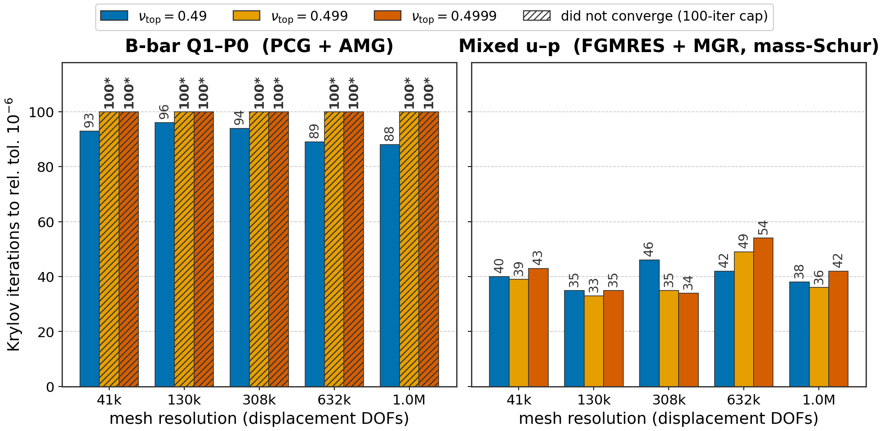

   Krylov iterations vs mesh resolution, one bar per :math:`\nu_{\text{top}}`.
   *Left:* B-bar (PCG + AMG) is locking-free but its condensed operator still carries
   the :math:`\lambda` penalty, so it is ill-conditioned -- iteration counts climb
   with both refinement and :math:`\nu_{\text{top}}`, capping out at the tighter
   ratios. *Right:* mixed u-p (FGMRES + MGR with the scaled pressure-mass Schur as
   MGR's coarse operator) converges at every ratio and size, essentially independent
   of :math:`\nu_{\text{top}}`.

The lesson is that **removing locking is not the same as making the system cheap to
solve.** Both discretizations recover the correct displacement (0.144), but B-bar's
static condensation leaves the :math:`\lambda` penalty inside the displacement
operator, so it is as ill-conditioned as standard CG: where it converges
(:math:`\nu_{\text{top}}=0.49`) it already needs many PCG iterations, and at the
tighter ratios PCG breaks down and hits the cap. The mixed u-p formulation exposes
the pressure, so MGR can precondition the saddle point as the textbook block
factorization: the displacement F-block uses the :math:`\lambda`-independent shear
operator (two rigid-body-aware GM2 AMG V-cycles, nearly mesh-independent), and the
pressure C-block is driven by the scaled pressure-mass Schur
:math:`\hat S = (\tfrac{1}{2\mu}+\tfrac{1}{\lambda})\,M_p`, supplied to MGR via
``coarse_level_type: user``. :math:`\hat S` is spectrally equivalent to the exact
pressure Schur uniformly in :math:`h` and :math:`\lambda` (Mardal--Winther; the
Bochev--Dohrmann pressure stabilization makes this hold for equal-order Q1--Q1), and
a mass matrix is perfectly conditioned, so one cheap coarse cycle suffices. The
mixed discretization is thus the only option here that is both locking-free **and**
efficiently solvable as :math:`\nu \to 1/2`.

.. _LibraryExample4:

Example 4: Nonlinear Heat Flow
------------------------------

This section documents the transient nonlinear heat conduction driver implemented in
``examples/src/C_heatflow/heatflow.c``. It solves a scalar diffusion equation with
temperature-dependent conductivity on a structured 3D mesh using Q1 hexahedral elements,
backward Euler time integration, and a full Newton method.

Geometry and Boundary Conditions
~~~~~~~~~~~~~~~~~~~~~~~~~~~~~~~~

The domain is :math:`\Omega = [0, L_x] \times [0, L_y] \times [0, L_z]` with a Cartesian
grid of :math:`N_x \times N_y \times N_z` nodes. The y-axis represents the vertical
direction with a cold base:

- **Dirichlet**: :math:`T = 0` on the bottom plane :math:`y = 0` (cold base)
- **Neumann (insulated)**: :math:`\partial T / \partial n = 0` on all other faces
  (:math:`x = 0`, :math:`x = L_x`, :math:`y = L_y`, :math:`z = 0`, :math:`z = L_z`)

This configuration models heat conduction in a body with an isothermal cold base and
thermally insulated sides and top.

Governing Equation
~~~~~~~~~~~~~~~~~~

We consider the PDE

.. math::

   \rho c\, \partial_t T \;-\; \nabla\!\cdot\!\big(k(T)\,\nabla T\big) \;=\; Q_{\text{MMS}}(x,y,z,t),
   \qquad k(T) \;=\; k_0\,e^{\beta T}.

The nonlinear conductivity :math:`k(T)` allows modeling temperature-dependent thermal properties:

- :math:`\beta = 0`: linear conductivity (:math:`k = k_0`)
- :math:`\beta > 0`: conductivity increases with temperature
- :math:`\beta < 0`: conductivity decreases with temperature

MMS Validation
~~~~~~~~~~~~~~

The example uses a transient Method of Manufactured Solutions (MMS) with a 3D exact solution:

.. math::

   T_{\text{exact}}(x,y,z,t) \;=\; e^{-t}\,
   \frac{1 + \cos(2\pi x/L_x)}{2}\,
   \sin\!\left(\frac{\pi y}{2 L_y}\right)\,
   \frac{1 + \cos(2\pi z/L_z)}{2},

which satisfy the boundary conditions:

  - :math:`T = 0` at :math:`y = 0` (since :math:`\sin(0) = 0`)
  - :math:`\partial T / \partial x = 0` at :math:`x = 0, L_x` (since :math:`\sin(0) = \sin(2\pi) = 0`)
  - :math:`\partial T / \partial y = 0` at :math:`y = L_y` (since :math:`\cos(\pi/2) = 0`)
  - :math:`\partial T / \partial z = 0` at :math:`z = 0, L_z` (since :math:`\sin(0) = \sin(2\pi) = 0`)

The corresponding source term :math:`Q_{\text{MMS}}` is computed analytically so that
:math:`T_{\text{exact}}` satisfies the PDE, enabling verification of the numerical
implementation. The solution has full 3D spatial variation, with temperature maxima at the
corners :math:`(0,L_y,0)` and :math:`(L_x,L_y,L_z)` and minima along the :math:`y=0` plane.

Discretization and Nonlinear Formulation
~~~~~~~~~~~~~~~~~~~~~~~~~~~~~~~~~~~~~~~~

- Space: trilinear Q1 hexahedral elements on a uniform Cartesian grid.
- Time: backward Euler (implicit, first order).
- Unknown: scalar temperature, one DOF per node.
- Nonlinear conductivity: :math:`k(T)=k_0 e^{\beta T}`, so :math:`k'(T)=\beta k(T)`.

At a Newton iterate :math:`T^k` the residual reads

.. math::
   R(T^k) \;=\; \frac{\rho c}{\Delta t}\,M\,(T^k - T^n) \;+\;
                \int_{\Omega} k(T^k)\,\nabla v \cdot \nabla T^k \, d\Omega
                \;-\; \int_{\Omega} v\,Q_{\text{MMS}} \, d\Omega.

The Jacobian applied to :math:`\delta T` is

.. math::
   J(T^k)\,\delta T \;=\; \frac{\rho c}{\Delta t}\,M\,\delta T
   \;+\; \int_{\Omega} k(T^k)\,\nabla v \cdot \nabla(\delta T) \, d\Omega
   \;+\; \int_{\Omega} k'(T^k)\,(\delta T)\,\big(\nabla v \cdot \nabla T^k\big) \, d\Omega.

Implementation notes:

- Precomputed Q1 templates provide consistent mass and unit-diffusion stiffness on uniform
  hexes; conductivity and nonlinear terms are accumulated at Gauss points.
- Dirichlet rows are set to identity with zero RHS (Newton solves for the update), and
  interior rows include zero entries for Dirichlet columns to preserve a symmetric
  sparsity pattern (AMG friendly).
- Parallel assembly uses face/edge/corner ghost exchanges so each rank can evaluate
  boundary-straddling elements without cracks in the global solution or VTK output.

Jacobian Symmetry and Solver Choice
^^^^^^^^^^^^^^^^^^^^^^^^^^^^^^^^^^^

The Jacobian matrix is **symmetric only when** :math:`\beta = 0` (linear conductivity). For nonlinear
conductivity (:math:`\beta \neq 0`), the extra Jacobian term

.. math::

   \int_{\Omega} k'(T^k)\,(\delta T)\,\big(\nabla v \cdot \nabla T^k\big)\, d\Omega

introduces asymmetry because :math:`\nabla v \cdot \nabla T^k` differs from
:math:`\nabla(\delta T) \cdot \nabla T^k` when expanded in the finite element basis.

- **PCG** (conjugate gradient) works correctly for :math:`\beta = 0` and may work for
  small :math:`|\beta|` where the asymmetry is negligible.
- **GMRES** (or FGMRES) is recommended for nonlinear problems (:math:`\beta \neq 0`) as it
  handles non-symmetric systems robustly. The default configuration uses GMRES+AMG for
  this reason.

Output and Diagnostics
~~~~~~~~~~~~~~~~~~~~~~

- VTK RectilinearGrid per rank with point fields:

  - ``temperature`` (numerical solution)
  - ``conductivity`` (derived via :math:`k(T)`)
  - ``temperature_exact`` (MMS exact solution, enable with ``-vis 16`` bit)
  - ``heat_flux`` vector field :math:`\mathbf{q}=-k(T)\nabla T` (enable with ``-vis 8`` bit)

- PVD collection at the end for easy time series loading in ParaView.
- The header and iteration logs report:

  - Fourier number :math:`\text{Fo} = \alpha_0 \Delta t / h_{\min}^2` where :math:`\alpha_0 = k_0 / (\rho c)`
  - Total internal energy :math:`E = \int_\Omega \rho c\, T\, d\Omega` and :math:`\Delta E` per step
  - MMS L2 error :math:`\|T - T_{\text{exact}}\|_{L^2}` at each Newton iteration

Reproducible Run
~~~~~~~~~~~~~~~~

.. code-block:: text

  Usage: mpirun -np <np> ./heatflow [options]

  Options:
    -i <file>         : YAML configuration file for solver settings
    -n <nx> <ny> <nz> : Global grid nodes (default: 17 17 17)
    -P <Px> <Py> <Pz> : Processor grid (default: 1 1 1)
    -L <Lx> <Ly> <Lz> : Domain lengths (default: 1 1 1)
    -rho <val>        : Density (default: 1)
    -cp <val>         : Heat capacity (default: 1)
    -dt <val>         : Time step (default: 1e-2)
    -tf <val>         : Final time (default: 1.0)
    -k0 <val>         : Base conductivity (default: 1)
    -beta <val>       : Conductivity exponent (default: 0 = linear)
    -br <n>           : Batch rows per IJ call (default: 128)
    -adt              : Enable adaptive time stepping
    -cfl <val>        : Maximum CFL for adaptive time stepping (0=no limit)
    -vis <m>          : Visualization mode bitset (default: 0)
                         Any nonzero value enables visualization
                         Bit 1 (0x2): ASCII (1) or binary (0)
                         Bit 2 (0x4): All timesteps (1) or last only (0)
                         Bit 3 (0x8): Include heat flux in output
                         Bit 4 (0x10): Include exact MMS solution
    -nw_max <n>       : Newton max iterations (default: 20)
    -nw_tol <t>       : Newton update tolerance ||delta||_inf (default: 1e-5)
    -nw_rtol <t>      : Newton residual tolerance ||R||_2 (default: 1e-5)
    -v|--verbose <n>  : Verbosity bitset (default: 7)
                         0x1: Newton iteration info
                         0x2: Library and system info
                         0x4: Print linear system
    -h|--help         : Print this message

.. code-block:: bash

   # 2×2×2 parallel, transient MMS with insulated BCs, moderate nonlinearity
   mpirun -np 8 ./heatflow -n 33 33 33 -P 2 2 2 -beta 0.5 -dt 0.01 -tf 0.1 -v 1

Transient Visualization
~~~~~~~~~~~~~~~~~~~~~~~~~

Enabling all-timestep VTK output (``-vis 4``) writes a ``.pvd`` time-series collection
that the bundled ``postprocess.py`` renders into an animated GIF of the temperature
isosurfaces with `PyVista <https://pyvista.org>`_. The ``-cfl 1.0`` flag caps the
time-step size so the frames are uniformly spaced across the transient (otherwise the
driver grows ``dt`` and only a handful of frames are produced).

.. code-block:: bash

   mpirun -np 4 /path/to/build/heatflow -n 49 49 49 -P 2 2 1 -dt 0.005 -tf 0.6 -cfl 1.0 -vis 4
   python3 postprocess.py heatflow_49x49x49_2x2x1.pvd -o heatflow_transient.gif   # needs: pip install pyvista imageio

.. only:: html

   .. figure:: figures/heatflow_transient.gif
      :width: 70%
      :align: center
      :alt: Animated temperature isosurfaces decaying over the transient

      Nested translucent isosurfaces of the temperature field over the transient. The hot
      cores at the insulated corners gradually shrink and cool as heat diffuses out through
      the isothermal cold base at :math:`y = 0`; the isosurface levels and color scale are
      held fixed so the decay is apparent.

.. only:: latex

   .. figure:: figures/heatflow_transient.png
      :width: 70%
      :align: center
      :alt: Temperature isosurfaces decaying over the transient

      Nested translucent isosurfaces of the temperature field over the transient. The hot
      cores at the insulated corners gradually shrink and cool as heat diffuses out through
      the isothermal cold base at :math:`y = 0`; the isosurface levels and color scale are
      held fixed so the decay is apparent.

.. _LibraryExample5:

Example 5: Lid-Driven Cavity (Navier-Stokes)
--------------------------------------------

This section documents the mathematical model, discretization, and hypre usage
for the 2D lid-driven cavity driver implemented in ``examples/src/C_lidcavity/lidcavity.c``.
This is a classical benchmark problem for incompressible fluid flow solvers, featuring
time-dependent Navier-Stokes equations solved with stabilized finite elements and
Newton iteration.

Governing Equations (Incompressible Navier-Stokes)
~~~~~~~~~~~~~~~~~~~~~~~~~~~~~~~~~~~~~~~~~~~~~~~~~~

We consider the unit square domain :math:`\Omega = [0, L] \times [0, L]` with the
lid-driven cavity configuration. The unknowns are the velocity field
:math:`\mathbf{u} = (u, v)` and the pressure :math:`p`.

- Momentum equation:

  .. math::

     \frac{\partial \mathbf{u}}{\partial t} + (\mathbf{u} \cdot \nabla) \mathbf{u}
     - \nu \nabla^2 \mathbf{u} + \nabla p = \mathbf{0} \quad \text{in } \Omega,

- Continuity equation (incompressibility):

  .. math::

     \nabla \cdot \mathbf{u} = 0 \quad \text{in } \Omega,

where the kinematic viscosity :math:`\nu = 1/\text{Re}` is the inverse of the
Reynolds number.

Geometry and Boundary Conditions
~~~~~~~~~~~~~~~~~~~~~~~~~~~~~~~~

The lid-driven cavity is a square domain with the following boundary conditions:

- **Lid** (:math:`y = L`, excluding corners): :math:`u = u_{\text{lid}}(x)`, :math:`v = 0`

  - *Classic BC*: :math:`u_{\text{lid}} = 1` (discontinuous at corners)
  - *Regularized BC*: :math:`u_{\text{lid}} = [1 - (2x/L - 1)^{16}]^2` (smooth, zero at corners)

- **Walls** (:math:`x = 0`, :math:`x = L`, :math:`y = 0`, and corners): :math:`\mathbf{u} = \mathbf{0}` (no-slip)
- **Pressure**: Fixed at one node (bottom-left corner, :math:`p = 0`) to remove the nullspace

The regularized boundary condition eliminates the velocity discontinuity at the
top corners, which can cause numerical difficulties at high Reynolds numbers.

Numerical Discretization
~~~~~~~~~~~~~~~~~~~~~~~~

This section describes the spatial and temporal discretization of the lid-driven cavity problem.

Spatial Discretization
^^^^^^^^^^^^^^^^^^^^^^

By default, we use equal-order bilinear (Q1) finite elements for both velocity and
pressure on a structured quadrilateral mesh. This violates the
Ladyzhenskaya-Babuška-Brezzi (LBB) inf-sup condition, requiring stabilization to obtain a
well-posed system. In this discretization, the three degrees of freedom ``(u, v, p)``
are interleaved at every node and the pressure is pinned at a reference node.

Alternatively, the driver supports an inf-sup stable Q2-Q1 (Taylor-Hood) discretization
via the ``-disc q2q1`` command line option, which requires no stabilization. The ``-n``
option then gives the pressure (bilinear) grid, while the velocity (biquadratic) grid has
``(2*nx - 1) x (2*ny - 1)`` nodes. Because the two fields live on staggered grids with
different numbers of unknowns, the degrees of freedom are stored in a block layout —
``(u, v)`` pairs interleaved over the velocity nodes followed by the pressure block — and
the dof types are communicated to hypredrive with explicit labels
(``HYPREDRV_LinearSystemSetDofmap()`` with ``u = 0``, ``v = 1``, ``p = 2``) instead of
the interleaved dofmap helper. Moreover, the pressure is *not* pinned in this mode:
since the enclosed flow determines the pressure only up to a constant, the example
registers the constant pressure mode with
``HYPREDRV_LinearSystemSetNullSpace()`` and hypredrive projects it out of the solution
after every solve, fixing the pressure gauge. The default solver configuration for
``-disc q2q1`` is a two-level MGR preconditioner with the velocity dof types as F points,
the pressure as the C point, and ``blk-absrowsum`` prolongation. The Q2-Q1 path runs in
serial and in parallel (``-P Px Py``); hypre requires at least version 3.1 for the MGR
default configuration.

The two discretizations can be compared side by side with
``examples/src/C_lidcavity/compare.sh``, which sweeps Reynolds and CFL numbers at matched
velocity resolution and reports time steps, nonlinear/linear iteration counts, the final
kinetic energy (a solution observable printed by the driver and comparable between the
discretizations), and wall times.

Temporal Discretization
^^^^^^^^^^^^^^^^^^^^^^^

Backward Euler (implicit, first-order) is used for time integration:

.. math::

   \frac{\mathbf{u}^{n+1} - \mathbf{u}^n}{\Delta t} + (\mathbf{u}^{n+1} \cdot \nabla) \mathbf{u}^{n+1}
   - \nu \nabla^2 \mathbf{u}^{n+1} + \nabla p^{n+1} = \mathbf{0}

The nonlinear convective term is handled by Newton iteration within each time step.

SUPG and PSPG Stabilization
^^^^^^^^^^^^^^^^^^^^^^^^^^^

To stabilize the equal-order discretization, we add SUPG (Streamline-Upwind/Petrov-Galerkin)
for the momentum equations and PSPG (Pressure-Stabilizing/Petrov-Galerkin) for the
continuity equation. The stabilized residual is:

.. math::

   \mathbf{R}(\mathbf{u}, p) = \mathbf{R}_{\text{Gal}} + \sum_{e} \mathbf{R}_{\text{SUPG}}^e
   + \sum_{e} \mathbf{R}_{\text{PSPG}}^e = \mathbf{0}

The SUPG term adds streamline diffusion to the momentum equations:

.. math::

   \mathbf{R}_{\text{SUPG}}^e = \int_{\Omega_e} (\mathbf{u} \cdot \nabla \mathbf{w}) \, \tau_{\text{SUPG}}
   \left( \rho \mathbf{u} \cdot \nabla \mathbf{u} + \nabla p \right) d\Omega

The PSPG term stabilizes the pressure field:

.. math::

   \mathbf{R}_{\text{PSPG}}^e = \int_{\Omega_e} (\nabla q) \, \tau_{\text{PSPG}}
   \left( \rho \mathbf{u} \cdot \nabla \mathbf{u} + \nabla p \right) d\Omega

where :math:`\mathbf{w}` and :math:`q` are velocity and pressure test functions,
and :math:`\tau` is the element-wise stabilization parameter computed from:

.. math::

   \tau = \left[ \left(\frac{2}{\Delta t}\right)^2 + \left(\frac{2|\mathbf{u}|}{h}\right)^2
   + \left(\frac{4\nu}{h^2}\right)^2 \right]^{-1/2}

Jacobian Matrix Structure
^^^^^^^^^^^^^^^^^^^^^^^^^

The Newton-Raphson iteration solves :math:`\mathbf{J} \delta \mathbf{U} = -\mathbf{R}`,
where the Jacobian has a 2×2 block structure:

.. math::

   \mathbf{J} =
   \begin{bmatrix}
   \mathbf{J}_{\mathbf{uu}} & \mathbf{J}_{\mathbf{up}} \\
   \mathbf{J}_{p\mathbf{u}} & \mathbf{J}_{pp}
   \end{bmatrix}

- :math:`\mathbf{J}_{\mathbf{uu}}`: Momentum-momentum block (advection, diffusion, SUPG)
- :math:`\mathbf{J}_{\mathbf{u}p}`: Momentum-pressure block (pressure gradient, SUPG pressure)
- :math:`\mathbf{J}_{p\mathbf{u}}`: Continuity-velocity block (divergence, PSPG advection)
- :math:`\mathbf{J}_{pp}`: Continuity-pressure block (PSPG pressure Laplacian)

The PSPG stabilization populates :math:`\mathbf{J}_{pp}` with a pressure-Laplacian-like
term, which would be zero in standard Galerkin Q1-Q1 formulation. This is the key
mechanism that allows equal-order interpolation to work.

Element Assembly
^^^^^^^^^^^^^^^^

Each quadrilateral element has 4 nodes with 3 DOFs per node (interleaved as :math:`u, v, p`),
giving 12 element DOFs. The element stiffness matrix :math:`K_e \in \mathbb{R}^{12 \times 12}`
and residual vector :math:`\mathbf{r}_e \in \mathbb{R}^{12}` are computed using 2×2 Gauss
quadrature. The global system is assembled using the hypre IJ interface.

Parallel Partitioning
~~~~~~~~~~~~~~~~~~~~~

The domain is partitioned using an MPI Cartesian grid :math:`P = (P_x, P_y)`. Each rank
owns a rectangular subdomain with local node counts determined by balanced partitioning.
Ghost data exchange is performed for velocity values needed in element assembly at
partition boundaries.

The global DOF numbering uses block-aware lexicographic ordering: for a node with
global coordinates :math:`(i, j)`, the three DOF indices are:

.. math::

   \text{dof}_{\text{gid}}(i, j, c) = 3 \cdot \text{node}_{\text{gid}}(i, j) + c,
   \qquad c \in \{0, 1, 2\}

where :math:`c = 0` is :math:`u`, :math:`c = 1` is :math:`v`, and :math:`c = 2` is :math:`p`.

Linear System Creation
~~~~~~~~~~~~~~~~~~~~~~

At each Newton iteration within each time step:

1. Create ``HYPRE_IJMatrix`` and ``HYPRE_IJVector`` with global DOF bounds for this rank.
2. Set per-row nnz bounds (conservative 27 per row for 9 nodes × 3 DOFs).
3. For each local element, compute the Jacobian and residual contributions and
   assemble using ``HYPRE_IJMatrixAddToValues`` and ``HYPRE_IJVectorAddToValues``.
4. Apply Dirichlet boundary conditions by setting identity rows and prescribed RHS values.
5. Finalize with ``HYPRE_IJMatrixAssemble`` and ``HYPRE_IJVectorAssemble``.
6. Optionally migrate to GPU with ``HYPRE_IJMatrixMigrate``/``HYPRE_IJVectorMigrate``.

The following code snippet shows the linear system setup and solve within a Newton iteration:

.. code-block:: c

   HYPRE_IJMatrix A;
   HYPRE_IJVector b;
   /* ... BuildNewtonSystem creates and assembles A, b ... */

   // Tell hypredrive we have 3 interleaved DOFs per node (u, v, p)
   HYPREDRV_LinearSystemSetInterleavedDofmap(hdrv, local_num_nodes, 3);
   HYPREDRV_LinearSystemSetMatrix(hdrv, (HYPRE_Matrix)A);
   HYPREDRV_LinearSystemSetRHS(hdrv, (HYPRE_Vector)b);
   HYPREDRV_LinearSystemSetInitialGuess(hdrv, NULL);
   HYPREDRV_LinearSystemSetPrecMatrix(hdrv, NULL);

   // Solve lifecycle
   HYPREDRV_LinearSolverCreate(hdrv);
   HYPREDRV_LinearSolverSetup(hdrv);
   HYPREDRV_LinearSolverApply(hdrv);
   HYPREDRV_LinearSolverDestroy(hdrv);

   // Update solution vector (U^{k + 1} = U^{k} + ΔU)
   HYPREDRV_StateVectorApplyCorrection(hdrv);

   // Cleanup IJ objects (recreated each Newton iteration)
   HYPRE_IJMatrixDestroy(A);
   HYPRE_IJVectorDestroy(b);

State Vector Management for Time-Stepping
~~~~~~~~~~~~~~~~~~~~~~~~~~~~~~~~~~~~~~~~~

For time-dependent problems, HYPREDRV provides a state vector management system that
efficiently handles multiple solution states (e.g., previous time step, current time step)
using a circular indexing scheme. This is particularly useful for time-stepping applications
where you need to maintain and access multiple solution states.

The state vector system is initialized with ``HYPREDRV_StateVectorSet``, which registers
an array of ``HYPRE_IJVector`` objects that will be managed internally. The system uses
logical indices (0, 1, ...) that map to physical state vectors through a circular buffer,
allowing efficient state rotation without data copying.

The following code snippet shows how to set up state vectors for a time-stepping application:

.. code-block:: c

   // Create state vectors for time-stepping (e.g., old and new time steps)
   HYPRE_IJVector vec_s[2];
   for (int i = 0; i < 2; i++)
   {
      HYPRE_IJVectorCreate(MPI_COMM_WORLD, dof_ilower, dof_iupper, &vec_s[i]);
      HYPRE_IJVectorSetObjectType(vec_s[i], HYPRE_PARCSR);
      HYPRE_IJVectorInitialize(vec_s[i]);
   }
   HYPREDRV_StateVectorSet(hdrv, 2, vec_s);

   // In the time-stepping loop:
   for (int t = 0; t < num_steps; t++)
   {
      // Copy previous time step to current (state 1 -> state 0)
      HYPREDRV_StateVectorCopy(hdrv, 1, 0);

      // Get pointers to state vector data for assembly
      HYPRE_Complex *u_old = NULL;
      HYPRE_Complex *u_now = NULL;
      HYPREDRV_StateVectorGetValues(hdrv, 1, &u_old);  // Previous time step
      HYPREDRV_StateVectorGetValues(hdrv, 0, &u_now);  // Current time step

      // ... Newton iteration loop ...
      for (int k = 0; k < max_newton_iters; k++)
      {
         // Assemble linear system using u_old and u_now
         BuildNewtonSystem(..., u_old, u_now, &A, &b, ...);

         // Solve linear system
         HYPREDRV_LinearSolverApply(hdrv);

         // Apply Newton correction: U^{k+1} = U^k + ΔU
         HYPREDRV_StateVectorApplyCorrection(hdrv);
      }

      // At end of time step, cycle states for next iteration
      HYPREDRV_StateVectorUpdateAll(hdrv);
   }

The main function APIs are listed below:

- **HYPREDRV_StateVectorSet**: Initializes the state vector management system with
  an array of ``HYPRE_IJVector`` objects. Must be called before using other state vector
  functions.

- **HYPREDRV_StateVectorGetValues**: Retrieves a pointer to the underlying data
  array of a state vector, allowing direct read/write access without copying. The
  pointer is valid as long as the state vector exists.

- **HYPREDRV_StateVectorCopy**: Copies the contents of one state vector to another.
  Commonly used to initialize the new time step with the solution from the previous
  time step.

- **HYPREDRV_StateVectorApplyCorrection**: Applies the linear solver correction
  (ΔU) to the current state vector (logical index 0), implementing the Newton update:
  :math:`U^{k+1} = U^k + \Delta U`.

- **HYPREDRV_StateVectorUpdateAll**: Advances the internal state mapping by one
  position in a circular manner. After calling this, logical indices refer to different
  physical state vectors. Typically called at the end of each time step.

The circular indexing scheme allows efficient state management: after ``HYPREDRV_StateVectorUpdateAll``,
what was previously state 1 becomes state 0, state 2 becomes state 1, etc., wrapping around.
This avoids unnecessary data copying while maintaining clear logical indexing.

Linear Solver Configuration
~~~~~~~~~~~~~~~~~~~~~~~~~~~

One of the main goals of hypredrive is to provide a flexible and easy-to-use interface for solving
linear systems. In this example, we provide a comparison script to evaluate different preconditioner strategies:

.. code-block:: bash

   ./reproduce.sh --solvers

This script runs the simulation with five different solver configurations and
generates performance comparison plots. The tested configurations are stored in
the ``examples/src/C_lidcavity/`` directory and are listed below:

- **ILUK(0)**: Block Jacobi ILU with zero fill level (``fgmres-ilu0.yml``)
- **ILUK(1)**: Block Jacobi ILU with fill level 1 (``fgmres-ilu1.yml``)
- **ILUT(1e-2)**: Block Jacobi ILUT with drop tolerance 1.0e-2 (``fgmres-ilut_1e-2.yml``)
- **AMG**: Algebraic multigrid preconditioner (``fgmres-amg.yml``)
- **MGR**: MGR with absolute block rowsum prolongation (``fgmres-mgr.yml``)

All configurations use flexible GMRES (FGMRES) with a relative tolerance of
1.0e-6. The comparison uses a 256×256 grid with 16 MPI ranks, running from
t=0 to t=50 with adaptive time stepping.

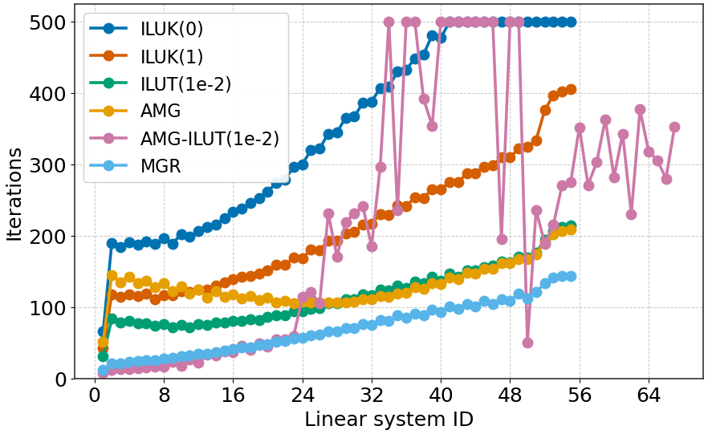

   Linear solver iterations for different preconditioner
   configurations (Re=100, 256×256 grid).

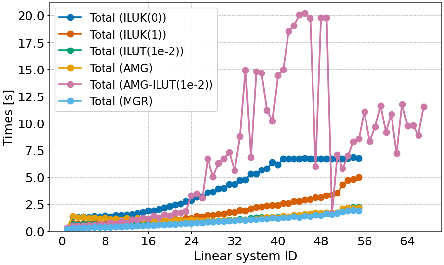

   Total execution time for different preconditioner
   configurations (Re=100, 256×256 grid).

Time Stepping and Newton Convergence
~~~~~~~~~~~~~~~~~~~~~~~~~~~~~~~~~~~~

The simulation advances in time using backward Euler with adaptive time stepping:

1. Initialize velocity and pressure to zero.
2. For each time step until final time:

   a. Perform Newton iterations until the residual norm is below tolerance.
   b. At each Newton iteration, assemble and solve the linearized system.
   c. Update the solution with the Newton correction.
   d. Optionally adjust :math:`\Delta t` based on Newton convergence (adaptive stepping).

3. Write VTK output at specified intervals or at steady state.

The driver supports simple adaptive time stepping: if Newton converges quickly
(≤3 iterations), :math:`\Delta t` is increased; if convergence is slow (≥6 iterations),
:math:`\Delta t` is decreased. Additionally, a maximum CFL constraint can be specified
using the ``-cfl`` option to prevent the time step from growing too large; when enabled,
the time step is limited to :math:`\Delta t \leq \text{CFL}_{\max} \cdot h_{\min}`.

Visualizing the Solution
~~~~~~~~~~~~~~~~~~~~~~~~

The driver outputs VTK ``RectilinearGrid`` files with velocity vectors, pressure,
and divergence fields. A PVD collection file is written at the end to group all
time steps for visualization in ParaView.

- ``-vis 1``: Binary VTK, last time step only
- ``-vis 2``: ASCII VTK, last time step only
- ``-vis 4``: Binary VTK, all time steps
- ``-vis 6``: ASCII VTK, all time steps

Output includes:

- ``velocity``: 3-component vector field :math:`(u, v, 0)`
- ``pressure``: Scalar field :math:`p`
- ``div_velocity``: Divergence :math:`\nabla \cdot \mathbf{u}` (should be near zero)

Open the ``.pvd`` file in ParaView to visualize the flow evolution. Use "Stream Tracer"
or "Glyph" filters to visualize the velocity field and vortex structures.

Validation Results
~~~~~~~~~~~~~~~~~~

In this section, we validate the lid-driven cavity simulation by comparing 128×128
simulation centerline velocity profiles with high-resolution (8192×8192 grid) reference
data from Marchi et al. (2021). The plots were generated using the ``postprocess.py`` script.
They show the u-velocity profiles along the vertical centerline (x = 0.5) as a function of y
and the v-velocity profiles along the horizontal centerline (y = 0.5) as a function of x.
The error metrics (maximum error and RMSE) for both components are also displayed.

.. code-block:: bash

   # Run test cases and plot centerlines comparison
   ./reproduce.sh --centerlines

   # (Optional) Generate individual comparison plots (Re = 100)
   python3 postprocess.py results.pvd --Re 100 --save lidcavity.png --compact

.. list-table:: Centerline Velocity Profile Validation
   :widths: 50 50
   :header-rows: 0

   * - |image_re1|

     - |image_re10|

   * - |image_re100|

     - |image_re400|

   * - |image_re1000|

     - |image_re3200|

   * - |image_re5000|

     - |image_re7500|

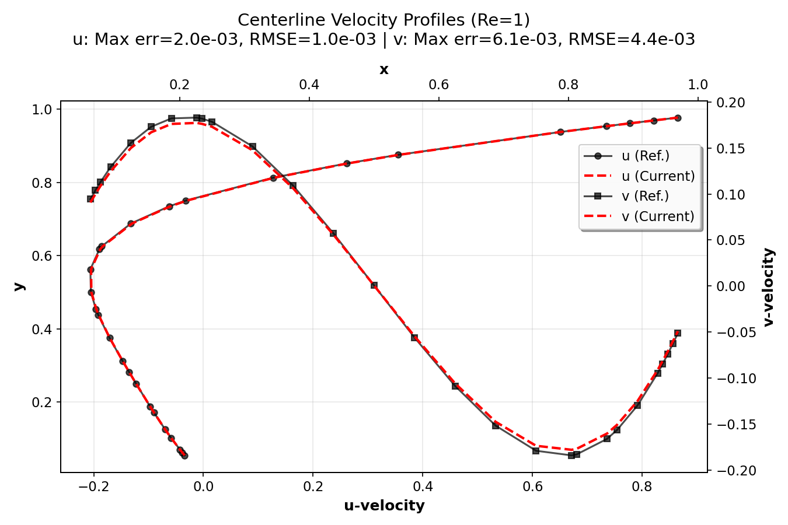

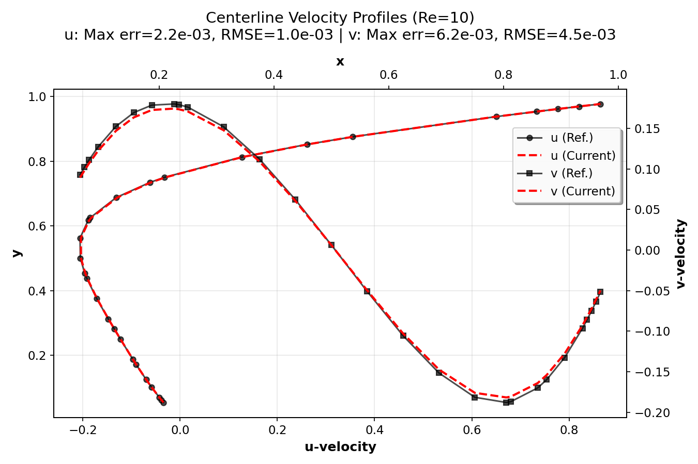

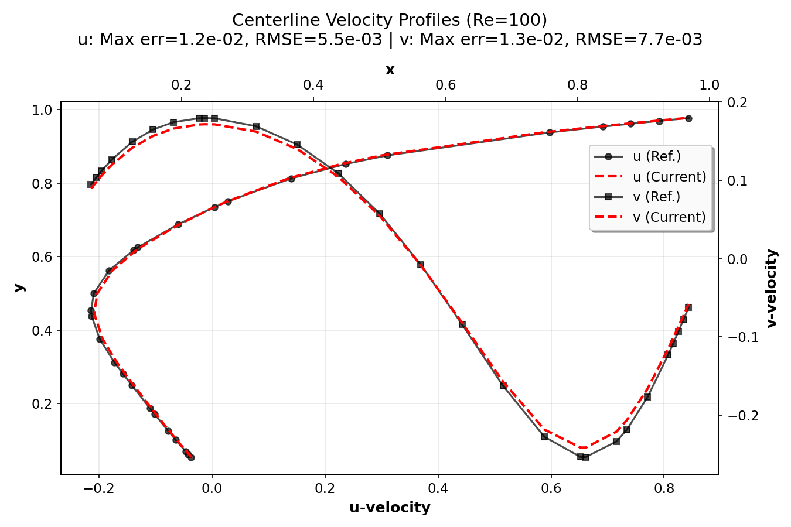

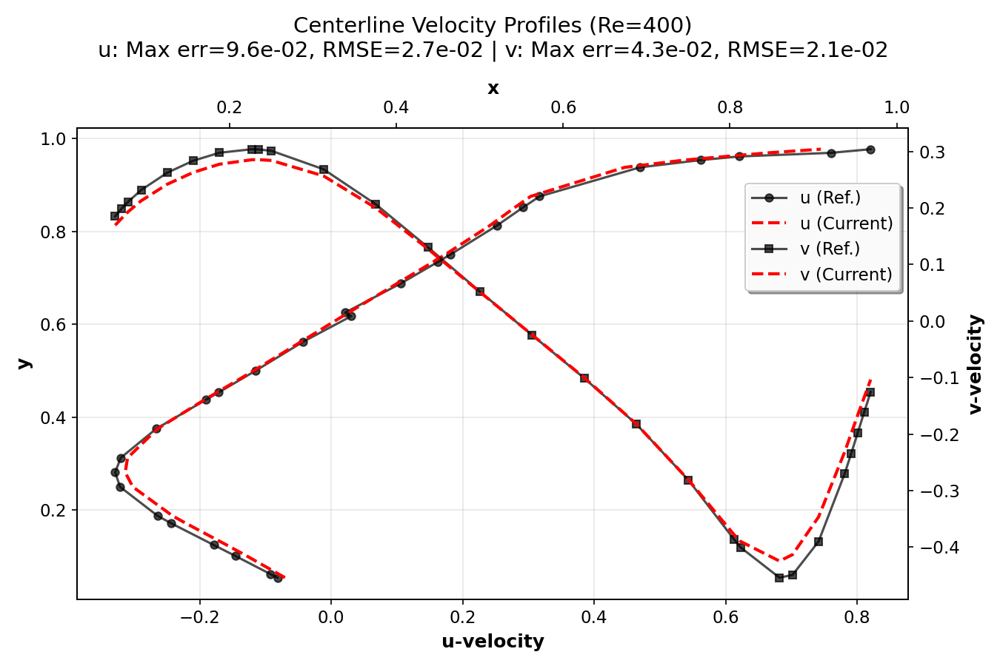

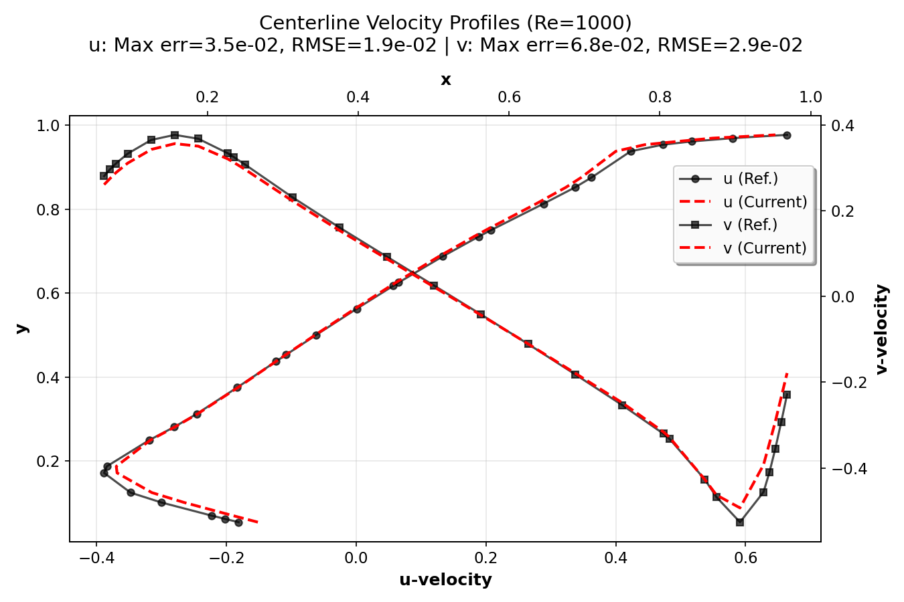

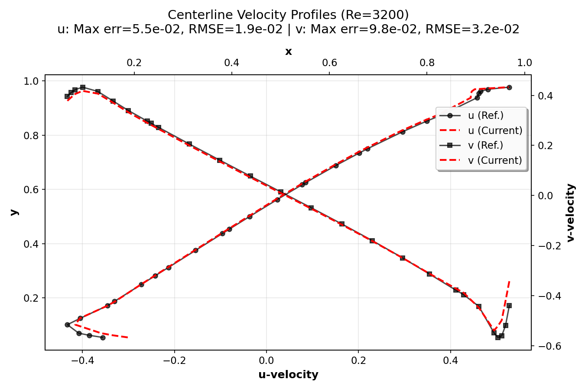

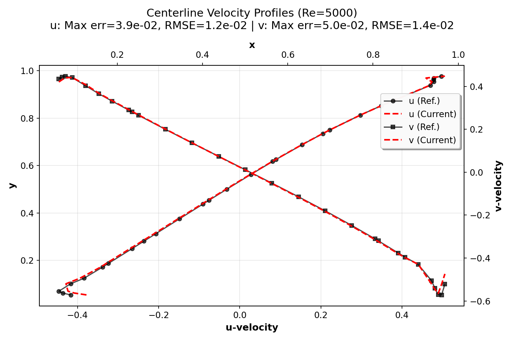

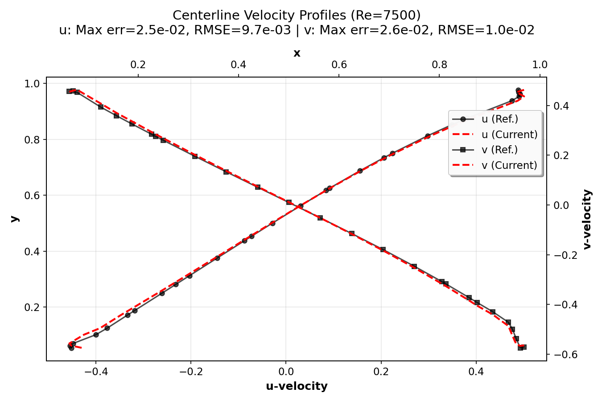

The validation demonstrates that the current numerical implementation provides
accurate results across a wide range of Reynolds numbers, from creeping flow
(Re = 1) to turbulent flow (Re = 7500). The agreement with high-resolution reference
data (Marchi et al., 2021) confirms the correctness of the implementation. The compact
plots show excellent agreement between simulation results and reference data,
with error metrics (maximum error and RMSE) displayed for each Reynolds number.

Reproducible Run
~~~~~~~~~~~~~~~~

Command-line parameters (see ``lidcavity -h``) control problem size, Reynolds number,
time stepping, partitioning, and visualization.

.. code-block:: bash

   mpirun -np 1 /path/to/build/examples/src/C_lidcavity/lidcavity -h

.. code-block:: text

   Usage: ${MPIEXEC_COMMAND} <np> ./lidcavity [options]

   Options:
     -i <file>         : YAML configuration file for solver settings (Opt.)
     -n <nx> <ny>      : Global grid dimensions in nodes (32 32)
     -P <Px> <Py>      : Processor grid dimensions (1 1)
     -L <Lx> <Ly>      : Physical dimensions (1 1)
     -Re <val>         : Reynolds number (100.0)
     -dt <val>         : Initial time step size (1)
     -tf <val>         : Final simulation time (50)
     -ntol <val>       : Non-linear solver tolerance (1.0e-6)
     -adt              : Enable simple adaptive time stepping
     -cfl <val>        : Maximum CFL for adaptive time stepping (0=no limit)
     -reg              : Use regularized lid BC (smooth corners)
     -br <n>           : Batch rows for matrix assembly (128)
     -vis <m>          : Visualization mode bitset (0)
                            Any nonzero value enables visualization
                            Bit 2 (0x2): ASCII (1) or binary (0)
                            Bit 3 (0x4): All timesteps (1) or last only (0)
     -v|--verbose <n>  : Verbosity bitset (0)
                            0x1: Linear solver statistics
                            0x2: Library information
                            0x4: Linear system printing
     -h|--help         : Print this message

Example run for Re=100 with visualization:

.. code-block:: bash

   mpirun -np 1 /path/to/build/examples/src/C_lidcavity/lidcavity -vis 1

.. literalinclude:: ../../examples/src/C_lidcavity/refOutput/default_Re100.out
   :language: text

The transient streamlines can be rendered as an animated GIF with the ``postprocess.py``
script, which traces the velocity field at each timestep using
`PyVista <https://pyvista.org>`_ (write all timesteps with ``-vis 4``):

.. code-block:: bash

   mpirun -np 4 /path/to/build/lidcavity -n 96 96 -P 2 2 -Re 100 -dt 0.05 -tf 50 -adt -reg -vis 4 -i fgmres-ilu0.yml
   python3 postprocess.py lidcavity_Re100_96x96_2x2.pvd --Re 100 --video lidcavity_streamlines.gif   # needs: pip install pyvista imageio

.. only:: html

   .. figure:: figures/lidcavity_streamlines.gif
      :alt: Animated streamlines of the lid-driven cavity (Re=100) as the vortex develops
      :width: 70%
      :align: center

      Streamlines of the lid-driven cavity flow (Re=100) over the transient, colored by the
      velocity magnitude. The primary vortex forms and the two secondary corner eddies emerge
      as the flow approaches steady state.

.. only:: latex

   .. figure:: figures/lidcavity_streamlines.png
      :alt: Streamlines of the lid-driven cavity (Re=100) as the vortex develops
      :width: 70%
      :align: center

      Streamlines of the lid-driven cavity flow (Re=100) over the transient, colored by the
      velocity magnitude. The primary vortex forms and the two secondary corner eddies emerge
      as the flow approaches steady state.

.. _maxwell_example:

Example 6: Definite curl-curl (AMS)
-----------------------------------

This example, implemented in ``examples/src/C_maxwell/maxwell.c``, is an
electromagnetic benchmark for the **Auxiliary-space Maxwell Solver (AMS)**. It pairs a
lowest-order edge-element discretization of a definite Maxwell problem with a
manufactured solution, so that both the *algebraic* performance (iteration counts,
timings) and the *discretization* accuracy can be measured directly.

Governing Equations (Definite Maxwell)
~~~~~~~~~~~~~~~~~~~~~~~~~~~~~~~~~~~~~~~~

On a box :math:`\Omega=[0,L_x]\times[0,L_y]\times[0,L_z]` we solve the
curl-curl + mass (also called *definite Maxwell*) problem for the electric field
:math:`E`:

.. math::

   \nabla\times\!\big(\mu^{-1}\,\nabla\times E\big) + \sigma\,E = f
   \quad\text{in } \Omega,
   \qquad
   E\times n = (E\times n)_D \quad\text{on } \partial\Omega ,

where :math:`\mu^{-1}` is the inverse magnetic permeability (the curl-curl coefficient)
and :math:`\sigma\ge 0` is the conductivity / mass coefficient. Both default to
:math:`1` and are configurable with the ``-muinv`` and ``-sigma`` flags. The essential
boundary condition prescribes the **tangential trace** :math:`E\times n`, which is the
natural Dirichlet datum for fields in :math:`H(\mathrm{curl})`.

The mass term is what makes the operator definite: for :math:`\sigma>0` the bilinear
form is coercive on all of :math:`H(\mathrm{curl})` (the gradient fields, which lie in
the kernel of the curl, are controlled by the :math:`\sigma\,E` term). This is exactly
the regime AMS is designed for, and AMS remains robust across the whole range from
curl-dominated (:math:`\sigma\ll\mu^{-1}`) to mass-dominated (:math:`\sigma\gg\mu^{-1}`)
as long as :math:`\sigma\ge 0`.

Variational Formulation
~~~~~~~~~~~~~~~~~~~~~~~~~

Let :math:`V=\{v\in H(\mathrm{curl};\Omega): v\times n=0 \text{ on }\partial\Omega\}`.
The weak problem reads: find :math:`E\in E_D+V` such that for all :math:`v\in V`,

.. math::

   \int_\Omega \mu^{-1}\,(\nabla\times E)\cdot(\nabla\times v)\,d\Omega
   \;+\;
   \int_\Omega \sigma\,E\cdot v\,d\Omega
   \;=\;
   \int_\Omega f\cdot v\,d\Omega .

The two volume integrals give, after discretization, a **stiffness (curl-curl)** matrix
weighted by :math:`\mu^{-1}` and a **mass** matrix weighted by :math:`\sigma`; the
system matrix is their sum.

Discretization: Lowest-Order Nedelec (Edge) Elements
~~~~~~~~~~~~~~~~~~~~~~~~~~~~~~~~~~~~~~~~~~~~~~~~~~~~~~

The field is discretized with the lowest-order Nedelec (Whitney) edge elements on a
structured hexahedral mesh. The degrees of freedom live on **edges**: the DOF of edge
:math:`e` is the integral of the tangential component of :math:`E` along it,

.. math::

   \mathrm{dof}_e(E) \;=\; \int_e E\cdot \tau \, ds ,

with every edge oriented in the :math:`+`-axis direction. Each hexahedron carries 12
edge DOFs (four per axis direction). The example builds the :math:`12\times12` element
matrix :math:`S_K = \mu^{-1}\,K_K + \sigma\,M_K` by integrating the Whitney basis with a
:math:`3`-point Gauss rule per direction, where :math:`(K_K)_{ab}=\int_K(\nabla\times
W_a)\cdot(\nabla\times W_b)` and :math:`(M_K)_{ab}=\int_K W_a\cdot W_b`. The essential
boundary condition is imposed by element-level static condensation: boundary-edge rows
become identity rows whose right-hand side is the prescribed tangential value, and their
columns are lifted to the load of the interior rows.

Nodes, edges, and (for the H(div) example below) faces are numbered with a single
**rank-monotonic** scheme so that the node, edge, and face partitions are mutually
consistent -- a requirement for the auxiliary-space products formed internally by AMS
and ADS.

Manufactured Solution and Error Measurement
~~~~~~~~~~~~~~~~~~~~~~~~~~~~~~~~~~~~~~~~~~~~~

The benchmark uses the smooth field

.. math::

   E=(\sin\kappa y,\ \sin\kappa z,\ \sin\kappa x),\qquad \kappa=\text{freq}\cdot\pi
   \ \ (\texttt{-freq}, \text{ default } 1),

which is an eigenfunction of the curl-curl operator: a short computation gives
:math:`\nabla\times E=(-\kappa\cos\kappa z,-\kappa\cos\kappa x,-\kappa\cos\kappa y)` and
hence :math:`\nabla\times\nabla\times E=\kappa^2 E`. The forcing is therefore available
in closed form,

.. math::

   f \;=\; \mu^{-1}\,\nabla\times\nabla\times E + \sigma\,E
       \;=\; (\mu^{-1}\kappa^2+\sigma)\,E ,

and the exact edge DOFs reduce to one-dimensional integrals, e.g. for an
:math:`x`-edge at nodal height :math:`y` the DOF is :math:`h_x\sin(\kappa y)`. After the
solve the example compares the computed edge DOFs to this reference field and reports
the relative discrete :math:`\ell_2` error, which confirms the solver converges to the
*correct* field rather than merely to a small residual.

Auxiliary-Space Inputs: the Discrete de Rham Complex
~~~~~~~~~~~~~~~~~~~~~~~~~~~~~~~~~~~~~~~~~~~~~~~~~~~~~~

AMS accelerates the edge system by mapping curl-free error components into nodal
(:math:`H^1`) auxiliary spaces, where standard AMG is effective. This requires two
*operator inputs* beyond the system matrix, both reflecting the de Rham complex
:math:`H^1 \xrightarrow{\nabla} H(\mathrm{curl}) \xrightarrow{\nabla\times} H(\mathrm{div})`:

- the **discrete gradient** :math:`G` (an edge :math:`\times` node incidence matrix with
  entries :math:`-1` at the tail node and :math:`+1` at the head node of each edge),
  passed with ``HYPREDRV_LinearSystemSetDiscreteGradient()``; and
- the **vertex coordinate vectors** :math:`x,y,z`, passed with
  ``HYPREDRV_LinearSystemSetCoordinates()``.

The example assembles :math:`G` as an ``HYPRE_IJMatrix`` (edges :math:`\times` nodes) and
the coordinates as three nodal ``HYPRE_IJVector`` objects. Note that these inputs are
purely topological/geometric: they do **not** depend on :math:`\mu^{-1}` or
:math:`\sigma`.

Linear System Creation
~~~~~~~~~~~~~~~~~~~~~~~~

The driver builds the IJ objects itself and hands them to HYPREDRV in library mode:

.. code-block:: c

   HYPREDRV_LinearSystemSetMatrix(hypredrv, (HYPRE_Matrix) A);
   HYPREDRV_LinearSystemSetRHS(hypredrv, (HYPRE_Vector) b);
   HYPREDRV_LinearSystemSetDiscreteGradient(hypredrv, (HYPRE_Matrix) G);
   HYPREDRV_LinearSystemSetCoordinates(hypredrv,
                                       (HYPRE_Vector) xcoord,
                                       (HYPRE_Vector) ycoord,
                                       (HYPRE_Vector) zcoord);

The solver and preconditioner are configured from
``examples/src/C_maxwell/pcg-ams.yml`` (PCG + AMS). A typical run:

.. code-block:: bash

   mpirun -np 4 /path/to/build/maxwell -i pcg-ams.yml -n 33 33 33 -P 2 2 1

Solution Visualization
~~~~~~~~~~~~~~~~~~~~~~~~

Passing ``-vtk <base>`` writes the computed field as VTK ImageData -- a single
``<base>.vti`` on one rank, or a ``<base>.pvti`` master plus per-rank ``<base>_pN.vti``
pieces in parallel. The driver reconstructs the cell-centered electric field from the
edge DOFs (Whitney basis) and stores both the vector and its magnitude. The bundled
``postprocess.py`` renders the magnitude with `PyVista <https://pyvista.org>`_; by
default it draws nested translucent isosurfaces (level sets) that show the 3D structure
of the field. The ``--style`` flag also offers ``clip`` (octant cutaway), ``volume``
(volume rendering), and ``slices``:

.. code-block:: bash

   mpirun -np 4 /path/to/build/maxwell -i pcg-ams.yml -n 65 65 65 -P 2 2 1 -vtk maxwell
   python3 postprocess.py maxwell.pvti -o maxwell_solution_3d.png   # needs: pip install pyvista

   Computed electric-field magnitude :math:`\|E\|_2` on a :math:`64^3` mesh (4 MPI
   ranks) for the default manufactured solution (:math:`\text{freq}=1`), shown as nested
   isosurfaces. The field is smooth and peaks at the cube center. The same
   ``.vti``/``.pvti`` files can also be opened directly in ParaView.

Mesh Refinement (Discretization Accuracy)
~~~~~~~~~~~~~~~~~~~~~~~~~~~~~~~~~~~~~~~~~~~

``./reproduce.sh`` (the default ``refine`` mode) confirms convergence to the
manufactured field. AMS keeps the iteration count nearly mesh independent while the
discrete :math:`\ell_2` error drops like :math:`O(h^2)`:

.. code-block:: text

   grid       iters        rel. error
   9^3        4            5.302372e-04
   17^3       7            1.358464e-04
   33^3       9            3.443534e-05
   65^3       10           8.673237e-06

Coefficient Robustness
~~~~~~~~~~~~~~~~~~~~~~~~

The ``./reproduce.sh sweep`` mode probes robustness with respect to the coefficients on
the :math:`64^3` mesh (~0.8M edge unknowns). Because the discrete operator is
:math:`\mu^{-1}K+\sigma M`, what matters is the **curl-to-mass ratio**
:math:`\sigma/\mu^{-1}`, so it suffices to fix :math:`\mu^{-1}=1` and sweep
:math:`\sigma` over six orders of magnitude, :math:`\sigma\in\{10^{-3},\dots,10^{3}\}`:
values below 1 are curl-dominated and values above 1 are mass-dominated. The iteration
plot compares AMS against two generic preconditioners that are *not* tailored to
:math:`H(\mathrm{curl})` -- BoomerAMG (``pcg-amg.yml``) and restricted additive Schwarz
with one level of overlap and ILU(0) subdomain solves (``gmres-ras1-ilu0.yml``) -- all
driven to ``relative_tol = 1e-8`` with a cap of 500 iterations.

.. code-block:: bash

   cd /path/to/build/examples/src/C_maxwell
   MPI_RANKS=4 PGRID="2 2 1" ./reproduce.sh sweep

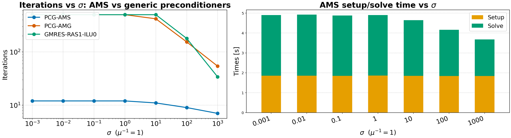

   Definite Maxwell problem on a :math:`64^3` mesh (4 MPI ranks). Left: iteration count
   versus :math:`\sigma` (log-log) for AMS, BoomerAMG, and RAS(1)-ILU0. Right: stacked
   AMS setup/solve time versus :math:`\sigma`.

The contrast is stark. **AMS is flat and robust**: 12 iterations in the curl-dominated
regime, easing to 7 as the mass term makes the system better conditioned -- essentially
independent of :math:`\sigma`. The generic preconditioners, by contrast, **fail in the
curl-dominated regime**: both BoomerAMG and RAS(1)-ILU0 hit the 500-iteration cap for
small :math:`\sigma` (BoomerAMG for :math:`\sigma\le 1`, RAS for :math:`\sigma\le 10`),
and recover only once the mass term dominates (:math:`\sigma\gtrsim 100`), where the
matrix approaches a well-conditioned mass matrix and any reasonable smoother works. This
is exactly why an auxiliary-space solver is needed: only AMS handles the large
near-kernel of the curl operator. Finally, the **AMS setup time is independent of**
:math:`\sigma` (~2 s throughout), because the auxiliary-space hierarchy is built from the
discrete gradient and the vertex coordinates -- the problem topology and geometry -- not
from the coefficient values; the solve time simply tracks the iteration count.

.. note::

   The comparison uses 4 MPI ranks because, in the bundled HYPRE build, the overlapping
   Schwarz (RAS) setup aborts at higher rank counts on this :math:`64^3` system; AMS,
   ADS, and BoomerAMG run at any rank count.

.. _graddiv_example:

Example 7: Definite grad-div (ADS)
----------------------------------

This example, in ``examples/src/C_graddiv/graddiv.c``, is the :math:`H(\mathrm{div})`
counterpart of the Maxwell benchmark and targets the **Auxiliary-space Divergence
Solver (ADS)**. It mirrors Example 6 one step down the de Rham complex: edges become
faces, the curl-curl operator becomes grad-div, and Nedelec elements become
Raviart-Thomas elements.

Governing Equations (Definite grad-div)
~~~~~~~~~~~~~~~~~~~~~~~~~~~~~~~~~~~~~~~~~

On a box :math:`\Omega` we solve the grad-div + mass problem for a vector field
:math:`u` (a flux/velocity):

.. math::

   -\alpha\,\nabla(\nabla\cdot u) + \beta\,u = f \quad\text{in } \Omega,
   \qquad
   u\cdot n = (u\cdot n)_D \quad\text{on } \partial\Omega ,

where :math:`\alpha` weights the grad-div (divergence-stiffness) term and
:math:`\beta\ge 0` is the mass coefficient; both default to :math:`1` and are set with
``-alpha`` and ``-beta``. The essential boundary condition prescribes the **normal
trace** :math:`u\cdot n`, the natural Dirichlet datum in :math:`H(\mathrm{div})`. As
before the mass term makes the operator definite (it controls the divergence-free fields
that lie in the kernel of the divergence), which is the regime ADS is built for.

Variational Formulation
~~~~~~~~~~~~~~~~~~~~~~~~~

With :math:`W=\{v\in H(\mathrm{div};\Omega): v\cdot n=0\text{ on }\partial\Omega\}`, the
weak form is: find :math:`u\in u_D+W` such that for all :math:`v\in W`,

.. math::

   \int_\Omega \alpha\,(\nabla\cdot u)(\nabla\cdot v)\,d\Omega
   \;+\;
   \int_\Omega \beta\,u\cdot v\,d\Omega
   \;=\;
   \int_\Omega f\cdot v\,d\Omega ,

giving a **divergence-stiffness** matrix weighted by :math:`\alpha` plus a **mass**
matrix weighted by :math:`\beta`.

Discretization: Lowest-Order Raviart-Thomas (Face) Elements
~~~~~~~~~~~~~~~~~~~~~~~~~~~~~~~~~~~~~~~~~~~~~~~~~~~~~~~~~~~~~~

The flux is discretized with lowest-order Raviart-Thomas (RT0) face elements. The
degrees of freedom live on **faces**: the DOF of face :math:`F` is the integral of the
normal flux through it,

.. math::

   \mathrm{dof}_F(u) \;=\; \int_F u\cdot n \, dA ,

with every face normal oriented in the :math:`+`-axis direction. Each hexahedron carries
6 face DOFs. The :math:`6\times6` element matrix :math:`S_K=\alpha\,K^{\mathrm{div}}_K
+ \beta\,M_K` is integrated from the RT0 basis, with
:math:`(K^{\mathrm{div}}_K)_{ab}=\int_K(\nabla\cdot v_a)(\nabla\cdot v_b)` and
:math:`(M_K)_{ab}=\int_K v_a\cdot v_b`. The normal-trace boundary condition is imposed by
the same element-level static condensation used in the Maxwell example.

Manufactured Solution and Error Measurement
~~~~~~~~~~~~~~~~~~~~~~~~~~~~~~~~~~~~~~~~~~~~~

The benchmark uses

.. math::

   u=(\sin\kappa x,\ \sin\kappa y,\ \sin\kappa z),\qquad \kappa=\text{freq}\cdot\pi .

Here :math:`\nabla\cdot u=\kappa(\cos\kappa x+\cos\kappa y+\cos\kappa z)` and
:math:`\nabla(\nabla\cdot u)=-\kappa^2 u`, so the forcing is again closed-form,

.. math::

   f \;=\; -\alpha\,\nabla(\nabla\cdot u)+\beta\,u \;=\; (\alpha\kappa^2+\beta)\,u ,

and the exact face DOFs reduce to surface integrals such as
:math:`h_y h_z\sin(\kappa x)` for an :math:`x`-face. The example reports the relative
discrete :math:`\ell_2` error of the computed face DOFs against this reference.

Auxiliary-Space Inputs: the Full de Rham Complex
~~~~~~~~~~~~~~~~~~~~~~~~~~~~~~~~~~~~~~~~~~~~~~~~~~

ADS reduces the face system through the *edge* space (where it applies AMS) and then to
the *nodal* space. It therefore needs the **whole discrete de Rham sequence**
:math:`\text{nodes}\xrightarrow{G}\text{edges}\xrightarrow{C}\text{faces}`, i.e. three
operator inputs in addition to the system matrix:

- the **discrete gradient** :math:`G` (edge :math:`\times` node), via
  ``HYPREDRV_LinearSystemSetDiscreteGradient()``;
- the **discrete curl** :math:`C` (face :math:`\times` edge incidence, with right-hand-rule
  signs around each face), via ``HYPREDRV_LinearSystemSetDiscreteCurl()``; and
- the **vertex coordinate vectors**, via ``HYPREDRV_LinearSystemSetCoordinates()``.

The example constructs :math:`G` and :math:`C` so that the fundamental identity
:math:`C\,G=0` (the discrete *curl of a gradient is zero*) holds exactly -- a property
ADS relies on. As in the Maxwell case these inputs are purely topological/geometric and
independent of :math:`\alpha` and :math:`\beta`.

Linear System Creation
~~~~~~~~~~~~~~~~~~~~~~~~

.. code-block:: c

   HYPREDRV_LinearSystemSetMatrix(hypredrv, (HYPRE_Matrix) A);
   HYPREDRV_LinearSystemSetRHS(hypredrv, (HYPRE_Vector) b);
   HYPREDRV_LinearSystemSetDiscreteGradient(hypredrv, (HYPRE_Matrix) G);
   HYPREDRV_LinearSystemSetDiscreteCurl(hypredrv, (HYPRE_Matrix) C);
   HYPREDRV_LinearSystemSetCoordinates(hypredrv,
                                       (HYPRE_Vector) xcoord,
                                       (HYPRE_Vector) ycoord,
                                       (HYPRE_Vector) zcoord);

The solver/preconditioner come from ``examples/src/C_graddiv/pcg-ads.yml`` (PCG + ADS):

.. code-block:: bash

   mpirun -np 4 /path/to/build/graddiv -i pcg-ads.yml -n 33 33 33 -P 2 2 1

Solution Visualization
~~~~~~~~~~~~~~~~~~~~~~~~

As in the Maxwell example, ``-vtk <base>`` writes the solution as VTK ImageData
(serial ``<base>.vti`` or parallel ``<base>.pvti`` plus per-rank pieces); here the
cell-centered flux is reconstructed from the face DOFs using the RT0 basis. The bundled
``postprocess.py`` renders the magnitude with `PyVista <https://pyvista.org>`_, using
the same isosurface default (and the same ``--style`` options) as the Maxwell example:

.. code-block:: bash

   mpirun -np 4 /path/to/build/graddiv -i pcg-ads.yml -n 65 65 65 -P 2 2 1 -freq 2 -vtk graddiv
   python3 postprocess.py graddiv.pvti -o graddiv_solution_3d.png   # needs: pip install pyvista

   Computed flux magnitude :math:`\|u\|_2` on a :math:`64^3` mesh (4 MPI ranks) for the
   manufactured solution at frequency ``-freq 2`` (:math:`\kappa = 2\pi`), shown as nested
   isosurfaces. The higher frequency produces a periodic lattice of peaks throughout the
   domain, so the field looks visibly different from the single central peak of the Maxwell
   example (which uses the default ``-freq 1``).

Mesh Refinement (Discretization Accuracy)
~~~~~~~~~~~~~~~~~~~~~~~~~~~~~~~~~~~~~~~~~~~

``./reproduce.sh`` shows ADS behaving like AMS -- nearly mesh independent with
:math:`O(h^2)` error decay:

.. code-block:: text

   grid       iters        rel. error
   9^3        5            1.174488e-03
   17^3       8            2.950893e-04
   33^3       10           7.386281e-05
   65^3       13           1.847132e-05

Coefficient Robustness
~~~~~~~~~~~~~~~~~~~~~~~~

As for Maxwell, what matters is the **div-to-mass ratio** :math:`\beta/\alpha`, so
``./reproduce.sh sweep`` fixes :math:`\alpha=1` and sweeps :math:`\beta` over six orders
of magnitude (:math:`\{10^{-3},\dots,10^{3}\}`, crossing from div-dominated to
mass-dominated) on the :math:`64^3` mesh, comparing ADS against BoomerAMG and
RAS(1)-ILU0.

.. code-block:: bash

   cd /path/to/build/examples/src/C_graddiv
   MPI_RANKS=4 PGRID="2 2 1" ./reproduce.sh sweep

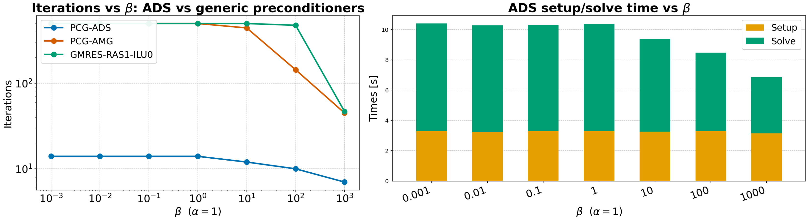

   Definite grad-div problem on a :math:`64^3` mesh (4 MPI ranks). Left: iteration count
   versus :math:`\beta` (log-log) for ADS, BoomerAMG, and RAS(1)-ILU0. Right: stacked
   ADS setup/solve time versus :math:`\beta`.

ADS behaves exactly like its :math:`H(\mathrm{curl})` counterpart: it is flat and robust
(14 iterations in the div-dominated regime, easing to 7 when the mass term dominates),
while BoomerAMG and RAS(1)-ILU0 hit the 500-iteration cap for small :math:`\beta`,
recovering only once the mass term dominates. The ADS setup time is again independent of
the coefficients, since the face-edge-node auxiliary hierarchy is built only from the
discrete curl :math:`C`, the discrete gradient :math:`G`, and the coordinates; the solve
time tracks the iteration count. The shared auxiliary-space machinery makes both solvers
robust to the relative weight of the differential and mass terms, where generic
algebraic preconditioners are not. (As in the Maxwell example, the comparison uses
4 MPI ranks because the bundled HYPRE's overlapping-Schwarz setup aborts at higher rank
counts on this :math:`64^3` system.)
