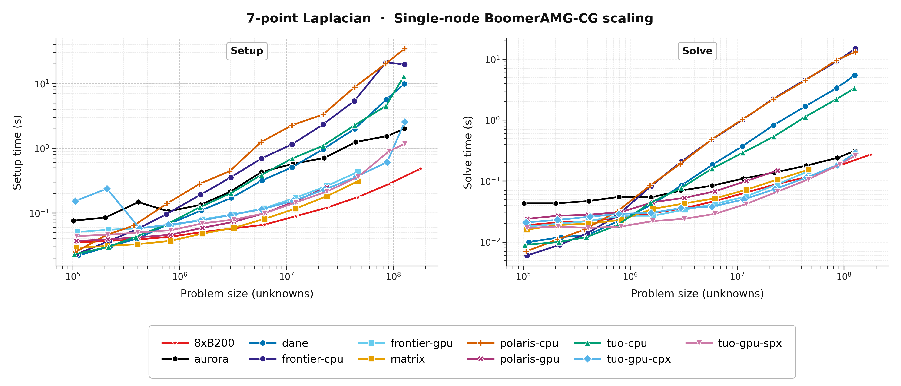
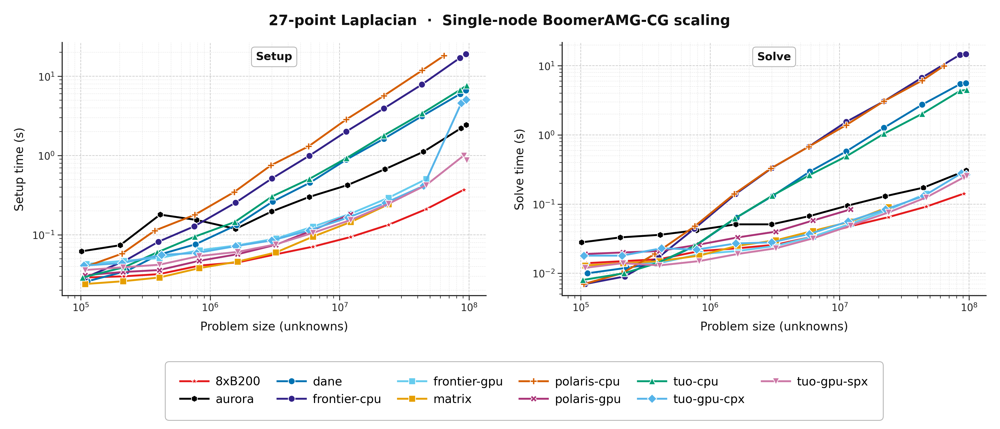
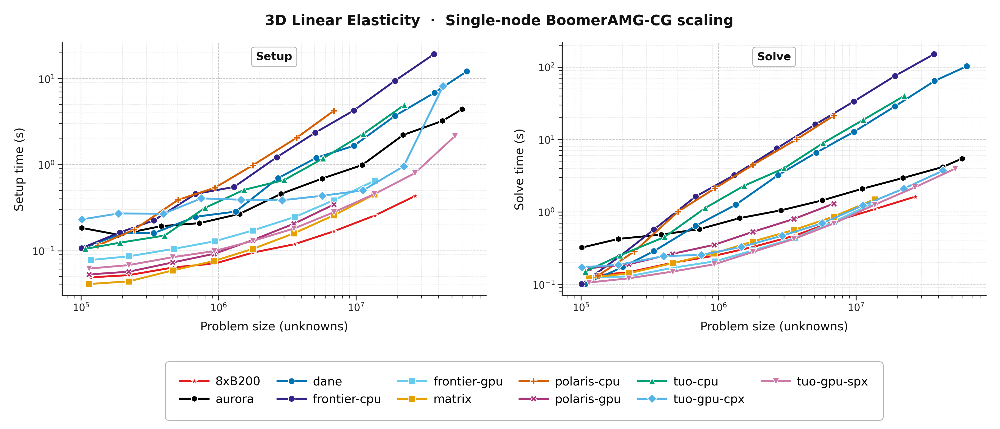

.. Copyright (c) 2024 Lawrence Livermore National Security, LLC and other
   HYPRE Project Developers. See the top-level COPYRIGHT file for details.

   SPDX-License-Identifier: (MIT)

.. _PerformanceAndScaling:

Performance and Scaling
=======================

This chapter describes performance-oriented workflows built around the example
drivers. These workflows assume that ``hypredrive`` and its examples have
already been built.

.. _SingleNodeScaling:

Single-node problem-size scaling
--------------------------------

``scripts/node_scaling.sh`` runs the Laplacian or elasticity driver from
approximately 100K unknowns to a conservative, machine-specific limit. Each run
uses all computational CPU cores or GPUs in one node.

The script must be started inside an interactive, full-node allocation. It
launches work within that allocation and never requests resources itself.

Usage
~~~~~

Select the problem with ``-p`` or ``--problem`` and the machine configuration
with ``-m`` or ``--machine``:

.. code-block:: console

   $ scripts/node_scaling.sh --machine dane --problem lap-7
   $ scripts/node_scaling.sh --machine matrix --problem lap-27
   $ scripts/node_scaling.sh --machine tuo-gpu-spx --problem elast
   $ scripts/node_scaling.sh --machine polaris-gpu --problem lap-7
   $ scripts/node_scaling.sh --machine aurora --problem lap-27
   $ scripts/node_scaling.sh --machine frontier-gpu --problem elast
   $ scripts/node_scaling.sh --machine tioga-gpu --problem lap-7

The supported problems are:

.. list-table::
   :header-rows: 1
   :widths: 20 30 50

   * - Name
     - Driver
     - Discretization
   * - ``lap-7``
     - ``laplacian``
     - 7-point Laplacian
   * - ``lap-27``
     - ``laplacian``
     - 27-point Laplacian
   * - ``elast``
     - ``elasticity``
     - 3D linear elasticity

Use ``-e`` or ``--executable`` to provide the driver executable directly, or
``--build-dir`` when both example executables are in a build directory other
than ``build``. The problem selection still controls the driver arguments and,
for elasticity, the number of unknowns per grid point. Use ``--max-unknowns``
to replace the conservative size cap, or ``--dry-run`` to inspect all generated
commands without launching MPI:

.. code-block:: console

   $ scripts/node_scaling.sh -m tuo-gpu-cpx -p lap-27 \
       --build-dir build-tuolumne --max-unknowns 80000000
   $ scripts/node_scaling.sh -m polaris-gpu -p elast \
       --build-dir build-polaris --dry-run
   $ scripts/node_scaling.sh -m tioga-gpu -p lap-7 \
       --executable install/bin/laplacian --dry-run

Machine configurations
~~~~~~~~~~~~~~~~~~~~~~

Each configuration uses one MPI rank per computational CPU core or GPU:

.. list-table::
   :header-rows: 1
   :widths: 24 34 14 28

   * - Machine option
     - Node resources
     - MPI ranks
     - Launcher
   * - ``dane``
     - 2x Intel(R) Xeon(R) Platinum 8480+
     - 112
     - ``srun``
   * - ``matrix``
     - 4x NVIDIA H100 80GB GPUs
     - 4
     - ``srun``
   * - ``tuo-cpu``
     - 4x AMD MI300A 128GB (CPU cores)
     - 80
     - ``flux run``
   * - ``tuo-gpu-cpx``
     - 4x AMD MI300A 128GB (GPU cores)
     - 24
     - ``flux run``
   * - ``tuo-gpu-spx``
     - 4x AMD MI300A 128GB (GPU cores)
     - 4
     - ``flux run``
   * - ``tioga-cpu``
     - 1x AMD EPYC 7A53 64-Core
     - 64
     - ``flux run``
   * - ``tioga-gpu``
     - 4x AMD MI250X 128GB GPUs
     - 8
     - ``flux run``
   * - ``polaris-cpu``
     - 1x AMD EPYC 7543P 32-Core
     - 32
     - ``mpiexec``
   * - ``polaris-gpu``
     - 4x NVIDIA A100 40GB GPUs
     - 4
     - ``mpiexec``
   * - ``aurora``
     - 6x Intel(R) Data Center GPU Max 1550
     - 12
     - ``mpiexec``
   * - ``8xB200``
     - 8x NVIDIA B200 180GB GPUs
     - 8
     - ``mpiexec``
   * - ``frontier-cpu``
     - 1x AMD EPYC 7A53 64-Core
     - 56
     - ``srun``
   * - ``frontier-gpu``
     - 4x AMD MI250X 128GB GPUs
     - 8
     - ``srun``

Tioga and Tuolumne use Flux and mpibind for process and GPU placement. The
Tioga modes use all 64 CPU cores or all eight GPU devices in a node. The
``tuo-gpu-cpx`` configuration requires an interactive allocation created in
CPX mode:

.. code-block:: console

   $ flux alloc -N 1 --amd-gpumode=CPX

SPX is the default four-GPU mode. See the `LLNL Flux and mpibind guide
<https://hpc.llnl.gov/documentation/user-guides/using-el-capitan-systems/running-jobs-flux-and-mpi>`_
for allocation and launcher details, and the `LLNL Tioga hardware page
<https://hpc.llnl.gov/hardware/compute-platforms/tioga>`_ for Tioga's node
configuration.

On Polaris, the script uses the documented reverse-order GPU affinity mapping
and enables GPU-aware MPI. See the `ALCF Polaris GPU guide
<https://docs.alcf.anl.gov/polaris/running-jobs/using-gpus/>`_ for the underlying
launcher and affinity recommendations.

On Aurora, the script launches one rank per GPU tile, applies the documented
CPU binding list, and uses the system-provided ``gpu_tile_compact.sh`` wrapper
for GPU affinity. GPU-aware MPI is enabled with ``MPIR_CVAR_ENABLE_GPU=1``.
See the `ALCF Aurora running-jobs guide
<https://docs.alcf.anl.gov/aurora/running-jobs-aurora/>`_ for details.

Frontier uses Slurm. The GPU configuration launches one rank per MI250X GPU
compute die, binds each rank to its closest GPU, and enables GPU-aware MPI with
``MPICH_GPU_SUPPORT_ENABLED=1``. The CPU configuration respects Frontier's
default core specialization and uses the 56 physical cores available to the
application. See the `OLCF Frontier user guide
<https://docs.olcf.ornl.gov/systems/frontier_user_guide.html>`_ for the
underlying hardware, allocation, and launcher details.

Problem sizes and output
~~~~~~~~~~~~~~~~~~~~~~~~

The script constructs near-cubic grids whose dimensions are compatible with
the machine's MPI processor grid. It starts at no fewer than 100K unknowns,
approximately doubles the number of unknowns between runs, and adds the largest
grid that fits below the configured cap. The built-in caps are intentionally
conservative starting points rather than guaranteed memory limits.

Results are stored under:

.. code-block:: text

   results/node-scaling/<machine>/<problem>/<full-date>/

Each results directory contains:

``metadata.txt``
   Machine, problem, executable, resource layout, size cap, environment, and
   source revision.

``commands.log``
   The exact shell-escaped command used for each problem size.

``summary.tsv``
   Grid dimensions, unknown counts, timestamps, exit status, and log names.

``run_<unknowns>.log``
   Combined standard output and standard error from one problem size.

Set ``HYPREDRV_SCALING_RESULTS_DIR`` to use a different output root. If a run
fails, the script records its status and output, stops the sweep, and returns
the failing status.

Representative single-node results
~~~~~~~~~~~~~~~~~~~~~~~~~~~~~~~~~~

The measurements below use one full node per machine and separate BoomerAMG
setup time from CG solve time. They compare node-level time to solution rather
than per-core or per-device efficiency, since the machines have different
processor counts and architectures. At the smallest problem sizes, fixed
launch and communication costs can dominate, so CPU and accelerator timings
may overlap. As the amount of work increases, the accelerator configurations
generally provide lower setup and solve times, while the relative ordering and
largest completed problem size depend on the discretization and phase. Both
axes use logarithmic scales.

7-point Laplacian
^^^^^^^^^^^^^^^^^

   Single-node BoomerAMG-CG setup and solve times for the 7-point Laplacian.

27-point Laplacian
^^^^^^^^^^^^^^^^^^

   Single-node BoomerAMG-CG setup and solve times for the 27-point Laplacian.

3D linear elasticity
^^^^^^^^^^^^^^^^^^^^

   Single-node BoomerAMG-CG setup and solve times for 3D linear elasticity.
